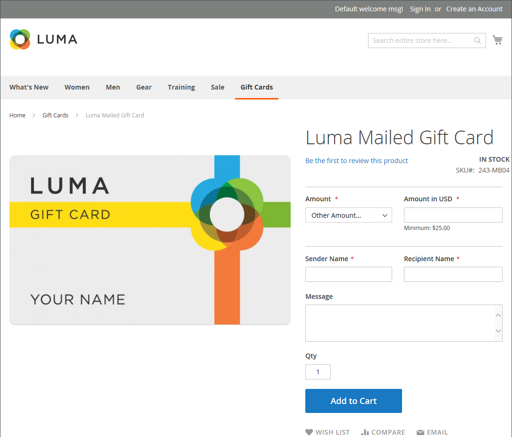

# Prodotto gift card

{{ee-feature}}

Ogni gift card ha un codice univoco, che può essere riscattato da un solo cliente durante il pagamento. A [pool di codici](../stores-purchase/product-gift-card-accounts.md#step-3-establish-the-gift-card-code-pool) devono essere stabilite prima che le gift card possano essere vendute. Consulta [Flusso di lavoro gift card](../stores-purchase/product-gift-card-workflow.md) per informazioni su come le carte regalo vengono riscattate nel carrello.

{width="700" zoomable="yes"}

Esistono tre tipi di prodotti gift card:

- **Virtuale** - Una gift card virtuale viene inviata all&#39;indirizzo e-mail del destinatario, richiesto durante l&#39;acquisto della gift card. Non è necessario specificare un indirizzo di spedizione.

- **Fisico** - Una gift card fisica viene spedita all&#39;indirizzo del destinatario, necessario durante l&#39;acquisto della gift card.

- **Combinato** - Una gift card combinata viene spedita e inviata al destinatario via e-mail. Durante l&#39;acquisto della gift card è necessario specificare l&#39;indirizzo e-mail e di spedizione del destinatario.

## Creare un prodotto gift card

Le istruzioni seguenti illustrano il processo di creazione di una gift card utilizzando un [modello di prodotto](attribute-sets.md), campi obbligatori e impostazioni di base. Ogni campo obbligatorio è contrassegnato da un asterisco rosso (`*`). Al termine delle nozioni di base, puoi completare le altre impostazioni del prodotto in base alle esigenze.

### Passaggio 1: scegliere il tipo di prodotto

1. Il giorno _Amministratore_ barra laterale, vai a **[!UICONTROL Catalog]** > **[!UICONTROL Products]**.

1. Nell&#39;angolo in alto a destra del _[!UICONTROL Add Product]_( {width="25"}  ), scegliere **[!UICONTROL Gift Card]**.

   {width="700" zoomable="yes"}

### Passaggio 2: scegliere la serie di attributi

È possibile utilizzare il valore predefinito `Gift Card` set di attributi o sceglierne un altro. Per scegliere la serie di attributi utilizzata come modello per il prodotto, effettuare una delle seguenti operazioni:

- Fai clic su nella **[!UICONTROL Attribute Set]** e immettere tutto o parte del nome della serie di attributi.

- Nell&#39;elenco visualizzato scegliere il set di attributi che si desidera utilizzare.

{width="600" zoomable="yes"}

### Passaggio 3: completare le impostazioni richieste

1. Immetti un **[!UICONTROL Product Name]** per la gift card.

   È inoltre possibile indicare il tipo di gift card nel nome. Ad esempio: _Scheda regalo virtuale Luma_.

1. Immetti un **[!UICONTROL SKU]** per il prodotto.

   Per impostazione predefinita, il Nome prodotto viene utilizzato come SKU predefinita.

1. Imposta **[!UICONTROL Card Type]** a uno dei seguenti elementi:

   - `Virtual` - Le gift card virtuali vengono consegnate via e-mail al destinatario.
   - `Physical` - Le carte regalo fisiche possono essere prodotte in serie in anticipo e in rilievo con codici univoci.
   - `Combined` - Una gift card combinata ha le caratteristiche di una gift card virtuale e fisica.

   {width="600" zoomable="yes"}

1. Per offrire al cliente una scelta di importi fissi, fare clic su **[!UICONTROL Add Amount]** e inserisci il primo valore fisso della scheda come decimale.

   Per inserire la selezione degli importi fissi, ripetere questo passo per ciascuno di essi.

1. Per consentire ai clienti di impostare il valore della gift card, eseguire le operazioni seguenti:

   - Imposta **[!UICONTROL Open Amount]** a `Yes`.

   - Per definire l&#39;intervallo di valori minimo e massimo accettabili, immettere il valore **[!UICONTROL Open Amount From]** e **[!UICONTROL To]** valori.

   È possibile creare gift card con prezzo fisso, prezzo di importo aperto o entrambi.

   >[!NOTE]
   >
   >Un prodotto gift card non ha un proprio prezzo nel catalogo. Il prezzo della gift card deriva dall&#39;importo della gift card selezionata durante l&#39;acquisto.

   {width="600" zoomable="yes"}

### Passaggio 4: completare le impostazioni di base

1. Per una gift card fisica o combinata, immettere **[!UICONTROL Quantity]** in magazzino.

1. Se la gift card da spedire, immettere il **[!UICONTROL Weight]** della confezione.

1. In **[!UICONTROL Categories]** campo, scegli `Gift Card`.

Potrebbero essere presenti singoli attributi aggiuntivi che descrivono il prodotto. La selezione varia a seconda del set di attributi e può essere completata in un secondo momento.

### Passaggio 5: completare le informazioni sulla gift card

Il _[!UICONTROL Gift Card Information]_sezione delle impostazioni del prodotto può essere utilizzata per sostituire la [configurazione gift card](../configuration-reference/sales/gift-cards.md) impostazioni che determinano la modalità di gestione della scheda.

1. Scorri verso il basso fino a _[!UICONTROL Gift Card Information]_sezione.

   Le impostazioni predefinite in questa sezione sono determinate dalla configurazione del sistema.

   {width="600" zoomable="yes"}

1. Modifica i campi aggiuntivi in base alla modalità di funzionamento della gift card:

   - **[!UICONTROL Treat Balance as Store Credit]** - Determina se il titolare della gift card può riscattare il saldo come credito del negozio.

   - **[!UICONTROL Lifetime (days)]** - Determina il numero di giorni dopo l&#39;acquisto fino alla scadenza della gift card. Se non si desidera impostare un limite per la durata della scheda, lasciare vuoto questo campo.

   - **[!UICONTROL Allow Message]** - Determina se l&#39;acquirente della gift card può immettere un messaggio per il destinatario. È possibile includere un messaggio regalo sia per le carte regalo virtuali (via e-mail) che per quelle fisiche (spedite).

   - **[!UICONTROL Email Template]** - Determina il modello di e-mail utilizzato per la notifica inviata al destinatario di una gift card.

### Passaggio 6: Completare le informazioni sul prodotto

Compila le informazioni nelle sezioni seguenti secondo necessità:

- [Contenuto](product-content.md)
- [Immagini e video](product-images-and-video.md)
- [Prodotti correlati, up-selling e cross-selling](related-products-up-sells-cross-sells.md)
- [Ottimizzazione motore di ricerca](product-search-engine-optimization.md)
- [Opzioni personalizzabili](settings-advanced-custom-options.md)
- [Prodotti nei siti Web](settings-basic-websites.md)
- [Progettazione](settings-advanced-design.md)
- [Opzioni regalo](product-gift-options.md)

### Passaggio 7: pubblicare il prodotto

1. Se sei pronto a pubblicare il prodotto nel catalogo, imposta **Abilita prodotto** passa a `Yes`.

1. Effettuare una delle seguenti operazioni:

   **Metodo 1:** Salva e visualizza anteprima

   - Nell’angolo superiore destro, fai clic su **[!UICONTROL Save]**.

   - Per visualizzare il prodotto nel tuo negozio, scegli **[!UICONTROL Customer View]** il _Amministratore_ (  ),

   {width="600" zoomable="yes"}

   **Metodo 2:** Salva e chiudi

   Il giorno _[!UICONTROL Save]_( {width="25"} ), scegliere **[!UICONTROL Save & Close]**.

## Aspetti da ricordare

- A _pool di codici_ di numeri unici deve essere generato prima che una gift card possa essere offerta in vendita.

- Le gift card possono essere impostate su `Redeemable` o `Non-Redeemable`.

- Le imposte sono **_non applicato_** alle gift card durante l&#39;acquisto della gift card. Le imposte vengono applicate ai prodotti solo quando una gift card acquistata viene utilizzata per acquistare prodotti.

- La durata di una gift card può essere illimitata o impostata su un numero specificato di giorni.

- Il valore di una gift card può essere impostato su un importo fisso o su un importo aperto con un valore minimo e massimo.

- Un prodotto gift card non ha un proprio prezzo nel catalogo. Il prezzo della gift card deriva dall&#39;importo della gift card selezionata durante l&#39;acquisto.

- È possibile creare un conto gift card per il cliente quando l&#39;ordine viene effettuato o al momento della fatturazione.
