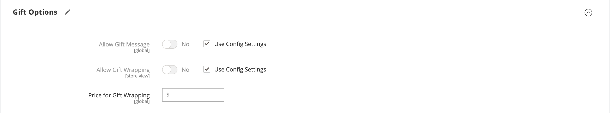

# Impostazioni prodotto - [!UICONTROL Gift Options]

Nella sezione _[!UICONTROL Gift Options]_&#x200B;è possibile impostare le opzioni relative ai messaggi regalo e alla confezione regalo al momento del pagamento a livello di prodotto. Per ignorare l&#39;impostazione di configurazione predefinita, deselezionare la casella di controllo **[!UICONTROL Use Config Settings]**.

{width="600" zoomable="yes"}

## Impostare le opzioni regalo per un singolo prodotto

1. Apri il prodotto in modalità di modifica.

1. Scorri verso il basso ed espandi il  nella sezione _[!UICONTROL Gift Options]_&#x200B;ed effettua le seguenti operazioni:

   - Per ignorare l&#39;impostazione predefinita, deselezionare la casella di controllo **[!UICONTROL Use Config Settings]**.

   - Imposta **[!UICONTROL Allow Gift Message]** come necessario per il prodotto.

   -  ([solo Adobe Commerce](../landing/home.md#product-editions)) Imposta **[!UICONTROL Allow Gift Wrapping]** come necessario per il prodotto.

   -  ([solo Adobe Commerce](../landing/home.md#product-editions)) Se applicabile, immettere **[!UICONTROL Price for Gift Wrapping]**.

1. Al termine, fare clic su **[!UICONTROL Save]**.

## Abilita messaggi regalo per il tuo store

Per impostazione predefinita, Commerce consente ai clienti di aggiungere un messaggio regalo personalizzato agli ordini e ai prodotti durante il processo di pagamento.

Puoi fornire questa funzione ai clienti abilitando _messaggio regalo_ per il tuo store:

1. Nella barra laterale _Admin_, passa a **[!UICONTROL Stores]** > _[!UICONTROL Settings]_>**[!UICONTROL Configuration]**.

1. Nel pannello a sinistra, espandi **[!UICONTROL Sales]** e scegli **[!UICONTROL Sales]** sotto.

1. Espandere  **[!UICONTROL Gift Options]** nella pagina.

1. Per **[!UICONTROL Allow Gift Messages on Order Level]**, selezionare `Yes` per abilitare un singolo messaggio regalo per l&#39;intero ordine.

1. Per **[!UICONTROL Allow Gift Messages for Order Items]**, selezionare `Yes` per abilitare l&#39;aggiunta di messaggi regalo separatamente ai singoli articoli nel carrello.

1. Fare clic su **[!UICONTROL Save Config]**.

Con questa configurazione, i clienti possono aggiungere un messaggio regalo alla pagina del carrello dalla vetrina, come illustrato nell’esempio seguente:

{width="600" zoomable="yes"}
