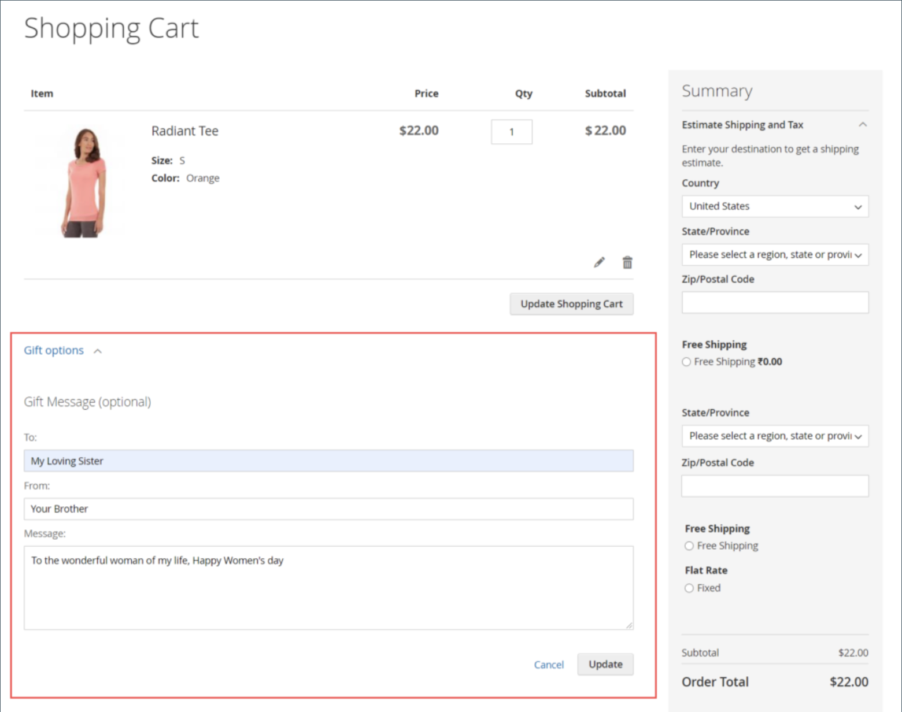

# Impostazioni prodotto - [!UICONTROL Gift Options]

In _[!UICONTROL Gift Options]_sezione, è possibile impostare le opzioni relative ai messaggi e ai pacchetti regalo al momento del pagamento a livello di prodotto. Per ignorare l&#39;impostazione di configurazione predefinita, deselezionare **[!UICONTROL Use Config Settings]**casella di controllo.

{width="600" zoomable="yes"}

## Impostare le opzioni regalo per un singolo prodotto

1. Apri il prodotto in modalità di modifica.

1. Scorri verso il basso ed espandi  il _[!UICONTROL Gift Options]_ed effettuare le seguenti operazioni:

   - Per ignorare l&#39;impostazione predefinita, deselezionare **[!UICONTROL Use Config Settings]** casella di controllo.

   - Imposta **[!UICONTROL Allow Gift Message]** secondo necessità del prodotto.

   -  ([Adobe Commerce](../landing/home.md#product-editions) solo) Imposta **[!UICONTROL Allow Gift Wrapping]** secondo necessità del prodotto.

   -  ([Adobe Commerce](../landing/home.md#product-editions) solo) Se applicabile, inserire il **[!UICONTROL Price for Gift Wrapping]**.

1. Al termine, fai clic su **[!UICONTROL Save]**.

## Abilita messaggi regalo per il tuo store

Per impostazione predefinita, Commerce consente ai clienti di aggiungere un messaggio regalo personalizzato agli ordini e ai prodotti durante il processo di pagamento.

Puoi fornire questa funzione ai clienti abilitando _messaggio regalo_ per il tuo punto vendita:

1. Il giorno _Amministratore_ barra laterale, vai a **[!UICONTROL Stores]** > _[!UICONTROL Settings]_>**[!UICONTROL Configuration]**.

1. Nel pannello a sinistra, espandi **[!UICONTROL Sales]** e scegli **[!UICONTROL Sales]** sotto.

1. Espandi  **[!UICONTROL Gift Options]** sulla pagina.

1. Per **[!UICONTROL Allow Gift Messages on Order Level]**, seleziona `Yes` per attivare un singolo messaggio regalo per l&#39;intero ordine.

1. Per **[!UICONTROL Allow Gift Messages for Order Items]**, seleziona `Yes` per abilitare l&#39;aggiunta separata di messaggi regalo ai singoli articoli nel carrello acquisti.

1. Clic **[!UICONTROL Save Config]**.

Con questa configurazione, i clienti possono aggiungere un messaggio regalo alla pagina del carrello dalla vetrina, come illustrato nell’esempio seguente:

{width="600" zoomable="yes"}
