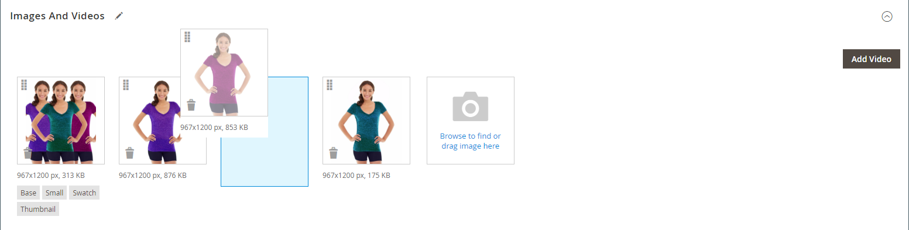

# Gestire immagini e video dei prodotti

Per ogni prodotto, puoi caricare più immagini e video, riorganizzarne l’ordine e controllarne l’utilizzo. Se devi gestire un numero elevato di immagini, puoi preferire importarle come batch, anziché caricarle singolarmente. Per ulteriori informazioni, vedere [Importare immagini prodotto](../systems/data-import-product-images.md).

Se si prevede di caricare immagini di grandi dimensioni per la visualizzazione nella pagina _[!UICONTROL Product Details]_, è consigliabile impostare una dimensione massima in pixel (larghezza e altezza) e ridimensionare automaticamente i file al caricamento. È disponibile un’opzione per abilitare il ridimensionamento automatico di file di immagine più grandi durante il caricamento. Per ulteriori informazioni, vedere [Ridimensionamento immagine prodotto](product-image-config.md#product-image-resizing).

## Aggiornare le immagini del prodotto

1. Apri il prodotto in modalità di modifica.

1. Per utilizzare una visualizzazione archivio specifica, impostare il selettore **[!UICONTROL Store View]** nell&#39;angolo superiore sinistro sulla visualizzazione applicabile.

   >[!NOTE]
   >
   >Le nuove immagini del prodotto sono **_sempre_** caricate e visibili in **_tutte_** le visualizzazioni archivio, anche se l&#39;ambito `All Store Views` non è utilizzato per il caricamento.   Per nascondere un&#39;immagine di prodotto da una visualizzazione di archivio specifica, è necessario passare a tale visualizzazione, selezionare la casella di controllo **[!UICONTROL Hide from Product Page]** per l&#39;immagine e fare clic su **[!UICONTROL Save]**.

1. Scorri verso il basso ed espandi la sezione _[!UICONTROL Images and Videos]_.

### Carica un&#39;immagine

Per una migliore compatibilità, si consiglia di caricare tutte le immagini del prodotto con il profilo colore `sRGB`. Tutti gli altri profili colore vengono automaticamente convertiti nel profilo colore `sRGB` durante il caricamento dell&#39;immagine del prodotto, il che potrebbe causare incoerenza di colore nell&#39;immagine caricata.

La lunghezza del nome del file di immagine, inclusa l&#39;estensione, non può superare i 90 caratteri.

Per caricare un&#39;immagine, effettuare una delle seguenti operazioni:

- Trascina un&#39;immagine dal desktop e rilasciala nella sezione _Fotocamera_ (  ) della casella _[!UICONTROL Images And Videos]_.

- Nella casella _[!UICONTROL Images And Videos]_, fai clic sul riquadro_ Fotocamera _(  ), seleziona il file di immagine nel computer e fai clic su **[!UICONTROL Open]**.

  {width="600" zoomable="yes"}

### Ridisponi immagini

Per modificare l&#39;ordine delle immagini nella raccolta, fare clic sull&#39;icona _[!UICONTROL Sort]_(  ) nella parte inferiore del riquadro immagine e trascinare l&#39;immagine in una posizione diversa nella casella_[!UICONTROL Images And Videos]_.

{width="600" zoomable="yes"}

### Eliminare un’immagine

Per rimuovere un&#39;immagine dalla raccolta, fare clic sull&#39;icona **[!UICONTROL Delete]** (  ) nell&#39;angolo superiore destro del riquadro immagine e fare clic su **[!UICONTROL Save]**.

### Imposta dettagli immagine

Fare clic sull&#39;immagine che si desidera aprire nella visualizzazione dei dettagli ed eseguire una delle operazioni seguenti:

{width="600" zoomable="yes"}

Per chiudere la visualizzazione dettagli, fare clic sull&#39;icona _Chiudi_ (  ) nell&#39;angolo superiore destro.

Al termine, fare clic su **[!UICONTROL Save]**.

#### Inserisci testo alternativo

Per migliorare l’accessibilità web, gli assistenti vocali fanno riferimento al testo Image Alt e i motori di ricerca durante l’indicizzazione del sito fanno riferimento a tale testo. Alcuni browser visualizzano il testo Alt al passaggio del mouse. Il testo alternativo può contenere diverse parole e includere parole chiave selezionate con attenzione.

Nella casella _[!UICONTROL Alt Text]_immettere una breve descrizione dell&#39;immagine.

#### Assegna ruoli

Per impostazione predefinita, tutti i ruoli vengono assegnati alla prima immagine caricata sul prodotto. Per riassegnare un ruolo a un&#39;altra immagine, effettuare le seguenti operazioni:

Nella casella _[!UICONTROL Role]_scegliere il ruolo che si desidera assegnare all&#39;immagine.

Quando ritorni alla sezione _Immagini e video_, i ruoli attualmente assegnati vengono visualizzati sotto ogni immagine.

{width="600" zoomable="yes"}

#### Nascondi un&#39;immagine

Per escludere un&#39;immagine dalla raccolta miniature, selezionare la casella di controllo **[!UICONTROL Hidden]** e fare clic su **[!UICONTROL Save]**.

{width="600" zoomable="yes"}

## Ruoli immagine

| Ruolo immagine | Descrizione |
|--- |--- |
| [!UICONTROL Thumbnail] | Le miniature vengono visualizzate nella raccolta miniature, nel carrello e in alcuni blocchi, ad esempio Elementi correlati. Esempio di dimensioni: 50 x 50 pixel |
| [!UICONTROL Small Image] | L’immagine piccola viene utilizzata per le immagini del prodotto negli elenchi nelle pagine delle categorie e dei risultati di ricerca e per visualizzare le immagini del prodotto necessarie per sezioni quali up-sell, cross-selling e elenco nuovi prodotti. Esempio di dimensioni: 470 x 470 pixel |
| [!UICONTROL Base Image] | L’immagine di base è l’immagine principale nella pagina dei dettagli del prodotto. Lo zoom dell’immagine viene attivato se carichi un’immagine di dimensioni superiori a quelle del contenitore dell’immagine. A seconda del livello di zoom da raggiungere, l’immagine di base deve essere due o tre volte la dimensione del contenitore. Esempi di dimensioni: 470 x 470 pixel (senza zoom), 1100 x 1100 pixel (con zoom) |
| [!UICONTROL Swatch] | È possibile utilizzare un [campione](swatches.md) per illustrare il colore, il motivo o la trama. Esempio di dimensioni: 50 x 50 pixel |

{style="table-layout:auto"}

## Filigrane

Se si va a scapito di creare le proprie immagini di prodotto originali, non c&#39;è molto si può fare per evitare che concorrenti senza scrupoli di rubare loro con il clic di un mouse. Tuttavia, puoi renderli un target meno attraente inserendo una filigrana su ogni immagine per identificarli come proprietà. Un file di filigrana può essere un’immagine JPG JPEG, GIF o PNG. Entrambi i tipi di file GIF e PNG supportano livelli trasparenti, che possono essere utilizzati per conferire alla filigrana uno sfondo trasparente.

La filigrana utilizzata per l&#39;immagine _small_ nell&#39;esempio seguente è un logo nero con sfondo trasparente e salvato come file PNG con le impostazioni seguenti:

- Dimensioni: 50x50
- Opacità: 5
- Posizione: sezione

{width="700" zoomable="yes"}

### Aggiungere filigrane alle immagini del prodotto

1. Nella barra laterale _Admin_, passa a **[!UICONTROL Content]** > _[!UICONTROL Design]_>**[!UICONTROL Configuration]**.

   Per ulteriori informazioni sulle configurazioni di progettazione, vedere [Configurazione di progettazione](../content-design/configuration.md).

1. Individuare la visualizzazione archivio da configurare e fare clic su **[!UICONTROL Edit]** nella colonna _[!UICONTROL Action]_.

1. In _[!UICONTROL Other Settings]_, espandere  la sezione **[!UICONTROL Product Image Watermarks]**.

   {width="600" zoomable="yes"}

   Le impostazioni dell&#39;immagine **[!UICONTROL Base]**, **[!UICONTROL Thumbnail]**, **[!UICONTROL Small]** e **[!UICONTROL Swatch Image]** sono uguali.

1. Per aggiungere la risorsa immagine della filigrana, utilizza uno dei seguenti metodi:

   - Fare clic su **[!UICONTROL Upload]** e scegliere il file di immagine nel sistema che si desidera caricare per utilizzarlo come filigrana.
   - Fai clic su **[!UICONTROL Select from Gallery]** e seleziona una risorsa immagine dalla [Galleria file multimediali](../content-design/media-gallery.md).

1. Completare le impostazioni per la visualizzazione della filigrana:

   - Immetti **[!UICONTROL Image Opacity]** come percentuale. Esempio: `40`

   - Immetti **[!UICONTROL Image Size]** in pixel. Esempio: `200 x 200`

   - Impostare **[!UICONTROL Image Position]** per determinare la posizione della filigrana.

1. Al termine, fare clic su **[!UICONTROL Save Config]**.

1. Quando viene richiesto di aggiornare la cache, fare clic su **[!UICONTROL Cache Management]** nel messaggio di sistema e aggiornare la cache non valida.

   {width="600" zoomable="yes"}

>[!TIP]
>
>È possibile fare clic su **[!UICONTROL Use Default Value]**  per ripristinare il valore predefinito.

### Eliminare una filigrana

1. Nell&#39;angolo inferiore sinistro dell&#39;immagine fare clic sull&#39;icona **[!UICONTROL Delete]** (  ).

   {width="300"}

1. Fare clic su **[!UICONTROL Save Config]**.

1. Quando viene richiesto di aggiornare la cache, fare clic su **[!UICONTROL Cache Management]** nel messaggio di sistema e aggiornare la cache non valida.

   Se l&#39;immagine della filigrana persiste nella vetrina, tornare alla gestione della cache e fare clic su **[!UICONTROL Flush Magento Cache]**.
