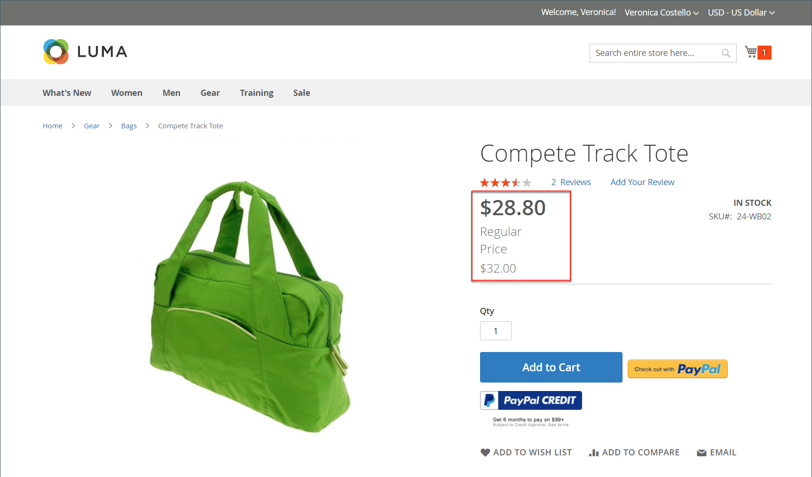
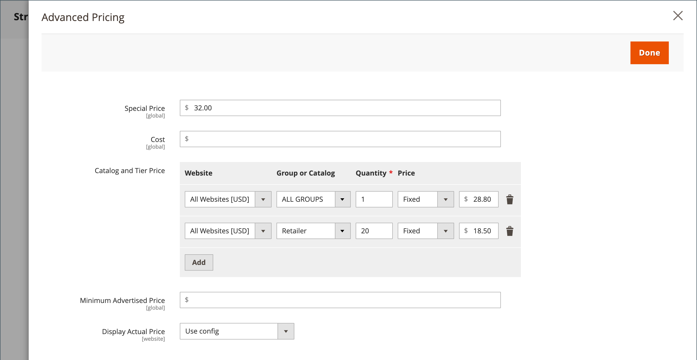

# Prezzi di gruppo

Puoi utilizzare le impostazioni di configurazione del prodotto nell’amministratore per impostare i prezzi per gli articoli scontati in base ai gruppi di clienti nel tuo negozio. Questo modello di determinazione dei prezzi strategico è denominato _prezzo di gruppo_.

Il prezzo scontato di qualsiasi prodotto può essere offerto ai membri di un gruppo di clienti specifico quando l&#39;acquirente è connesso al loro account. Il prezzo del gruppo di clienti viene visualizzato nella pagina del prodotto insieme al prezzo regolare, in modo che un acquirente possa confrontare facilmente i prezzi e agire di conseguenza. Dopo aver aggiunto il prodotto al carrello, il prezzo regolare viene sostituito dal prezzo di gruppo in base al gruppo di clienti.

La determinazione dei prezzi per i gruppi di clienti è un componente di [determinazione prezzi su più livelli](product-price-tier.md) ed è impostata in modo simile. L&#39;unica differenza è che i prezzi del gruppo di clienti hanno una quantità pari a 1.

{width="600" zoomable="yes"}

## Vantaggi dell&#39;utilizzo dei prezzi di gruppo

- Adatto per acquirenti all&#39;ingrosso

- Incentivo per i clienti ad aggiornare il proprio gruppo di clienti per trarre vantaggio dagli sconti

- Campagne di marketing mirate

- Creare fiducia e credibilità premiando i clienti fedeli

## Imposta un prezzo di gruppo

1. Apri il prodotto in modalità di modifica.

1. Sotto il campo _[!UICONTROL Price]_, fare clic su **[!UICONTROL Advanced Pricing]**.

1. Nella sezione _[!UICONTROL Customer Group Price]_, fare clic su **[!UICONTROL Add]**.

   Se il tuo archivio include [Adobe Commerce B2B](../b2b/introduction.md) e dispone di [cataloghi condivisi](../b2b/catalog-shared.md) abilitati, questa sezione è etichettata _[!UICONTROL Catalog and Tier Price]_.

   {width="600" zoomable="yes"}

1. Configura il prezzo di gruppo:

   - Per un&#39;installazione multisito, scegliere **[!UICONTROL Website]** in cui si applica il prezzo di gruppo.

   - Scegliere **[!UICONTROL Customer Group]** per ricevere lo sconto.

   - Immettere **[!UICONTROL Quantity]** di `1`.

   - Per **[!UICONTROL Price]**, impostare il tipo di prezzo e l&#39;importo:

      - `Fixed` - Inserire il prezzo del prodotto scontato.

      - `Discount` - Inserire il prezzo scontato come percentuale del prezzo del prodotto.

     {width="600" zoomable="yes"}

1. Per aggiungere un altro prezzo di gruppo, fare clic su **[!UICONTROL Add]** e ripetere il passaggio precedente.

1. Al termine, fare clic su **[!UICONTROL Done]** e quindi su **[!UICONTROL Save]**.

>[!NOTE]
>
>Il prezzo del prodotto **_final_** è calcolato come prezzo rilevante **_minimum_**, utilizzando la seguente formula:  `Final Price=Min(Regular(Base) Price, Group(Tier) Price, Special Price, Catalog Price Rule) + Sum(Min Price per each required custom option)`

>[!NOTE]
>
>**_Le opzioni personalizzabili del prodotto_** a prezzo fisso sono _non_ influenzate dalle regole di prezzo di gruppo, prezzo di livello, prezzo speciale o prezzo di catalogo.
