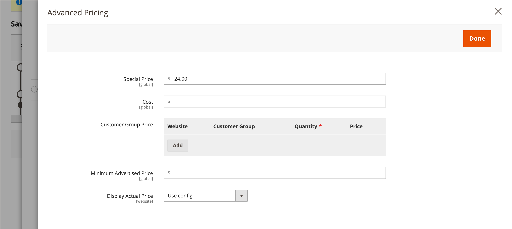
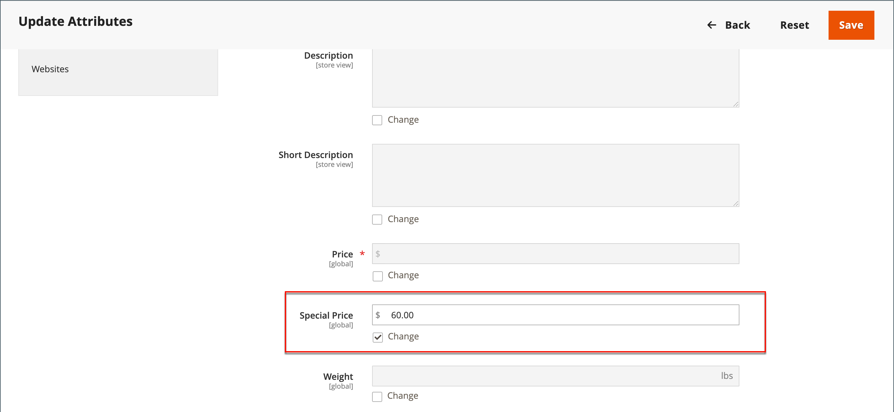
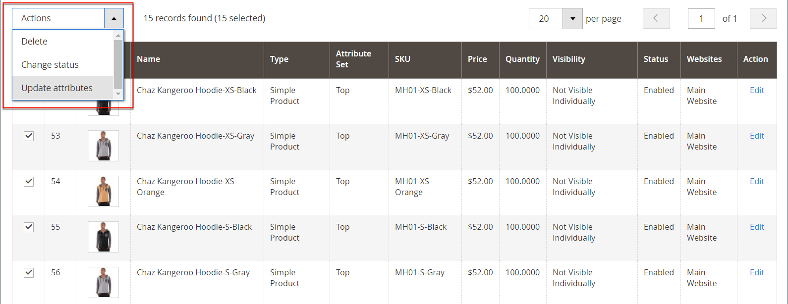
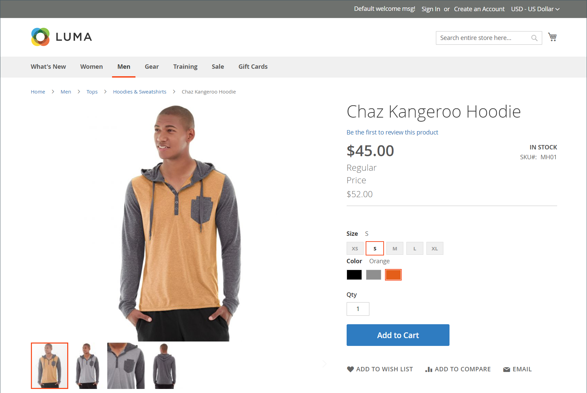

# Prezzi speciali

Un prezzo speciale può essere offerto per un determinato periodo di tempo. Durante il periodo di tempo specificato, il prezzo speciale viene visualizzato al posto del prezzo regolare, seguito da una notazione che mostra il prezzo regolare.

{width="700" zoomable="yes"}

## Applica prezzo speciale a un singolo prodotto

Puoi facilmente impostare un prezzo speciale per un singolo prodotto nel catalogo.

### Utilizza un aggiornamento pianificato

{{ee-feature}}

Adobe Commerce include il supporto per [aggiornamenti pianificati](../content-design/content-staging-scheduled-update.md). Utilizzare questi strumenti promozionali per applicare un prezzo speciale a un prodotto specifico per un periodo di tempo specificato.

1. Apri il prodotto in modalità di modifica.

1. Clic **[!UICONTROL Scheduled Update]**.

   {width="600" zoomable="yes"}

1. Per **Nome aggiornamento**, immettere un nome per la promozione speciale.

1. Inserisci una descrizione **[!UICONTROL Description]**.

1. Utilizza il _Calendario_ (  ) per scegliere il **[!UICONTROL Start Date]** e **[!UICONTROL End Date]** per la promozione speciale di prezzo.

   È possibile utilizzare **[!UICONTROL Hour]** e **[!UICONTROL Minute]** i cursori per scegliere anche l&#39;ora di inizio e di fine. Clic **[!UICONTROL Close]** quando vengono impostati l’inizio e la fine.

   {width="600" zoomable="yes"}

1. Scorri verso il basso fino a _Prezzo_ , fare clic su **[!UICONTROL Advanced Pricing]** e immettere l&#39;importo del **[!UICONTROL Special Price]** da applicare in base all’aggiornamento pianificato.

   {width="600" zoomable="yes"}

1. Al termine, fai clic su **[!UICONTROL Done]** e poi **[!DNL Save]**.

   Nella vetrina, il prezzo speciale dovrebbe essere visualizzato sia nell’elenco dei cataloghi che nella pagina del prodotto.

   Il _[!UICONTROL Scheduled Change]_viene visualizzato nella parte superiore della pagina.

   {width="600" zoomable="yes"}

### Utilizzare una data di inizio e una data di fine semplici

{{ce-feature}}

Nelle opzioni di Advanced Pricing il Magento Open Source include semplici opzioni di data di inizio e di fine.

1. Apri il prodotto in modalità di modifica.

1. Scorri verso il basso fino a _[!UICONTROL Price]_, fare clic su **[!UICONTROL Advanced Pricing]**, e immettere il **[!UICONTROL Special Price]**importo.

1. Utilizza il _Calendario_ (  ) per scegliere il **[!UICONTROL Start Date]** e **[!UICONTROL End Date]** per la promozione speciale di prezzo.

   Il prezzo speciale entra in vigore immediatamente dopo la mezzanotte all&#39;inizio della data di inizio (00:01) e continua fino a poco prima della mezzanotte (23:59) del giorno prima della data di fine.

   {width="600" zoomable="yes"}

1. Al termine, fai clic su **[!UICONTROL Done]** e poi **[!UICONTROL Save]**.

   Nella vetrina, il prezzo speciale dovrebbe essere visualizzato sia nell’elenco dei cataloghi che nella pagina del prodotto.

## Applica un prezzo speciale a più prodotti

È inoltre possibile assegnare un prezzo speciale a più prodotti, ad esempio più varianti di un [prodotto configurabile](product-create-configurable.md).

### Imposta un prezzo speciale per i prodotti selezionati

{{ee-feature}}

L’esempio seguente mostra come assegnare lo stesso prezzo speciale a più varianti di prodotto di un prodotto configurabile in Adobe Commerce.

1. Il giorno _[!UICONTROL Products]_pagina, fai clic su **[!UICONTROL Filters]**e immetti **[!UICONTROL Name]**del prodotto configurabile.

1. Imposta **[!UICONTROL Type]** a `Configurable Product` e fai clic su **[!UICONTROL Apply Filters]**.

1. Per assegnare lo stesso prezzo speciale a tutti i prodotti, impostare il controllo nell&#39;intestazione della prima colonna su `Select All`.

   In alternativa, puoi selezionare la casella di controllo di ciascun prodotto che desideri includere.

1. Imposta il **[!UICONTROL Actions]** controllo a `Update attributes`.

1. Scorri verso il basso fino a _[!UICONTROL Special Price]_e selezionare il **[!UICONTROL Change]**casella di controllo sotto_[!UICONTROL Special Price]_ e immettere il prezzo speciale che si desidera offrire.

   {width="600" zoomable="yes"}

1. Al termine, fai clic su **[!UICONTROL Save]**.

Il prezzo speciale disponibile nel negozio viene visualizzato nelle inserzioni del catalogo e nella pagina del prodotto. Per un prodotto configurabile, il prezzo normale viene visualizzato anche nella pagina del prodotto quando si scelgono le opzioni.

### Imposta un prezzo speciale e un intervallo di date per i prodotti selezionati

{{ce-feature}}

Nell&#39;esempio seguente viene illustrato come assegnare lo stesso prezzo speciale a più varianti di prodotto di un prodotto configurabile nel Magento Open Source.

1. Il giorno _Amministratore_ barra laterale, vai a **[!UICONTROL Catalog]** > **[!UICONTROL Products]**.

1. Clic **[!UICONTROL Filters]**.

1. Inserisci il **[!UICONTROL Name]** del prodotto configurabile.

1. Imposta **[!UICONTROL Type]** a `Simple Product`.

   {width="600" zoomable="yes"}

1. Clic **[!UICONTROL Apply Filters]**.

   La griglia elenca tutti i prodotti semplici associati come varianti del prodotto configurabile.

1. Per assegnare lo stesso prezzo speciale a tutti i prodotti, impostare il controllo nell&#39;intestazione della prima colonna su `Select All`.

   In alternativa, puoi selezionare la casella di controllo di ciascun prodotto che desideri includere.

1. Imposta il **[!UICONTROL Actions]** controllo a `Update attributes`.

   {width="600" zoomable="yes"}

1. Scorri verso il basso fino a _[!UICONTROL Special Price]** il campo ed effettuare le seguenti operazioni:

   - Seleziona la **[!UICONTROL Change]** casella di controllo sotto _[!UICONTROL Special Price]** il campo e inserisci il prezzo speciale che desideri offrire.

   - Seleziona la **[!UICONTROL Change]** casella di controllo sotto _Prezzo speciale dalla data_ , fare clic sul pulsante _Calendario_ (  ) e scegliere la prima data della promozione prezzo speciale.

     Il prezzo speciale entra in vigore immediatamente dopo la mezzanotte all&#39;inizio della data di inizio (00:01) e continua fino a poco prima della mezzanotte (23:59) del giorno prima della data di fine.

   - Seleziona la **[!UICONTROL Change]** casella di controllo sotto _Prezzo speciale fino a oggi_ , fare clic sul pulsante _Calendario_ (  ) e scegliere l&#39;ultima data della promozione prezzo speciale.

   {width="600" zoomable="yes"}

1. Al termine, fai clic su **[!UICONTROL Save]**.

   Un messaggio indica quanti record sono stati aggiornati con il prezzo speciale.

   Il prezzo speciale diventa disponibile nel negozio alla data specificata e viene visualizzato nelle inserzioni del catalogo e nella pagina del prodotto. Per un prodotto configurabile, il prezzo normale viene visualizzato anche nella pagina del prodotto quando si scelgono le opzioni.

   {width="600" zoomable="yes"}

## Test

Se il prezzo speciale non viene visualizzato correttamente nella vetrina sia nella pagina di elenco che in quella dei prodotti, cancella la cache del browser:

1. Il giorno _Amministratore_ barra laterale, vai a **[!UICONTROL System]** > **[!UICONTROL Cache Management]**.

1. Clic **[!UICONTROL Flush Magento Cache]**.

>[!NOTE]
>
>Il **_finale_** il prezzo del prodotto viene calcolato come **_minimo_** prezzo rilevante, utilizzando la formula seguente:  `Final Price=Min(Regular(Base) Price, Group(Tier) Price, Special Price, Catalog Price Rule) + Sum(Min Price per each required custom option)`

>[!NOTE]
>
>**_Prezzo fisso_** Le opzioni personalizzabili del prodotto sono _non_ sono influenzati dalle regole Prezzo di gruppo, Prezzo livello, Prezzo speciale o Prezzo catalogo.
