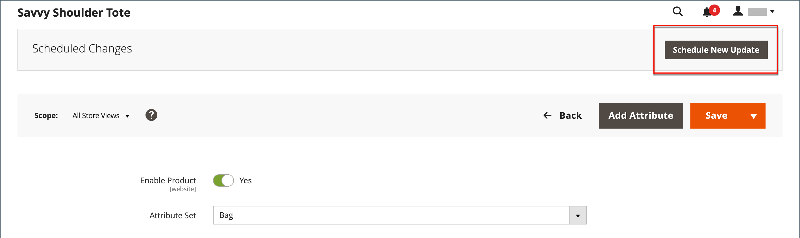
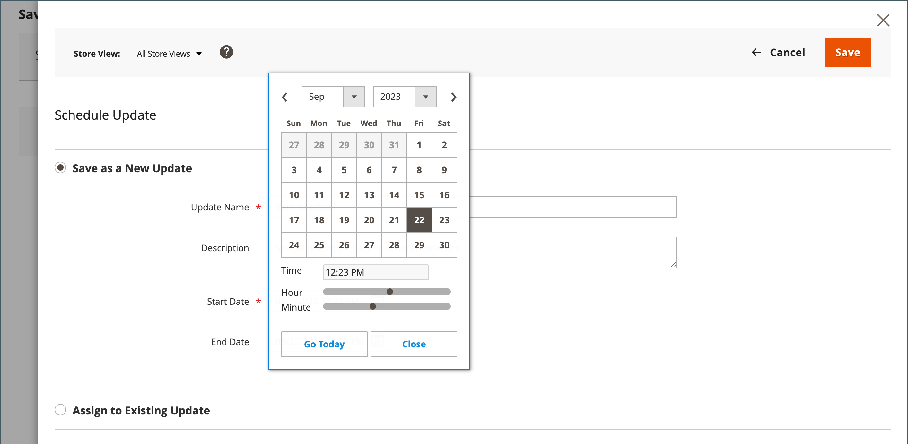
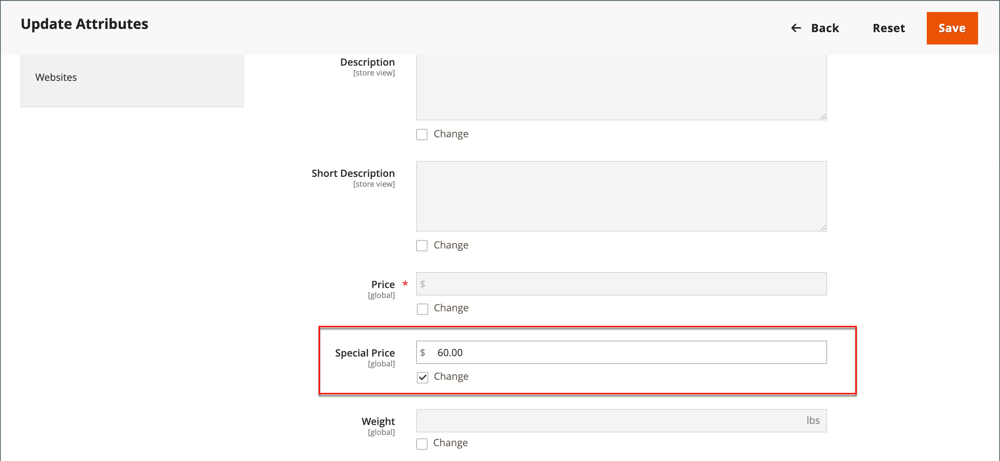
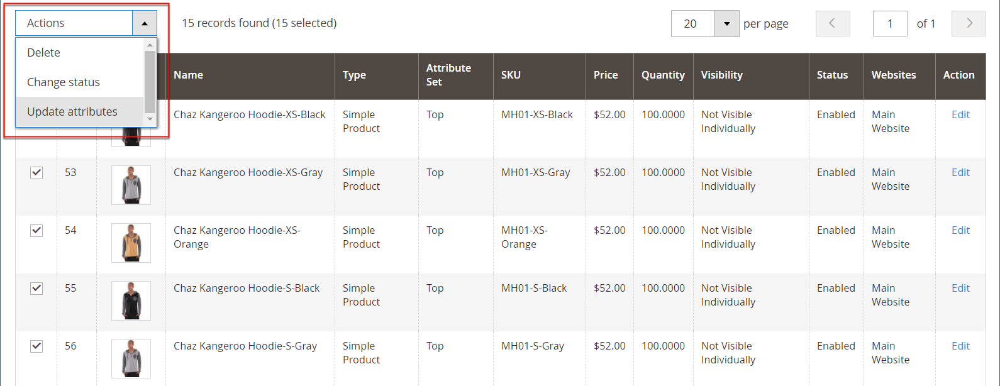
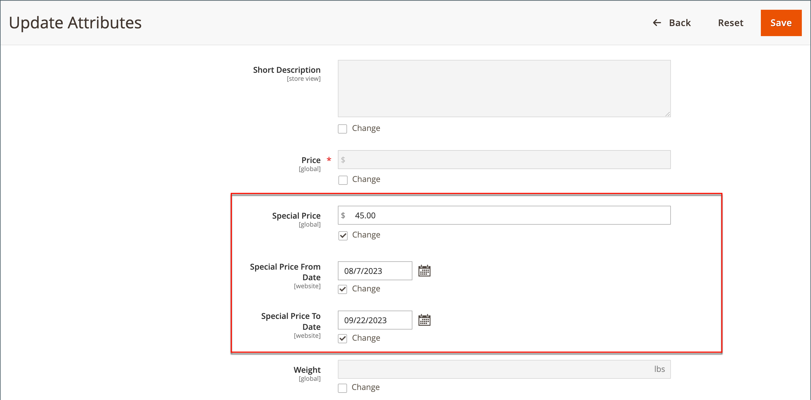

# Prezzi speciali

Un prezzo speciale può essere offerto per un determinato periodo di tempo. Durante il periodo di tempo specificato, il prezzo speciale viene visualizzato al posto del prezzo regolare, seguito da una notazione che mostra il prezzo regolare.

{width="700" zoomable="yes"}

## Applica prezzo speciale a un singolo prodotto

Puoi facilmente impostare un prezzo speciale per un singolo prodotto nel catalogo.

### Utilizza un aggiornamento pianificato

{{ee-feature}}

Adobe Commerce include il supporto per [aggiornamenti pianificati](../content-design/content-staging-scheduled-update.md). Utilizzare questi strumenti promozionali per applicare un prezzo speciale a un prodotto specifico per un periodo di tempo specificato.

1. Apri il prodotto in modalità di modifica.

1. Fare clic su **[!UICONTROL Scheduled Update]**.

   {width="600" zoomable="yes"}

1. Per **Aggiorna nome**, immettere un nome per la promozione prezzo speciale.

1. Immettere un breve **[!UICONTROL Description]**.

1. Utilizza l&#39;icona _Calendario_ (  ) per scegliere **[!UICONTROL Start Date]** e **[!UICONTROL End Date]** per la promozione prezzo speciale.

   È possibile utilizzare i cursori **[!UICONTROL Hour]** e **[!UICONTROL Minute]** per scegliere anche l&#39;ora di inizio e di fine. Fare clic su **[!UICONTROL Close]** quando sono impostati l&#39;inizio e la fine.

   {width="600" zoomable="yes"}

1. Scorri verso il basso fino al campo _Prezzo_, fai clic su **[!UICONTROL Advanced Pricing]** e immetti l&#39;importo di **[!UICONTROL Special Price]** da applicare in base all&#39;aggiornamento pianificato.

   {width="600" zoomable="yes"}

1. Al termine, fare clic su **[!UICONTROL Done]** e quindi su **[!DNL Save]**.

   Nella vetrina, il prezzo speciale dovrebbe essere visualizzato sia nell’elenco dei cataloghi che nella pagina del prodotto.

   _[!UICONTROL Scheduled Change]_viene visualizzato nella parte superiore della pagina.

   {width="600" zoomable="yes"}

### Utilizzare una data di inizio e una data di fine semplici

{{ce-feature}}

Magento Open Source include opzioni di data di inizio e di fine semplici nelle opzioni di Advanced Pricing.

1. Apri il prodotto in modalità di modifica.

1. Scorri verso il basso fino al campo _[!UICONTROL Price]_, fai clic su **[!UICONTROL Advanced Pricing]**e immetti l&#39;importo **[!UICONTROL Special Price]**.

1. Utilizza l&#39;icona _Calendario_ (  ) per scegliere **[!UICONTROL Start Date]** e **[!UICONTROL End Date]** per la promozione prezzo speciale.

   Il prezzo speciale entra in vigore immediatamente dopo la mezzanotte all&#39;inizio della data di inizio (00:01) e continua fino a poco prima della mezzanotte (23:59) del giorno prima della data di fine.

   {width="600" zoomable="yes"}

1. Al termine, fare clic su **[!UICONTROL Done]** e quindi su **[!UICONTROL Save]**.

   Nella vetrina, il prezzo speciale dovrebbe essere visualizzato sia nell’elenco dei cataloghi che nella pagina del prodotto.

## Applica un prezzo speciale a più prodotti

È inoltre possibile assegnare un prezzo speciale a più prodotti, ad esempio più varianti di un [prodotto configurabile](product-create-configurable.md).

### Imposta un prezzo speciale per i prodotti selezionati

{{ee-feature}}

L’esempio seguente mostra come assegnare lo stesso prezzo speciale a più varianti di prodotto di un prodotto configurabile in Adobe Commerce.

1. Nella pagina _[!UICONTROL Products]_, fare clic su **[!UICONTROL Filters]**e immettere **[!UICONTROL Name]**del prodotto configurabile.

1. Impostare **[!UICONTROL Type]** su `Configurable Product` e fare clic su **[!UICONTROL Apply Filters]**.

1. Per assegnare lo stesso prezzo speciale a tutti i prodotti, impostare il controllo nell&#39;intestazione della prima colonna su `Select All`.

   In alternativa, puoi selezionare la casella di controllo di ciascun prodotto che desideri includere.

1. Impostare il controllo **[!UICONTROL Actions]** su `Update attributes`.

1. Scorri verso il basso fino al campo _[!UICONTROL Special Price]_, seleziona la casella di controllo **[!UICONTROL Change]**sotto il campo_[!UICONTROL Special Price]_ e immetti il prezzo speciale che desideri offrire.

   {width="600" zoomable="yes"}

1. Al termine, fare clic su **[!UICONTROL Save]**.

Il prezzo speciale disponibile nel negozio viene visualizzato nelle inserzioni del catalogo e nella pagina del prodotto. Per un prodotto configurabile, il prezzo normale viene visualizzato anche nella pagina del prodotto quando si scelgono le opzioni.

### Imposta un prezzo speciale e un intervallo di date per i prodotti selezionati

{{ce-feature}}

L’esempio seguente mostra come assegnare lo stesso prezzo speciale a più varianti di prodotto di un prodotto configurabile in Magento Open Source.

1. Nella barra laterale _Admin_, passa a **[!UICONTROL Catalog]** > **[!UICONTROL Products]**.

1. Fare clic su **[!UICONTROL Filters]**.

1. Immettere **[!UICONTROL Name]** del prodotto configurabile.

1. Imposta **[!UICONTROL Type]** su `Simple Product`.

   {width="600" zoomable="yes"}

1. Fare clic su **[!UICONTROL Apply Filters]**.

   La griglia elenca tutti i prodotti semplici associati come varianti del prodotto configurabile.

1. Per assegnare lo stesso prezzo speciale a tutti i prodotti, impostare il controllo nell&#39;intestazione della prima colonna su `Select All`.

   In alternativa, puoi selezionare la casella di controllo di ciascun prodotto che desideri includere.

1. Impostare il controllo **[!UICONTROL Actions]** su `Update attributes`.

   {width="600" zoomable="yes"}

1. Scorri verso il basso fino al campo _[!UICONTROL Special Price]** ed effettua le seguenti operazioni:

   - Selezionare la casella di controllo **[!UICONTROL Change]** sotto il campo _[!UICONTROL Special Price]** e immettere il prezzo speciale che si desidera offrire.

   - Selezionare la casella di controllo **[!UICONTROL Change]** sotto il campo _Prezzo speciale da data_, fare clic sul _Calendario_ ( ) e scegliere la prima data della promozione prezzo speciale.

     Il prezzo speciale entra in vigore immediatamente dopo la mezzanotte all&#39;inizio della data di inizio (00:01) e continua fino a poco prima della mezzanotte (23:59) del giorno prima della data di fine.

   - Selezionare la casella di controllo **[!UICONTROL Change]** sotto il campo _Prezzo speciale fino alla data_, fare clic sul _Calendario_ ( ) e scegliere l&#39;ultima data della promozione prezzo speciale.

   {width="600" zoomable="yes"}

1. Al termine, fare clic su **[!UICONTROL Save]**.

   Un messaggio indica quanti record sono stati aggiornati con il prezzo speciale.

   Il prezzo speciale diventa disponibile nel negozio alla data specificata e viene visualizzato nelle inserzioni del catalogo e nella pagina del prodotto. Per un prodotto configurabile, il prezzo normale viene visualizzato anche nella pagina del prodotto quando si scelgono le opzioni.

   {width="600" zoomable="yes"}

## Test

Se il prezzo speciale non viene visualizzato correttamente nella vetrina sia nella pagina di elenco che in quella dei prodotti, cancella la cache del browser:

1. Nella barra laterale _Admin_, passa a **[!UICONTROL System]** > **[!UICONTROL Cache Management]**.

1. Fare clic su **[!UICONTROL Flush Magento Cache]**.

>[!NOTE]
>
>Il prezzo del prodotto **_final_** è calcolato come prezzo rilevante **_minimum_**, utilizzando la seguente formula:  `Final Price=Min(Regular(Base) Price, Group(Tier) Price, Special Price, Catalog Price Rule) + Sum(Min Price per each required custom option)`

>[!NOTE]
>
>**_Le opzioni personalizzabili del prodotto_** a prezzo fisso sono _non_ influenzate dalle regole di prezzo di gruppo, prezzo di livello, prezzo speciale o prezzo di catalogo.
