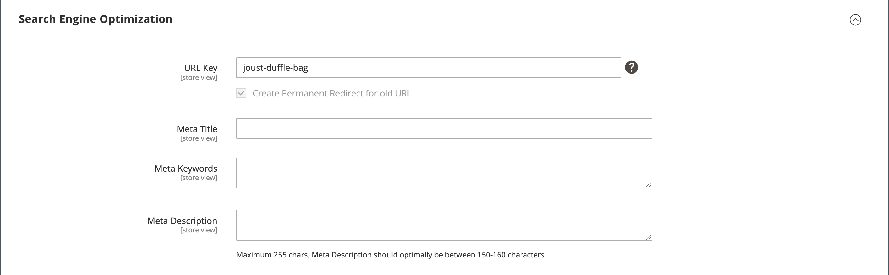

# Impostazioni prodotto - [!UICONTROL Search Engine Optimization]

_Ottimizzazione dei motori di ricerca_ (SEO) è la pratica di perfezionare il contenuto e la presentazione di un sito per migliorare il modo in cui le pagine vengono indicizzate dai motori di ricerca.

Il _[!UICONTROL Search Engine Optimization]_impostazioni di un prodotto specificare [Chiave URL](catalog-urls.md) e [metadati](../merchandising-promotions/meta-data.md) campi utilizzati dai motori di ricerca per indicizzare il prodotto. Anche se alcuni motori di ricerca ignorano le parole chiave meta, altri motori di ricerca continuano a utilizzarle. L&#39;attuale [Best practice per l’ottimizzazione SEO](../merchandising-promotions/seo-overview.md) deve incorporare parole chiave di alto valore sia nel titolo meta che nella descrizione meta.

Il valore predefinito per ogni campo di metadati può essere generato automaticamente in base ai valori specificati nella configurazione. Ogni campo contiene un segnaposto sostituito da un valore effettivo. Per ulteriori informazioni, consulta [Generazione automatica campi prodotto](../configuration-reference/catalog/catalog.md#uicontrol-product-fields-auto-generation).

## Completare i campi SEO (Search Engine Optimization)

1. Apri il prodotto in modalità di modifica.

1. Scorri verso il basso ed espandi  il _[!UICONTROL Search Engine Optimization]_sezione.

{width="600" zoomable="yes"}

1. Inserisci il **[!UICONTROL URL Key]** (facoltativo).

   Il codice URL predefinito è basato sul nome del prodotto. Puoi utilizzare il valore predefinito o modificarlo in base alle esigenze. Per ulteriori informazioni, consulta [URL catalogo](catalog-urls.md).

1. Inserisci il **[!UICONTROL Meta Title]** (facoltativo).

   Il titolo meta è il testo visualizzato nella parte superiore della finestra del browser. Puoi utilizzare il valore predefinito, basato sul nome del prodotto, oppure modificarlo in base alle esigenze.

1. Aggiungi il **[!UICONTROL Meta Keywords]** (facoltativo).

   Le metaparole chiave vengono utilizzate da alcuni motori di ricerca più di altri. È consigliabile immettere alcune parole chiave di alto valore per aumentare la visibilità del prodotto.

1. Inserisci il **[!UICONTROL Meta Description]**.

   La metadescrizione è il testo visualizzato nell&#39;elenco dei risultati di ricerca. Per ottenere risultati ottimali, immettere una descrizione di lunghezza compresa tra 150 e 160 caratteri.

## Riferimento campo

| Campo | [Ambito](../getting-started/websites-stores-views.md#scope-settings) | Descrizione |
|--- |--- |------------------|
| [!UICONTROL URL Key] | Visualizzazione store | Determina l&#39;indirizzo in linea del prodotto. La chiave URL viene aggiunta all’URL di base dell’archivio e visualizzata nella barra degli indirizzi di un browser. Commerce crea inizialmente un’ _compatibile con i motori di ricerca_ URL basato sul nome del prodotto. La Chiave URL deve contenere tutti caratteri minuscoli, tra i quali non devono essere presenti trattini finali anziché spazi. Non includere un suffisso come `.html` nella chiave URL, perché viene gestita nella configurazione. |
| [!UICONTROL Meta Title] | Visualizzazione store | Il titolo viene visualizzato nella barra del titolo e nella scheda del browser e viene utilizzato anche come titolo in una pagina dei risultati di un motore di ricerca (SERP). Il metatitolo deve essere univoco per la pagina e contenere meno di 70 caratteri. Valore generato automaticamente: `{{name}}` |
| [!UICONTROL Meta Keywords] | Visualizzazione store | Parole chiave rilevanti per il prodotto. Valuta l’utilizzo di parole chiave che i clienti potrebbero utilizzare per trovare il prodotto. Valore generato automaticamente: `{{name}}` |
| [!UICONTROL Meta Description] | Visualizzazione store | La metadescrizione fornisce una breve panoramica della pagina per l’elenco dei risultati di ricerca. La lunghezza ideale è compresa tra 150 e 160 caratteri, con un massimo di 255 caratteri. Sebbene non sia visibile al cliente, alcuni motori di ricerca includono la metadescrizione nella pagina dei risultati della ricerca. Valore generato automaticamente: `{{name}} {{description}}` |

{style="table-layout:auto"}
