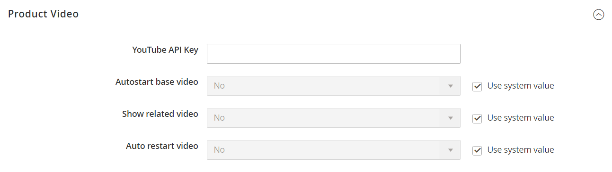

# Aggiungi video di prodotto

Per aggiungere un video di prodotto, devi prima ottenere una chiave API dal tuo account Google e immetterla nella configurazione dello store. Quindi puoi collegare il prodotto al video.

## Passaggio 1: ottenere la chiave API di YouTube

1. Accedi al tuo account Google e visita il [Console per sviluppatori Google][1].

1. Nel campo di ricerca in alto, immetti `YouTube Data API v3` e fai clic sull’icona di ricerca.

1. Quando viene visualizzata la pagina API, accertati che sia abilitata.

1. Nel pannello a sinistra, scegli **[!UICONTROL Credentials]**.

1. A seconda che si disponga di credenziali o meno, eseguire una delle operazioni seguenti:

   - Se disponi già delle credenziali necessarie, copia la chiave in _Chiavi API_ tabella.

   - Se non disponi già delle credenziali per questa API, fai clic su **[!UICONTROL Create Credentials]**  nella parte superiore e segui le istruzioni per creare le credenziali necessarie. Sotto _Ottenere le credenziali_, copia la chiave API e fai clic su **[!UICONTROL Done]**.

1. Copia la chiave API negli Appunti.

1. Fai clic sull’icona Modifica a destra e imposta le restrizioni per assicurarti che la chiave API sia limitata ai referenti corretti.

1. Attendi alcuni istanti mentre viene generata la chiave, quindi copiala negli Appunti.

   Nel passaggio successivo, incollerai la chiave nella configurazione del tuo archivio.

## Passaggio 2: configurare la chiave in Commerce

1. Il giorno _Amministratore_ barra laterale, vai a **[!UICONTROL Stores]** > _[!UICONTROL Settings]_>**[!UICONTROL Configuration]**.

1. Nel pannello a sinistra, espandi **[!UICONTROL Catalog]** e scegli **[!UICONTROL Catalog]** sotto.

1. Espandi  il _[!UICONTROL Product Video]_e incolla il **[!UICONTROL YouTube API key]**.

   {width="600" zoomable="yes"}

1. Al termine, fai clic su **[!UICONTROL Save Config]**.

1. Quando richiesto, aggiorna la cache.

## Passaggio 3: collegamento al video

1. Apri un prodotto in modalità di modifica.

1. Scorrere ed espandere _[!UICONTROL Images and Videos]_sezione.

   {width="600" zoomable="yes"}

1. click **[!UICONTROL Add Video]**.

   Se non hai ancora configurato la chiave API di YouTube, fai clic su **[!UICONTROL OK]** per continuare. Non puoi effettuare il collegamento a un video YouTube, ma puoi seguire la procedura.

1. Per **[!UICONTROL Url]**, immetti l’URL del video YouTube o Vimeo.

   {width="600" zoomable="yes"}

1. Fai clic all’esterno del campo e attendi il feedback sulla chiave API o sul video.

   Se tutto viene estratto, YouTube fornisce le informazioni di base del video

1. Inserisci il **[!UICONTROL Title]** e **[!UICONTROL Description]** del video.

1. Per caricare una **[!UICONTROL Preview Image]**, individuare l&#39;immagine e selezionare il file.

   >[!NOTE]
   >
   >Dopo il caricamento, l’immagine di anteprima visualizzata viene generata automaticamente da un provider di servizi video esterno. Non è possibile modificare l’immagine dall’amministratore di Adobe Commerce.

1. Se preferisci utilizzare i metadati video, fai clic su **[!UICONTROL Get Video Information]**.

1. Per determinare il modo in cui il video viene utilizzato nell’archivio, seleziona la casella di controllo di ciascun **[!UICONTROL Role]** che si applica:

   - `Base Image`
   - `Small Image`
   - `Swatch Image`
   - `Thumbnail`
   - `Hide from Product Page`

1. Al termine, fai clic su **[!UICONTROL Save]**.

   >[!NOTE]
   >
   >Se il _[!UICONTROL Autostart base video]_l&#39;opzione di configurazione è impostata su `Yes` ma il video non inizia a essere riprodotto automaticamente, potrebbe essere dovuto ai criteri di riproduzione automatica applicati dal browser e non controllabili da Adobe Commerce. Ogni browser supportato dispone di criteri di riproduzione automatica che possono cambiare nel tempo e il video potrebbe non essere riprodotto automaticamente in futuro. Come best practice consigliata, non affidarti alla riproduzione automatica per le funzionalità business critical e verifica il comportamento di riproduzione automatica del video nel tuo store con ogni browser supportato.

## Gestisci accesso API

Secondo lo sviluppatore Google [Termini e condizioni], YouTube può disabilitare l’accesso API per gli account che sono stati inattivi per più di 90 giorni. Questa occorrenza potrebbe impedire la visualizzazione dei video. Per mantenere aggiornato l’accesso API, utilizza un processo cron per eseguire il ping dell’API a intervalli regolari:

```code
30 10 1 * * curl -i -G -e https://yourdomain.com/ -d "part=snippet&maxResults=1&q=test&key=YOUTUBEAPIKEY" https://www.googleapis.com/youtube/v3/search >/dev/null 2>&1
```

## Riferimento campo

| Campo | Descrizione |
|--- |--- |
| [!UICONTROL URL] | URL del video associato. |
| [!UICONTROL Title] | Titolo del video. |
| [!UICONTROL Description] | Descrizione del video. |
| [!UICONTROL Preview Image] | Un’immagine caricata che viene utilizzata come anteprima del video nel tuo store. |
| [!UICONTROL Get Video Information] | Recupera i metadati video memorizzati sul server host. Puoi utilizzare i dati originali o aggiornarli in base alle esigenze. |
| [!UICONTROL Role] | Determina il modo in cui l&#39;immagine di anteprima viene utilizzata nell&#39;archivio. È possibile scegliere qualsiasi combinazione di opzioni: `Base Image`, `Small Image`, `Thumbnail`, `Swatch Image`, `Hide from Product Page` |

{style="table-layout:auto"}

[1]: https://console.developers.google.com/
[Termini e condizioni]: https://developers.google.com/youtube/terms/developer-policies#d.-accessing-youtube-api-services
