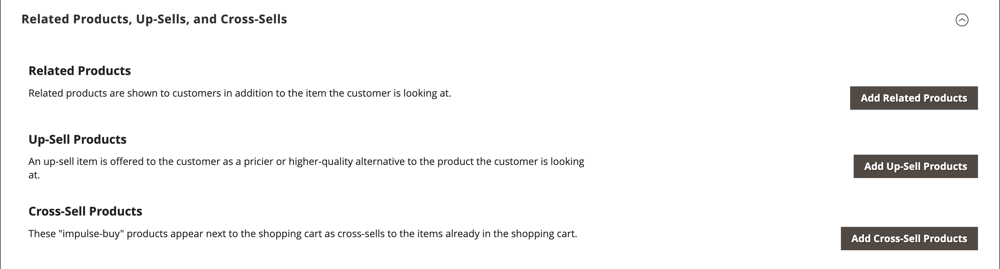
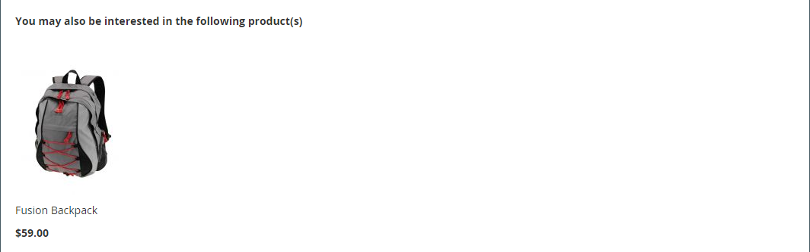
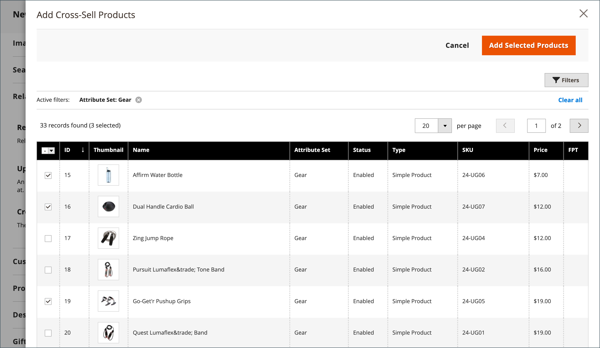

# Impostazioni prodotto - [!UICONTROL Related Products, Up-Sells, and Cross-Sells]

Utilizzare la sezione _[!UICONTROL Related Products, Up-Sells, and Cross-Sells]_&#x200B;per impostare semplici blocchi promozionali che presentano una selezione di prodotti aggiuntivi che potrebbero essere di interesse per il cliente. Per ulteriori informazioni, vedere [Relazioni prodotto](../merchandising-promotions/product-relationships.md).

{width="600" zoomable="yes"}

Ogni blocco è costituito da un elenco di prodotti che appartengono a un’opzione specifica.

| Campo | Descrizione |
|--- |--- |
| [!UICONTROL ID] | Identificatore numerico univoco assegnato all’entità prodotto. |
| [!UICONTROL Thumbnail] | Immagine miniatura prodotto. |
| [!UICONTROL Name] | Il nome del prodotto. |
| [!UICONTROL Status] | Indica lo stato del prodotto. Opzioni: `Enabled` / `Disabled`. I prodotti disattivati non vengono visualizzati nei blocchi sul front-end. |
| [!UICONTROL Attribute Set] | Nome del set di attributi utilizzato come modello per il prodotto. |
| [!UICONTROL SKU] | Unità di stoccaggio univoca assegnata al prodotto. |
| [!UICONTROL Price] | Il prezzo unitario del prodotto. |
| [!UICONTROL Action] | Opzioni: `Remove`. Rimuovi un prodotto dal blocco. |

{style="table-layout:auto"}

>[!TIP]
>
> (solo Adobe Commerce) **Consigli di prodotto basati su Adobe AI** semplifica il processo di definizione delle relazioni tra i prodotti utilizzando algoritmi di intelligenza artificiale e machine learning per eseguire un&#39;analisi approfondita dei dati aggregati dei visitatori. Quando vengono combinati con il catalogo di Adobe Commerce, questi dati offrono esperienze altamente coinvolgenti, pertinenti e personalizzate per l’acquirente.
> >Per ulteriori informazioni sull&#39;utilizzo di questa estensione sviluppata da Adobe come alternativa alla configurazione manuale di prodotti consigliati e up-sell, consulta la _[Guida ai prodotti consigliati](https://experienceleague.adobe.com/docs/commerce/product-recommendations/guide-overview.html?lang=it)_.

## Prodotti correlati

I prodotti correlati devono essere acquistati in aggiunta all&#39;articolo che il cliente sta visualizzando. Il cliente può inserire l’articolo nel carrello semplicemente facendo clic sulla casella di controllo. La posizione del blocco _Prodotti correlati_ varia in base al tema e al layout di pagina definiti. Nell&#39;esempio seguente, il blocco _Prodotti correlati_ viene visualizzato nella parte inferiore della pagina _Visualizzazione prodotto_. Con un layout a due colonne, il blocco _Prodotti correlati_ viene spesso visualizzato nella barra laterale a destra.

{width="600" zoomable="yes"}

Per impostare i prodotti correlati:

1. Apri il prodotto in modalità di modifica.

1. Scorri verso il basso ed espandi il  nella sezione **[!UICONTROL Related Products, Up-Sells, and Cross-Sells]**.

1. Fare clic su **[!UICONTROL Add Related Products]**.

1. Utilizza i [controlli filtro](../getting-started/admin-grid-controls.md) per trovare i prodotti desiderati.

1. Nell’elenco, seleziona la casella di controllo di qualsiasi prodotto che desideri visualizzare come prodotto correlato.

   {width="600" zoomable="yes"}

1. Al termine, fare clic su **[!UICONTROL Add Selected Products]**.

## Up-sell

I prodotti di upselling sono articoli che il cliente potrebbe preferire al posto del prodotto attualmente considerato. Un articolo offerto come upselling potrebbe essere di qualità superiore, più popolare o avere un margine di profitto migliore. I prodotti di upselling vengono visualizzati nella pagina del prodotto sotto un&#39;intestazione come _Potresti essere interessato anche ai seguenti prodotti_.

{width="600" zoomable="yes"}

Per selezionare i prodotti di upselling:

1. Apri il prodotto in modalità di modifica.

1. Scorri verso il basso ed espandi il  nella sezione **[!UICONTROL Related Products, Up-Sells, and Cross-Sells]**.

1. Fare clic su **[!UICONTROL Add Up-Sell Products]**.

1. Utilizza i [controlli filtro](../getting-started/admin-grid-controls.md) per trovare i prodotti desiderati.

1. Nell’elenco, seleziona la casella di controllo di qualsiasi prodotto che desideri visualizzare come prodotto di upselling.

   {width="600" zoomable="yes"}

1. Al termine, fare clic su **[!UICONTROL Add Selected Products]**.

>[!NOTE]
>
>Il pacchetto principale viene sempre visualizzato automaticamente come prodotto di up-sell per tutti i suoi prodotti secondari.

## Effetti di cross-selling

Gli articoli di cross-selling sono simili agli acquisti di impulso posizionati accanto al registratore di cassa nella linea di pagamento. I prodotti offerti come cross-selling vengono visualizzati sulla pagina del carrello, appena prima che il cliente inizi il processo di pagamento.

>[!NOTE]
>
>Per mostrare o nascondere gli articoli di cross-selling per visualizzazione store, vedere l&#39;opzione [Pagamento > Carrello acquisti](../configuration-reference/sales/checkout.md) denominata _[!UICONTROL Show Cross-sell Items]_&#x200B;nel carrello acquisti. Puoi nascondere le cross-selling durante vendite specifiche o per test A/B in una visualizzazione punto vendita.

{width="600" zoomable="yes"}

**_Per selezionare i prodotti di cross-selling:_**

1. Apri il prodotto in modalità di modifica.

1. Scorri verso il basso ed espandi il  nella sezione **[!UICONTROL Related Products, Up-Sells, and Cross-Sells]**.

1. Fare clic su **[!UICONTROL Add Cross-Sell Products]**.

1. Utilizza i [controlli filtro](../getting-started/admin-grid-controls.md) per trovare i prodotti desiderati.

1. Nell’elenco, seleziona la casella di controllo di qualsiasi prodotto che desideri visualizzare come prodotto di cross-selling.

   {width="600" zoomable="yes"}

1. Al termine, fare clic su **[!UICONTROL Add Selected Products]**.

