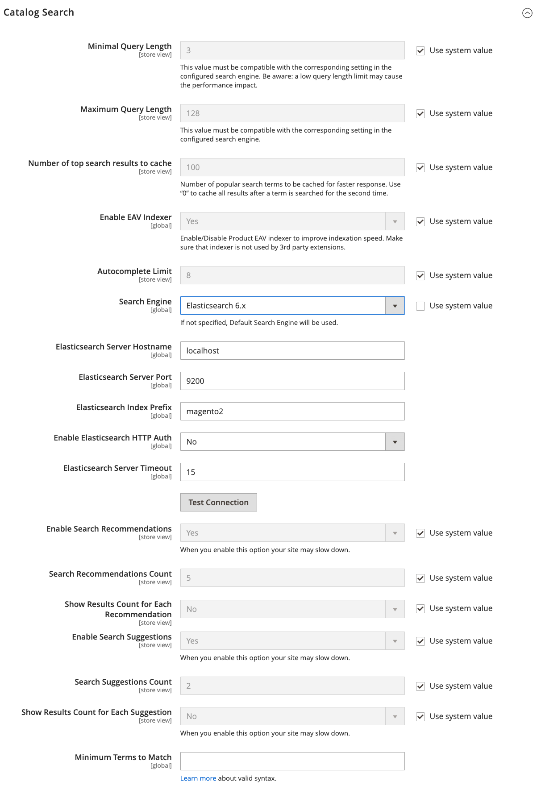

# Configura ricerca catalogo

Sono disponibili due varianti della configurazione di Ricerca nel catalogo. Il primo metodo descrive le impostazioni disponibili quando [Live Search](https://experienceleague.adobe.com/docs/commerce-merchant-services/live-search/overview.html) è installato. Il secondo metodo descrive le impostazioni di configurazione per Adobe Commerce nativo con [Elasticsearch][1]{:target=&quot;_blank&quot;}.

## Metodo 1: Adobe Commerce con [!DNL Live Search]

1. Il giorno _Amministratore_ barra laterale, vai a **[!UICONTROL Stores]** > _[!UICONTROL Settings]_>**[!UICONTROL Configuration]**.

1. Nel pannello a sinistra, espandi **[!UICONTROL Catalog]** e scegli **[!UICONTROL Catalog]** sotto.

1. Espandi  il **[!UICONTROL Catalog Search]** sezione.

   {width="600" zoomable="yes"}

   Per un elenco dettagliato di queste opzioni, vedi [Adobe Commerce con Live Search](../configuration-reference/catalog/catalog.md#adobe-commerce-with-live-search) nel _Riferimento configurazione_.

1. Per limitare la lunghezza e il numero di parole del testo della query di ricerca, impostare un valore per **[!UICONTROL Minimal Query Length]** e **[!UICONTROL Maximum Query Length]**.

1. Per limitare la quantità di risultati di ricerca più comuni da memorizzare nella cache per ottenere risposte più rapide, imposta una quantità per **[!UICONTROL Number of top search results to cache]**.

   Il valore predefinito è `100`. Inserimento di un valore `0` memorizza nella cache tutti i termini e i risultati di ricerca immessi una seconda volta.

1. Per modificare il numero massimo di righe disponibili per i risultati restituiti in [vetrina a comparsa](https://experienceleague.adobe.com/docs/commerce-merchant-services/live-search/live-search-storefront/quick-tour.html), immettere un valore diverso **[!UICONTROL Autocomplete Limit]** valore.

   La limitazione del numero di righe migliora le prestazioni delle ricerche e riduce le dimensioni dell’elenco restituito. Il valore predefinito è `8` linee.

## Metodo 2: Commerce con Elasticsearch

>[!IMPORTANT]
>
>A causa della [!DNL Elasticsearch 7] Annuncio sulla fine del supporto di per agosto 2023, si consiglia a tutti i clienti di Adobe Commerce di migrare al motore di ricerca OpenSearch 2.x. Per informazioni sulla migrazione del motore di ricerca durante l’aggiornamento del prodotto, consulta [Migrazione a OpenSearch](https://experienceleague.adobe.com/docs/commerce-operations/upgrade-guide/prepare/opensearch-migration.html) nel _Guida all’aggiornamento_.

{{beta2-updates}}

### Passaggio 1: configurare le opzioni di ricerca generali

>[!NOTE]
>
>Ad Elasticsearch, non è disponibile il supporto predefinito per la ricerca in base al suffisso. Ad esempio, la ricerca per SKU potrebbe non restituire il risultato previsto se la parola chiave contiene solo la parte finale dello SKU.

1. Il giorno _Amministratore_ barra laterale, vai a **[!UICONTROL Stores]** > _[!UICONTROL Settings]_>**[!UICONTROL Configuration]**.

1. Nel pannello a sinistra, espandi **[!UICONTROL Catalog]** e scegli **[!UICONTROL Catalog]** sotto.

1. Espandi  il **[!UICONTROL Catalog Search]** sezione.

   {width="600" zoomable="yes"}

   Per ulteriori informazioni su queste opzioni, vedi [Adobe Commerce con Elasticsearch](../configuration-reference/catalog/catalog.md#adobe-commerce-with-elasticsearch) nel _Riferimento configurazione_.

1. Per limitare la lunghezza e il numero di parole del testo della query di ricerca, impostare un valore per **[!UICONTROL Minimal Query Length]** e **[!UICONTROL Maximum Query Length]**.

   >[!IMPORTANT]
   >
   >Il valore impostato per questo intervallo minimo e massimo deve essere compatibile con l’intervallo corrispondente impostato nella configurazione di Elasticsearch del motore di ricerca. Ad esempio, se imposti questi valori su `2` e `300` in Commerce, aggiorna i valori corrispondenti nel motore di ricerca.

1. Per limitare la quantità di risultati di ricerca più comuni da memorizzare nella cache per ottenere risposte più rapide, imposta una quantità per **[!UICONTROL Number of top search results to cache]**.

   Il valore predefinito è `100`. Inserimento di un valore `0` memorizza nella cache tutti i termini e i risultati di ricerca immessi una seconda volta.

1. Se si desidera attivare o disattivare l&#39;indicizzatore Product EAV, impostare **[!UICONTROL Enable EAV Indexer]**.

   Questa funzione migliora la velocità di indicizzazione e impedisce all’indicizzatore di essere utilizzato da estensioni di terze parti.

1. Per limitare il numero massimo di risultati di ricerca da visualizzare per il completamento automatico della ricerca, impostare un importo per **[!UICONTROL Autocomplete Limit]**.

   Limitando questa quantità si aumentano le prestazioni delle ricerche e si riduce la dimensione dell’elenco visualizzato. Il valore predefinito è `8`.

### Passaggio 2: configurare la connessione Elasticsearch

>[!IMPORTANT]
>
>Il **[!UICONTROL Search Engine]**, **[!UICONTROL Elasticsearch Server Hostname]**, **[!UICONTROL Elasticsearch Server Port]**, **[!UICONTROL Elasticsearch Index Prefix]**, **[!UICONTROL Enable Elasticsearch HTTP Auth]**, e **[!UICONTROL Elasticsearch Server Timeout]** i campi sono stati configurati al momento dell’installazione o dell’aggiornamento di Commerce. Questi valori devono essere modificati solo quando si aggiorna o si modifica l’Elasticsearch.

1. Per **[!UICONTROL Search Engine]**, accetta il valore predefinito `Elasticsearch 7`.

   L’Elasticsearch 7.6.x è richiesto per tutte le installazioni di Commerce.

1. Per **[!UICONTROL Elasticsearch Server Hostname]**, accetta il valore predefinito configurato al momento dell’installazione di Commerce.

   In questo esempio, il valore predefinito è `elasticsearch.internal`.

1. Per **[!UICONTROL Elasticsearch Server Port]**, accetta il valore predefinito configurato al momento dell’installazione di Commerce.

   In questo esempio, il valore predefinito è `9200`.

1. Per **[!UICONTROL Elasticsearch Index Prefix]**, immetti un prefisso per identificare l&#39;indice Elasticsearch.

   Il valore predefinito è `magento2`.

1. Per utilizzare l&#39;autenticazione HTTP per richiedere un nome utente e una password per accedere a Elasticsearch Server, impostare **[!UICONTROL Enable Elasticsearch HTTP Auth]** a `Yes`.

1. Per **[!UICONTROL Elasticsearch Server Timeout]**, immettere il numero di secondi prima del timeout del sistema.

   Il valore predefinito è `15`.

1. Per verificare la configurazione, fai clic su **[!UICONTROL Test Connection]**.

### Passaggio 3: configurare suggerimenti e consigli

>[!NOTE]
>
>I suggerimenti e i consigli di ricerca possono influire sulle prestazioni del server.

1. Per offrire consigli, imposta **[!UICONTROL Enable Search Recommendations]** a `Yes` ed effettuare le seguenti operazioni:

   - Per **[!UICONTROL Search Recommendation Count]**, inserisci il numero di consigli da offrire.

   - Per visualizzare il numero di risultati trovati per ogni consiglio, imposta **[!UICONTROL Show Results Count for Each Recommendation]** a `Yes`.

1. Imposta **[!UICONTROL Enable Search Suggestions]** a `Yes` ed effettuare le seguenti operazioni:

   - Per **[!UICONTROL Search Suggestions Count]**, inserisci il numero di suggerimenti di ricerca da offrire.

   - Per visualizzare il numero di risultati trovati per ogni suggerimento, imposta **[!UICONTROL Show Results for Each Suggestion]** a `Yes`.

### Passaggio 4: configurare i termini minimi da abbinare

Per controllare il numero minimo di termini della query che i risultati della ricerca devono corrispondere per la restituzione, specifica un valore per **[!UICONTROL Minimum Terms to Match]**. Specificando questo valore si garantisce la rilevanza dei risultati ottimali per gli acquirenti. Per un elenco dei valori accettati, vedi [parametro minimum_should_match](https://www.elastic.co/guide/en/elasticsearch/reference/current/query-dsl-minimum-should-match.html) nella documentazione di Elasticsearch.

Al termine, fai clic su **[!UICONTROL Save Config]**.

[1]: https://experienceleague.adobe.com/docs/commerce-operations/installation-guide/prerequisites/search-engine/overview.html
[2]: https://experienceleague.adobe.com/docs/commerce-operations/configuration-guide/search/overview-search.html
