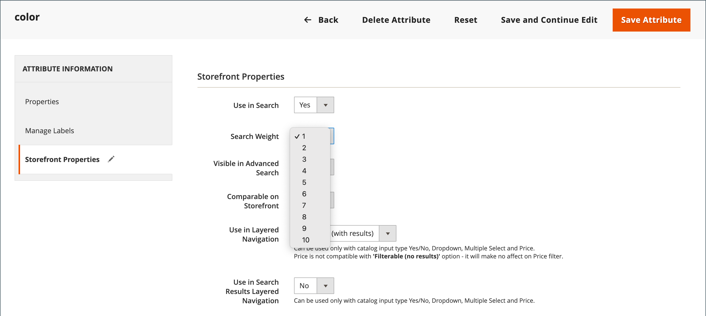

# Risultati di ricerca

>[!NOTE]
>
>In questa pagina sono descritte le funzionalità di ricerca standard che potrebbero essere diverse da [Live Search](https://experienceleague.adobe.com/docs/commerce-merchant-services/live-search/overview.html).

L&#39;elenco _Risultati ricerca_ include tutti i prodotti che corrispondono ai criteri di ricerca specificati nella casella Ricerca rapida o nel modulo Ricerca avanzata. Ogni elenco di prodotti del catalogo ha essenzialmente gli stessi controlli. L&#39;unica differenza è che uno è il risultato di una query di ricerca e l&#39;altra è il risultato di [navigazione](navigation.md).

I risultati possono essere formattati come griglia o elenco e ordinati in base a una selezione di attributi. I controlli di impaginazione vengono visualizzati se nella pagina sono presenti più prodotti di quanti ne possano contenere. Utilizzare questi controlli per passare da una pagina all&#39;altra. Il numero di record per pagina è determinato dalla configurazione di Catalog Frontend. Per ulteriori informazioni, vedere [Elenco prodotti](navigation-product-listings.md).

Con **Elasticsearch**:

- Non è disponibile il supporto predefinito per la ricerca in base al suffisso. Ad esempio, la ricerca per SKU potrebbe non restituire il risultato previsto se la parola chiave contiene solo la parte finale dello SKU.
- Supporto predefinito per la ricerca per prefisso (ricerca parziale per parole chiave) solo per gli attributi di prodotto `name` e `sku`. La ricerca di tutti gli altri attributi del prodotto viene eseguita in base alla parola chiave intera, con l’esatta corrispondenza.
- I risultati della ricerca per gli attributi di prodotto `name` e `sku` si basano sulla rilevanza, non sulla corrispondenza esatta. Vengono elencate per prime le corrispondenze più rilevanti, ad esempio _Nome prodotto_ o _SKU_ corrispondenti. Per cercare una corrispondenza esatta, il cliente può utilizzare le virgolette nella query di ricerca. Ad esempio, una query di ricerca `WSH12-32-Red` può restituire diversi prodotti, ordinati in base alla rilevanza. Ma una query di ricerca `"WSH12-32-Red"` restituisce un solo prodotto con **_esattamente_** corrispondente a `sku`.

{width="700" zoomable="yes"}

>[!IMPORTANT]
>
>A causa dell’annuncio di fine del supporto di Elasticsearch 7 relativo ad agosto 2023, si consiglia a tutti i clienti di Adobe Commerce di migrare al motore di ricerca OpenSearch 2.x. Per informazioni sulla migrazione del motore di ricerca durante l&#39;aggiornamento del prodotto, vedere [Migrazione a OpenSearch](https://experienceleague.adobe.com/docs/commerce-operations/upgrade-guide/prepare/opensearch-migration.html) nella _Guida all&#39;aggiornamento_.

## Mappatura delle parole chiave per estendere i risultati della ricerca

Questa tecnica utilizza un attributo per creare un’associazione basata su parole chiave tra due prodotti in modo che la ricerca di uno dei due prodotti restituisca i risultati per entrambi i prodotti. È possibile utilizzare la mappatura delle parole chiave per promuovere un prodotto nei risultati di ricerca in cui altrimenti non verrebbe visualizzato.

{width="700" zoomable="yes"}

Nell&#39;esempio seguente viene utilizzata la mappatura delle parole chiave basata su SKU. Quando si immette uno SKU nella casella di ricerca, entrambi i prodotti vengono visualizzati nei risultati. Vengono mappati gli SKU dei seguenti prodotti configurabili, anziché gli SKU delle varianti di prodotto:

- Giubbotto Antivento Montana (MJ03)
- Cappuccio di canguro Chaz (MH01)

### Passaggio 1: creare un attributo

1. Nell&#39;elenco _[!UICONTROL Products]_aprire `Montana Wind Jacket` (MJ03) in modalità di modifica.
1. Nell&#39;angolo superiore destro fare clic su **[!UICONTROL Add Attribute]**.
1. Nella pagina _Seleziona attributo_ fare clic su **[!UICONTROL Create New Attribute]**.
1. Completa le proprietà dell’attributo come segue:

   **[!UICONTROL Attribute Properties]**

   - [!UICONTROL Attribute Label] - `Search Keywords`
   - [!UICONTROL Catalog Input Type for Store Owner] - `Text Field`

   **[!UICONTROL Advanced Attribute Properties]**

   - [!UICONTROL Add to Column Options] - `Yes` (impostazione predefinita)
   - [!UICONTROL Use in Filter Options] - `Yes` (impostazione predefinita)

   **[!UICONTROL Storefront Properties]**

   - [!UICONTROL Use in Search] - `Yes`
   - [!UICONTROL Visible on Catalog Pages in the Storefront] - `No`
   - [!UICONTROL Used in Product Listings] - `No`

1. Al termine, fare clic su **[!UICONTROL Save Attribute]**.

   L’attributo viene aggiunto al set di attributi del prodotto.

### Passaggio 2: mappare il primo prodotto

1. Nella pagina delle impostazioni del prodotto, scorrere verso il basso ed espandere la sezione _[!UICONTROL Attributes]_.
1. Nel campo **[!UICONTROL Search Keywords]**, immettere lo SKU `MH01` da mappare a questo prodotto.

   È possibile immettere più SKU separati da uno spazio nel campo Parole chiave di ricerca. In questo esempio ne viene immesso solo uno.

   {width="600" zoomable="yes"}

1. Al termine, fare clic su **[!UICONTROL Save]**.
1. Vai a **[!UICONTROL System]** > _[!UICONTROL Tools]_>**[!UICONTROL Cache Management]**e aggiorna **[!UICONTROL Page Cache]**.

### Passaggio 3: mappare il secondo prodotto

1. Nell&#39;elenco _[!UICONTROL Products]_aprire `Chaz Kangaroo Hoodie` (MH01) in modalità di modifica.
1. Scorri verso il basso ed espandi la sezione **[!UICONTROL Attributes]**.
1. Nel campo **[!UICONTROL Search Keywords]**, immettere lo SKU per l&#39;altro prodotto, `MJ03`.
1. Fare clic su **[!UICONTROL Save]**.
1. Vai a **[!UICONTROL System]** > _[!UICONTROL Tools]_>**[!UICONTROL Cache Management]**e aggiorna **[!UICONTROL Page Cache]**.

### Passaggio 4: testarlo nella vetrina

1. Vai alla vetrina e immetti `MJ03` nella casella _Ricerca rapida_.
1. Verifica che entrambi i prodotti siano restituiti nell’elenco dei risultati della ricerca.

## Ricerca ponderata

Agli attributi dei prodotti abilitati per la ricerca nel catalogo può essere assegnato un valore più elevato nei risultati di ricerca. Gli attributi con un peso maggiore vengono restituiti prima degli attributi con un peso inferiore. Ad esempio, se nel sistema sono presenti due attributi, _color_ con un peso di ricerca di 3 e _description_ con un peso di ricerca di 1. La ricerca della parola _red_ restituisce un elenco di prodotti con un attributo di colore `red` nella parte superiore dei risultati della ricerca e restituisce prodotti con descrizioni che contengono la parola _red_ nella parte inferiore dei risultati della ricerca. In questo esempio, l&#39;attributo `color` ha un peso definito maggiore dell&#39;attributo `description`.

>[!IMPORTANT]
>
>L&#39;ordinamento in base alla rilevanza è influenzato da **_più_** criteri e relazioni tra di essi **_contemporaneamente_**. [!UICONTROL Search Weight] è solo uno di questi criteri. Ciò significa che a volte gli attributi con un peso di ricerca inferiore possono avere ancora maggiore rilevanza degli attributi con un peso di ricerca maggiore. Altri criteri possono includere il numero di corrispondenze in un dato attributo, la posizione del termine di ricerca trovato e la struttura generale del testo prima e dopo un termine di ricerca.

**_Per impostare le proprietà del peso di ricerca di un attributo:_**

1. Nella barra laterale _Admin_, passa a **[!UICONTROL Stores]** > _[!UICONTROL Attributes]_>**[!UICONTROL Product]**.

1. Trova l’attributo nell’elenco e aprilo in modalità di modifica.

1. Nel pannello a sinistra, scegli **[!UICONTROL Storefront Properties]** ed effettua le seguenti operazioni:

   - Per includere l&#39;attributo nelle query di ricerca, impostare **[!UICONTROL Use in Search]** su `Yes`.

   - Per stabilire il valore di ricerca dell&#39;attributo, impostare **[!UICONTROL Search Weight]** su un numero compreso tra 1 e 10, dove `10` ha la priorità più alta. Se non viene immesso alcun valore, per impostazione predefinita tutti gli attributi hanno un peso di ricerca pari a `1`.

   {width="600" zoomable="yes"}

1. Al termine, fare clic su **[!UICONTROL Save Attribute]**.
