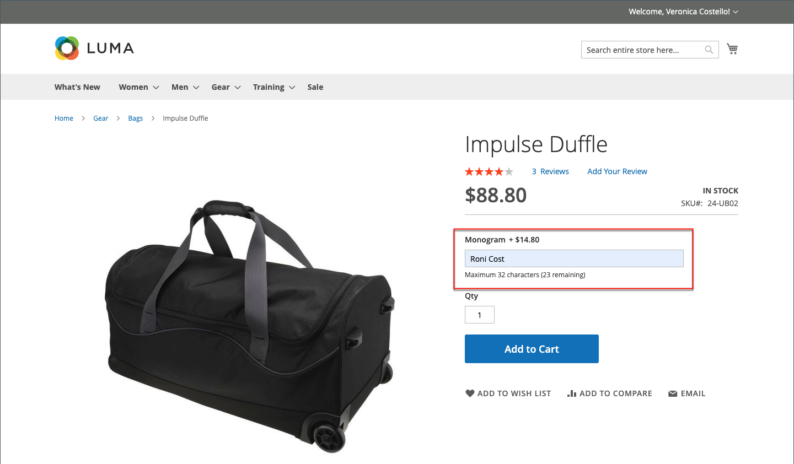

# Impostazioni prodotto - [!UICONTROL Customizable Options]

L’aggiunta di opzioni personalizzabili a un prodotto è un modo semplice per offrire una selezione di opzioni con tipi di input di testo, selezione e data. Le opzioni personalizzabili sono una buona soluzione se le tue esigenze di inventario sono semplici. Tuttavia, poiché si basano su varianti di un singolo SKU, non possono essere utilizzati per gestire le scorte o come base delle condizioni della regola del prezzo. Se hai più prodotti con le stesse opzioni, puoi impostare un prodotto e importare le opzioni negli altri prodotti.

Quando un cliente acquista un prodotto con un’opzione personalizzabile, sotto la descrizione del prodotto viene visualizzata una descrizione di ciascuna opzione selezionata e tutte le revisioni associate (o markdown) vengono applicate automaticamente al prezzo dell’articolo.

{width="700" zoomable="yes"}

Se una regola del prezzo del carrello viene attivata dall’acquisto, il calcolo iniziale viene applicato prima al prezzo del prodotto e in secondo luogo al prezzo dell’articolo di linea con qualsiasi adeguamento per le opzioni personalizzabili applicabili. Nell’esempio seguente, il cliente acquista un borsone per $74,00, più un’opzione personalizzabile per un monogramma. Al prezzo base del prodotto viene applicato un markup di $14,80 e il prezzo adeguato viene visualizzato come $88,80. In questo caso, l’acquisto del doppio sacchetto attiva una regola di prezzo del carrello basata sullo SKU del prodotto e applica uno sconto all’acquisto, oltre alla spedizione gratuita. Anche se la regola del prezzo del carrello non viene attivata dall’opzione personalizzabile, applica lo sconto al contenuto del carrello, che include il markup per l’opzione personalizzabile.

{width="700" zoomable="yes"}

>[!NOTE]
>
>Uno sconto della regola del prezzo di catalogo non viene applicato alle opzioni personalizzabili del prezzo fisso.

## Creare opzioni personalizzabili

1. Apri il prodotto in modalità di modifica.

1. Scorri verso il basso ed espandi il  nella sezione _[!UICONTROL Customizable Options]_.

1. Fare clic su **[!UICONTROL Add Option]**.

   {width="600" zoomable="yes"}

1. Completa le nuove impostazioni delle opzioni:

   - Per **[!UICONTROL Option Title]**, immettere un nome per l&#39;opzione.

   - Impostare **[!UICONTROL Option Type]** per il tipo di immissione dati.

   - Se l&#39;opzione non è necessaria per acquistare il prodotto, deselezionare la casella di controllo **[!UICONTROL Required]**.

1. Compila i campi in base al tipo di immissione dati:

   - Per **[!UICONTROL Title]**, immettere un nome per questa opzione.

   - (Facoltativo) Per **[!UICONTROL Price]**, immettere qualsiasi markup o markdown dal prezzo del prodotto di base applicabile a questa opzione.

   - Imposta **[!UICONTROL Price Type]** su uno dei seguenti:

      - `Fixed` - Il prezzo della variazione differisce dal prezzo del prodotto di base per un importo monetario fisso, ad esempio $1.
      - `Percentage` - Il prezzo della variante differisce dal prezzo del prodotto di base di una percentuale, ad esempio il 10%.

   - (Facoltativo) Immetti **[!UICONTROL SKU]** per l&#39;opzione. L’opzione SKU è un suffisso che viene aggiunto allo SKU del prodotto.

   - Se _[!UICONTROL Option Type]_è `File`, impostare i parametri per il file. Per **[!UICONTROL Compatible File Extensions]**, immettere le estensioni valide come valori separati da virgole (ad esempio `png, jpg, gif`). Per **[!UICONTROL Maximum Image Size]**, immettere la dimensione immagine massima in pixel. Se è una voce di testo, immettere il valore massimo per **[!UICONTROL Maximum Characters]**.

   {width="600" zoomable="yes"}

1. (Facoltativo) Per aggiungere un&#39;altra opzione personalizzabile, fare clic su **[!UICONTROL Add Option]**.

   - Completa le impostazioni come prima.

   - Per modificare l&#39;ordine delle opzioni, fare clic sull&#39;icona _[!UICONTROL Order]_ e trascinare l&#39;opzione in una nuova posizione nell&#39;elenco.

   Ripeti questo passaggio per ogni opzione da aggiungere.

1. Al termine, fare clic su **[!UICONTROL Save]**.

## Importa opzioni personalizzabili

1. Nella sezione _Opzioni personalizzabili_ fare clic su **[!UICONTROL Import Options]**.

1. Tutti i prodotti con opzioni personalizzabili vengono visualizzati nella griglia.

1. Nell’elenco, seleziona la casella di controllo del prodotto con le opzioni che desideri importare.

1. Fare clic su **[!UICONTROL Import]**.

1. Al termine, puoi continuare ad aggiungere altre opzioni personalizzate o fare clic su **[!UICONTROL Save and Close]**.

## Tipi di input

| Tipo | Descrizione |
|---------------------|---------------|
| [!UICONTROL Text] | Una riga di input o una casella di testo in cui il cliente può immettere le informazioni richieste. Opzioni: **[!UICONTROL Field]**- Campo di input a riga singola per il testo. **[!UICONTROL Area]** - Campo di input a più righe. Questo tipo non supporta la formattazione avanzata come HTML. Utilizza il numero massimo di caratteri per limitare la lunghezza del testo che può essere immesso e garantire la corretta rappresentazione del testo immesso nell’amministratore. |
| [!UICONTROL File] | Consente al cliente di caricare un file. |
| [!UICONTROL Select] | Consente al cliente di selezionare una o più opzioni, a seconda del tipo di input utilizzato. Opzioni: **[!UICONTROL Drop-down]**- Elenco a discesa di opzioni che consente una sola selezione. **[!UICONTROL Radio Buttons]** - Un insieme di opzioni che consente una sola selezione. **[!UICONTROL Checkbox]**- Una casella di controllo è una variante di un&#39;opzione sì/no. Se il prodotto ha più di una casella di controllo, è possibile effettuare più selezioni. **[!UICONTROL Multiple Select]** - Casella di riepilogo a discesa contenente le opzioni che accettano più selezioni. Per scegliere più opzioni, tenere premuto il tasto Ctrl (PC) o Comando (Mac) e fare clic su ciascuna opzione. |
| [!UICONTROL Date] | Consente al cliente di inserire una data o un&#39;ora o di scegliere il valore da un calendario. Opzioni:  **[!UICONTROL Date]**- Campo di input per un valore di data. La data può essere digitata direttamente nel campo o selezionata da un elenco o calendario. Il formato e il metodo di input sono determinati dalla configurazione delle [opzioni data e ora](attributes-input-types.md#date-and-time-options). **[!UICONTROL Date & Time]** - Campo di input per un valore di data e ora. **[!UICONTROL Time]**- Campo di input per un valore di tempo. |

{style="table-layout:auto"}
