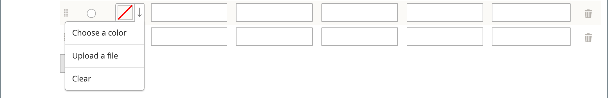

# Campioni di prodotto

I clienti hanno grandi aspettative sulla scelta di un colore ed è fondamentale che le descrizioni del prodotto rappresentino accuratamente ogni colore, motivo o texture disponibile. Ad esempio, i pantaloni nell’esempio seguente non sono disponibili in rosso, verde e blu. Piuttosto, sono disponibili solo in tonalità specifiche di rosso, verde e blu, che sono probabilmente uniche per questo prodotto.

{width="700" zoomable="yes"}

Per [prodotti configurabili](product-create-configurable.md), il colore può essere indicato da un campione visivo, da un campione di testo o da un controllo di input. I campioni possono essere utilizzati nella pagina del prodotto, negli elenchi di prodotti e in [navigazione su più livelli](navigation-layered.md). Nella pagina del prodotto, i campioni vengono sincronizzati per visualizzare l&#39;immagine del prodotto corrispondente quando il campione viene selezionato. Quando il cliente seleziona il campione, il valore corrispondente viene visualizzato nel campo di input e il campione viene indicato come selezione corrente.

>[!NOTE]
>
>Gli attributi dei campioni possono essere configurati in modo da non visualizzare le immagini di prodotto semplici corrispondenti quando il campione viene selezionato impostando _[!UICONTROL Update Product Preview Image]_valore opzione a `No` il [!UICONTROL Attribute Edit] in Admin.

## Campioni basati su testo

Se un&#39;immagine non è disponibile per un campione, il valore dell&#39;attributo viene visualizzato come testo. Un campione basato su testo è simile a un pulsante con un’etichetta di testo e si comporta come un campione con un’immagine. Quando si utilizzano campioni basati su testo per visualizzare le dimensioni disponibili, le dimensioni non disponibili vengono cancellate.

{width="700" zoomable="yes"}

## Campioni nella navigazione a livelli

I campioni possono essere utilizzati anche nella navigazione a livelli, se _[!UICONTROL Use in Layered Navigation]_proprietà dell&#39;attributo color impostata su `Yes`. L&#39;esempio seguente mostra campioni di immagini a colori e basati su testo in una navigazione a più livelli.

{width="700" zoomable="yes"}

## Creare campioni per i prodotti

I campioni possono essere definiti come un componente del `color` o configurato localmente per un prodotto specifico e caricato come [immagini prodotto](product-image.md#upload-an-image).

Negli esempi precedenti, i pantaloni Sylvia Capri sono disponibili in valori specifici di `red`, `green`, e `blue`. Poiché i campioni sono stati prelevati dall&#39;immagine del prodotto, ognuno di essi è una rappresentazione fedele del colore. Il `color` Questo attributo consente di gestire le informazioni per tutti i colori e i campioni del prodotto.

### Passaggio 1: creare i campioni

Per creare campioni per i prodotti, utilizzate uno dei metodi descritti di seguito.

#### Metodo 1: aggiungere un campione di colore

1. Per acquisire il colore effettivo di un prodotto, apri l’immagine in un editor di foto e utilizza lo strumento contagocce per identificare il colore esatto e prendere nota del valore esadecimale equivalente.

   {width="400"}

1. Il giorno _Amministratore_ barra laterale, vai a **[!UICONTROL Stores]** > _[!UICONTROL Attributes]_>**[!UICONTROL Product]**.

1. Nella griglia, apri _colore_ in modalità di modifica.

1. Verifica che **[!UICONTROL Catalog Input Type for Store Owner]** è impostato su `Visual Swatch`.

1. Se preferisci non visualizzare le corrispondenti immagini di prodotto semplici quando il campione è selezionato nella pagina di visualizzazione del prodotto, imposta **[!UICONTROL Update Product Preview Image]** a `No`.

1. Sotto _[!UICONTROL Manage Swatch (Values of Your Attribute)]_, fai clic su **[!UICONTROL Add Swatch]**ed effettuare le seguenti operazioni:

   {width="600" zoomable="yes"}

   - In _Campione_ , fai clic sul nuovo campione e seleziona **[!UICONTROL Choose a color]** dal menu.

     {width="500" zoomable="yes"}

   - Nel selettore colore, posiziona il cursore nel **N.** eliminare il valore corrente e immettere il valore esadecimale di sei caratteri del nuovo colore.

     {width="500" zoomable="yes"}

   - Per salvare il campione, fai clic su _Ruota colore_ (  ) nell&#39;angolo inferiore destro del selettore colore.

   - In _Amministratore_ , immettere un&#39;etichetta per descrivere il colore all&#39;amministratore dello store.

     Se applicabile, puoi anche inserire la traduzione del colore per ogni lingua supportata. Nell&#39;esempio seguente, lo SKU viene incluso come riferimento nel _Amministratore_ perché i colori vengono utilizzati solo per un prodotto specifico. È possibile includere uno spazio o un carattere di sottolineatura nell&#39;etichetta, ma non un trattino.

   - In _È predefinito_ , selezionare il campione da impostare come predefinito.

   - Per modificare l’ordine dei campioni colore, fai clic sul pulsante _[!UICONTROL Order]_ e trascinare l&#39;elemento in una nuova posizione nell&#39;elenco.

     {width="400"}

1. Al termine, fai clic su **[!UICONTROL Save Attribute]** e aggiorna la cache quando richiesto.

1. Apri ogni prodotto in modalità di modifica e aggiorna la **Colore** con il campione corretto.

   Per aggiornare più prodotti contemporaneamente, segui la procedura riportata di seguito.

#### Metodo 2: Caricare un’immagine campione

1. Per catturare un’immagine per un campione, apri l’immagine del prodotto in un editor di foto e salva un’area quadrata dell’immagine che rappresenta il colore, il motivo o la trama.

   Se necessario, puoi ripetere questa azione per ogni variante del prodotto.

   La dimensione e le dimensioni del campione sono determinate dal tema. In genere, il salvataggio di un&#39;immagine come quadrato consente di mantenere le proporzioni di un motivo.

   {width="400"}

1. Il giorno _Amministratore_ barra laterale, vai a **[!UICONTROL Stores]** > _[!UICONTROL Attributes]_>**[!UICONTROL Product]**.

1. Nella griglia, apri **[!UICONTROL color]** in modalità di modifica.

1. Verifica che **[!UICONTROL Catalog Input Type for Store Owner]** è impostato su `Visual Swatch`.

1. Se preferisci non visualizzare le corrispondenti immagini di prodotto semplici quando il campione è selezionato nella pagina di visualizzazione del prodotto, imposta **[!UICONTROL Update Product Preview Image]** a `No`.

1. Sotto _[!UICONTROL Manage Swatch]_(valori dell’attributo), fai clic su **[!UICONTROL Add Swatch]**ed effettuare le seguenti operazioni:

   - In _[!UICONTROL Swatch]_, fate clic sul nuovo campione per visualizzare il menu e scegliete **[!UICONTROL Upload a file]**.

   - Individuate il file campione preparato e scegliete il file da caricare.

   - Ripetete questi passaggi per ogni immagine campione.

   - Immetti le etichette per l’amministratore e la vetrina.

     In questo esempio, lo SKU viene incluso nell’etichetta Amministratore come riferimento, perché questi colori vengono utilizzati solo per un prodotto specifico. È possibile includere uno spazio o un carattere di sottolineatura nell&#39;etichetta, ma non un trattino.

     {width="500" zoomable="yes"}

1. Al termine, fai clic su **[!UICONTROL Save Attribute]** e aggiorna la cache quando richiesto.

1. Apri ogni prodotto in modalità di modifica e aggiorna la **[!UICONTROL Color]** con il campione corretto.

   Per aggiornare più prodotti contemporaneamente, segui la procedura riportata di seguito.

### Passaggio 2: aggiornare i prodotti

1. Il giorno _Amministratore_ barra laterale, vai a **[!UICONTROL Catalog]** > **[!UICONTROL Products]**.

1. Utilizza il **[!UICONTROL Filter]** per visualizzare l’elenco in base al nome o allo SKU e includere solo i prodotti applicabili.

1. Nella griglia, seleziona la casella di controllo di ciascun prodotto a cui si applica il campione.

1. Imposta **[!UICONTROL Actions]** a `Update Attributes`.

   In questo esempio, vengono selezionate tutte le configurazioni blu dei pantaloni.

   {width="600" zoomable="yes"}

1. Scorri verso il basso fino a **[!UICONTROL Color]** e selezionare il **[!UICONTROL Change]** casella di controllo.

   {width="400"}

1. Scegli il campione applicabile ai prodotti selezionati e fai clic su **[!UICONTROL Save]**.

1. Quando richiesto, aggiorna la cache.

   {width="200"}

## Aggiungere campioni a un prodotto semplice

1. Il giorno _Amministratore_ barra laterale, vai a **[!UICONTROL Catalog]** > **[!UICONTROL Products]**.

1. Apri un prodotto in modalità di modifica, controlla lo stato del prodotto (dovrebbe essere abilitato).

1. Clic **[!UICONTROL Create Configurations]** (sotto il `Configurations` ).

1. Nella finestra popup, scegliere l&#39;attributo Colore e **[!UICONTROL Next]**.

1. Selezionate i campioni colore dall&#39;attributo che desiderate includere nel prodotto.

1. Nella barra di avanzamento, fai clic su **[!UICONTROL Next]**.

1. [Configurare immagini, prezzo e quantità](product-create-configurable.md#step-3-configure-the-images-price-and-quantity).

   In questo passaggio, imposta le immagini, il prezzo e la quantità di ciascuna configurazione. Le opzioni disponibili sono le stesse per ciascuno di essi ed è possibile sceglierne solo una. Puoi applicare la stessa impostazione a tutte le SKU, applicare un’impostazione univoca a ciascuna SKU o saltare le impostazioni per il momento.

1. Al termine della configurazione di immagini, prezzo e quantità, fai clic su **[!UICONTROL Next]** nell’angolo superiore destro.

   Le varianti di prodotto correnti vengono visualizzate nella parte inferiore della sezione Configurazione. Se si è soddisfatti delle configurazioni, fare clic su **[!UICONTROL Generate Products]**.
