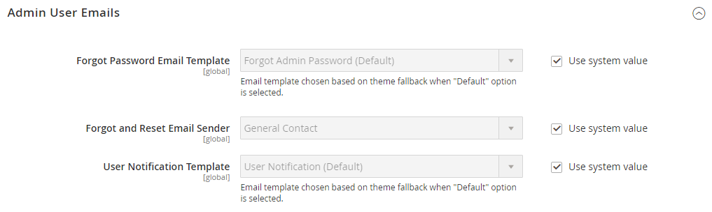

# Avanzate > Amministratore

{{config}}

## [!UICONTROL Admin User Emails]

<!-- zoom -->

Per ulteriori informazioni sulla modifica di queste impostazioni, vedere [Password dimenticata e reimpostare l&#39;e-mail](../../systems/permissions-users-all.md#forgotten-password-and-reset-emails).

| Campo | [Ambito](../../getting-started/websites-stores-views.md#scope-settings) | Descrizione |
|---------------------------------------------|------------------------------------------------------------------------|----------------------------------------------------------------------------------------------------------------------------------------------------------------------------------------------------------------|
| [!UICONTROL Forgot Password Email Template] | Globale | Identifica il modello e-mail utilizzato per il messaggio inviato quando un utente amministratore dimentica la password. Modello predefinito: `Forgot Admin Password` |
| [!UICONTROL Forgot and Reset Email Sender] | Globale | Identifica il contatto dell&#39;archivio che viene visualizzato come mittente dell&#39;e-mail _Password dimenticata_. Mittente predefinito: `General Contact` Altre opzioni mittente: `Sales Representative`, `Customer Support`, `Custom Email` |
| [!UICONTROL User Notification Template] | Globale | Determina il modello e-mail utilizzato come predefinito per le notifiche dell’amministratore. Modello predefinito: `User Notification` |

{style="table-layout:auto"}

## [!UICONTROL Startup Page]

<!-- zoom -->

Per ulteriori informazioni sulla modifica di queste impostazioni, vedere [Modificare la pagina di avvio](../../getting-started/admin-dashboard.md#change-the-startup-page) nella _Guida introduttiva_.

| Campo | [Ambito](../../getting-started/websites-stores-views.md#scope-settings) | Descrizione |
|---------------------------|------------------------------------------------------------------------|------------------------------------------------------------------|
| [!UICONTROL Startup Page] | Globale | Determina la pagina di destinazione Amministratore che viene visualizzata dopo l’accesso. |

{style="table-layout:auto"}

### [!UICONTROL Startup Page] opzioni

| Superfici |                                                                                                                                                                                                                                                                                                                                                                           | Opzione |
|---------------------------------------------------------|---------------------------------------------------------------------------------------------------------------------------------------------------------------------------------------------------------------------------------------------------------------------------------------------------------------------------------------------------------------------------|---------------------------------------------------------------------------------------------------------------------------------------------------------------------------------------------------------------------------------------------------------------------------------------------------------------------------------------------------------------------------------------------------------------------------------------------------------------------------------------------------------------------------------------------------------------------------------------------|
| [`Dashboard`](../../getting-started/admin-dashboard.md) |                                                                                                                                                                                                                                                                                                                                                                           |                                                                                                                                                                                                                                                                                                                                                                                                                                                                                                                                                                                             |
| `Sales` | `Operations` | [`Quotes`](../../b2b/quotes.md)   [`Orders`](../../stores-purchase/orders.md) [`Invoices`](../../stores-purchase/invoices.md) [`Shipments`](../../stores-purchase/shipments.md) [`Credit Memos`](../../stores-purchase/credit-memos.md) [`Billing Agreements`](../../stores-purchase/paypal-billing-agreements.md) [`Returns`](../../stores-purchase/returns.md)   [`Transactions`](../../stores-purchase/transactions.md) `Braintree Virtual Terminal` |
| `Catalog` | [`Inventory`](../../inventory-management/introduction.md) | [`Products`](../../catalog/products-list.md) [`Categories`](../../catalog/categories.md) [`Shared Catalog`](../../b2b/catalog-shared-create.md)  |
| `Customers` | [`All Customers`](../../customers/customers-all.md) [`Now Online`](../../customers/now-online.md) [`Customer Groups`](../../customers/customer-groups.md) [`Segments`](../../customers/customer-segments.md)   [`Companies`](../../b2b/account-companies.md) |                                                                                                                                                                                                                                                                                                                                                                                                                                                                                                                                                                                             |
| `Marketing` | `Promotions` | [`Catalog Price Rule`](../../merchandising-promotions/price-rules-catalog.md)  [`Cart Price Rules`](../../merchandising-promotions/price-rules-cart.md))  [`Related Products Rules`](../../merchandising-promotions/product-related-rules.md)   [`Gift Card Accounts`](../../stores-purchase/product-gift-card-accounts.md)  |
|                                                         | [`Private Sales`](../../merchandising-promotions/events-private-sales.md)  | [`Events`](../../merchandising-promotions/event-configure.md)  [`Invitations`](../../merchandising-promotions/invitations.md) |
|                                                         | `Communications` | [`Email Templates`](../../systems/email-templates.md)  [`Newsletter Template`](../../merchandising-promotions/newsletter-template.md)  [`Newsletter Queue`](../../merchandising-promotions/newsletter-queue.md)  [`Newsletter Subscribers`](../../merchandising-promotions/newsletter-subscribers.md)  [`Email Reminders`](../../merchandising-promotions/email-reminder-rules.md)  |
|                                                         | `SEO & Search` | [`Search Terms`](../../catalog/search-terms.md)  [`Search Synonyms`](../../catalog/search-terms.md#search-synonyms)  [`URL Rewrites`](../../merchandising-promotions/url-rewrite.md)  [`Site Map`](../../merchandising-promotions/sitemap-xml.md) |
|                                                         | [`User Content`](../../catalog/settings-advanced-product-reviews.md) | [`All Reviews`](../../catalog/settings-advanced-product-reviews.md)  [`Pending Reviews`](../../merchandising-promotions/product-reviews-moderate.md)   |
| `Content` | `Elements` | [`Pages`](../../content-design/pages.md) [`Hierarchy`](../../content-design/page-hierarchy.md)  [`Blocks`](../../content-design/blocks.md) [`Dynamic Blocks`](../../content-design/dynamic-blocks.md)  [`Widgets`](../../content-design/widgets.md) [`Media Gallery`](../../content-design/media-storage.md) |
|                                                         | `Design` | [`Configuration`](../../content-design/configuration.md) [`Themes`](../../content-design/themes.md) [`Schedule`](../../content-design/schedule.md) |
|                                                         | `Content Staging`   | [Dashboard](../../content-design/content-staging.md) |
| `Reports` | [`Marketing`](../../getting-started/marketing-reports.md) | `Products in Cart` `Search Terms` `Abandoned Carts` `Newsletter Problem Reports` |
|                                                         | [`Reviews`](../../getting-started/review-reports.md) | `By Customer`  `By Products`  |
|                                                         | [`Sales`](../../getting-started/sales-reports.md) | `Orders` `Tax` `Invoiced` `Shipping` `Refunds` `Coupons` `PayPal Settlement` `Braintree Settlement` |
|                                                         | `System Insights` | [`Site-Wide Analysis Tool`](https://experienceleague.adobe.com/docs/commerce-operations/tools/site-wide-analysis-tool/access.html)  |
|                                                         | [`Customers`](../../getting-started/customer-reports.md) | `Order Total` `Order Count` `New` `Wish Lists` `Segments`  |
|                                                         | [`Products`](../../getting-started/product-reports.md) | `Views` `Bestsellers` `Low Stock` `Ordered` `Downloads` |
|                                                         | [`Private Sales`](../../getting-started/private-sales-reports.md)  | `Invitations` `Invited Customers` `Conversions` |
|                                                         | `Statistics` | [`Refresh Statistics`](../../getting-started/sales-reports.md#refresh-statistics) |
|                                                         | [`Business Intelligence`](../../getting-started/business-intelligence.md) | `Advanced Reporting` `BI Essentials`  |
|                                                         | `Customer Engagement` | `Dashboard` `Importer Status` `Automation Enrollment` `Campaign Sends` `SMS Sends` `Cron Tasks` `Log Viewer` `Abandoned Carts` |
| `Stores` | `Settings` | [`All Stores`](../../stores-purchase/stores.md) [`Configuration`](../../configuration-reference/guide-overview.md) [`Terms and Conditions`](../../stores-purchase/terms-and-conditions.md) [`Order Status`](../../stores-purchase/order-status.md) |
|                                                         | [`Inventory`](../../inventory-management/introduction.md) | [`Sources`](../../inventory-management/sources-stocks.md#sources) [`Stocks`](../../inventory-management/sources-stocks.md#stocks) |
|                                                         | [`Taxes`](../../stores-purchase/taxes.md) | [`Tax Rules`](../../stores-purchase/tax-rules.md) [`Tax Zones and Rates`](../../stores-purchase/tax-zones-rates.md) |
|                                                         | [`Currency`](../../stores-purchase/currency.md) | [`Currency Rates`](../../stores-purchase/currency-configuration.md) [`Currency Symbols`](../../stores-purchase/currency-configuration.md#step-5-customize-currency-symbols-optional) |
|                                                         | `Attributes` | [`Customer`](../../systems/data-attributes-customer.md) [`Customer Address`](../../systems/data-attributes-customer.md#customer-addresses) [`Product`](../../systems/data-attributes-product.md) [`Attribute Set`](../../catalog/attribute-sets.md) [`Returns`](../../stores-purchase/attributes-returns.md) [`Ratings`](../../merchandising-promotions/product-reviews.md#create-custom-ratings) |
|                                                         | `Other Settings` | [`Reward Exchange Rates`](../../merchandising-promotions/reward-exchange-rates.md) [`Gift Wrapping`](../../stores-purchase/cart-configuration.md#gift-wrap) [`Gift Registry`](../../merchandising-promotions/gift-registry-create.md) |
| `System` | [`Data Transfer`](../../systems/data-transfer.md) | [`Import`](../../systems/data-import.md) [`Export`](../../systems/data-export.md) [`Import/Export Tax Rates`](../../systems/data-transfer-tax-rates.md) [`Import History`](../../systems/data-import.md#import-history) [`Scheduled Import/Export`](../../systems/data-scheduled-import-export.md) |
|                                                         | `Extensions` | [`Integrations`](../../systems/integrations.md) |
|                                                         | `Tools` | [`Cache Management`](../../systems/cache-management.md) [`Index Management`](../../systems/index-management.md) |
|                                                         | `Support` | [`Data Collector`](../../systems/support.md#data-collector) [`System Report`](../../systems/support.md#system-reports) |
|                                                         | `Permissions` | [`All Users`](../../systems/permissions-users-all.md) [`Locked Users`](../../systems/permissions-users-all.md#locked-users) [`User Roles`](../../systems/permissions-user-roles.md) |
|                                                         | `Action Log`  | [`Report`](../../systems/action-log.md) [`Archive`](../../systems/action-log-archive.md) [`Bulk Actions`](../../systems/action-log-bulk-actions.md) |
|                                                         | `Other Settings` | [`Notifications`](../../systems/notifications.md) [`Custom Variables`](../../systems/variables-custom.md) [`Manage Encryption Key`](../../systems/encryption-key.md) |
| `Find Partners & Extensions` |                                                                                                                                                                                                                                                                                                                                                                           |                                                                                                                                                                                                                                                                                                                                                                                                                                                                                                                                                                                             |

{style="table-layout:auto"}

<!-- Feature still in development 
## [!UICONTROL Unified Experience]

The [!UICONTROL Unified Experience] option is available in Adobe Commerce deployments that have the Commerce Admin Unified Experience extension loaded. This extension enables integration with Experience Cloud to streamline cross-application workflows between Commerce and other Experience Cloud solutions. See [Adobe Experience Cloud Integration for Commerce Admin](../../getting-started/admin-unified-experience-integration-overview.md).

| Field        | [Scope](../../getting-started/websites-stores-views.md#scope-settings) | Description                                                                                                                                                                                                                                                                                                                                                                    |
|--------------|------------------------------------------------------------------------|--------------------------------------------------------------------------------------------------------------------------------------------------------------------------------------------------------------------------------------------------------------------------------------------------------------------------------------------------------------------------------|
| Enable       | Global                                                                 | Determines if the Commerce instance uses the Experience Cloud integration. Before enabling this feature, review the [requirements and configuration instructions](../../getting-started/admin-unified-experience-integration-overview.md). Options: Yes/No.                                                                                                                    |
| Project Name | Global                                                                 | Identifies the instance in the Experience Cloud Commerce Projects workspace when the Unified Experience is enabled. The name can contain only alphanumeric characters and spaces. Defaults to the [cloud environment name](https://experienceleague.adobe.com/docs/commerce-cloud-service/user-guide/architecture/pro-architecture.html?lang=en#pro-environment-architecture). |

{style="table-layout:auto"}

-->

## [!UICONTROL Admin Base URL]

<!-- zoom -->

Per ulteriori informazioni sull&#39;impostazione di queste opzioni, vedere [Configurare l&#39;URL di base](../../stores-purchase/store-urls.md#configure-the-base-url) nella _Guida agli archivi e all&#39;esperienza di acquisto_.

| Campo | [Ambito](../../getting-started/websites-stores-views.md#scope-settings) | Descrizione |
|------------------------------------|------------------------------------------------------------------------|-----------------------------------------------------------------------------------------------------------------------------------------------------------------------------------------------------------------------------------|
| [!UICONTROL Use Custom Admin URL] | Globale | Determina se viene utilizzato un URL personalizzato per accedere all’amministratore. Opzioni: `Yes` / `No` |
| [!UICONTROL Custom Admin URL] | Globale | Specifica un URL personalizzato per accedere all&#39;amministratore. Per impostazione predefinita, l’URL amministratore è lo stesso dell’URL di base. **Importante:** l&#39;URL amministratore deve trovarsi nella stessa installazione di Commerce e avere la stessa directory principale dei documenti della vetrina. |
| [!UICONTROL Use Custom Admin Path] | Globale | Determina se viene utilizzato un percorso personalizzato per accedere all’amministratore. Il percorso predefinito è `admin`. Opzioni: `Yes` / `No` |
| [!UICONTROL Custom Admin Path] | Globale | Modifica il nome del percorso amministratore predefinito in un percorso difficile da indovinare. Inserisci il nome del percorso personalizzato in caratteri minuscoli. Esempio: `aardvark` |

{style="table-layout:auto"}

## [!UICONTROL Security]

<!-- zoom -->

Per ulteriori informazioni sull&#39;impostazione di queste opzioni, vedere [Configurare la protezione amministratore](../../systems/security-admin.md) nella _Guida di Admin Systems_.

| Campo | [Ambito](../../getting-started/websites-stores-views.md#scope-settings) | Descrizione |
|--------------------------------------------------------|------------------------------------------------------------------------|--------------------------------------------------------------------------------------------------------------------------------------------------------------------------------------------------------------------------------------------------------------------------------------------------------------------------------------------------------------------------------------------------------------------------------------------------------------------------------------------------------------------------------------------------------------------------------------------------------|
| [!UICONTROL Admin Account Sharing] | Visualizzazione store | Determina se un utente amministratore può accedere contemporaneamente allo stesso account da dispositivi diversi. Opzioni:  **`Yes`**- Consente più sessioni attive dallo stesso account amministratore. **`No`** - Consente una sola sessione attiva per account amministratore. |
| [!UICONTROL Password Reset Protection Type] | Visualizzazione store | Determina il metodo utilizzato per gestire le richieste di reimpostazione della password. Opzioni:  **`By IP and Email`**- È possibile reimpostare la password online dopo aver ricevuto una risposta dalla notifica inviata all&#39;indirizzo di posta elettronica associato all&#39;account Admin. **`By IP`** - La password può essere reimpostata online senza ulteriore conferma.  **`By Email`**- È possibile reimpostare la password solo rispondendo tramite e-mail alla notifica inviata all&#39;indirizzo e-mail associato all&#39;account Admin. **`None`** - La password può essere reimpostata solo dall&#39;amministratore dello store. |
| [!UICONTROL Recovery Link Expiration Period (hours)] | Globale | Determina il numero di ore durante le quali un collegamento di recupero password rimane valido. |
| [!UICONTROL Max Number of Password Reset Requests] | Visualizzazione store | Determina il numero massimo di richieste di password che possono essere inviate all&#39;ora. |
| [!UICONTROL Min Time Between Password Reset Requests] | Visualizzazione store | Determina il numero minimo di minuti tra le richieste di reimpostazione della password. |
| [!UICONTROL Add Secret Key to URLs] | Globale | Quando questa opzione è abilitata, aggiunge una chiave segreta all’URL dell’amministratore come precauzione contro gli exploit. Opzioni: `Yes` / `No` |
| [!UICONTROL Login Is Case Sensitive] | Globale | Determina se le credenziali di accesso immesse da un utente devono corrispondere alle maiuscole/minuscole di quelle memorizzate. Opzioni: `Yes` / `No` |
| [!UICONTROL Admin Session Lifetime (seconds)] | Globale | Determina la durata di una sessione di amministrazione in secondi. |
| [!UICONTROL Maximum Login Failures to Lockout Account] | Globale | Determina quante volte gli utenti Admin possono tentare di accedere prima che i loro account vengano bloccati. Se il campo è vuoto, non viene impostato alcun valore minimo. Valore predefinito: `6` |
| [!UICONTROL Lockout Time (minutes)] | Globale | Determina per quanti minuti un account Amministratore viene bloccato prima che l&#39;utente possa tentare di accedere di nuovo. Valore predefinito: `30` |
| [!UICONTROL Password Lifetime (days)] | Globale | Determina quanti giorni mancano alla scadenza di una password amministratore. Se il campo è vuoto, non viene impostata alcuna durata. Valore predefinito: `90` |
| [!UICONTROL Password Change] | Globale | Determina se gli utenti Admin devono modificare le proprie password. Opzioni:  **`Forced`**- Richiede che gli utenti Admin modifichino le password dopo la configurazione dell&#39;account. **`Recommended`** - Consiglia agli utenti amministratori di modificare le password dopo la configurazione dell&#39;account. |

{style="table-layout:auto"}

## [!UICONTROL Dashboard]

<!-- zoom -->

Per ulteriori informazioni sull&#39;impostazione di queste opzioni, vedere [Admin dashboard](../../getting-started/admin-dashboard.md) nella _Guida introduttiva_.

| Campo | [Ambito](../../getting-started/websites-stores-views.md#scope-settings) | Descrizione |
|----------------------------|------------------------------------------------------------------------|-------------------------------------------------------------------------------------------------------|
| [!UICONTROL Enable Charts] | Globale | Determina se il dashboard include un grafico generato dai dati di vendita correnti. Opzioni: `Yes` / `No` |

{style="table-layout:auto"}

## [!UICONTROL Admin Grids]

<!-- zoom -->

Per ulteriori informazioni sull&#39;impostazione di queste opzioni, vedere [Limit product display](../../catalog/products-list.md#limit-product-display) in _Catalog Management Guide_.

>[!NOTE]
>
>Per migliorare le prestazioni per i cataloghi di grandi dimensioni, si consiglia di limitare il numero di prodotti visualizzati nella griglia.

| Campo | [Ambito](../../getting-started/websites-stores-views.md#scope-settings) | Descrizione |
|-----------------------------------------------|------------------------------------------------------------------------|-------------------------------------------------------------------------------------------------------------------------------------|
| [!UICONTROL Limit Number of Products in Grid] | Globale | Determina se il numero di prodotti visualizzati nella griglia è limitato al valore _[!UICONTROL Records Limit]_. Opzioni: `Yes` / `No` |
| [!UICONTROL Records Limit] | Globale | Imposta il limite di numero di prodotti nella griglia prodotti. Il valore minimo predefinito è `20000`. |

## [!UICONTROL CAPTCHA]

<!-- zoom -->

Per ulteriori informazioni sull&#39;impostazione di queste opzioni, vedere [CAPTCHA](../../systems/security-captcha.md) nella _Guida ai sistemi di amministrazione_.

| Campo | [Ambito](../../getting-started/websites-stores-views.md#scope-settings) | Descrizione |
|-------------------------------------------------------|------------------------------------------------------------------------|-------------------------------------------------------------------------------------------------------------------------------------------------------------------------------------------------------------------------------------------------------------------------------------------------------------------------------------------------------------------------------------------------------------------------------------------------------------------------------------------------------------------------------------------------------------------------------------------------------------------------------------------------------------------------------------------------------------------------------------------------------------------------------------------------|
| [!UICONTROL Enable CAPTCHA in Admin] | Globale | Abilita il CAPTCHA per l’accesso amministratore. Opzioni: `Yes` / `No` |
| [!UICONTROL Font] | Globale | Determina il font utilizzato per visualizzare il CAPTCHA. Per aggiungere un tipo di carattere personalizzato, inserire il file del tipo di carattere nella stessa directory dell&#39;istanza di Commerce e aggiungere la dichiarazione al file config.xml in `app/code/Magento/Captcha/etc` Tipo di carattere predefinito:` LinLibertine` |
| [!UICONTROL Forms] | Globale | Determina i moduli in cui viene utilizzato CAPTCHA. Opzioni: `Admin Login` / `Admin Forgot Password` |
| [!UICONTROL Displaying Mode] | Globale | Determina quando viene visualizzato il CAPTCHA. Opzioni:  **`Always`**- CAPTCHA è sempre richiesto per accedere. **`After number of attempts to login`** - Visualizza il campo [!UICONTROL Number of Unsuccessful Attempts to Login]. Immetti il numero di tentativi di accesso consentiti. Il valore 0 (zero) è simile all&#39;impostazione Modalità di visualizzazione su Sempre. Questa opzione non copre i moduli Password dimenticata e Crea utente. Se CAPTCHA è attivato e impostato per essere visualizzato, viene sempre incluso nel modulo. **Nota**: per tenere traccia del numero di tentativi di accesso non riusciti, viene conteggiato ogni tentativo di accesso con un solo indirizzo e-mail e da un solo indirizzo IP. Il numero massimo di tentativi di accesso consentiti dallo stesso indirizzo IP è 1.000. Questa limitazione si applica solo quando CAPTCHA è abilitato. |
| [!UICONTROL Number of Unsuccessful Attempts to Login] | Globale | Determina quante volte una persona può tentare di accedere prima che l’account venga bloccato. Per tenere traccia del numero di tentativi di accesso non riusciti, il sistema tiene traccia dei tentativi da un indirizzo e-mail da un singolo indirizzo IP. Il numero massimo di tentativi consentiti dallo stesso indirizzo IP è 1.000. Questa limitazione si applica solo se CAPTCHA è abilitato. |
| [!UICONTROL CAPTCHA Timeout (minutes)] | Globale | Determina la durata del CAPTCHA corrente. Alla scadenza del CAPTCHA, l’utente deve ricaricare la pagina. |
| [!UICONTROL Number of Symbols] | Globale | Determina il numero di simboli utilizzati nel CAPTCHA. Il valore massimo consentito è `8`. È inoltre possibile specificare un intervallo, ad esempio `5-8`. |
| [!UICONTROL Symbols Used in CAPTCHA] | Globale | Determina quali simboli vengono utilizzati nel CAPTCHA. Sono consentiti solo lettere (a-z e A-Z) e numeri (0-9). Il set di simboli predefinito suggerito nel campo esclude simboli simili, ad esempio i, l o 1. La visualizzazione di questi simboli in CAPTCHA riduce le possibilità che un utente riconosca correttamente il CAPTCHA. |
| [!UICONTROL Case Sensitive] | Globale | Determina se i caratteri utilizzati nel CAPTCHA fanno distinzione tra maiuscole e minuscole. Opzioni: `Yes` / `No` |

{style="table-layout:auto"}

## [!UICONTROL Admin Actions Logging]

{{ee-feature}}

<!-- zoom -->

Per ulteriori informazioni sull&#39;impostazione di queste opzioni, vedere [Archivio log azioni](../../systems/action-log-archive.md) nella _Guida di Admin Systems_.

| Campo | [Ambito](../../getting-started/websites-stores-views.md#scope-settings) | Descrizione |
|-----------------------------|------------------------------------------------------------------------|-----------------------------------------------------------------------------------------------------------------------------------------------------------------------------------------------------------------------------------------------------------------------------------------------------------------------------------------------------------------------------------------------------------------------------------------------------------------------------------------------------------------------------------------------------------------------------------------------------------------------------------------------------------------------------------------------------------------------------------------------------------------------------------------------------------------------------------------------------------------------------------------------------------------------------------------------------------------------------------------------------------------------------------------------------------------------------------------------------------------------------------------------------------------------------------------------------------------------------------------------------------------------------------------------------------------------------------------------------------------------------------------------------------------------------------------------------------------------------------------------------------------------------------------------------------------------------------------------------------------------------------------------------------------------------------------------------------------------------------------------------------------------------------------------|
| [!UICONTROL Enable Actions] | Globale | Abilita la registrazione delle azioni per ciascuna delle azioni selezionate:  `Admin My Account`  `Admin Permission Roles`  `Admin Permission Users`  `Admin Sign In`  `CMS Blocks`  `CMS Hierarchy`  `CMS Pages`  `Cache Management`  `Cart Price Rules`  `Catalog Attributes`  `Catalog Categories`  `Catalog Events`  `Catalog Price Rules`  `Catalog Product Tax Classes`  `Catalog Product Templates`  `Catalog Products`  `Catalog Ratings`  `Catalog Reviews`  `Catalog Search`  `Checkout Terms and Conditions`  `Companies`  `Company Credit`  `Custom Variables`  `Customer Groups`  `Customer Invitations`  `Customer Tax Classes`  `Customers`  `Design Configuration`  `Gift Card Accounts`  `Gift Registry Entity`  `Gift Registry Type`  `Login as a Customer`  `Manage Currency Rates`  `Manage Customer Address Attributes`  `Manage Customer Attributes`  `Manage Design`  `Manage Dynamic Blocks`  `Manage Segments`  `Manage Store Views`  `Manage Stores`  `Manage Websites`  `Negotiable Quotes`  `Newsletter Queue`  `Newsletter Subscribers`  `Newsletter Templates`  `PayPal Settlement Reports`  `Reports`   `Index Management` `Reward Points Rates`  `Rule-Based Product Relations`  `Sales Archive`  `Sales Credit Memos`  `Sales Invoices`  `Sales Order Status`  `Sales Orders`  `Sales Shipments`  `Shared Catalog`  `Shopping Cart Management`  `Store Credit`  `System Backups`  `System Configuration`  `Tax Rates`  `Tax Rules`  `Transactional Emails`  `URL Rewrites`  `Widget`  `XML Sitemap` |

{style="table-layout:auto"}

## [!UICONTROL Admin Usage]

<!-- zoom -->

Per ulteriori informazioni sull&#39;impostazione di queste opzioni, vedere [Raccolta dati di utilizzo](../../getting-started/admin.md#usage-data-collection) nella _Guida introduttiva_.

| Campo | Ambito | Descrizione |
|------------------------------------------|--------|--------------------------------------------------------------------------------------------------------------------------------------------------------------------------------------------------------------------------------------------------------------------------------------------------------------------------------------------------------------------------------------------------------------------------------------------------------------------------------------------------------------------------------------------------------------------------------------------------------------|
| [!UICONTROL Enable Admin Usage Tracking] | Globale | Concede l&#39;autorizzazione, ad Adobe, per raccogliere i dati di utilizzo dell&#39;amministratore al fine di migliorare l&#39;esperienza di utilizzo di _Admin_ e dei prodotti e servizi correlati. Consentendo la raccolta dati, abilita anche _la guida interna_, progettata per fornire a _Admin_ contenuti interattivi quali aiuto, descrizioni comandi, guide dettagliate, informazioni sull&#39;onboarding, annunci sulle funzionalità e altro ancora. I singoli amministratori non sono identificati nei dati di utilizzo. Opzioni: **`Yes`**- Consente la raccolta dati e abilita _Guida interna al prodotto_. **`No`** - Non consente la raccolta dati né abilita _Guida interna al prodotto_. |

{style="table-layout:auto"}
