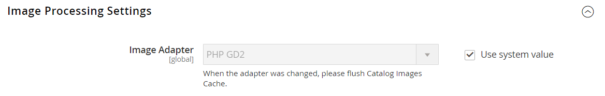

# [!UICONTROL Advanced] > [!UICONTROL Developer]

{{config}}

>[!NOTE]
>
>Queste impostazioni di configurazione sono disponibili solo in [modalità sviluppatore](../../systems/developer-tools.md#operation-modes).

## [!UICONTROL Frontend Development Workflow]

<!-- zoom -->

Per ulteriori informazioni sulla modifica di queste impostazioni, vedere [Flusso di lavoro di sviluppo front-end](../../systems/developer-tools.md#frontend-development-workflow) nella _Guida ai sistemi di amministrazione_.

| Campo | [Ambito](../../getting-started/websites-stores-views.md#scope-settings) | Descrizione |
|--- |--- |--- |
| [!UICONTROL Workflow Type] | Globale | Determina se la compilazione Less viene eseguita sul lato client o server durante lo sviluppo. Opzioni:  **`Client side less compilation`**- La compilazione viene eseguita nel browser utilizzando la libreria nativa less.js. **`Server side less compilation`** - Compilazione eseguita sul server utilizzando la libreria meno PHP. Questa è la modalità predefinita per la produzione. |

{style="table-layout:auto"}

## [!UICONTROL Developer Client Restrictions]

<!-- zoom -->

Per ulteriori informazioni sulla modifica di questa impostazione, vedere [Restrizioni client](../../systems/developer-tools.md#client-restrictions) nella _Guida di Admin Systems_.

| Campo | [Ambito](../../getting-started/websites-stores-views.md#scope-settings) | Descrizione |
|--- |--- |--- |
| [!UICONTROL Allow IPs (comma separated)] | Visualizzazione store | Crea una inserisce nell&#39;elenco Consentiti di indirizzi IP che possono essere utilizzati dagli sviluppatori su un sito live, senza interferire con i clienti nel negozio. Eventuali modifiche apportate al sito quando si utilizza uno strumento per sviluppatori, ad esempio _Traduzione in linea_, sono visibili solo dagli indirizzi IP nel inserisco nell&#39;elenco Consentiti di. |

{style="table-layout:auto"}

## [!UICONTROL Template Settings]

<!-- zoom -->

Per ulteriori informazioni sulla modifica di queste impostazioni, vedere [Ottimizzazione dei file di risorse](../../systems/developer-tools.md#optimizing-resource-files) nella _Guida di Admin Systems_.

| Campo | [Ambito](../../getting-started/websites-stores-views.md#scope-settings) | Descrizione |
|--- |--- |--- |
| [!UICONTROL Allow Symlinks] | Visualizzazione store | L&#39;attivazione di [collegamenti simbolici](https://en.wikipedia.org/wiki/Symbolic_link) può esporre il sito a rischi per la sicurezza e non è consigliata per un archivio di produzione. |
| [!UICONTROL Minify Html] | Visualizzazione store | Determina se le HTML per i modelli di archivio sono ridotte a icona. Opzioni: `Yes` / `No` |

{style="table-layout:auto"}

## [!UICONTROL Debug]

<!-- zoom -->

Per ulteriori informazioni sulla modifica di queste impostazioni, vedere [Suggerimenti percorso modello](../../systems/developer-tools.md#template-path-hints) nella _Guida di Admin Systems_.

| Campo | [Ambito](../../getting-started/websites-stores-views.md#scope-settings) | Descrizione |
|--- |--- |--- |
| [!UICONTROL Enable Template Path Hints for Storefront] | Visualizzazione store | Aggiunge una notazione alla vetrina che indica il percorso di ciascun modello utilizzato nella pagina. Opzioni: `Yes` / `No` |
| [!UICONTROL Enable Template Path Hints for Admin] | Globale | Aggiunge all’amministratore una notazione che indica il percorso di ciascun modello utilizzato nella pagina. Opzioni: `Yes` / `No` |
| [!UICONTROL Add Block Class Type to Hints] | Visualizzazione store | Include i nomi dei blocchi negli hint di percorso del modello. Opzioni: `Yes` / `No` |

{style="table-layout:auto"}

## [!UICONTROL Translate Inline]

<!-- zoom -->

Per ulteriori informazioni sulla modifica di queste impostazioni, vedere [Traduci in linea](../../systems/developer-tools.md#translate-inline) nella _Guida di Admin Systems_.

| Campo | [Ambito](../../getting-started/websites-stores-views.md#scope-settings) | Descrizione |
|--- |--- |--- |
| [!UICONTROL Enable for Storefront] | Visualizzazione store | Attiva il traduttore in linea per la vetrina. Il testo dell’interfaccia può essere modificato per ogni visualizzazione store. Per utilizzare il traduttore in linea senza interferire con il live store, aggiungi il tuo indirizzo IP al inserisco nell&#39;elenco Consentiti Developer Client Restrictions (Limitazioni client sviluppatore). |
| [!UICONTROL Enable for Admin] | Globale | Attiva il traduttore in linea per l’amministratore. A differenza della vetrina, l’amministratore non può essere tradotto in più lingue. Tuttavia, le etichette dei campi e altro testo nell’interfaccia possono essere modificati. |

{style="table-layout:auto"}

## [!UICONTROL JavaScript Settings]

<!-- zoom -->

Per ulteriori informazioni sulla modifica di queste impostazioni, vedere [Ottimizzazione dei file di risorse](../../systems/developer-tools.md#optimizing-resource-files) nella _Guida di Admin Systems_.

| Campo | [Ambito](../../getting-started/websites-stores-views.md#scope-settings) | Descrizione |
|--- |--- |--- |
| [!UICONTROL Merge JavaScript Files] | Visualizzazione store | Unisce più file JavaScript in un unico file per migliorare il tempo di caricamento della pagina. |
| [!UICONTROL Enable JavaScript Bundling] | Visualizzazione store | Determina se è possibile unire più file JavaScript in un unico file. Opzioni: `Yes` / `No` |
| [!UICONTROL Minify JavaScript Files] | Visualizzazione store | Rimuove caratteri, spazi e rientri non necessari per ridurre le dimensioni del codice. |
| [!UICONTROL Move JS code to the bottom of the page] | Globale | Se questa opzione è abilitata, sposta il codice JS nella parte inferiore della pagina. Opzioni: `Yes` / `No` |
| [!UICONTROL Translation Strategy] | Globale | Determina la metodologia di traduzione utilizzata dal sistema. Opzioni:  **`Dictionary`**- Traduzione sul lato vetrina. **`Embedded`** - Traduzione da parte dell&#39;amministratore. |
| [!UICONTROL Log JS Errors to Session Storage] | Globale | Se questa opzione è abilitata, può essere utilizzata dai test funzionali per la generazione dei rapporti. Opzioni: `Yes` / `No` |
| [!UICONTROL Log JS Errors to Session Storage Key] | Globale | Identifica la chiave utilizzata per recuperare gli errori js raccolti. |

{style="table-layout:auto"}

## [!UICONTROL CSS Settings]

<!-- zoom -->

Per ulteriori informazioni sulla modifica di queste impostazioni, vedere [Ottimizzazione dei file di risorse](../../systems/developer-tools.md#optimizing-resource-files) nella _Guida di Admin Systems_.

| Campo | [Ambito](../../getting-started/websites-stores-views.md#scope-settings) | Descrizione |
|--- |--- |--- |
| [!UICONTROL Merge CSS Files] | Visualizzazione store | Unisce più file CSS in un singolo file per migliorare il tempo di caricamento della pagina. Opzioni: `Yes` / `No` |
| [!UICONTROL Minify CSS Files] | Visualizzazione store | Rimuove caratteri, spazi e rientri non necessari per ridurre le dimensioni del codice. Opzioni: `Yes` / `No` |
| [!UICONTROL Use CSS critical path] | Globale | Il _percorso critico CSS_ fornisce CSS critici minimizzati in linea in `<head>` e rinvia tutti gli stili non critici caricati in modo asincrono. Opzioni: `Yes` / `No` |

{style="table-layout:auto"}

## [!UICONTROL Image Processing Settings]

<!-- zoom -->

| Campo | [Ambito](../../getting-started/websites-stores-views.md#scope-settings) | Descrizione |
|--- |--- |--- |
| [!UICONTROL Image Adapter] | Globale | Specifica l&#39;adattatore utilizzato per il rendering delle immagini. Dopo aver modificato l&#39;impostazione della scheda, svuotare la cache delle immagini del catalogo. Opzioni: `PHP GD2` / `ImageMagick`   **_Nota:_**&#x200B;il tipo di file ICO è supportato solo dall&#39;adattatore ImageMagik. |

{style="table-layout:auto"}

## [!UICONTROL Caching Settings]

<!-- zoom -->

| Campo | [Ambito](../../getting-started/websites-stores-views.md#scope-settings) | Descrizione |
|--- |--- |--- |
| [!UICONTROL Cache User Defined Attributes] | Globale | Quando questa opzione è attivata, memorizza nella cache gli attributi EAV (Entity Attribute Value) definiti dall&#39;utente e dal sistema. Questa opzione può migliorare le prestazioni ma richiede anche spazio aggiuntivo per il caching. Opzioni: `Yes` / `No` |

{style="table-layout:auto"}

## [!UICONTROL Static Files Settings]

<!-- zoom -->

| Campo | [Ambito](../../getting-started/websites-stores-views.md#scope-settings) | Descrizione |
|--- |--- |--- |
| [!UICONTROL Sign Static Files] | Globale | Quando questa opzione è attivata, aggiunge una firma digitale all&#39;URL dei file statici per consentire ai browser di rilevare quando è disponibile una versione più recente del file. Se la firma di un file è diversa da quella memorizzata nella cache del browser, viene utilizzata la versione più recente del file. I file statici che possono essere firmati includono JavaScript, CSS, immagini e font. Opzioni: `Yes` / `No` |

{style="table-layout:auto"}

## [!UICONTROL Grid Settings]

<!-- zoom -->

| Campo | [Ambito](../../getting-started/websites-stores-views.md#scope-settings) | Descrizione |
|--- |--- |--- |
| [!UICONTROL Asynchronous Indexing|Global] | Determina quando le entità del sistema di elaborazione degli ordini, quali ordini, fatture, spedizioni e note di accredito, vengono aggiunte alla griglia e reindicizzate. L’indicizzazione asincrona può essere utilizzata per evitare blocchi sui dati durante le operazioni di salvataggio e per ridurre il tempo di elaborazione. Opzioni:  **`Disable`**- (impostazione predefinita) Le entità correlate all&#39;ordine vengono aggiunte alla griglia in diversi momenti. durante il salvataggio. **`Enable`** - Le entità correlate all&#39;ordine vengono aggiunte alla griglia solo durante un processo cron pianificato. Cron deve essere configurato per essere eseguito una volta al minuto. |

{style="table-layout:auto"}
