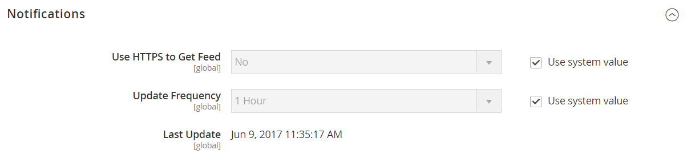

# [!UICONTROL Advanced] > [!UICONTROL System]

{{config}}

## [!UICONTROL Cron (Scheduled Tasks)]

<!-- zoom -->

Per ulteriori informazioni sulla modifica di queste impostazioni di configurazione, vedere [Cron (attività pianificate)](../../systems/cron.md).

### [!UICONTROL index]

<!-- zoom -->

| Campo | [Ambito](../../getting-started/websites-stores-views.md#scope-settings) | Descrizione |
|--- |--- |--- |
| [!UICONTROL Generate Schedules Every] | Globale | Determina la frequenza in minuti della generazione delle pianificazioni. |
| [!UICONTROL Schedule Ahead for] | Globale | Determina quanti minuti in anticipo vengono generate le pianificazioni. |
| [!UICONTROL Missed if Not Run Within] | Globale | Determina quanti minuti devono trascorrere prima che un processo cron non ancora eseguito venga contrassegnato come non eseguito. |
| [!UICONTROL History Cleanup Every] | Globale | Determina quanti minuti trascorrono prima che venga pulita la cronologia cron. |
| [!UICONTROL Success History Lifetime] | Globale | Determina quanti minuti viene conservato nel database il record dei processi cron completati correttamente. |
| [!UICONTROL Failure History Lifetime] | Globale | Determina il numero di minuti in cui viene conservato nel database il record dei processi cron non riusciti. |
| [!UICONTROL Use Separate Process] | Globale | Determina se i processi cron vengono eseguiti in parallelo come processi separati. Opzioni: `Yes` / `No` |

{style="table-layout:auto"}

### [!UICONTROL default]

<!-- zoom -->

| Campo | [Ambito](../../getting-started/websites-stores-views.md#scope-settings) | Descrizione |
|--- |--- |--- |
| [!UICONTROL Generate Schedules Every] | Globale | Determina la frequenza in minuti della generazione delle pianificazioni. |
| [!UICONTROL Schedule Ahead for] | Globale | Determina quanti minuti in anticipo vengono generate le pianificazioni. |
| [!UICONTROL Missed if Not Run Within] | Globale | Determina quanti minuti devono trascorrere prima che un processo cron non ancora eseguito venga contrassegnato come non eseguito. |
| [!UICONTROL History Cleanup Every] | Globale | Determina quanti minuti trascorrono prima che venga pulita la cronologia cron. |
| [!UICONTROL Success History Lifetime] | Globale | Determina quanti minuti viene conservato nel database il record dei processi cron completati correttamente. |
| [!UICONTROL Failure History Lifetime] | Globale | Determina il numero di minuti in cui viene conservato nel database il record dei processi cron non riusciti. |
| [!UICONTROL Use Separate Process] | Globale | Determina se i processi cron vengono eseguiti in parallelo come processi separati. Opzioni: `Yes` / `No` |

{style="table-layout:auto"}

## [!UICONTROL MySQL Message Queue Cleanup]

{{ee-feature}}

<!-- zoom -->

| Campo | [Ambito](../../getting-started/websites-stores-views.md#scope-settings) | Descrizione |
|--- |--- |--- |
| [!UICONTROL Successful Messages Lifetime] | Globale | Determina la durata in minuti dei messaggi con esito positivo. Immettete zero per saltare la pulizia. Predefinito: `10080` (7 giorni) |
| [!UICONTROL New Messages Lifetime] | Globale | Determina la durata dei nuovi messaggi in minuti. Immettete zero per saltare la pulizia. Predefinito: `10080` (7 giorni) |
| [!UICONTROL Failed Messages Lifetime] | Globale | Determina la durata in minuti dei messaggi non riusciti. Immettete zero per saltare la pulizia. Predefinito: `10080` (7 giorni) |
| [!UICONTROL Retry Messages in Progress After] | Globale | Determina per quanto tempo il sistema attende un messaggio in corso prima di riprovare. Predefinito: `1440` (24 ore) |

{style="table-layout:auto"}

## [!UICONTROL Mail Sending Settings]

<!-- zoom -->

Per ulteriori informazioni sulla modifica di queste impostazioni, vedere [Configurare le comunicazioni e-mail](../../systems/email-communications.md) nella _Guida di Admin Systems_.

>[!IMPORTANT]
>
>**Avviso di protezione** È consigliabile che tutti i commercianti impostino immediatamente la configurazione di invio della posta per proteggersi da un potenziale attacco di esecuzione di codice remoto identificato di recente. Fino alla risoluzione del problema, si consiglia di evitare di utilizzare [!DNL Sendmail] per le comunicazioni e-mail. In [!UICONTROL Mail Sending Settings], assicurarsi che [!UICONTROL Set Return Path] sia impostato su `No`.

| Campo | [Ambito](../../getting-started/websites-stores-views.md#scope-settings) | Descrizione |
|--- |--- |--- |
| [!UICONTROL Disable Email Communications] | Visualizzazione store | Determina se le comunicazioni e-mail vengono attivate per lo store. Opzioni: `Yes` / `No` |
| [!UICONTROL Transport] | Visualizzazione store | Determina il tipo di trasporto per le comunicazioni e-mail dallo store. Opzioni: `Sendmail` / `SMTP` |
| [!UICONTROL Host] | Visualizzazione store | (Solo per server SMTP e Windows) Determina il nome utilizzato per fare riferimento all&#39;host. Valore predefinito: `localhost` |
| [!UICONTROL Port (25)] | Visualizzazione store | (Solo per i server SMTP e Windows) Identifica la porta utilizzata per le comunicazioni e-mail. Valore predefinito: `25` |
| [!UICONTROL Set Return-Path] | Visualizzazione store | Determina se viene utilizzato un indirizzo di routing per le e-mail restituite. Opzioni: `No` / `Yes` / `Specified` |

{style="table-layout:auto"}

### Opzioni SMTP

Quando si seleziona SMTP nel tipo di trasporto, sono disponibili opzioni aggiuntive per configurare la connessione al server SMTP.

<!-- zoom -->

| Campo | [Ambito](../../getting-started/websites-stores-views.md#scope-settings) | Descrizione |
|--- |--- |--- |
| [!UICONTROL Username] | Visualizzazione store | Nome utente di accesso per il server SMTP. |
| [!UICONTROL Password] | Visualizzazione store | Password per l&#39;accesso al server SMTP. |
| [!UICONTROL Auth] | Visualizzazione store | Determina il tipo di autenticazione per la connessione al server SMTP. Opzioni: `NONE` / `PLAIN` / `LOGIN` |
| [!UICONTROL SSL] | Visualizzazione store | Determina il tipo di verifica per il certificato di sicurezza host. Opzioni: `SSL` / `TLS` |

{style="table-layout:auto"}

## [!UICONTROL Currency]

<!-- zoom -->

Per ulteriori informazioni sulla modifica di questa impostazione, vedere [Configurazione della valuta](../../stores-purchase/currency-configuration.md) nella _Guida agli archivi e all&#39;esperienza di acquisto_.

| Campo | [Ambito](../../getting-started/websites-stores-views.md#scope-settings) | Descrizione |
|--- |--- |--- |
| [!UICONTROL Installed Currencies] | Globale | Indica le valute attualmente disponibili per l&#39;installazione di Commerce. Le opzioni includono tutte le valute disponibili, con le valute installate selezionate. |

{style="table-layout:auto"}

## [!UICONTROL Security]

<!-- zoom -->

Per ulteriori informazioni sulla modifica di queste impostazioni, vedere [Gestione delle sessioni](../../systems/security-session-management.md) nella _Guida ai sistemi di amministrazione_.

| Campo | [Ambito](../../getting-started/websites-stores-views.md#scope-settings) | Descrizione |
|--- |--- |--- |
| [!UICONTROL Max Session Size in Admin] | Globale | Limita la dimensione massima della sessione in byte. Usa `0` per disabilitare. |
| [!UICONTROL Max Session Size in Storefront] | Globale | Limita la dimensione massima della sessione in byte. Usa `0` per disabilitare. |

{style="table-layout:auto"}

## [!UICONTROL Notifications]

<!-- zoom -->

Per ulteriori informazioni sulla modifica di queste impostazioni, vedere [Notifiche di sistema](../../systems/notifications.md) nella _Guida di Admin Systems_.

| Campo | [Ambito](../../getting-started/websites-stores-views.md#scope-settings) | Descrizione |
|--- |--- |--- |
| [!UICONTROL Use HTTPS to Get Feed] | Globale | Determina se le notifiche dell’amministratore vengono inviate tramite un canale sicuro. Opzioni: `Yes` / `No` |
| Frequenza di aggiornamento | Globale | Determina la frequenza degli aggiornamenti dei messaggi amministratore. Opzioni: `1 Hour` / `2 Hours` / `6 Hours` / `12 Hours` / `24 Hours` |
| [!UICONTROL Last Update] | Globale | Indica la data e l’ora dell’ultimo aggiornamento del messaggio. |

{style="table-layout:auto"}

## [!UICONTROL Backup Settings]

<!-- zoom -->

{{$include /help/_includes/backups-note.md}}

Per ulteriori informazioni sulla modifica di queste impostazioni, vedere [Backup del sistema](../../systems/backups.md) nella _Guida di Admin Systems_.

| Campo | [Ambito](../../getting-started/websites-stores-views.md#scope-settings) | Descrizione |
|--- |--- |--- |
| [!UICONTROL Enable Backup] | Globale | Determina se l’istanza di Commerce consente i backup. Opzioni: `Yes` / `No` |
| [!UICONTROL Enable Scheduled Backup] | Globale | (Visualizzato quando _[!UICONTROL Enable Backup]_&#x200B;è impostato su `Yes`.) Determina se il backup dell&#39;istanza di Commerce viene eseguito automaticamente secondo una pianificazione regolare. Opzioni: `Yes` / `No` |
| [!UICONTROL Scheduled Backup Type] | Globale | (Visualizzato quando _[!UICONTROL Enable Scheduled Backup]_&#x200B;è impostato su `Yes`.) Determina gli elementi dell&#39;istanza di Commerce inclusi nel backup. Opzioni: `Database` / `Database and Media` / `System` / `System (excluding Media)` |
| [!UICONTROL Start Time] | Globale | (Visualizzato quando [!UICONTROL Enable Scheduled Backup] è impostato su `Yes`.) Specifica l&#39;ora, il minuto e il secondo di inizio del backup pianificato. |
| [!UICONTROL Frequency] | Globale | (Visualizzato quando [!UICONTROL Enable Scheduled Backup] è impostato su `Yes`.) Determina la frequenza con cui viene eseguito il backup pianificato. Opzioni: `Daily` / `Weekly` / `Monthly` |
| [!UICONTROL Maintenance Mode] | Globale | (Visualizzato quando [!UICONTROL Enable Scheduled Backup] è impostato su `Yes`.) Determina se l&#39;archivio viene messo in modalità di manutenzione durante il backup pianificato. Opzioni: `Yes` / `No` |

{style="table-layout:auto"}

## [!UICONTROL Admin Actions Log Archiving]

{{ee-feature}}

<!-- zoom -->

Per ulteriori informazioni sulla modifica di queste impostazioni, vedere [Archivio log azioni](../../systems/action-log-archive.md) nella _Guida di Admin Systems_.

| Campo | [Ambito](../../getting-started/websites-stores-views.md#scope-settings) | Descrizione |
|--- |--- |--- |
| [!UICONTROL Log Entry Lifetime, Days] | Visualizzazione store | Determina il numero di giorni in cui le azioni amministratore vengono mantenute nell’archivio Azioni amministratore. Predefinito: `60` |
| [!UICONTROL Log Archiving Frequency] | Visualizzazione store | Determina la frequenza con cui vengono archiviati i registri di azioni amministratore. Opzioni: `Daily` / `Weekly` / `Monthly` |

{style="table-layout:auto"}

## [!UICONTROL Full Page Cache]

<!-- zoom -->

Per ulteriori informazioni sulla modifica di queste impostazioni, vedere [Memorizzazione in cache a pagina intera](../../systems/cache-management.md#full-page-caching) nella _Guida di Admin Systems_.

<!-- zoom -->

| Campo | [Ambito](../../getting-started/websites-stores-views.md#scope-settings) | Descrizione |
|--- |--- |--- |
| [!UICONTROL Caching Application] | Globale | Determina l&#39;applicazione utilizzata per gestire la cache di pagina intera. Opzioni:  **`Built-in Application`**- Non consigliato per l&#39;ambiente di produzione. **`Varnish Caching`** - Consigliato per l&#39;ambiente di produzione. |
| [!UICONTROL TTL for public content] | Globale | Determina la durata della cache del contenuto pubblico in secondi. Valore predefinito: `120` |
| [!UICONTROL Handles param size] | globale | Specifica il numero massimo di [handle di layout](https://developer.adobe.com/commerce/frontend-core/guide/layouts/#layout-handles) da elaborare sull&#39;endpoint HTTP [`{BASE-URL}/page_cache/block/esi`](https://experienceleague.adobe.com/docs/commerce-operations/configuration-guide/cache/use-varnish-esi.html?lang=it). La limitazione delle dimensioni può migliorare la sicurezza e le prestazioni. Valore predefinito: `100` |
| **[!UICONTROL Varnish Configuration]** |  |  |
| [!UICONTROL Access list] | Globale | Specifica gli indirizzi IP che possono eliminare la configurazione Vernice per generare un file di configurazione. Separa più voci con una virgola. Valore predefinito: `localhost` |
| [!UICONTROL Backend host] | Globale | Specifica l&#39;host backend che genera i file di configurazione. Valore predefinito: `localhost` |
| [!UICONTROL Backend port] | Globale | Specifica la porta back-end utilizzata per generare i file di configurazione. Valore predefinito: `8080` |
| [!UICONTROL Grace period] | Globale | Determina per quanto tempo Vernice fornisce contenuti non aggiornati se il backend non risponde. Valore predefinito: `300` |
| **[!UICONTROL Export Configuration]** |  |  |
| [!UICONTROL Export VCL for Varnish 4] | Globale | Esporta il file `varnish.vcl` per la versione 4. |
| [!UICONTROL Export VCL for Varnish 5] | Globale | Esporta il file `varnish.vcl` per la versione 5. |
| [!UICONTROL Export VCL for Varnish 6] | Globale | Esporta il file `varnish.vcl` per la versione 6. |

{style="table-layout:auto"}

## [!UICONTROL Storage Configuration for Media]

<!-- zoom -->

Per ulteriori informazioni sulla modifica di queste impostazioni, vedere [Utilizzare un database multimediale](../../content-design/media-storage-database.md) nella _Guida di progettazione e contenuto_.

| Campo | [Ambito](../../getting-started/websites-stores-views.md#scope-settings) | Descrizione |
|--- |--- |--- |
| [!UICONTROL Media Storage] | Globale | Determina il metodo utilizzato per memorizzare i file multimediali. Impostazione predefinita: `File System` |
| [!UICONTROL Environment Update Time] | Globale | Determina la frequenza degli aggiornamenti dell’ambiente dei file multimediali in secondi. Valore predefinito: `3600` |

{style="table-layout:auto"}

<!-- zoom -->

>[!IMPORTANT]
>
>Il metodo di archiviazione dei supporti del database è stato dichiarato obsoleto a partire da Adobe Commerce e Magento Open Source 2.4.3.

| Campo | [Ambito](../../getting-started/websites-stores-views.md#scope-settings) | Descrizione |
|--- |--- |--- |
| [!UICONTROL Media Storage] | Globale | Specifica il database come metodo utilizzato per archiviare i file multimediali. |
| [!UICONTROL Select Media Database] | Globale | Identifica il nome del database utilizzato per l&#39;archiviazione dei supporti. Impostazione predefinita: `default_setup` |
| [!UICONTROL Synchronize] |  | Sincronizza il trasferimento di tutti i supporti nel percorso di database specificato. |
| Ora di aggiornamento dell’ambiente | Globale | Determina la frequenza degli aggiornamenti dell’ambiente dei file multimediali in secondi. Valore predefinito: `3600` |

{style="table-layout:auto"}

## [!UICONTROL Bulk Actions]

{{ee-feature}}

<!-- zoom -->

Per ulteriori informazioni sulla modifica di queste impostazioni, vedere [Azioni in blocco](../../systems/action-log-bulk-actions.md) nella _Guida di Admin Systems_.

| Campo | [Ambito](../../getting-started/websites-stores-views.md#scope-settings) | Descrizione |
|--- |--- |--- |
| [!UICONTROL Days Saved in Log] | Globale | Determina il numero di giorni in cui le azioni in blocco vengono mantenute nell&#39;archivio _Registro azioni in blocco_. Predefinito: `60` |

{style="table-layout:auto"}

## [!UICONTROL Scheduled Import/Export File History Cleaning]

{{ee-feature}}

<!-- zoom -->

Per ulteriori informazioni sulla modifica di queste impostazioni, vedere [Importazione ed esportazione pianificate](../../systems/data-scheduled-import-export.md) nella _Guida di Admin Systems_.

| Campo | [Ambito](../../getting-started/websites-stores-views.md#scope-settings) | Descrizione |
|--- |--- |--- |
| [!UICONTROL Save File, Days] | Globale | Determina il numero di giorni in cui vengono salvati i file di cronologia di importazione/esportazione. |
| [!UICONTROL Enable Scheduled File History Cleaning] | Globale | Abilita la pulizia pianificata dei file di importazione/esportazione. Opzioni: `Yes` / `No` |
| [!UICONTROL Clean Now] |  | Sostituisce la pulizia pianificata e pulisce immediatamente i file di cronologia di importazione/esportazione. |
| [!UICONTROL Start Time] | Globale | Specifica l&#39;ora, il minuto e il secondo della pulizia del file di cronologia di importazione/esportazione. |
| [!UICONTROL Frequency] | Globale | Determina la frequenza con cui vengono puliti i file della cronologia di importazione/esportazione. Opzioni: `Daily` / `Weekly` / `Monthly` |
| [!UICONTROL Error Email Recipient] | Globale | L’indirizzo e-mail della persona che deve ricevere la notifica se si verifica un errore durante la pulizia della cronologia del file di importazione/esportazione. Separa più indirizzi con una virgola. |
| [!UICONTROL Error Email Sender] | Globale | Identifica il contatto del punto vendita che viene visualizzato come mittente della notifica. Mittente predefinito: `General Contact` |
| [!UICONTROL Error Email Template] | Globale | Identifica il modello e-mail utilizzato per la notifica di errore di pulizia del file di importazione/esportazione. Modello predefinito: `File History Clean Failed` |

{style="table-layout:auto"}

## [!UICONTROL Image Upload Configuration]

<!-- zoom -->

<!-- [Image Upload Configuration](https://experienceleague.adobe.com/it/docs/commerce-admin/systems/action-logs/action-log-bulk-actions) -->

| Campo | [Ambito](../../getting-started/websites-stores-views.md#scope-settings) | Descrizione |
|--- |--- |--- |
| [!UICONTROL Quality] | Globale | Determina la qualità JPG dell&#39;immagine ridimensionata. Una qualità inferiore riduce le dimensioni del file. Utilizza l’80-90% per ridurre le dimensioni dei file con un’elevata qualità. Predefinito: `80` |
| [!UICONTROL Enable Frontend Resize] | Globale | Abilita questa impostazione per consentire a Commerce di ridimensionare immagini grandi e di dimensioni eccessive che puoi caricare per la pagina _Dettagli prodotto_. Commerce ridimensiona i file immagine utilizzando JavaScript prima di caricarli. Quando l&#39;immagine viene ridimensionata, mantiene le proporzioni esatte da soddisfare e non superare le dimensioni massime per Larghezza massima o Altezza massima. Predefinito: `Yes` |
| [!UICONTROL Maximum Width] | Globale | Determina la larghezza massima in pixel dell&#39;immagine. Quando l&#39;immagine viene ridimensionata, non supera questa larghezza. Predefinito: `1920` |
| [!UICONTROL Maximum Height] | Globale | Determina l&#39;altezza massima in pixel dell&#39;immagine. Quando l&#39;immagine viene ridimensionata, non supera questa altezza. Predefinito: `1200` |

{style="table-layout:auto"}

## [!UICONTROL Media Gallery]

<!-- zoom -->

| Campo | [Ambito](../../getting-started/websites-stores-views.md#scope-settings) | Descrizione |
|--- |--- |--- |
| [!UICONTROL Enable Old Media Gallery] | Globale | Attiva o disattiva la precedente Raccolta file multimediali. |

{style="table-layout:auto"}

## [!UICONTROL Media Gallery Image Optimization]

<!-- zoom -->

| Campo | [Ambito](../../getting-started/websites-stores-views.md#scope-settings) | Descrizione |
|--- |--- |--- |
| [!UICONTROL Enable Image Optimization] | Globale | Determina se le immagini vengono ridimensionate per ridurre le dimensioni del file delle immagini inserite nel contenuto. Le immagini originali vengono conservate in Media Gallery. |
| [!UICONTROL Maximum Width] | Globale | Larghezza massima (in pixel) per le immagini inserite da Raccolta multimediale nel contenuto. |
| [!UICONTROL Maximum Height] | Globale | Altezza massima (in pixel) per le immagini inserite da Raccolta multimediale nel contenuto. |

{style="table-layout:auto"}

## [!UICONTROL Adobe Stock Integration]

<!-- zoom -->

Per ulteriori informazioni sulla configurazione di queste impostazioni, vedere [Integrazione di Adobe Stock](../../content-design/adobe-stock.md) nella _Guida al contenuto e alla progettazione_.

| Campo | [Ambito](../../getting-started/websites-stores-views.md#scope-settings) | Descrizione |
|--- |--- |--- |
| [!UICONTROL Enabled Adobe Stock] | Globale | Abilita o disabilita l&#39;integrazione di Adobe Stock. |
| [!UICONTROL API Key (Client ID)] | Globale | Per collegare il tuo store al servizio Adobe Stock è necessaria una chiave API. |
| [!UICONTROL Client Secret] | Globale | È necessario il segreto client per l’integrazione di Adobe Stock. |
| [!UICONTROL Test Connection] |  | Esegue un test per verificare che la chiave API sia valida per l’utilizzo con il servizio Adobe Stock. |

{style="table-layout:auto"}

<!-- Last updated from includes: 2023-02-22 09:59:54 -->
