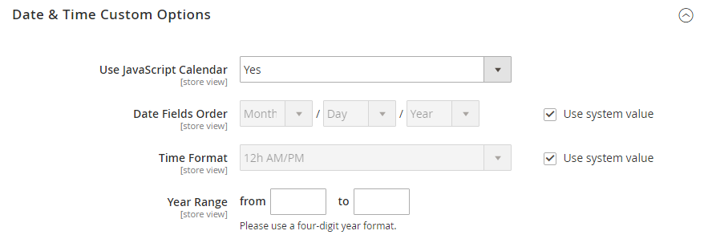

# [!UICONTROL Catalog] > [!UICONTROL Catalog]

{{config}}

## [!UICONTROL Product Fields Auto-Generation]

<!-- zoom -->

<!-- [Product Fields Auto-Generation](https://experienceleague.adobe.com/en/docs/commerce-admin/catalog/products/product-workspace#default-field-values) -->

| Campo | [Ambito](../../getting-started/websites-stores-views.md#scope-settings) | Descrizione |
|--- |--- |--- |
| [!UICONTROL Mask for SKU] | Globale | Determina il valore predefinito del campo SKU in base ai valori dei segnaposto di altri campi e al testo aggiuntivo immesso. Segnaposto predefinito:  Nome prodotto - `{{name}}` |
| [!UICONTROL Mask for Meta Title] | Globale | Determina il valore predefinito del campo Titolo metadati in base ai valori dei segnaposto di altri campi e al testo aggiuntivo immesso. Segnaposto predefinito:  Nome prodotto - `{{name}}` |
| [!UICONTROL Mask for Meta Keywords] | Globale | Determina il valore predefinito del campo _Parole chiave meta_ in base ai valori dei segnaposto di altri campi e all&#39;eventuale testo immesso. Segnaposto predefinito:  Nome prodotto - `{{name}}` |
| [!UICONTROL Mask for Meta Description] | Globale | Determina il valore predefinito del campo Meta Description in base ai valori dei segnaposto di altri campi e al testo aggiuntivo immesso. Segnaposto predefinito:  Nome prodotto - `{{name}}`  Descrizione - `{{description}}` |

{style="table-layout:auto"}

## [!UICONTROL Product Reviews]

<!-- zoom -->

<!-- [Product Reviews](https://experienceleague.adobe.com/en/docs/commerce-admin/marketing/merchandising/product-reviews/product-reviews) -->

| Campo | [Ambito](../../getting-started/websites-stores-views.md#scope-settings) | Descrizione |
|--- |--- |--- |
| [!UICONTROL Enabled] | Visualizzazione store | Abilita le revisioni dei prodotti. Opzioni: `Yes` / `No` |
| [!UICONTROL Allow Guests to Write Reviews] | Sito Web | Determina se i clienti devono aprire un account con il tuo negozio per poter scrivere recensioni di prodotti. |

{style="table-layout:auto"}

## [!UICONTROL Storefront]

<!-- zoom -->

<!-- [Storefront](https://experienceleague.adobe.com/en/docs/commerce-admin/catalog/catalog/navigation/navigation-product-listings) -->

| Campo | [Ambito](../../getting-started/websites-stores-views.md#scope-settings) | Descrizione |
|--- |--- |--- |
| [!UICONTROL List Mode] | Visualizzazione store | Determina il formato dell&#39;elenco dei risultati della ricerca. Opzioni:  **`Grid Only`**- Formatta l&#39;elenco come griglia di righe e colonne. Ogni prodotto viene visualizzato in una singola cella della griglia. **`List Only`** - Formatta l&#39;elenco con ogni prodotto in una riga separata.  **`Grid (default / List)`**- Per impostazione predefinita, i prodotti vengono visualizzati nella visualizzazione Griglia e possono essere attivati nella visualizzazione Elenco. **`List (default / Grid)`** - Per impostazione predefinita, i prodotti vengono visualizzati nella visualizzazione elenco e possono essere attivati nella visualizzazione griglia. |
| [!UICONTROL Products per Page on Grid Allowed Values] | Visualizzazione store | Determina il numero di prodotti visualizzati in Visualizzazione griglia. Per fornire una selezione di opzioni, immettere più valori separati da virgole. |
| [!UICONTROL Products per Page on Grid Default Value] | Visualizzazione store | Determina il numero di prodotti visualizzati per pagina per impostazione predefinita nella visualizzazione griglia. |
| [!UICONTROL Products per Page on List Allowed Values] | Visualizzazione store | Determina il numero di prodotti visualizzati nella Vista a elenco. Per fornire una selezione di opzioni, immettere più valori separati da virgole. |
| [!UICONTROL Products per Page on List Default Value] | Visualizzazione store | Determina il numero di prodotti visualizzati per pagina per impostazione predefinita, nella vista a elenco. |
| Elenco prodotti Ordina per | Visualizzazione store | Determina l&#39;ordinamento dell&#39;elenco dei risultati della ricerca. La selezione delle opzioni è determinata dalle impostazioni di visualizzazione della categoria e dagli attributi disponibili impostati su `Used for Sorting in Product Listing`. Il valore predefinito è `Use All Available Attributes` e in genere include il valore migliore, il nome e il prezzo. Questa impostazione non è applicabile al [!DNL Live Search] [widget pagina elenco prodotti](https://experienceleague.adobe.com/en/docs/commerce/live-search/live-search-storefront/plp-styling). |
| [!UICONTROL Allow All Products per Page] | Visualizzazione store | Se è impostato su `Yes`, include l&#39;opzione `ALL` nel controllo &quot;Mostra per pagina&quot;. |
| [!UICONTROL Remember Category Pagination] | Globale | Se è impostato su `Yes`, i valori di impaginazione delle categorie correnti vengono salvati mentre i clienti navigano da una categoria all&#39;altra in [elenchi di prodotti](../../catalog/navigation-product-listings.md). Il salvataggio del valore utilizza una maggiore quantità di memoria cache e può influire sul modo in cui le pagine vengono indicizzate dai motori di ricerca. Opzioni: `Yes` / `No` (impostazione predefinita) |
| [!UICONTROL Use Flat Catalog Category] | Globale | Abilita la [struttura di categorie piatta](../../catalog/catalog-flat.md) (non consigliata). Opzioni: `Yes` / `No` |
| [!UICONTROL Use Flat Catalog Product] | Globale | Abilita la struttura di prodotto piatta. (scelta non consigliata) Opzioni: `Yes` / `No` |
| [!UICONTROL Swatches per Product] | Visualizzazione store | Determina il numero di campioni disponibili per ciascun prodotto. Predefinito: `16` |
| [!UICONTROL Show Swatches in Product List] | Visualizzazione store | Determina se i campioni vengono visualizzati nell&#39;elenco dei prodotti. Opzioni: `Yes` / `No` |
| [!UICONTROL Show Swatch Tooltip] | Visualizzazione store | Determina se viene visualizzata la descrizione del campione. Opzioni: `Yes` / `No` |

{style="table-layout:auto"}

## [!UICONTROL Product Alerts]

<!-- zoom -->

<!-- [Product Alerts](https://experienceleague.adobe.com/en/docs/commerce-admin/inventory/configuration/product-alerts/alert-setup) -->

| Campo | [Ambito](../../getting-started/websites-stores-views.md#scope-settings) | Descrizione |
|--- |--- |--- |
| [!UICONTROL Allow Alerts When Product Price Changes] | Visualizzazione store | Determina se gli avvisi e-mail sono disponibili per le modifiche del prezzo del prodotto. Opzioni: `Yes` / `No` |
| [!UICONTROL Price Alert Email Template] | Visualizzazione store | Identifica il modello utilizzato per gli avvisi e-mail sulle modifiche del prezzo del prodotto. Modello predefinito: `Product price alert` |
| [!UICONTROL Allow Alert When Product Comes Back in Stock] | Sito Web | Determina se i clienti possono scegliere di ricevere un avviso quando il prodotto torna disponibile. Opzioni: `Yes` / `No` |
| [!UICONTROL Stock Alert Email Template] | Visualizzazione store | Identifica il modello utilizzato per le notifiche e-mail di avviso sulle azioni. Modello predefinito: `Product stock alert` |
| [!UICONTROL Alert Email Sender] | Visualizzazione store | Determina il contatto del negozio che viene visualizzato come mittente del messaggio di posta elettronica di avviso relativo al prodotto. Opzioni: `General Contact` / `Sales Representative` / `Customer Support` / `Custom Email` |

{style="table-layout:auto"}

## [!UICONTROL Product Alerts Run Settings]

<!-- zoom -->

<!-- [Product Alerts Run Settings](https://experienceleague.adobe.com/en/docs/commerce-admin/inventory/configuration/product-alerts/alert-setup) -->

| Campo | [Ambito](../../getting-started/websites-stores-views.md#scope-settings) | Descrizione |
|--- |--- |--- |
| [!UICONTROL Frequency] | Globale | Scegli la frequenza di invio degli avvisi sui prodotti. Opzioni: `Daily` / `Weekly` / `Monthly` |
| [!UICONTROL Start Time] | Globale | Scegli l’ora del giorno in cui inizia il processo di avviso relativo al prodotto. Questo periodo di tempo deve essere successivo all’esecuzione di eventuali aggiornamenti di prezzo o inventario. |
| [!UICONTROL Error Email Recipient] | Globale | Identifica l’indirizzo e-mail della persona (solitamente un amministratore del negozio) che deve ricevere una notifica e-mail quando si verifica un errore nel processo di avviso del prodotto. |
| [!UICONTROL Error Email Sender] | Globale | Selezionare il ruolo che l&#39;e-mail è `from`. |
| [!UICONTROL Error Email Template] | Globale | Seleziona il modello e-mail da utilizzare per le notifiche di errore di avvisi sui prodotti. |

{style="table-layout:auto"}

## [!UICONTROL Product Image Placeholders]

<!-- zoom -->

<!-- [Product Image Placeholders](https://experienceleague.adobe.com/en/docs/commerce-admin/catalog/products/digital-assets/product-image-config#image-placeholders) -->

| Campo | [Ambito](../../getting-started/websites-stores-views.md#scope-settings) | Descrizione |
|--- |--- |--- |
| [!UICONTROL Base Image] | Visualizzazione store | Identifica il file segnaposto scelto per l&#39;immagine di base. |
| [!UICONTROL Small Image] | Visualizzazione store | Identifica il file segnaposto scelto per l&#39;immagine piccola. |
| [!UICONTROL Swatch] | Visualizzazione store | Identifica il file segnaposto scelto per il campione. |
| [!UICONTROL Thumbnail] | Visualizzazione store | Identifica il file segnaposto scelto per la miniatura. |
| [!UICONTROL Choose File] |  | Passa al file e lo carica come immagine segnaposto per il tipo. |

{style="table-layout:auto"}

## [!UICONTROL Recently Viewed/Compared Products]

<!-- zoom -->

<!-- Recently Viewed/Compared Products](https://experienceleague.adobe.com/en/docs/commerce-admin/stores-sales/shopper-tools/products-viewed-compared) -->

| Campo | [Ambito](../../getting-started/websites-stores-views.md#scope-settings) | Descrizione |
|--- |--- |--- |
| [!UICONTROL Synchronize widget products with backend storage] | Globale | Determina la sincronizzazione delle informazioni del widget prodotto, ad esempio l&#39;ID prodotto, con il database. Ciò consente di riutilizzare le informazioni su altri dispositivi. |
| [!UICONTROL Show for Current] | Sito Web | Limita i prodotti visualizzati al sito Web corrente. Opzioni: `Website` / `Store` / `Store View` |
| [!UICONTROL Default Recently Viewed Products Count] | Visualizzazione store | Determina il numero massimo di prodotti visualizzati di recente che compaiono nell&#39;elenco. |
| [!UICONTROL Default Recently Compared Products Count] | Visualizzazione store | Determina il numero massimo di prodotti confrontati di recente visualizzati nell&#39;elenco. |
| [!UICONTROL Lifetime of products in Recently Viewed Widget] | Globale | Determina per quanto tempo, in secondi, i prodotti visualizzati vengono visualizzati nell&#39;elenco visualizzato di recente. |
| [!UICONTROL Lifetime of products in Recently Compared Widget] | Globale | Determina per quanto tempo, in secondi, i prodotti confrontati vengono visualizzati nell&#39;elenco confrontato di recente. |

{style="table-layout:auto"}

## [!UICONTROL Product Video]

<!-- zoom -->

<!-- [Product Videos](https://experienceleague.adobe.com/en/docs/commerce-admin/catalog/products/digital-assets/product-video) -->

| Campo | [Ambito](../../getting-started/websites-stores-views.md#scope-settings) | Descrizione |
|--- |--- |--- |
| [!UICONTROL YouTube API key] | Visualizzazione store | Specifica la chiave API necessaria per la connessione al server YouTube. |
| [!UICONTROL Autostart base video] | Visualizzazione store | Per avviare automaticamente il video dopo il caricamento della pagina, impostare su `Yes`. |
| [!UICONTROL Show related video] | Visualizzazione store | Per visualizzare i video correlati, impostare su `Yes`. |
| [!UICONTROL Auto restart video] | Visualizzazione store | Per abilitare la riproduzione automatica del video, impostare su `Yes`. |

{style="table-layout:auto"}

## [!UICONTROL Price]

<!-- zoom -->

<!--Price](https://experienceleague.adobe.com/en/docs/commerce-admin/catalog/products/pricing/catalog-price-scope) -->

| Campo | [Ambito](../../getting-started/websites-stores-views.md#scope-settings) | Descrizione |
|--- |--- |--- |
| [!UICONTROL Catalog Price Scope] | Globale | Determina l&#39;ambito della valuta di base. Opzioni: `Global` / `Website` |
| [!UICONTROL Default Product Price] | Globale |  (solo Adobe Commerce) Definisce il prezzo predefinito del prodotto, se applicabile. |

{style="table-layout:auto"}

## [!UICONTROL Layered Navigation]

>[!NOTE]
>
>La configurazione di ricerca standard descritta in questa sezione è diversa per [Live Search](https://experienceleague.adobe.com/docs/commerce/live-search/overview.html).

<!-- [Layered Navigation - Automatic (equalize price ranges)](https://experienceleague.adobe.com/en/docs/commerce-admin/catalog/catalog/navigation/navigation-layered#configure-layered-navigation) -->

<!-- zoom -->

<!-- zoom -->

<!-- zoom -->

| Campo | [Ambito](../../getting-started/websites-stores-views.md#scope-settings) | Descrizione |
|--- |--- |--- |
| [!UICONTROL Display Product Count] | Visualizzazione store | Determina se il conteggio dei prodotti viene visualizzato dopo ogni attributo, intervallo di prezzi e categoria. Opzioni: `Yes` / `No` |
| [!UICONTROL Price Navigation Step Calculation] | Visualizzazione store | Determina il metodo utilizzato per determinare il [passaggio di navigazione del prezzo](../../catalog/navigation-layered.md#configure-price-navigation)). Opzioni:  `Automatic (equalize price ranges)` - Basa il calcolo sulla fascia di prezzo dei prodotti del gruppo.  `Automatic (equalize product counts)` - Basa il calcolo sul numero di prodotti nel gruppo. Stabilisce una soglia per il numero minimo di prodotti nel gruppo, per evitare che vengano divisi in gruppi più piccoli.  `Manual` - Utilizza il limite di divisione immesso per gli intervalli di prezzo. |
| [!UICONTROL Default Price Navigation Step] | Visualizzazione store | Determina il numero di prodotti inclusi in ciascun passaggio. |
| [!UICONTROL Maximum Number of Price Intervals] | Visualizzazione store | Stabilisce un limite per il numero di intervalli di prezzo visualizzati nella navigazione a livelli. |

{style="table-layout:auto"}

## [!UICONTROL Category Permissions]

{{ee-feature}}

<!-- zoom -->

<!-- [Category Permissions](https://experienceleague.adobe.com/en/docs/commerce-admin/catalog/categories/category-permissions) -->

| Campo | [Ambito](../../getting-started/websites-stores-views.md#scope-settings) | Descrizione |
|--- |--- |--- |
| [!UICONTROL Enable] | Globale | Attiva le restrizioni per le categorie. Per impostazione predefinita, l’utilizzo di questa funzione limita tutte le categorie. Opzioni: `Yes` / `No` |
| [!UICONTROL Allow Browsing Category] | Sito Web | Determina chi può sfogliare le categorie. Opzioni:  `Yes, for Everyone` - Consente a tutti i visitatori e clienti di sfogliare la categoria.  `Yes, for Specified Customer Groups` - Consente solo ai membri dei gruppi di clienti selezionati di esplorare la categoria.  `No, Redirect to Landing Page` - Nega l&#39;accesso alla categoria e reindirizza alla pagina selezionata. |
| [!UICONTROL Display Product Prices] | Sito Web | Controlla la visualizzazione dei prezzi dei prodotti per la categoria. Opzioni:  `Yes, for Everyone` - Consente a tutti di visualizzare il prezzo dei prodotti della categoria.  `Yes, for Specified Customer Groups` - Consente solo ai membri dei gruppi di clienti selezionati di visualizzare il prezzo dei prodotti della categoria.  `No` - Disattiva la visualizzazione dei prezzi dei prodotti per la categoria. |
| [!UICONTROL Allow Adding to Cart] | Sito Web | Determina chi può acquistare prodotti dalla categoria. Opzioni:  `Yes, for Everyone` - Consente a tutti di inserire i prodotti della categoria nel carrello.  `Yes, for Specified Customer Groups` - Consente solo ai membri di gruppi di clienti selezionati di inserire prodotti della categoria nei loro carrelli.  `No` - Non consente a nessuno di inserire i prodotti della categoria nel carrello. |
| [!UICONTROL Disallow Catalog Search by] | Sito Web | Identifica i gruppi di clienti che non possono cercare prodotti nella categoria. |

{style="table-layout:auto"}

## [!UICONTROL Search Engine Optimization]

<!-- zoom -->

<!-- [Search Engine Optimization](https://experienceleague.adobe.com/en/docs/commerce-admin/catalog/products/settings/product-search-engine-optimization) -->

| Campo | [Ambito](../../getting-started/websites-stores-views.md#scope-settings) | Descrizione |
|--- |--- |----------------------------------------------------------------------------------------------------------------------------------------------------------------------------------------------------------------------------------------------------------------------------------------------------------------------------------------------------------------------------------------------------------|
| [!UICONTROL Popular Search Terms] | Visualizzazione store | Determina se _i termini di ricerca popolari_ sono implementati nell&#39;archivio. Questa impostazione non è applicabile agli archivi che utilizzano [Live Search](https://experienceleague.adobe.com/docs/commerce/live-search/overview.html). Opzioni: `Enable` / `Disable` |
| [!UICONTROL Product URL Suffix] | Visualizzazione store | Determina se un suffisso, ad esempio html o htm, viene applicato agli URL dei prodotti. Se utilizzato, non includere un punto prima del suffisso, in quanto viene applicato automaticamente. |
| [!UICONTROL Category URL Suffix] | Visualizzazione store | Determina se un suffisso, ad esempio html o htm, viene applicato agli URL delle categorie. Se utilizzato, non includere un punto prima del suffisso, in quanto viene applicato automaticamente. |
| [!UICONTROL Use Categories Path for Product URLs] | Visualizzazione store | Determina se i percorsi delle categorie sono inclusi negli URL dei prodotti nella vetrina. Così facendo, più URL potrebbero puntare alla stessa pagina, il che potrebbe influire sul livello di ricerca. Per ulteriori informazioni, consulta [Tag meta Canonical](../../merchandising-promotions/meta-data.md#canonical-meta-tag). |
| [!UICONTROL Create Permanent Redirect for URLs if URL Key Changed] | Visualizzazione store | Determina se viene creato automaticamente un reindirizzamento permanente ogni volta che cambia una chiave URL. Quando è implementata, la casella di controllo Crea reindirizzamento personalizzato per il vecchio URL sotto il campo Product URL Key è selezionata per impostazione predefinita. Opzioni: `Yes` / `No` |
| [!UICONTROL Generate "category/product" URL Rewrites] | Globale | Determina se Adobe Commerce genera dati e li salva in tabelle di riscrittura quando un utente salva una categoria contenente molti prodotti assegnati.    La modifica di questa opzione non influisce sulla risoluzione degli URL dei prodotti in Adobe Commerce, poiché questi vengono risolti automaticamente indipendentemente da questa impostazione.   Opzioni: `Yes` / `No`   **_Importante:_**Il salvataggio dei dati generati in una tabella di riscrittura URL può compromettere le prestazioni. Per ulteriori informazioni, vedere [Reindirizzamenti automatici ai prodotti](../../merchandising-promotions/url-redirect-product-automatic.md). |
| [!UICONTROL Apply transliteration for product URL] | Visualizzazione store | Determina se la traslitterazione viene applicata durante la creazione o l’aggiornamento degli URL dei prodotti. Opzioni: `Yes` / `No`. Impostazione predefinita: `Yes`.   Per alcuni casi d&#39;uso è necessario disabilitare la traslitterazione. Ad esempio, se gestisci un negozio online in cinese, le best practice per l’ottimizzazione SEO (Search Engine Optimization) consigliano che gli URL del prodotto corrispondano al nome del prodotto. L&#39;impostazione dell&#39;opzione su `No` consente l&#39;utilizzo di caratteri cinesi negli URL dei prodotti anziché in caratteri ASCII equivalenti. |
| [!UICONTROL Page Title Separator] | Visualizzazione store | Identifica il carattere che separa il nome della categoria e la sottocategoria nella barra del titolo del browser. |
| [!UICONTROL Use Canonical Link Meta Tag for Categories] | Visualizzazione store | Se esistono più URL che puntano alla stessa pagina della categoria, questa opzione utilizza un metatag canonico per identificare l’URL della categoria che i motori di ricerca devono indicizzare. L’URL include un nome completo per la categoria utilizzando il tag meta. Questo riduce i contenuti duplicati e migliora l’ottimizzazione SEO (Search Engine Optimization). Opzioni: `Yes` / `No` |
| [!UICONTROL Use Canonical Link Meta Tag for Products] | Visualizzazione store | Se esistono più URL che puntano alla stessa pagina di prodotto, questa opzione utilizza un metatag canonico per identificare l’URL del prodotto che i motori di ricerca devono indicizzare. L’URL include un nome completo per il prodotto che utilizza il tag meta. Questo riduce i contenuti duplicati e migliora l’ottimizzazione SEO (Search Engine Optimization). Opzioni: `Yes` / `No` |

{style="table-layout:auto"}

## [!UICONTROL Category Top Navigation]

<!-- zoom -->

<!-- Category Top Navigation](https://experienceleague.adobe.com/en/docs/commerce-admin/catalog/catalog/navigation/navigation-top) -->

| Campo | [Ambito](../../getting-started/websites-stores-views.md#scope-settings) | Descrizione |
|--- |--- |--- |
| [!UICONTROL Maximal Depth] | Globale | Determina il numero di livelli di sottocategoria nella navigazione superiore. Il valore predefinito di `0` non pone alcun limite al numero di livelli. |

{style="table-layout:auto"}

## [!UICONTROL Catalog Search]

È possibile configurare la ricerca nel catalogo utilizzando [[!DNL Live Search]](https://experienceleague.adobe.com/docs/commerce/live-search/overview.html) o i servizi dei motori di ricerca di terze parti supportati da Adobe Commerce. Seguire le istruzioni per l&#39;installazione.

### Adobe Commerce con [!DNL Live Search]

Quando è installato Live Search, Ricerca nel catalogo include le seguenti impostazioni di configurazione:

<!-- zoom -->

<!-- [Catalog Search for Live Search](https://experienceleague.adobe.com/en/docs/commerce-admin/catalog/catalog/search/search-configuration) -->

| Campo | [Ambito](../../getting-started/websites-stores-views.md#scope-settings) | Descrizione |
|--- |--- |--- |
| [!UICONTROL Minimal Query Length] | Visualizzazione store | Numero minimo di caratteri consentito in una ricerca nel catalogo. Il valore impostato per questa opzione deve essere compatibile con l’intervallo corrispondente impostato nelle configurazioni del motore di ricerca Elasticsearch. Se ad esempio si imposta questo valore su `2` in Adobe Commerce, aggiornare il valore nel motore di ricerca. |
| [!UICONTROL Maximum Query Length] | Visualizzazione store | Numero massimo di caratteri consentito in una ricerca nel catalogo. Il valore impostato per questa opzione deve essere compatibile con l’intervallo corrispondente impostato nelle configurazioni del motore di ricerca Elasticsearch. Ad esempio, se imposti questo valore su 300 in Adobe Commerce, aggiorna il valore nel motore di ricerca. |
| [!UICONTROL Number of top search results to cache] | Visualizzazione store | Il numero di termini e risultati di ricerca popolari da memorizzare nella cache per risposte più veloci. Se si immette un valore di `0`, vengono memorizzati nella cache tutti i termini e i risultati di ricerca una seconda volta. Valore predefinito: `100` |
| [!UICONTROL Autocomplete Limit] | Visualizzazione store | Determina il numero massimo di righe disponibili nella pagina [storefront popover]. Il valore predefinito può essere modificato quando Live Search viene installato e aggiornato in seguito modificando questa impostazione di configurazione. Valore predefinito: `8` |

{style="table-layout:auto"}

### Motori di ricerca di terze parti

Adobe Commerce supporta OpenSearch e Elasticsearch. Le versioni di Adobe Commerce 2.3.7-p3, 2.4.3-p2 e 2.4.4 e successive supportano il servizio OpenSearch. Elasticsearch 7.11 e versioni successive non è supportato in Adobe Commerce nei progetti di infrastruttura cloud. Elasticsearch è ancora supportato per le installazioni on-premise.

>[!IMPORTANT]
>
>- A causa dell’annuncio sulla fine del supporto di Elasticsearch 7 relativo ad agosto 2023, Adobe consiglia a tutti i clienti di Adobe Commerce di migrare al motore di ricerca OpenSearch 2.x. Per informazioni sulla migrazione del motore di ricerca durante un aggiornamento, vedere [Migrazione a OpenSearch](https://experienceleague.adobe.com/docs/commerce-operations/upgrade-guide/prepare/opensearch-migration.html) nella _Guida all&#39;aggiornamento_.
>- Nelle versioni 2.4.4 e 2.4.3-p2, tutti i campi etichettati Elasticsearch si applicano anche a OpenSearch. Quando è stato introdotto il supporto per Elasticsearch 8.x nella versione 2.4.6, sono state create nuove etichette per distinguere tra le configurazioni di Elasticsearch e OpenSearch. Tuttavia, le opzioni di configurazione per entrambi sono le stesse.

{zoomable="yes"}

| Campo | [Ambito](../../getting-started/websites-stores-views.md#scope-settings) | Descrizione |
|--- |--- |--- |
| [!UICONTROL Minimal Query Length] | Visualizzazione store | Numero minimo di caratteri consentito in una ricerca nel catalogo. Il valore impostato per questa opzione deve essere compatibile con l&#39;intervallo corrispondente impostato nella configurazione di OpenSearch o Elasticsearch. Se ad esempio si imposta questo valore su `2` in Adobe Commerce, è necessario aggiornare anche il valore nella configurazione del motore di ricerca. Valore predefinito: `3` |
| [!UICONTROL Maximum Query Length] | Visualizzazione store | Numero massimo di caratteri consentito in una ricerca nel catalogo. Il valore impostato per questa opzione deve essere compatibile con l&#39;intervallo corrispondente impostato nella configurazione di OpenSearch o Elasticsearch. Se ad esempio si imposta questo valore su `300` in Adobe Commerce, è necessario aggiornare il valore nella configurazione del motore di ricerca. Valore predefinito: `128` |
| [!UICONTROL Number of top search results to cache] | Visualizzazione store | Il numero di termini e risultati di ricerca popolari da memorizzare nella cache per risposte più veloci. Se si immette un valore di `0`, vengono memorizzati nella cache tutti i termini e i risultati di ricerca una seconda volta. Valore predefinito: `100` |
| [!UICONTROL Enable EAV Indexer] | Globale | Determina se abilitare o disabilitare l&#39;indicizzatore Product EAV. Questa funzione migliora la velocità di indicizzazione e impedisce all’indicizzatore di essere utilizzato da estensioni di terze parti. Opzione predefinita: `Yes` per abilitato |
| [!UICONTROL Autocomplete Limit] | Visualizzazione store | Numero massimo di query di ricerca da visualizzare sotto il campo di ricerca per il completamento automatico della ricerca. Limitando questa quantità si aumentano le prestazioni delle ricerche e si riduce la dimensione dell’elenco visualizzato. Valore predefinito: `8` |
| Motore di ricerca | Globale | Identifica il motore di ricerca necessario per elaborare le richieste di dati di catalogo. Le opzioni di configurazione del motore di ricerca sono le stesse sia per OpenSearch che per Elasticsearch. Opzioni: `OpenSearch` o `Elasticsearch` |
| [!UICONTROL OpenSearch Server Hostname] | Globale | Specifica il nome del server host OpenSearch o Elasticsearch. |
| [!UICONTROL OpenSearch Server Port] | Globale | Specifica il numero della porta del server utilizzata da OpenSearch o Elasticsearch. Valore predefinito: `9200` |
| [!UICONTROL OpenSearch Index Prefix] | Globale | Assegna un prefisso per identificare l&#39;indice OpenSearch o Elasticsearch. Valore predefinito: `magento2` |
| [!UICONTROL Enable OpenSearch HTTP Auth] | Globale | Se abilitata, utilizza l’autenticazione HTTP per richiedere un nome utente e una password prima di accedere al server OpenSearch o Elasticsearch. Opzioni: `Yes` / `No` |
| [!UICONTROL OpenSearch HTTP Username] | Globale | Quando _Abilita autenticazione HTTP Elasticsearch_ è impostato su `Yes`, specifica il nome utente per l&#39;autenticazione HTTP OpenSearch o Elasticsearch. |
| [!UICONTROL OpenSearch HTTP Password] | Globale | Quando _Abilita autenticazione HTTP Elasticsearch_ è impostato su `Yes`, specifica la password per l&#39;autenticazione HTTP OpenSearch o Elasticsearch. |
| [!UICONTROL OpenSearch Server Timeout] | Globale | Determina il numero di secondi prima del timeout di una richiesta al server OpenSearch o Elasticsearch. Valore predefinito: `15` |
| [!UICONTROL Test Connection] |  | Convalida la connessione OpenSearch o Elasticsearch. |
| [!UICONTROL Enable Search Recommendations] | Visualizzazione store | Determina se i consigli di ricerca vengono offerti quando una ricerca non restituisce alcun risultato e vengono visualizzati nella sezione `Related search terms` della pagina dei risultati di ricerca. Opzioni: `Yes` / `No`  Se è impostato su Sì, vengono visualizzate opzioni aggiuntive per _[!UICONTROL Search Recommendations Count]_e_[!UICONTROL Shows Results Count for Each Recommendation]_. |
| [!UICONTROL Search Recommendations Count] | Visualizzazione store | Specifica il numero di termini di ricerca offerti come consigli. Per impostazione predefinita, non ne vengono mostrati più di cinque. |
| [!UICONTROL Show Results Count for Each Recommendation] | Visualizzazione store | Se è impostato su `Yes`, il numero di prodotti trovati per il consiglio di ricerca proposto è indicato tra parentesi. Opzioni: `Yes` / `No` |
| [!UICONTROL Enable Search Suggestions] | Visualizzazione store | Determina se i suggerimenti di ricerca vengono visualizzati per gli errori ortografici più comuni. Quando questa opzione è attivata, vengono offerti suggerimenti di ricerca per qualsiasi richiesta che non restituisce alcun risultato e viene visualizzata nella sezione `Did you mean` della pagina **Risultati ricerca**. I suggerimenti di ricerca possono influire sulle prestazioni della ricerca. Se è impostato su `Yes`, vengono visualizzate opzioni aggiuntive per Abilita consigli di ricerca e campi associati. Opzioni: `Yes` / `No` |
| [!UICONTROL Search Suggestions Count] | Visualizzazione store | Determina il numero di suggerimenti di ricerca offerti. Esempio: `2` |
| [!UICONTROL Show Results Count for Each Suggestion] | Visualizzazione store | Determina se viene visualizzato il numero di risultati di ricerca per ogni suggerimento. A seconda del tema, il numero viene in genere visualizzato tra parentesi dopo il suggerimento. Opzioni: `Yes` / `No` |
| [!UICONTROL Minimum Terms to Match] | Visualizzazione store | Specifica un valore che corrisponde al numero di termini della query che i risultati della ricerca devono corrispondere per essere restituiti. Ciò garantisce risultati ottimali per gli acquirenti. I valori percentuali sono correlati a un numero e, se necessario, vengono arrotondati per difetto e utilizzati come numero minimo di termini da abbinare nella query. Il valore può essere un numero intero negativo o positivo, una percentuale negativa o positiva, una combinazione delle due o più combinazioni. Per ulteriori informazioni, consulta il parametro [minimum_should_match](https://opensearch.org/docs/latest/query-dsl/minimum-should-match/) nella documentazione di OpenSearch. |

## [!UICONTROL Downloadable Product Options]

<!-- zoom -->

<!-- [Downloadable Product Options](https://experienceleague.adobe.com/en/docs/commerce-admin/catalog/products/types/product-create-downloadable#configure-the-download-options) -->

| Campo | [Ambito](../../getting-started/websites-stores-views.md#scope-settings) | Descrizione |
|--- |--- |--- |
| [!UICONTROL Order Item Status to Enable Downloads] | Sito Web | Determina lo stato che un ordine deve avere prima che i download diventino disponibili. Opzioni: `Pending` / `Invoiced` |
| [!UICONTROL Default Maximum Number of Downloads] | Sito Web | Determina il numero predefinito di download disponibili per un cliente. |
| [!UICONTROL Shareable] | Sito Web | Determina se i clienti devono accedere ai propri account per accedere al collegamento di download. Opzioni:  **Sì** - Consente l&#39;invio del collegamento per e-mail, che può quindi essere condiviso con altri utenti.  **No** - Richiede ai clienti di accedere ai propri account per accedere al collegamento di download. |
| [!UICONTROL Default Sample Title] | Visualizzazione store | Titolo predefinito per tutti i file di esempio. |
| [!UICONTROL Default Link Title] | Visualizzazione store | Il collegamento predefinito per tutti i titoli scaricabili. |
| [!UICONTROL Opens Links in New Window] | Sito Web | Determina se il collegamento per il download si apre in una nuova finestra del browser. Opzioni: `Yes` / `No` |
| [!UICONTROL Use Content Disposition] | Visualizzazione store | Determina come viene distribuito il collegamento al contenuto scaricabile, come allegato e-mail o come collegamento in linea in una finestra del browser. Opzioni:  **`Attachment`**- Il collegamento di download viene consegnato come allegato e-mail. **`Inline`** - Il collegamento di download viene distribuito come collegamento in linea in una pagina Web. |
| [!UICONTROL Disable Guest Checkout if Cart Contains Downloadable Items] | Sito Web | Determina se gli ospiti che acquistano prodotti scaricabili devono registrarsi per un account e accedere per completare il processo di pagamento. Opzioni:  **`Yes`**- Se il carrello contiene prodotti scaricabili, l&#39;ospite deve registrarsi per un account o accedere a un account esistente per completare l&#39;acquisto. **`No`** - Il collegamento di download viene recapitato come collegamento in linea nel corpo del messaggio e-mail.    _**Nota:**_ l&#39;estrazione guest è disponibile per il download di prodotti solo se Sharable è impostato su `Yes`. |

{style="table-layout:auto"}

## [!UICONTROL Date & Time Custom Options]

<!-- zoom -->

<!-- Date & Time Custom Options](https://experienceleague.adobe.com/en/docs/commerce-admin/catalog/product-attributes/attributes-input-types#date-and-time-options) -->

| Campo | [Ambito](../../getting-started/websites-stores-views.md#scope-settings) | Descrizione |
|--- |--- |--- |
| [!UICONTROL Use JavaScript Calendar] | Visualizzazione store | Determina se il calendario di JavaScript viene utilizzato come controllo di input per i campi data. Opzioni: `Yes` / `No`  Se è impostato su `No`, viene visualizzato un menu a discesa separato per ogni parte del campo data. |
| [!UICONTROL Date Fields Order] | Visualizzazione store | Stabilisce l’ordine dei tre campi data. Opzioni: `Day` / `Month` / `Year` |
| [!UICONTROL Time Format] | Visualizzazione store | Imposta il formato dell&#39;ora su 12 o 24 ore. Opzioni: `12h AM/PM` / `24h` |
| [!UICONTROL Year Range] | Visualizzazione store | Definisce l&#39;intervallo iniziale e finale degli anni visualizzati nel campo _Anno_. Il valore deve essere immesso nel formato AAAA. |

{style="table-layout:auto"}

## [!UICONTROL Catalog Events]

{{ee-feature}}

<!-- zoom -->

<!-- [Catalog Events](https://experienceleague.adobe.com/en/docs/commerce-admin/marketing/promotions/events/events-private-sales) -->

| Campo | [Ambito](../../getting-started/websites-stores-views.md#scope-settings) | Descrizione |
|--- |--- |--- |
| [!UICONTROL Enable Catalog Events Functionality] | Sito Web | Determina se il modulo Eventi è abilitato. |
| [!UICONTROL Enable Catalog Event Widget on Frontend] | Visualizzazione store | Determina se il widget eventi è disponibile nella vetrina. Si tratta di un blocco statico con informazioni sugli eventi nel sito. |
| [!UICONTROL Number of Events to be Displayed in the Event Slider Widget] | Visualizzazione store | Determina il numero di eventi visualizzati nel widget cursore eventi nelle pagine delle categorie. Per ignorare, utilizzare la variabile `limit="x"`. |
| [!UICONTROL Events to Scroll per Click in Event Slider Widget] | Visualizzazione store | Determina il numero di eventi visualizzati nel widget del cursore eventi sulle pagine CMS, ad esempio la home page. Per ignorare, utilizzare la variabile `scroll="x"`. |

{style="table-layout:auto"}

## [!UICONTROL Rule-Based Product Relations]

{{ee-feature}}

<!-- zoom -->

<!-- [Rule-Based Product Relations](https://experienceleague.adobe.com/en/docs/commerce-admin/marketing/promotions/product-relationships/product-related-rules) -->

| Campo | [Ambito](../../getting-started/websites-stores-views.md#scope-settings) | Descrizione |
|--- |--- |--- |
| [!UICONTROL Maximum Number of Products in Related Products List] | Globale | Determina il numero massimo di prodotti che possono essere visualizzati nell&#39;elenco _Prodotti correlati_. |
| [!UICONTROL Show Related Products] | Globale | Determina quale elenco di prodotti correlati viene visualizzato nell&#39;archivio. Può essere l’elenco selezionato manualmente in Informazioni prodotto, l’elenco generato in risposta a una regola di relazione prodotto o una combinazione dei due. Opzioni: `Both Selected and Rule-Based` / `Selected Only` / `Rule-Based Only` |
| [!UICONTROL Rotation Mode for Products in Related Products List] | Globale | Determina l&#39;ordine di visualizzazione dei prodotti nell&#39;elenco _Prodotti correlati_. Opzioni: `Do not rotate` / `Shuffle` |
| [!UICONTROL Maximum Number of Products in Cross-Sell Product List] | Globale | Determina il numero massimo di prodotti che possono essere visualizzati nell&#39;elenco di cross-selling. |
| [!UICONTROL Show Cross-Sell Products] | Globale | Determina quale elenco di prodotti di cross-selling viene visualizzato nel negozio. Può essere l’elenco selezionato manualmente in Informazioni prodotto, l’elenco generato in risposta a una regola di relazione prodotto o una combinazione dei due. Opzioni: `Both Selected and Rule-Based` / `Selected Only` / `Rule-Based Only` |
| [!UICONTROL Rotation Mode for Products in Cross-Sell Products List] | Globale | Determina l&#39;ordine di visualizzazione dei prodotti nell&#39;elenco Prodotti per la vendita incrociata. Opzioni: Non ruotare / Riproduzione casuale |
| [!UICONTROL Maximum Number of Products in Upsell Product List] | Globale | Determina il numero massimo di prodotti che possono essere visualizzati nell&#39;elenco _Prodotti up-sell_. |
| [!UICONTROL Show Upsell Products] | Globale | Determina quale elenco di prodotti di upselling viene visualizzato nel negozio. Può essere l’elenco selezionato manualmente in Informazioni prodotto, l’elenco generato in risposta a una regola di relazione prodotto o una combinazione dei due. Opzioni: `Both Selected and Rule-Based` / `Selected Only` / `Rule-Based Only` |
| [!UICONTROL Rotation Mode for Products in Upsell Product List] | Globale | Determina l&#39;ordine di visualizzazione dei prodotti nell&#39;elenco dei prodotti di vendita in upselling. Opzioni: `Do not rotate` / `Shuffle` |

{style="table-layout:auto"}
