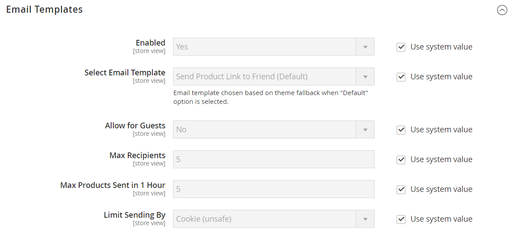

# [!UICONTROL Catalog] > [!UICONTROL Email to a Friend]

{{config}}

## [!UICONTROL Email Templates]

<!-- zoom -->

<!-- [Email Templates](https://docs.magento.com/user-guide/marketing/email-template-configuration.html) -->

| Campo | [Ambito](../../getting-started/websites-stores-views.md#scope-settings) | Descrizione |
|--- |--- |--- |
| [!UICONTROL Enabled] | Visualizzazione store | Attiva il processo che consente ai clienti di inviare e-mail agli amici sui prodotti presenti nel negozio. Opzioni: `Yes` / `No` |
| [!UICONTROL Select Email Template] | Visualizzazione store | Identifica il modello di e-mail utilizzato per i messaggi generati dalla funzione _Invia un&#39;e-mail a un amico_. Modello predefinito: `Send Product to Friend` |
| [!UICONTROL Allow for Guests] | Visualizzazione store | Determina se il mittente deve essere un cliente registrato per inviare e-mail su un prodotto agli amici. Opzioni: `Yes` / `No` |
| [!UICONTROL Max Recipients] | Visualizzazione store | Limita il numero di persone che possono essere nella lista di distribuzione per una singola e-mail. |
| [!UICONTROL Max Products Sent in 1  Hour] | Visualizzazione store | Limita il numero di prodotti che possono essere condivisi da un singolo utente in un periodo di un’ora. |
| [!UICONTROL Limit Sending By] | Visualizzazione store | Determina il metodo utilizzato per identificare il mittente. Le opzioni includono:  **`IP Address`**- (scelta consigliata) Identifica il mittente in base all&#39;indirizzo IP del computer utilizzato per inviare le e-mail del prodotto. **`Cookie (unsafe)`** - Identifica il mittente tramite un cookie del browser. Questo metodo non è sicuro perché l’utente può eliminare il cookie per evitare la restrizione. |

{style="table-layout:auto"}
