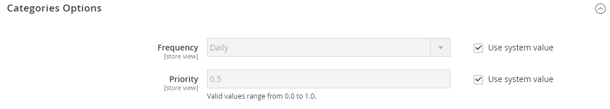
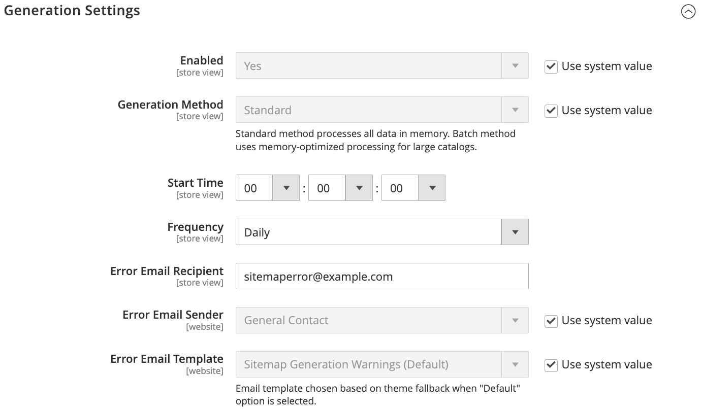

# [!UICONTROL Catalog] > [!UICONTROL XML Sitemap]

{{config}}

## [!UICONTROL Categories Options]

<!-- zoom -->

<!-- [Categories Options](https://experienceleague.adobe.com/it/docs/commerce-admin/marketing/seo/sitemap-xml) -->

| Campo | [Ambito](../../getting-started/websites-stores-views.md#scope-settings) | Descrizione |
|--- |--- |--- |
| [!UICONTROL Frequency] | Visualizzazione store | Determina la frequenza con cui le categorie della mappa del sito vengono aggiornate. Opzioni: `Always` / `Hourly` / `Daily` / `Weekly` / `Monthly` / `Yearly` / `Never` |
| [!UICONTROL Priority] | Visualizzazione store | Valore compreso tra `0.0` e `1.0` che determina la priorità degli aggiornamenti di sitemap di categoria in relazione ad altri contenuti. Zero (`0.0`) ha la priorità più bassa. |

{style="table-layout:auto"}

## [!UICONTROL Products Options]

<!-- zoom -->

<!-- [Products Options](https://experienceleague.adobe.com/it/docs/commerce-admin/marketing/seo/sitemap-xml) -->

| Campo | [Ambito](../../getting-started/websites-stores-views.md#scope-settings) | Descrizione |
|--- |--- |--- |
| [!UICONTROL Frequency] | Visualizzazione store | Determina la frequenza con cui i prodotti sitemap vengono aggiornati. Opzioni: `Always` / `Hourly` / `Daily` / `Weekly` / `Monthly` / `Yearly` / `Never` |
| [!UICONTROL Priority] | Visualizzazione store | Valore compreso tra `0.0` e `1.0` che determina la priorità degli aggiornamenti di sitemap del prodotto in relazione ad altri contenuti. Zero (`0.0`) ha la priorità più bassa. |
| [!UICONTROL Add Images into Sitemap] | Visualizzazione store | Determina il livello di inclusione delle immagini nella sitemap. Opzioni: `None` / `Base Only` / `All` |

{style="table-layout:auto"}

## [!UICONTROL CMS Pages Options]

<!-- zoom -->

<!-- [CMS Pages Options](https://experienceleague.adobe.com/it/docs/commerce-admin/marketing/seo/sitemap-xml) -->

| Campo | [Ambito](../../getting-started/websites-stores-views.md#scope-settings) | Descrizione |
|--- |--- |--- |
| [!UICONTROL Frequency] | Visualizzazione store | Determina la frequenza con cui vengono aggiornate le pagine CMS di sitemap. Opzioni: `Always` / `Hourly` / `Daily` / `Weekly` / `Monthly` / `Yearly` / `Never` |
| [!UICONTROL Priority] | Visualizzazione store | Valore compreso tra `0.0` e `1.0` che determina la priorità degli aggiornamenti della mappa del sito della pagina di CMS in relazione ad altri contenuti. Zero (`0.0`) ha la priorità più bassa. |

{style="table-layout:auto"}

## [!UICONTROL Store Url Options]

| Campo | [Ambito](../../getting-started/websites-stores-views.md#scope-settings) | Descrizione |
|--- |--- |--- |
| [!UICONTROL Frequency] | Visualizzazione store | Determina la frequenza con cui vengono aggiornati gli URL dei negozi. Opzioni: `Always` / `Hourly` / `Daily` / `Weekly` / `Monthly` / `Yearly` / `Never` |
| [!UICONTROL Priority] | Visualizzazione store | Valore compreso tra `0.0` e `1.0` che determina la priorità degli aggiornamenti dell&#39;URL dell&#39;archivio in relazione ad altri contenuti. Zero (`0.0`) ha la priorità più bassa. |

{style="table-layout:auto"}

## [!UICONTROL Generation Settings]

<!-- zoom -->

<!-- [Generation Settings](https://experienceleague.adobe.com/it/docs/commerce-admin/marketing/seo/sitemap-xml) -->

| Campo | [Ambito](../../getting-started/websites-stores-views.md#scope-settings) | Descrizione |
|--- |--- |--- |
| [!UICONTROL Enabled] | Visualizzazione store | Determina se una mappa del sito XML è disponibile per l&#39;archivio. Opzioni: `Yes` / `No` |
| [!UICONTROL Generation Method] | Visualizzazione store | Determina la modalità di generazione della mappa del sito XML. `Standard` utilizza il tradizionale processo di generazione sincrona ed elabora tutti i dati in memoria, mentre `Batch` utilizza una modalità batch asincrona con ottimizzazione per la memoria per una maggiore flessibilità e scalabilità. Questa opzione è disponibile a partire dalla versione 2.4.9 di. Opzioni: `Standard` / `Batch` |
| [!UICONTROL Start Time] | Visualizzazione store | Specifica l’ora, il minuto e il secondo del giorno in cui viene aggiornata la mappa del sito. |
| [!UICONTROL Frequency] | Visualizzazione store | Determina la frequenza con cui viene aggiornata la mappa del sito. Opzioni: `Daily` / `Weekly` / `Monthly` |
| [!UICONTROL Error Email Recipient] | Visualizzazione store | L’indirizzo e-mail della persona che riceve la notifica se si verifica un errore durante il processo di aggiornamento di sitemap. Per più indirizzi, separali con una virgola. |
| [!UICONTROL Error Email Sender] | Sito Web | Identifica il contatto dell&#39;archivio che viene visualizzato come mittente della notifica di errore. Opzioni: `General Contact` / `Sales Representative` / `Customer Support` / `Custom Email 1` / `Custom Email 2` |
| [!UICONTROL Error Email Template] | Sito Web | Identifica il modello e-mail utilizzato per la notifica dell’errore. Modello predefinito: `Sitemap generate Warnings` |

{style="table-layout:auto"}

## [!UICONTROL Sitemap File Limits]

<!-- zoom -->

<!-- [Sitemap File Limits](https://experienceleague.adobe.com/it/docs/commerce-admin/marketing/seo/sitemap-xml) -->

| Campo | [Ambito](../../getting-started/websites-stores-views.md#scope-settings) | Descrizione |
|--- |--- |--- |
| [!UICONTROL Maximum No of URLs Per File] | Visualizzazione store | Determina il numero massimo di URL che possono essere inclusi in una singola sitemap. |
| [!UICONTROL Maximum File Size] | Visualizzazione store | Determina la dimensione massima in byte della mappa del sito generata. |

{style="table-layout:auto"}

## [!UICONTROL Search Engine Submission Settings]

<!-- zoom -->

<!-- [Search Engine Submission Settings](https://experienceleague.adobe.com/it/docs/commerce-admin/marketing/seo/sitemap-xml) -->

| Campo | [Ambito](../../getting-started/websites-stores-views.md#scope-settings) | Descrizione |
|--- |--- |--- |
| [!UICONTROL Enable Submission to Robots.txt] | Visualizzazione store | Consente di inviare le direttive per il file robots.txt. Opzioni: `Yes` / `No` |

{style="table-layout:auto"}
