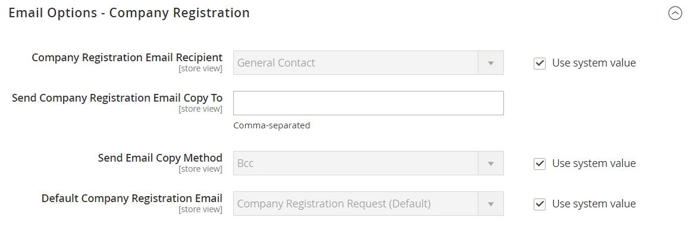

# [!UICONTROL Customers] > [!UICONTROL Company Configuration]

{{b2b-feature}}

{{config}}

>[!TIP]
>
>Con l’installazione e l’abilitazione di Adobe Commerce B2B, l’esperienza di acquisto può essere personalizzata con funzioni specifiche per l’azienda. Adobe Commerce B2B è una soluzione integrata che supporta sia i modelli B2B che B2C. Per ulteriori informazioni sulle funzionalità B2B, consulta la [Guida utente di Adobe Commerce B2B](https://experienceleague.adobe.com/docs/commerce-admin/b2b/introduction.html?lang=it).

>[!NOTE]
>
>L&#39;accesso a queste opzioni di configurazione per le funzionalità B2B è controllato dalle [risorse ruolo](../../systems/permissions-user-roles.md#role-resources). Queste risorse ruolo devono essere impostate per il ruolo utente assegnato all&#39;utente amministratore.

Per ulteriori informazioni sulla configurazione di queste impostazioni, vedere [Abilitare le funzionalità B2B di base](../../b2b/enable-basic-features.md) nella _Guida utente B2B di Adobe Commerce_.

## [!UICONTROL General]

<!-- zoom -->

| Campo | [Ambito](../../getting-started/websites-stores-views.md#scope-settings) | Descrizione |
|--- |--- |--- |
| [!UICONTROL Allow Company Registration from the Storefront] | Sito Web | Determina se i visitatori del tuo archivio possono scegliere di [registrarsi](../../customers/customer-sign-in.md) per un account aziendale o per un account individuale. Opzioni: `Yes` / `No` |

{style="table-layout:auto"}

## [!UICONTROL Email Options - Company Registration]

<!-- zoom -->

| Campo | [Ambito](../../getting-started/websites-stores-views.md#scope-settings) | Descrizione |
|--- |--- |--- |
| [!UICONTROL Company Registration Email Recipient] | Visualizzazione store | Il contatto del punto vendita che viene informato quando una richiesta di registrazione dell&#39;azienda viene inviata dal punto vendita. Opzioni: `General Contact` / `Sales Representative` / `Customer Support` / `Custom Email 1` / `Custom Email 2` |
| [!UICONTROL Send Company Registration Email Copy To] | Visualizzazione store | L’indirizzo e-mail di ogni persona che deve ricevere una copia della notifica di registrazione. Separa più indirizzi e-mail con una virgola. |
| [!UICONTROL Send Email Copy Method] | Visualizzazione store | Il metodo e-mail utilizzato per inviare la copia dell’e-mail di registrazione. Opzioni: `Bcc` / `Separate Email` |
| [!UICONTROL Default Company Registration Email] | Visualizzazione store | Il modello e-mail utilizzato per impostazione predefinita per la notifica di registrazione della società. Modello predefinito: `Company Registration Request` |

{style="table-layout:auto"}

## [!UICONTROL Customer-Related Emails]

<!-- zoom -->

| Campo | [Ambito](../../getting-started/websites-stores-views.md#scope-settings) | Descrizione |
|--- |--- |--- |
| [!UICONTROL Default 'Sales Rep Assigned' Email] | Visualizzazione store | Il modello e-mail utilizzato per impostazione predefinita quando un rappresentante commerciale viene assegnato a un account aziendale. Questa e-mail viene inviata al rappresentante commerciale e all’amministratore della società. Modello predefinito: `Sales Representative Assigned to Company` |
| [!UICONTROL Default 'Assign Company to Customer' Email] | Visualizzazione store | Il modello e-mail utilizzato per impostazione predefinita quando un singolo account cliente viene assegnato a un account aziendale. Questa e-mail viene inviata solo al cliente. Modello predefinito: `Assign Company to Customer` |
| [!UICONTROL Default 'Assign Company Admin' Email] | Visualizzazione store | Modello e-mail utilizzato quando un amministratore società viene assegnato a una società. Questa e-mail viene inviata al rappresentante commerciale e all’amministratore della società. Modello predefinito: `Assign Company Admin` |
| [!UICONTROL Default 'Company Admin Inactive' Email] | Visualizzazione store | Il modello e-mail utilizzato per impostazione predefinita quando lo stato della persona che funge da amministratore dell’azienda viene modificato in &quot;Inattivo&quot;. Il sistema invia una notifica e-mail della modifica agli amministratori della nuova e della società precedente. Modello predefinito: `Company Admin Set Inactive` |
| [!UICONTROL Default 'Company Admin Changed to Member' Email] | Visualizzazione store | Il modello e-mail utilizzato per impostazione predefinita quando l’amministratore della società precedente diventa un membro della società. L’e-mail viene inviata solo al membro della società. Modello predefinito: `Company Admin Changed to Member` |
| [!UICONTROL Default 'Customer Status Active' Email] | Visualizzazione store | Il modello e-mail utilizzato per impostazione predefinita quando lo stato di un cliente diventa attivo. Questa e-mail viene inviata solo al cliente. Modello predefinito: `Customer Status Active` |
| [!UICONTROL Default 'Customer Status Inactive' Email] | Visualizzazione store | Il modello e-mail utilizzato per impostazione predefinita quando lo stato di un cliente diventa inattivo. Questa e-mail viene inviata solo al cliente. Modello predefinito: `Customer Status Inactive` |

{style="table-layout:auto"}

## [!UICONTROL Company Status Change]

<!-- zoom -->

| Campo | [Ambito](../../getting-started/websites-stores-views.md#scope-settings) | Descrizione |
|--- |--- |--- |
| [!UICONTROL Company Status Change Email Recipient] | Visualizzazione store | Il contatto del punto vendita che riceve una notifica ogni volta che lo stato di un&#39;azienda cambia. Opzioni: `General Contact` / `Sales Representative` / `Customer Support` / `Custom Email 1` / `Custom Email 2` |
| [!UICONTROL Send Company Status Change Email Copy To] | Visualizzazione store | L&#39;indirizzo e-mail di ogni persona che deve ricevere una copia della notifica di modifica dello stato della società. Separa più indirizzi e-mail con una virgola. |
| [!UICONTROL Send Email Copy Method] | Visualizzazione store | Il metodo e-mail utilizzato per inviare la copia della notifica di modifica dello stato. Opzioni: `Bcc` / `Separate Email` |
| [!UICONTROL Default "Company Status Change to Active 1' Email] | Visualizzazione store | Modello di posta elettronica utilizzato quando lo stato di un&#39;azienda cambia da _In attesa di approvazione_ a _Attivo_. Modello predefinito: `Company Status Active 1` |
| [!UICONTROL Default 'Company Status Change to Active 2' Email] | Visualizzazione store | Il modello e-mail utilizzato per impostazione predefinita quando lo stato di un&#39;azienda cambia da _Rifiutato_ o _Bloccato_ a _Attivo_. Modello predefinito: `Company Status Active 2` |
| [!UICONTROL Default 'Company Status Change to Rejected' Email] | Visualizzazione store | Il modello e-mail utilizzato per impostazione predefinita quando lo stato di un&#39;azienda diventa _Rifiutato_. Modello predefinito: `Company Status Rejected` |
| [!UICONTROL Default 'Company Status Change to Blocked' Email] | Visualizzazione store | Il modello e-mail utilizzato per impostazione predefinita quando lo stato di un&#39;azienda cambia in _Bloccato_. Modello predefinito: `Company Status Blocked` |
| [!UICONTROL Default 'Company Status Change to Pending Approval' Email] | Visualizzazione store | Il modello e-mail utilizzato per impostazione predefinita quando lo stato di un&#39;azienda cambia in _In attesa di approvazione_. Modello predefinito: `Company Status Pending Approval` |

{style="table-layout:auto"}

## [!UICONTROL Company Credit]

<!-- zoom -->

| Campo | [Ambito](../../getting-started/websites-stores-views.md#scope-settings) | Descrizione |
|--- |--- |--- |
| [!UICONTROL Company Credit Change Email Sender] | Visualizzazione store | Il contatto del punto vendita che riceve una notifica ogni volta che viene apportata una modifica al credito di un&#39;azienda. Opzioni: `General Contact` / `Sales Representative` / `Customer Support` / `Custom Email 1` / `Custom Email 2` |
| [!UICONTROL Send Company Credit Change Email Copy To] | Visualizzazione store | L&#39;indirizzo di posta elettronica di ogni persona che deve ricevere una copia della notifica di modifica del credito della società. Separa più indirizzi e-mail con una virgola. |
| [!UICONTROL Send Email Copy Method] | Visualizzazione store | Il metodo e-mail utilizzato per inviare la copia della notifica di modifica del credito. Opzioni: `Bcc` / `Separate Email` |
| [!UICONTROL Allocated Email Template] | Visualizzazione store | Il modello e-mail utilizzato per impostazione predefinita quando viene allocato il credito aziendale. Questa e-mail viene inviata all’amministratore della società. Modello predefinito: `Credit Limit Allocated` |
| [!UICONTROL Updated Email Template] | Visualizzazione store | Il modello e-mail utilizzato per impostazione predefinita quando viene aggiornato il limite di credito di un’azienda. Questa e-mail viene inviata all’amministratore della società. Modello predefinito: `Credit Limit Updated` |
| [!UICONTROL Reimbursed Email Template] | Visualizzazione store | Il modello e-mail utilizzato per impostazione predefinita quando viene effettuato un [rimborso](../../b2b/credit-company.md#apply-a-payment-to-a-company-account) al credito della società. Questa e-mail viene inviata all’amministratore della società. Modello predefinito: `Credit Reimbursed` |
| [!UICONTROL Refunded Email Template] | Visualizzazione store | Il modello e-mail utilizzato per impostazione predefinita quando un importo proveniente da un ordine viene rimborsato al credito aziendale. Questa e-mail viene inviata all’amministratore della società. Modello predefinito: `Order Refunded to Company Credit` |
| [!UICONTROL Reverted Email Template] | Visualizzazione store | Il modello e-mail utilizzato per impostazione predefinita quando un ordine viene ripristinato al credito aziendale. Questa e-mail viene inviata all’amministratore della società. Modello predefinito: `Order Reverted to Company Credit` |

{style="table-layout:auto"}
