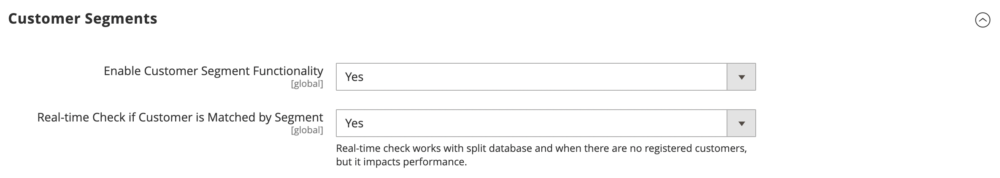

# [!UICONTROL Customers] > [!UICONTROL Customer Configuration]

{{config}}

## [!UICONTROL Account Sharing Options]

<!-- zoom -->

<!-- [Account Sharing Options](https://experienceleague.adobe.com/en/docs/commerce-admin/customers/customer-accounts/customer-account-scope) -->

| Campo | [Ambito](../../getting-started/websites-stores-views.md#scope-settings) | Descrizione |
|--- |--- |--- |
| [!UICONTROL Share Customer Accounts] | Globale | Determina l&#39;ambito dei conti cliente nella gerarchia dell&#39;archivio. Opzioni:  **`Global`**- Le informazioni sull&#39;account del cliente vengono condivise con ogni sito Web e archivio nell&#39;installazione di Commerce. **`Per Website`** - Le informazioni sull&#39;account del cliente sono limitate al sito Web in cui è stato creato l&#39;account. |

{style="table-layout:auto"}

## [!UICONTROL Online Customers Options]

<!-- zoom -->

<!-- [Online Customers Options](https://experienceleague.adobe.com/en/docs/commerce-admin/customers/customers-menu/now-online) -->

| Campo | [Ambito](../../getting-started/websites-stores-views.md#scope-settings) | Descrizione |
|--- |--- |--- |
| [!UICONTROL Online Minutes Interval] | Globale | Determina per quanto tempo l’attività online di un cliente è accessibile dall’amministratore. Lascia vuoto per impostare un intervallo predefinito di 15 minuti. |
| [!UICONTROL Customer Data Lifetime] | Globale | Determina quanti minuti prima della scadenza dei dati non salvati immessi dal cliente. Per impostazione predefinita, i dati non salvati scadono dopo 60 minuti. |

{style="table-layout:auto"}

## [!UICONTROL Create New Account Options]

<!-- zoom -->

<!-- zoom -->

<!-- [Create New Account Options (VAT Fields)](https://experienceleague.adobe.com/en/docs/commerce-admin/customers/customer-accounts/configure/login-landing-page) -->

| Campo | [Ambito](../../getting-started/websites-stores-views.md#scope-settings) | Descrizione |
|--- |--- |--- |
| [!UICONTROL Enable Automatic Assignment to Customer Group] | Visualizzazione store | Determina se i clienti vengono assegnati automaticamente al gruppo di clienti predefinito. Per visualizzare la partita IVA nel negozio, impostare Mostra partita IVA nel negozio e selezionare `Yes`. Opzioni:  **`Yes`**- Il sistema non convalida automaticamente gli ID IVA cliente né modifica i gruppi di clienti. **`No`** - Il comportamento del sistema è normale e il gruppo di clienti predefinito può essere impostato nel campo Gruppo predefinito. |
| [!UICONTROL Default Group] | Visualizzazione store | Identifica il gruppo di clienti iniziale assegnato al momento della creazione di un conto. |
| [!UICONTROL Default Value for Disable Automatic Group Changes Based on VAT ID] | Globale | Disponibile solo se l&#39;ambito di configurazione corrente è impostato su `Default Group`. Scegliere se la modifica automatica del gruppo di clienti basata sull&#39;ID IVA è abilitata o disabilitata per impostazione predefinita. L’impostazione può essere ignorata a livello di prodotto. L&#39;impostazione influisce sul comportamento del sistema nelle seguenti situazioni:   - L&#39;ID IVA dell&#39;indirizzo predefinito del cliente o l&#39;intero indirizzo predefinito cambia.   - La modifica del gruppo di clienti è stata emulata durante l&#39;estrazione per un cliente registrato che non aveva un indirizzo salvato in precedenza o per un cliente che si è registrato durante l&#39;estrazione.  Se la modifica automatica del gruppo è abilitata, nel primo caso il gruppo di clienti cambia automaticamente e nel secondo caso il gruppo di clienti emulato temporaneamente viene assegnato al cliente. Se la modifica automatica del gruppo è disattivata, il gruppo di clienti assegnato non cambia mai, a meno che un amministratore non la modifichi manualmente. |
| [!UICONTROL Show VAT Number on Storefront] | Sito Web | Determina se il numero di partita IVA è visibile ai clienti del punto vendita. Opzioni: `Yes` / `No`   Interessa solo gli account cliente non B2B regolari. Gli account società dispongono di un proprio campo Partita IVA separato. |
| [!UICONTROL Default Email Domain] | Visualizzazione store | Identifica il dominio e-mail predefinito per l’archivio. Esempio: `mystore.com` |
| [!UICONTROL Default Welcome Email] | Visualizzazione store | Identifica il modello di e-mail utilizzato per l&#39;e-mail predefinita di _Benvenuto_. |
| [!UICONTROL Default Welcome Email Without Password] | Visualizzazione store | Modello e-mail di benvenuto alternativo utilizzato per i nuovi account cliente creati dall&#39;amministratore a cui non è ancora stata assegnata una password. |
| [!UICONTROL Email Sender] | Visualizzazione store | Identifica il contatto del negozio che viene visualizzato come mittente dell&#39;e-mail di benvenuto. |
| [!UICONTROL Require Emails Confirmation] | Sito Web | Determina se una richiesta di creazione di un account richiede la conferma del cliente. Opzioni: `Yes` / `No`.    _**Nota:**_ a partire dalla versione 2.4.7, i clienti devono reimmettere l&#39;e-mail e la password per accedere al proprio account dopo la conferma dell&#39;e-mail, indipendentemente dal browser. |
| [!UICONTROL Confirmation Link Email] | Visualizzazione store | Identifica il modello e-mail utilizzato per l’e-mail di conferma. Modello predefinito: `New account confirmation key` |
| [!UICONTROL Welcome Email] | Visualizzazione store | Identifica il modello di e-mail utilizzato per il messaggio di benvenuto inviato dopo la conferma dell’account. |
| [!UICONTROL Generate Human-Friendly Customer ID] | Globale | Determina se il campo utilizzato per immettere e memorizzare il numero di partita IVA è visibile dalla vetrina. Opzioni: `Yes` / `No` |

{style="table-layout:auto"}

## [!UICONTROL Password Options]

<!-- zoom -->

<!-- [Password Options](https://experienceleague.adobe.com/en/docs/commerce-admin/customers/customer-accounts/configure/password-options) -->

| Campo | [Ambito](../../getting-started/websites-stores-views.md#scope-settings) | Descrizione |
|--- |--- |--- |
| [!UICONTROL Password Reset Protection Type] | Visualizzazione store | Determina il metodo utilizzato per reimpostare la password di un account cliente. Opzioni:  **`By IP and Email`**- È possibile reimpostare la password online dopo aver ricevuto una risposta da una notifica di reimpostazione inviata all&#39;indirizzo di posta elettronica associato all&#39;account Admin. **`By IP`** - La password può essere reimpostata online.  **`By Email`**- È possibile reimpostare la password rispondendo a una notifica e-mail inviata all&#39;indirizzo e-mail associato all&#39;account Admin. **`None`** - La password può essere reimpostata solo dall&#39;amministratore dello store. |
| [!UICONTROL Max Number of Password Reset Requests] | Visualizzazione store | Limita il numero di richieste di reimpostazione della password all&#39;ora. Per richieste illimitate, immetti zero (0). |
| [!UICONTROL Min Time Between Password Reset Requests] | Visualizzazione store | Determina il numero di minuti tra le richieste di reimpostazione della password. Per nessun ritardo tra le richieste, immetti zero (0). |
| [!UICONTROL Forgot Email Template] | Visualizzazione store | Identifica il modello e-mail utilizzato quando i clienti dimenticano le password. Modello predefinito: `Forgot Password` |
| [!UICONTROL Remind Email Template] | Visualizzazione store | Identifica il modello e-mail utilizzato quando i clienti ricevono un promemoria tramite password o un suggerimento. Modello predefinito: `Remind Password` |
| [!UICONTROL Reset Password Template] | Visualizzazione store | Determina il modello e-mail utilizzato quando i clienti reimpostano le password. |
| [!UICONTROL Password Template Email Sender] | Visualizzazione store | Determina il contatto di archiviazione che viene visualizzato come mittente delle e-mail relative alla password. |
| [!UICONTROL Recovery Link Expiration Period (hours)] | Globale | Specifica il numero di ore prima della scadenza di un collegamento di recupero password. |
| [!UICONTROL Enable Autocomplete on login/forgot password forms] | Sito Web | Determina se il completamento automatico è abilitato nei moduli password di accesso/dimenticati. Opzioni: `Yes` / `No` |
| [!UICONTROL Number of Required Character Classes] | Globale | Determina il numero di diverse classi di caratteri (minuscolo, maiuscolo, numerico e speciale) che devono essere incluse in una password. |
| [!UICONTROL Maximum Login Failures to Lockout Account] | Globale | Determina il numero di tentativi di accesso non riusciti fino al blocco dell’account del cliente. Per tentativi illimitati, immettere zero (`0`). |
| [!UICONTROL Minimum Password Length] | Globale | Determina il numero minimo di caratteri consentito in una password. Il numero deve essere maggiore di zero (`0`). |
| [!UICONTROL Lockout Time (minutes)] | Globale | Determina il numero di minuti di blocco di un account cliente dopo troppi tentativi di accesso non riusciti. |

{style="table-layout:auto"}

## [!UICONTROL Account Information Options]

<!-- zoom -->

| Campo | [Ambito](../../getting-started/websites-stores-views.md#scope-settings) | Descrizione |
|--- |--- |--- |
| [!UICONTROL Change Email Template] | Visualizzazione store | Identifica il modello e-mail predefinito utilizzato quando un cliente modifica il proprio indirizzo e-mail. |
| [!UICONTROL Change Email and Password Template] | Visualizzazione store | Identifica il modello e-mail predefinito utilizzato quando un cliente modifica il proprio indirizzo e-mail e la propria password. |

{style="table-layout:auto"}

## [!UICONTROL Name and Address Options]

### Opzioni Magento Open Source

{{ce-feature}}

<!-- zoom -->

<!-- [Name and Address Options - Open Source](https://experienceleague.adobe.com/en/docs/commerce-admin/customers/customer-accounts/configure/name-address-options) -->

| Campo | [Ambito](../../getting-started/websites-stores-views.md#scope-settings) | Descrizione |
|--- |--- |--- |
| [!UICONTROL Number of Lines in a Street Address] | Sito Web | Determina il numero di righe nell&#39;indirizzo stradale. L&#39;indirizzo stradale è composto da `1` a `4` righe. Se il campo è vuoto, verrà utilizzato l&#39;indirizzo predefinito di tre (`3`) righe. |
| [!UICONTROL Show Prefix] | Sito Web | Determina se il nome del cliente include un prefisso all&#39;inizio, ad esempio le opzioni Sig. e Sig.ra: `No` / `Optional` / `Required` |
| [!UICONTROL Prefix Dropdown Options] | Sito Web | Definisce l&#39;elenco delle opzioni di prefisso. Separare i valori con un punto e virgola. Inserire un punto e virgola prima del primo valore per visualizzare un valore vuoto nella parte superiore dell&#39;elenco. |
| [!UICONTROL Show Middle Name (initial)] | Sito Web | Determina se l&#39;iniziale centrale è inclusa nel nome del cliente. Se utilizzato, l’iniziale centrale è un campo facoltativo. Opzioni: `Yes` / `No` |
| [!UICONTROL Show Suffix] | Sito Web | Determina se il nome del cliente include un suffisso alla fine, ad esempio Jr., Sr. e III. Opzioni: `No` / `Optional` / `Required` |
| [!UICONTROL Suffix Dropdown Options] | Sito Web | Definisce l&#39;elenco delle opzioni di suffisso. Separare i valori con un punto e virgola. Inserire un punto e virgola prima del primo valore per visualizzare un valore vuoto nella parte superiore dell&#39;elenco. |
| [!UICONTROL Show Date of Birth] | Sito Web | Determina se la data di nascita del cliente è inclusa nel modulo del nome e dell&#39;indirizzo. Opzioni: `No` / `Optional` / `Required`   **_Importante:_**In linea con le attuali best practice in materia di sicurezza e privacy, tieni presente i potenziali rischi legali e di sicurezza associati all&#39;archiviazione della data di nascita completa (mese, giorno, anno) dei clienti con altri identificatori personali. Si consiglia di limitare la memorizzazione delle date di nascita complete dei clienti e, in alternativa, di utilizzare l’anno di nascita del cliente. |
| [!UICONTROL Show Tax/VAT Number] | Sito Web | Determina se il codice fiscale o il numero di partita IVA [1} è incluso nel modulo del nome e dell&#39;indirizzo. ](../../stores-purchase/vat.md) Opzioni: `No` / `Optional` / `Required` |
| [!UICONTROL Show Gender] | Sito Web | Determina se il genere è incluso nel modulo del nome e dell&#39;indirizzo. Opzioni: `No` / `Optional` / `Required` |
| [!UICONTROL Show Telephone] | Sito Web | Determina se il numero di telefono del cliente è incluso nel modulo del nome e dell&#39;indirizzo. Opzioni: `No` / `Optional` / `Required` |
| [!UICONTROL Show Company] | Sito Web | Determina se la società del cliente è inclusa nel modulo del nome e dell&#39;indirizzo. Opzioni: `No` / `Optional` / `Required` |
| [!UICONTROL Show Fax] | Sito Web | Determina se il numero di fax del cliente è incluso nel modulo del nome e dell&#39;indirizzo. Opzioni: `No` / `Optional` / `Required` |

{style="table-layout:auto"}

### Opzioni Adobe Commerce

{{ee-feature}}

<!-- zoom -->

<!-- [Name and Address Options - Commerce](https://experienceleague.adobe.com/en/docs/commerce-admin/customers/customer-accounts/configure/name-address-options) -->

| Campo | [Ambito](../../getting-started/websites-stores-views.md#scope-settings) | Descrizione |
|--- |--- |--- |
| [!UICONTROL Prefix Dropdown Options] | Sito Web | Definisce l&#39;elenco delle opzioni di prefisso. Separare i valori con un punto e virgola. Inserire un punto e virgola prima del primo valore per visualizzare un valore vuoto nella parte superiore dell&#39;elenco. |
| [!UICONTROL Suffix Dropdown Options] | Sito Web | Definisce l&#39;elenco delle opzioni di suffisso. Separare i valori con un punto e virgola. Inserire un punto e virgola prima del primo valore per visualizzare un valore vuoto nella parte superiore dell&#39;elenco. |
| [!UICONTROL Show Telephone] | Sito Web | Determina se il numero di telefono del cliente è incluso nel modulo del nome e dell&#39;indirizzo. Opzioni: `No` / `Optional` / `Required` |
| [!UICONTROL Show Company] | Sito Web | Determina se la società del cliente è inclusa nel modulo del nome e dell&#39;indirizzo. Opzioni: `No` / `Optional` / `Required` |
| [!UICONTROL Show Fax] | Sito Web | Determina se il numero di fax del cliente è incluso nel modulo del nome e dell&#39;indirizzo. Opzioni: `No` / `Optional` / `Required` |

{style="table-layout:auto"}

## [!UICONTROL Store Credit Options]

{{ee-feature}}

<!-- zoom -->

<!-- [Store Credit Options](https://experienceleague.adobe.com/en/docs/commerce-admin/customers/customer-accounts/store-credit/credit-configure) -->

| Campo | [Ambito](../../getting-started/websites-stores-views.md#scope-settings) | Descrizione |
|--- |--- |--- |
| [!UICONTROL Enable Store Credit Functionality] | Globale | Determina se il credito del negozio è abilitato. Se si disabilita questa opzione, il credito del Negozio viene rimosso dagli account cliente e dalla pagina Gestione clienti dell&#39;amministratore. Opzioni: `Yes` / `No`. |
| [!UICONTROL Show Store Credit History to Customers] | Sito Web | Determina se la cronologia dei saldi è visibile nei conti cliente. Opzioni: `Yes` / `No`. |
| [!UICONTROL Refund Store Credit Automatically] | Globale | Determina se il rimborso del negozio viene emesso automaticamente. Opzioni: `Yes` / `No` |
| [!UICONTROL Store Credit Update Email Sender] | Visualizzazione store | Determina l&#39;identità dell&#39;archivio visualizzato come mittente delle notifiche di aggiornamento del credito inviate ai clienti. |
| [!UICONTROL Store Credit Update Email Template] | Visualizzazione store | Determina il modello e-mail utilizzato per gli aggiornamenti del credito. |

{style="table-layout:auto"}

## [!UICONTROL Login Options]

<!-- zoom -->

<!-- [Login Options](https://experienceleague.adobe.com/en/docs/commerce-admin/customers/customer-accounts/configure/login-landing-page) -->

| Campo | [Ambito](../../getting-started/websites-stores-views.md#scope-settings) | Descrizione |
|--- |--- |--- |
| [!UICONTROL Redirect Customer to Account Dashboard after Logging in] | Sito Web | Determina cosa accade dopo che i clienti accedono ai loro account. Per reindirizzare i clienti al dashboard dell&#39;account, selezionare `Yes`. Opzioni:  **`Yes`**- Il dashboard account viene visualizzato quando i clienti accedono ai propri account. **`No`** - I clienti possono continuare a fare acquisti dopo aver effettuato l&#39;accesso ai loro account. |

{style="table-layout:auto"}

## [!UICONTROL Address Templates]

<!-- zoom -->

<!-- [Address Templates](https://experienceleague.adobe.com/en/docs/commerce-admin/customers/customer-accounts/attributes/address-templates) -->

| Modello | [Ambito](../../getting-started/websites-stores-views.md#scope-settings) | Descrizione |
|--- |--- |--- |
| [!UICONTROL Text] | Visualizzazione store | Il modello viene utilizzato per tutti gli indirizzi stampati. |
| [!UICONTROL Text One Line] | Visualizzazione store | Questo modello definisce l&#39;ordine delle entità indirizzo nell&#39;elenco delle rubriche del carrello acquisti del cliente. Avanzamento durante il pagamento. |
| [!UICONTROL HTML] | Visualizzazione store | Questo modello definisce l&#39;ordine dei campi indirizzo che si trovano nell&#39;area _Indirizzi cliente_ nel pannello di amministrazione ([!UICONTROL Customers] > [!UICONTROL Manage Customers]). Questo problema riguarda anche i clienti della pagina _Aggiungi nuovo indirizzo_ che creano un indirizzo di fatturazione o spedizione nella pagina dell&#39;account. |
| [!UICONTROL PDF] | Visualizzazione store | Il modello definisce la visualizzazione degli indirizzi di fatturazione e spedizione nelle fatture, spedizioni e note di credito stampate. |

{style="table-layout:auto"}

## [!UICONTROL Customer Segments]

{{ee-feature}}

<!-- zoom -->

<!-- [Customer Segments](https://experienceleague.adobe.com/en/docs/commerce-admin/customers/segments/customer-segments) -->

| Modello | [Ambito](../../getting-started/websites-stores-views.md#scope-settings) | Descrizione |
|--- |--- |--- |
| [!UICONTROL Enable Customer Segment Functionality] | Globale | Determina se i segmenti dei clienti possono essere utilizzati per creare promozioni mirate. Opzioni: `Yes` / `No` |
| [!UICONTROL Real-time Check if Customer is Matched by Segment] | Globale | Determina se i segmenti dei clienti vengono convalidati in tempo reale. Opzioni:  **[!UICONTROL Yes]**- I segmenti dei clienti vengono convalidati in tempo reale (valore predefinito). **[!UICONTROL No]** - I segmenti del cliente vengono convalidati da una singola query SQL combinata. Questo migliora le prestazioni della convalida dei segmenti se nel sistema sono presenti molti segmenti di clienti. Tuttavia, la convalida non funziona con un database suddiviso o quando non vi sono clienti registrati. |

{style="table-layout:auto"}

## [!UICONTROL CAPTCHA]

<!-- zoom -->

<!-- [CAPTCHA](https://experienceleague.adobe.com/en/docs/commerce-admin/systems/security/captcha/security-captcha) -->

| Campo | [Ambito](../../getting-started/websites-stores-views.md#scope-settings) | Descrizione |
|--- |--- |--- |
| [!UICONTROL Enable CAPTCHA on Storefront] | Sito Web | Abilita il CAPTCHA negli store associati al sito Web Commerce. Opzioni: `Yes` / `No` |
| [!UICONTROL Font] | Sito Web | Determina il font utilizzato per visualizzare il CAPTCHA. Per aggiungere un carattere personalizzato, inserire il file del carattere nella stessa directory dell&#39;installazione di Commerce e aggiungere la dichiarazione al file `config.xml` in `app/code/Magento/Captcha/etc`. |
| [!UICONTROL Forms] | Sito Web | Determina i moduli in cui viene utilizzato CAPTCHA. Opzioni:  `Applying Coupon Code`  `Checkout/Placing Order` `Create user`  `Login`  `Forgot password`  `Contact Us`  `Change password`  `Share Wishlist Form`  `Send to Friend Form`  `Payflow Pro` (vedi [patch di sicurezza](https://experienceleague.adobe.com/docs/commerce-knowledge-base/kb/troubleshooting/payments/paypal-payflow-pro-active-carding-activity.html))  `Add Gift Card Code`   `Create company`    _**Nota:**_ I moduli Crea utente, Password dimenticata e Payflow Pro sono sempre abilitati se selezionati. |
| [!UICONTROL Displaying Mode] | Sito Web | Determina quando viene visualizzato il CAPTCHA. Opzioni:  **`Always`**- CAPTCHA è sempre richiesto per accedere. **`After number of attempts to login`** - Questa opzione è valida solo per il modulo di accesso amministratore. Se selezionata, viene visualizzato il campo _[!UICONTROL Number of Unsuccessful Attempts to Login]_. Immetti il numero di tentativi di accesso che desideri consentire. Un valore di `0` (zero) è simile all&#39;impostazione di [!UICONTROL Displaying Mode] su `Always`. _**Nota:**_per tenere traccia del numero di tentativi di accesso non riusciti, viene conteggiato ogni tentativo di accesso con un unico indirizzo e-mail e da un solo indirizzo IP. Il numero massimo di tentativi di accesso consentiti dallo stesso indirizzo IP è 1.000. Questa limitazione si applica solo quando CAPTCHA è abilitato. |
| [!UICONTROL Number of Unsuccessful Attempts to Login] | Sito Web | Specifica quante volte un cliente può tentare di accedere prima che l&#39;account venga bloccato. |
| [!UICONTROL CAPTCHA Timeout (minutes)] | Sito Web | Determina la durata del CAPTCHA corrente. Alla scadenza del CAPTCHA, l’utente deve ricaricare la pagina. |
| [!UICONTROL Number of Symbols] | Sito Web | Determina il numero di simboli visualizzati nel CAPTCHA, con un massimo di 8. È inoltre possibile specificare un intervallo, ad esempio 5-8. |
| [!UICONTROL Symbols Used in CAPTCHA] | Sito Web | Determina le lettere (a-z e A-Z) e i numeri (0-9) visualizzati nel CAPTCHA. I simboli difficili da distinguere da altri simboli, ad esempio `i`, `l` o `1`, non sono inclusi nel set predefinito di simboli CAPTCHA. |
| [!UICONTROL Case Sensitive] | Sito Web | Determina se i caratteri CAPTCHA fanno distinzione tra maiuscole e minuscole. Opzioni: `Yes` / `No` |

{style="table-layout:auto"}
