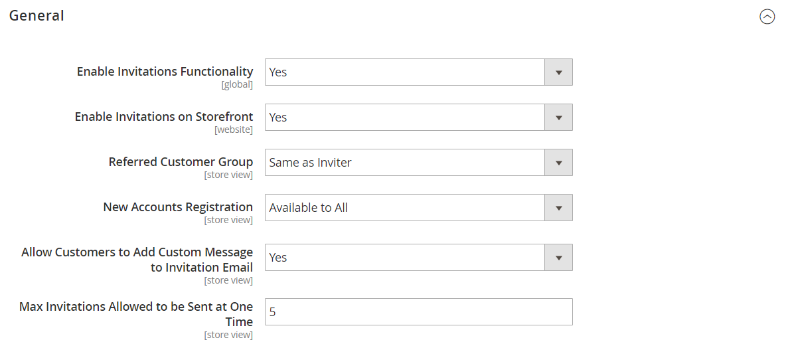

# [!UICONTROL Customers] > [!UICONTROL Invitations]

{{ee-feature}}

{{config}}

## [!UICONTROL General]

<!-- zoom -->

<!-- [General](https://experienceleague.adobe.com/it/docs/commerce-admin/marketing/promotions/events/invitations#enable-invitations-for-your-store) -->

| Campo | [Ambito](../../getting-started/websites-stores-views.md#scope-settings) | Descrizione |
|--- |--- |--- |
| [!UICONTROL Enable Invitations Functionality] | Globale | Determina se il modulo Inviti è abilitato. Opzioni: `Yes` / `No` |
| [!UICONTROL Enable Invitations on Frontend] | Sito Web | Determina se gli inviti possono essere gestiti dalla vetrina. Opzioni: `Yes` / `No` |
| [!UICONTROL Referred Customer Group] | Visualizzazione store | Determina il gruppo di clienti dell&#39;invitato. Opzioni:  **`Same as Inviter`**- Gli invitati vengono assegnati automaticamente allo stesso gruppo di clienti dei clienti che li hanno invitati. **`Default Customer Group from Configuration`** - Gli invitati dispongono automaticamente del [gruppo clienti](../../customers/customer-groups.md) predefinito. |
| [!UICONTROL New Accounts Registration] | Visualizzazione store | Determina il modo in cui gli invitati possono creare un account. Opzioni:  **`By Invitation Only`**- Per creare un account, gli invitati devono seguire il collegamento nell&#39;e-mail di invito. **`Available to All`** - Gli invitati possono utilizzare il modulo di registrazione account disponibile nello store. |
| [!UICONTROL Allow Customers to Add Custom Message to Invitation Email] | Visualizzazione store | Determina se nel modulo di invito è presente un campo in cui l&#39;utente che invita può aggiungere un messaggio personalizzato inviato all&#39;utente invitato tramite e-mail. Ciò non pregiudica la possibilità dell&#39;amministratore di aggiungere un messaggio a un invito. Opzioni: `Yes` / `No`. |
| [!UICONTROL Max Invitations Allowed to be Sent at One Time] | Visualizzazione store | Determina il numero massimo di inviti che l&#39;utente può inviare contemporaneamente. Un invito diverso viene inviato a ogni indirizzo e-mail incluso nel modulo dell&#39;utente che ha inviato l&#39;invito. In questo modo si proteggono le risorse del server impedendo l&#39;invio simultaneo di un numero elevato di inviti e diminuendo la probabilità che gli inviti vengano inviati come spam. |

{style="table-layout:auto"}

## [!UICONTROL Email]

<!-- zoom -->

<!-- [Email](https://experienceleague.adobe.com/it/docs/commerce-admin/marketing/promotions/events/invitations#enable-invitations-for-your-store) -->

| Campo | [Ambito](../../getting-started/websites-stores-views.md#scope-settings) | Descrizione |
|--- |--- |--- |
| [!UICONTROL Customer Invitation Email Sender] | Visualizzazione store | Determina il mittente dell&#39;e-mail che gli invitati ricevono quando viene inviato un messaggio e-mail di invito. Valore predefinito: `General Contact` |
| [!UICONTROL Customer Invitation Email Template] | Visualizzazione store | Determina il modello dell&#39;e-mail che gli invitati ricevono quando viene inviato un messaggio e-mail di invito. Modello predefinito: `Customer Invitation` |

{style="table-layout:auto"}
