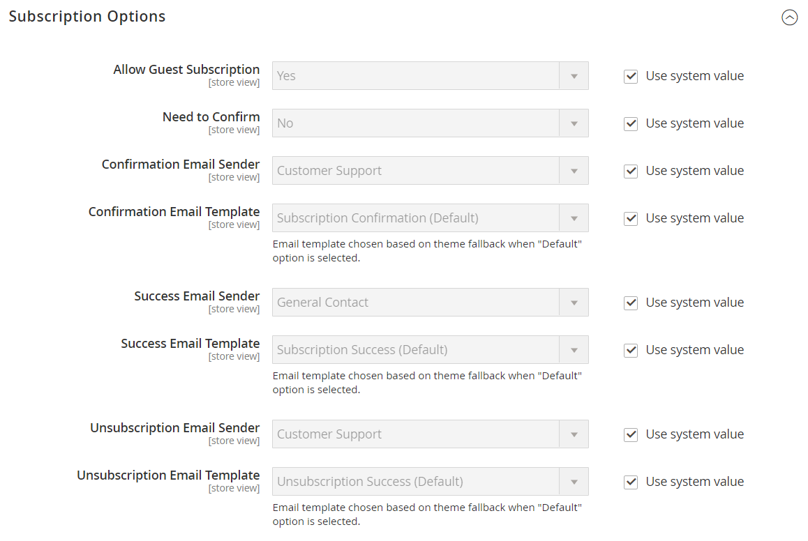

# [!UICONTROL Customers] > [!UICONTROL Newsletter]

{{config}}

>[!NOTE]
>
>La newsletter fa parte degli strumenti di marketing che consentono di inviare ai clienti notizie, sconti e altre e-mail di marketing. I clienti registrati possono gestire l&#39;abbonamento dal dashboard dell&#39;[account](../../customers/account-dashboard-my-account.md).

## [!UICONTROL General Options]

<!-- zoom -->

| Campo | [Ambito](../../getting-started/websites-stores-views.md#scope-settings) | Descrizione |
|--- |--- |--- |
| [!UICONTROL Enabled] | Visualizzazione store | Determina se le newsletter sono abilitate per l&#39;ambito di visualizzazione dell&#39;archivio. Opzioni: `Yes` / `No` |

{style="table-layout:auto"}

## [!UICONTROL Subscription Options]

<!-- zoom -->

<!-- [Subscription Options](https://experienceleague.adobe.com/it/docs/commerce-admin/marketing/communications/newsletters/newsletters) -->

| Campo | [Ambito](../../getting-started/websites-stores-views.md#scope-settings) | Descrizione |
|--- |--- |--- |
| [!UICONTROL Allow Guest Subscription] | Visualizzazione store | Determina se gli ospiti non registrati possono iscriversi a una newsletter. Opzioni: `Yes` / `No` |
| [!UICONTROL Need to Confirm] | Visualizzazione store | Determina se le richieste di abbonamento devono essere confermate. Questo metodo di doppio consenso è una misura di convalida che impedisce alle persone di effettuare l’abbonamento senza il loro consenso. Opzioni: `Yes` / `No` |
| [!UICONTROL Confirmation Email Sender] | Visualizzazione store | Identifica il contatto del negozio che viene visualizzato come mittente dell’e-mail inviata per confermare una richiesta di abbonamento. |
| [!UICONTROL Confirmation Email Template] | Visualizzazione store | Determina il modello di e-mail utilizzato per la notifica inviata per confermare una richiesta di abbonamento a una newsletter. Modello predefinito: `Newsletter subscription confirmation` |
| Mittente e-mail riuscito | Visualizzazione store | Identifica il contatto del negozio che viene visualizzato come mittente dell’e-mail inviata a coloro che si sono abbonati correttamente a una newsletter. |
| [!UICONTROL Success Email Template] | Visualizzazione store | Determina il modello di e-mail utilizzato per la notifica inviata a coloro che si sono abbonati correttamente a una newsletter. Modello predefinito: `Newsletter subscription success` |
| [!UICONTROL Unsubscription Email Sender] | Visualizzazione store | Identifica il contatto del negozio che viene visualizzato come mittente dell’e-mail inviata a coloro che richiedono di terminare l’abbonamento alla newsletter. |
| [!UICONTROL Unsubscription Email Template] | Visualizzazione store | Determina il modello di e-mail utilizzato per la notifica inviata a coloro che richiedono di terminare l’abbonamento alla newsletter. Modello predefinito: `Newsletter unsubscription success` |

{style="table-layout:auto"}
