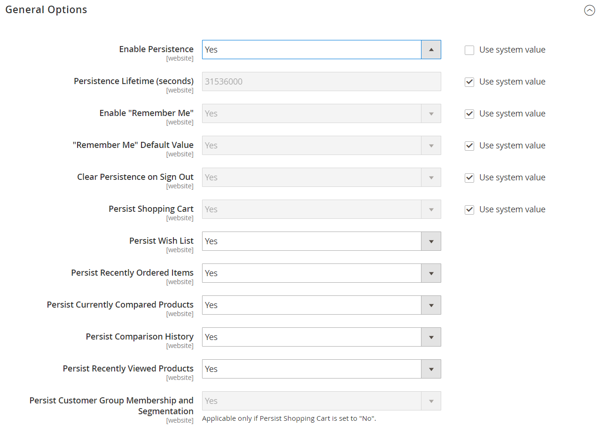

# [!UICONTROL Customers] > [!UICONTROL Persistent Shopping Cart]

{{config}}

>[!NOTE]
>
>A [Carrello acquisti persistente](../../stores-purchase/cart-persistent.md) consente di conservare gli articoli non acquistati rimasti nel carrello e di salvarli per un periodo configurato in _Durata persistenza_. I cookie devono essere consentiti nel browser del cliente per l’utilizzo di un carrello persistente.

## [!UICONTROL General Options]

<!-- zoom -->

<!-- [General Options](https://docs.magento.com/user-guide/sales/cart-persistent-configuration.html) -->

| Campo | [Ambito](../../getting-started/websites-stores-views.md#scope-settings) | Descrizione |
|--- |--- |--- |
| [!UICONTROL Enable Persistence] | Sito Web | Determina se la persistenza è abilitata. |
| [!UICONTROL Persistence Lifetime (seconds)] | Sito Web | Definisce la durata del cookie persistente in secondi. Il valore massimo consentito è di 3153600000 secondi (100 anni). |
| [!UICONTROL Enable "Remember Me"] | Sito Web | Definisce se _Ricordami_ La casella di controllo viene visualizzata nelle pagine di accesso e registrazione del negozio. Opzioni:  **`Yes`**- Visualizza la _Ricordami_ casella di controllo. **`No`** - Non visualizza il _Ricordami_ e il cookie persistente viene utilizzato solo per i clienti che lo dispongono già. |
| [!UICONTROL "Remember Me" Default Value] | Sito Web | Definisce lo stato predefinito per _Ricordami_ casella di controllo. |
| [!UICONTROL Clear Persistence on Log Out] | Sito Web | Definisce se il cookie persistente viene eliminato quando un cliente store si disconnette. Indipendentemente dalla configurazione, se un cliente non si disconnette ma il cookie di sessione scade, il cookie persistente viene comunque utilizzato. |
| [!UICONTROL Persist Shopping Cart] | Sito Web | Definisce se l’utilizzo del cookie persistente consente di accedere ai dati del carrello dell’account corrispondente. Opzioni:  **`Yes`**: il contenuto del carrello viene salvato al termine della sessione. **`No`** : al termine della sessione, il contenuto del carrello non viene salvato. |
| [!UICONTROL Persist Wish List] | Sito Web |  (Solo per Adobe Commerce) Determina se lo stato degli elenchi di desideri del cliente viene mantenuto al termine della sessione. Opzioni:  **`Yes`**- Il contenuto della lista dei desideri viene salvato al termine della sessione. **`No`** - La lista dei desideri non viene salvata al termine della sessione. |
| [!UICONTROL Persist Recently Ordered Items] | Sito Web |  (Solo per Adobe Commerce) Determina se lo stato degli elementi ordinati di recente viene mantenuto al termine della sessione. Opzioni:  **`Yes`**- Lo stato degli elementi ordinati di recente viene salvato al termine della sessione. **`No`** - Lo stato degli elementi ordinati di recente non viene salvato al termine della sessione. |
| [!UICONTROL Persist Currently Compared Products] | Sito Web |  (Solo per Adobe Commerce) Determina se lo stato dei prodotti attualmente confrontati viene mantenuto al termine della sessione. Opzioni:  **`Yes`**- Lo stato dei prodotti attualmente confrontati viene salvato al termine della sessione. **`No`** - Lo stato dei prodotti attualmente confrontati non viene salvato al termine della sessione. |
| [!UICONTROL Persist Comparison History] | Sito Web |  (Solo per Adobe Commerce) Determina se lo stato della cronologia di confronto viene mantenuto al termine della sessione. Opzioni:  **`Yes`**- Lo stato della cronologia di confronto viene salvato al termine della sessione. **`No`** - Lo stato della cronologia di confronto non viene salvato al termine della sessione. |
| [!UICONTROL Persist Recently Viewed Products] | Sito Web |  (Solo per Adobe Commerce) Determina se lo stato dei prodotti visualizzati di recente viene mantenuto al termine della sessione. Opzioni:  **`Yes`**: lo stato dei prodotti visualizzati di recente viene salvato al termine della sessione. **`No`** - Lo stato dei prodotti visualizzati di recente non viene salvato al termine della sessione. |
| [!UICONTROL Persist Customer Group Membership and Segmentation] | Sito Web |  (Solo per Adobe Commerce) Determina se lo stato dell’iscrizione al gruppo dei clienti e i criteri di segmentazione vengono mantenuti al termine della sessione. Opzioni:  **`Yes`**: lo stato dei dati di segmentazione e appartenenza al gruppo del cliente viene salvato al termine della sessione. **`No`** - Lo stato dei dati di appartenenza al gruppo e di segmentazione del cliente non viene salvato al termine della sessione. |

{:style=&quot;table-layout:auto&quot;}
