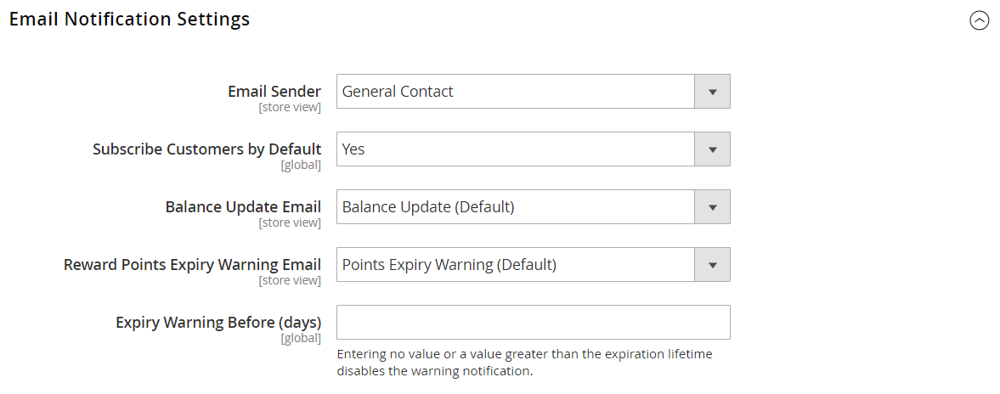

# [!UICONTROL Customers] > [!UICONTROL Reward Points]

{{ee-feature}}

{{config}}

>[!NOTE]
>
>[La configurazione dei tassi di cambio premi](../../merchandising-promotions/reward-exchange-rates.md) è necessaria per il rimborso dei punti premio da parte dei clienti e degli amministratori durante l&#39;estrazione.

## [!UICONTROL Reward Points]

<!-- zoom -->

<!-- [Reward Points](https://experienceleague.adobe.com/en/docs/commerce-admin/marketing/merchandising/reward-points/rewards-loyalty#enable-reward-point-operations-for-your-store) -->

| Campo | [Ambito](../../getting-started/websites-stores-views.md#scope-settings) | Descrizione |
|--- |--- |----------------------------------------------------------------------------------------------------------------------------------------------------------------------------------------------------------------------------------------------------------------------------------------------------------------------------------------------------------------------------------------------------------------------------------------------------------------------------------------------------------------------------------------------------------------------|
| [!UICONTROL Enable Reward Points Functionality] | Globale | Attiva o disattiva i punti premio. Opzioni: `Yes` / `No`. |
| [!UICONTROL Enable Reward Points Functionality on Storefront] | Sito Web | Quando questa opzione è abilitata, i clienti possono guadagnare punti attraverso le loro attività e riscattarli al momento del pagamento. Se è disattivato, solo gli utenti Admin possono assegnare e riscattare punti per conto dei clienti. Opzioni: `Yes` / `No`. |
| [!UICONTROL Customers May See Reward Points History] | Sito Web | Quando questa opzione è abilitata, i clienti possono visualizzare una cronologia dettagliata per ciascun accantonamento, rimborso e scadenza dei Punti premio nel dashboard dell’account. Opzioni: `Yes` / `No` |
| [!UICONTROL Reward Points Balance Redemption Threshold] | Sito Web | Richiede ai clienti di ottenere un saldo minimo di punti prima di poterli riscattare per gli ordini. Lascia vuoto il campo senza specificare alcun valore minimo. |
| [!UICONTROL Cap Reward Points Balance At] | Sito Web | Impedisce ai clienti di accumulare più di questo saldo massimo di punti. Lascia vuoto il campo per specificare un valore massimo. |
| [!UICONTROL Reward Points Expire in (days)] | Sito Web | Indica la durata dei punti premio in giorni. Ogni batch di punti guadagnati durante attività separate ha una durata separata. Ogni batch nella cronologia Punti premio indica il numero di giorni rimanenti prima della scadenza dei punti. La cronologia può essere visualizzata dal dashboard dell’account del cliente, se abilitata, e dall’amministratore. Lascia vuoto per non scadere. |
| [!UICONTROL Reward Points Expiry Calculation] | Sito Web | Determina il metodo utilizzato per determinare quando scadono i punti premio. Opzioni:  **`Static`**- Determina la durata residua dei punti premio in base al numero di giorni impostati nella configurazione. Se il limite di scadenza nella configurazione cambia, la data di scadenza dei punti esistenti non cambia. **`Dynamic`** - Calcola il numero di giorni rimanenti ogni volta che il saldo del punto premio aumenta. Se il limite di scadenza nella configurazione cambia, i calcoli di scadenza per tutti i punti esistenti vengono aggiornati di conseguenza. |
| [!UICONTROL Refund Reward Points Automatically] | Globale | Determina se i punti premio disponibili vengono rimborsati automaticamente. Opzioni: `Yes` / `No` |
| [!UICONTROL Deduct Reward Points from Refund Amount Automatically] | Globale | Questo determina se i punti premio guadagnati con gli acquisti vengono annullati completamente o parzialmente con il rimborso dell&#39;ordine, quando questa funzione è abilitata. Solo i punti premio dell’ordine che li ha ottenuti sono interessati quando l’ordine viene rimborsato. Opzioni: `Yes` / `No`. |
| [!UICONTROL Landing Page] | Visualizzazione store | Specifica la pagina CMS che spiega il programma punti premio. Un collegamento alla pagina Premi predefinita viene visualizzato nelle posizioni del negozio in cui è possibile ottenere punti. |

{style="table-layout:auto"}

## [!UICONTROL Actions for Acquiring Reward Points by Customers]

<!-- zoom -->

<!-- [Actions for Acquiring Reward Points by Customers](https://experienceleague.adobe.com/en/docs/commerce-admin/marketing/merchandising/reward-points/rewards-loyalty#enable-reward-point-operations-for-your-store) -->

| Campo | [Ambito](../../getting-started/websites-stores-views.md#scope-settings) | Descrizione |
|--- |--- |----------------------------------------------------------------------------------------------------------------------------------------------------------------------------------------------------------------------------------------------------------------------------------------------------------------------------------------------------------------------------------------------------------------------------------------------------------------------------------------------------------------------------------------------------------------------------------------------------|
| [!UICONTROL Purchase] | Sito Web | Determina se i punti premio vengono guadagnati per gli acquisti in base ai [tassi di cambio premio](../../merchandising-promotions/reward-exchange-rates.md) configurati. Opzioni: `Yes` / `No` |
| [!UICONTROL Registration] | Sito Web | Specifica il numero di punti guadagnati per l&#39;apertura di un conto cliente. |
| [!UICONTROL Newsletter Signup] | Sito Web | Specifica il numero di punti guadagnati dai clienti registrati che si abbonano a una newsletter. I punti non sono disponibili per gli abbonamenti da parte degli ospiti. Se un cliente annulla l’abbonamento e successivamente si abbona di nuovo, i punti non vengono guadagnati per il secondo abbonamento. |
| [!UICONTROL Converting Invitation to Customer] | Sito Web | Specifica il numero di punti guadagnati da un cliente che invia un invito quando il destinatario apre un conto cliente. |
| [!UICONTROL Invitation to Customer Conversions Quantity Limit] | Sito Web | Limita il numero di conversioni di inviti che possono essere utilizzate per guadagnare punti per il cliente che invia l’invito. Lascia vuoto per non impostare alcun limite. |
| [!UICONTROL Converting Invitation to Order] | Sito Web | Specifica il numero di punti guadagnati da un cliente che invia un invito quando il destinatario effettua un ordine iniziale. |
| [!UICONTROL Invitation to Order Conversions Quantity Limit] | Sito Web | Limita il numero di conversioni di ordini che possono guadagnare punti per la persona che invia l’invito. Se vuoto, non esiste alcun limite massimo. |
| [!UICONTROL Invitation Conversion to Order Reward] | Sito Web | Indica la frequenza con cui un cliente può ottenere punti premio quando gli invitati effettuano acquisti. Opzioni:  **`Each`**- Il cliente riceve punti premio per ogni ordine fatturato dall&#39;invitato. I punti premio vengono assegnati in base ai tassi di cambio fissati per la combinazione richiesta di un sito web e un gruppo di clienti. **`First`** - Il cliente riceve punti premio solo per il primo ordine fatturato effettuato dagli invitati. Se più di un invitato registra e invia un ordine, solo l&#39;importo del primo ordine viene convertito in punti premio e concesso al cliente. |
| [!UICONTROL Review Submission] | Sito Web | Determina il numero di punti guadagnati da un cliente che sottomette una revisione approvata per la pubblicazione. |
| [!UICONTROL Rewarded Reviews Submission Quantity Limit] | Sito Web | Limita il numero di recensioni che possono essere utilizzate per guadagnare punti per cliente. Lascia vuoto per non impostare alcun limite. |

{style="table-layout:auto"}

## [!UICONTROL Email Notification Settings]

<!-- zoom -->

<!-- [Email Notification Settings](https://experienceleague.adobe.com/en/docs/commerce-admin/marketing/merchandising/reward-points/rewards-loyalty#enable-reward-point-operations-for-your-store) -->

| Campo | [Ambito](../../getting-started/websites-stores-views.md#scope-settings) | Descrizione |
|--- |--- |--- |
| [!UICONTROL Email Sender] | Visualizzazione store | Determina il contatto del punto vendita che viene visualizzato come mittente delle e-mail di notifica di aggiornamento saldo e scadenza. |
| [!UICONTROL Subscribe Customers by Default] | Globale | Determina lo stato di abbonamento predefinito dei clienti per le e-mail di notifica di aggiornamento del saldo e di scadenza. |
| [!UICONTROL Balance Update Email] | Visualizzazione store | Determina il modello utilizzato per la notifica inviata ai clienti ogni volta che il loro saldo punti viene aggiornato. Modello predefinito: `Reward Points Balance Update` |
| [!UICONTROL Reward Points Expiry Warning Email] | Visualizzazione store | Determina il modello dell’e-mail che i clienti ricevono quando viene raggiunto il limite di avviso di scadenza per un batch di punti. Modello predefinito: `Reward Points Expiry Warning` |
| [!UICONTROL Expiry Warning before (days)] | Globale | Specifica il numero di giorni prima della scadenza del punto per l&#39;invio della notifica. Lascia vuoto per non inviare notifiche di scadenza. La notifica non viene inviata se il numero di giorni immessi è maggiore della durata residua dei punti. |

{style="table-layout:auto"}
