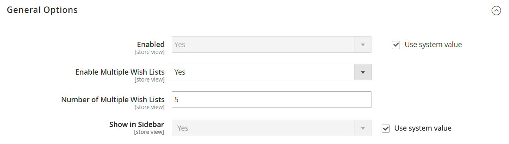

# [!UICONTROL Customers] > [!UICONTROL Wish List]

{{config}}

>[!NOTE]
>
>Una lista dei desideri consente ai clienti registrati di creare le proprie raccolte di prodotti che desiderano acquistare in futuro. Gli elenchi di desideri possono essere condivisi tra i clienti.

## [!UICONTROL General Options]

<!-- zoom -->

<!--[General Options](https://docs.magento.com/user-guide/marketing/wishlist-configuration.html) -->

| Campo | [Ambito](../../getting-started/websites-stores-views.md#scope-settings) | Descrizione |
|--- |--- |--- |
| [!UICONTROL Enabled] | Visualizzazione store | Attiva il modulo lista dei desideri per il tuo negozio. Opzioni: `Yes` / `No` |
| [!UICONTROL Show in Sidebar] | Visualizzazione store | Specifica la visibilità degli elenchi di desideri nella barra laterale.  Opzioni: `Yes` / `No` |
| [!UICONTROL Enable Multiple Wish Lists] | Visualizzazione store |  (Solo Adobe Commerce) Se impostato su `Yes`, consente ai clienti di creare e gestire più elenchi di desideri. Opzioni: `Yes` / `No` |
| [!UICONTROL Number of Multiple Wish Lists] | Visualizzazione store |  (Solo per Adobe Commerce) Se sono abilitate più liste di desideri, determina il numero massimo di liste di desideri che i clienti possono avere associate al proprio account. |

{style="table-layout:auto"}

## [!UICONTROL Share Options]

<!-- zoom -->

<!-- [Share Options](https://docs.magento.com/user-guide/marketing/wishlist-configuration.html) -->

| Campo | [Ambito](../../getting-started/websites-stores-views.md#scope-settings) | Descrizione |
|--- |--- |--- |
| [!UICONTROL Email Sender] | Visualizzazione store | Determina il contatto del punto vendita che viene visualizzato come mittente del messaggio inviato quando viene condivisa una lista dei desideri. Contatto predefinito: `General Contact` |
| [!UICONTROL Email Template] | Visualizzazione store | Determina il modello di e-mail utilizzato per il messaggio inviato quando viene condivisa una lista dei desideri. Modello predefinito: `Share Wishlist` |
| [!UICONTROL Max Emails Allowed to be Sent] | Visualizzazione store | Determina il numero massimo di e-mail che possono essere inviate in un batch. L&#39;impostazione di un limite massimo può contribuire a ridurre il carico sul server. Il numero massimo consentito è 10.000. Valore predefinito: `10` |
| [!UICONTROL Email Text Length Limit] | Visualizzazione store | Determina il numero massimo di caratteri che possono essere inclusi nel messaggio. Il numero massimo consentito è 10.000. Valore predefinito: `255` |

{style="table-layout:auto"}

## [!UICONTROL My Wish List Link]

<!-- zoom -->

<!--[My Wish List Link](https://docs.magento.com/user-guide/marketing/wishlist-configuration.html) -->

| Campo | [Ambito](../../getting-started/websites-stores-views.md#scope-settings) | Descrizione |
|--- |--- |--- |
| [!UICONTROL Display Wish List Summary] | Sito Web | Configura la visualizzazione del Riepilogo elenchi desideri nel dashboard dell&#39;account cliente. Opzioni: `Display number of items in wish list` / `Display item quantities` |

{style="table-layout:auto"}
