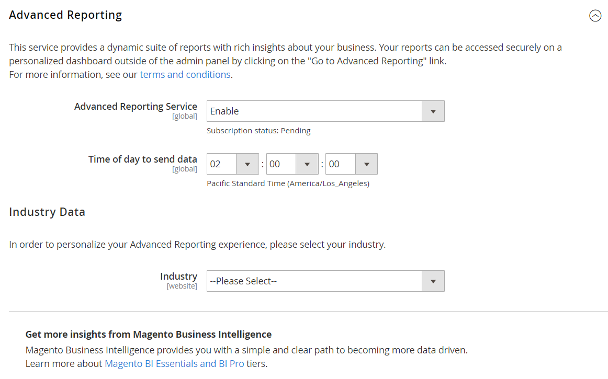

# [!UICONTROL General] > [!UICONTROL Advanced Reporting]

{{config}}

## [!UICONTROL Advanced Reporting]

_[!DNL Advanced Reporting]_è un servizio basato su cloud basato su [Adobe Commerce Intelligence][1]{:target="_blank"}. Per ulteriori informazioni, vedere [Reporting avanzato][2]{:target="_blank"} nella_ Guida introduttiva _.

<!-- zoom -->

<!-- [Advanced Reporting](https://experienceleague.adobe.com/en/docs/commerce-admin/start/reporting/business-intelligence#advanced-reporting) -->

| Campo | [Ambito](../../getting-started/websites-stores-views.md#scope-settings) | Descrizione |
|--- |--- |--- |
| [!UICONTROL Advanced Reporting Service] | Globale | Abilita l&#39;integrazione di [!DNL Advanced Reporting] per l&#39;installazione di Commerce. |
| [!UICONTROL Industry] | Sito Web | Identifica il tuo settore aziendale per personalizzare [!DNL Advanced Reporting]. |
| [!UICONTROL Time of day to send data] | Globale | Determina ogni giorno l&#39;ora di invio dei dati dell&#39;archivio a [!DNL Advanced Reporting]. L’ora si basa su un orologio da 24 ore e include il minuto, l’ora e il secondo nel fuso orario. |

{style="table-layout:auto"}

[1]: https://experienceleague.adobe.com/docs/commerce-business-intelligence/mbi/getting-started.html
[2]: https://experienceleague.adobe.com/docs/commerce-admin/start/reporting/business-intelligence.html#advanced-reporting
