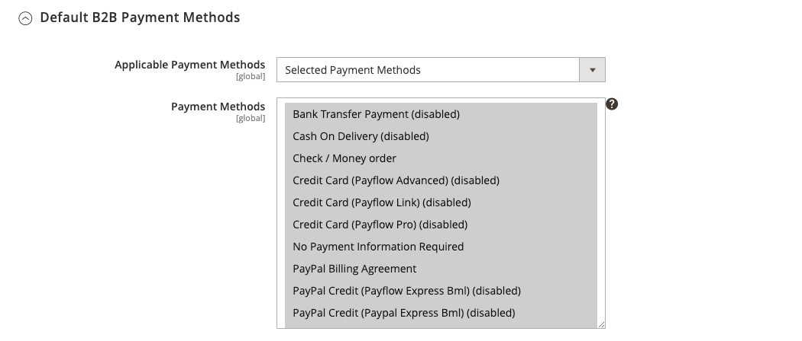

# [!UICONTROL General] > [!UICONTROL B2B Features]

{{b2b-feature}}

{{config}}

>[!TIP]
>
>Con l’installazione e l’abilitazione di B2B per Adobe Commerce, l’esperienza di acquisto può essere personalizzata con funzioni specifiche per l’azienda. B2B per Adobe Commerce è una soluzione integrata che supporta sia i modelli B2B che B2C. Per ulteriori informazioni sulle funzioni B2B, vedi [_Guida utente di B2B per Adobe Commerce_](https://experienceleague.adobe.com/docs/commerce-admin/b2b/introduction.html).

## [!UICONTROL B2B Features]

<!-- zoom -->

| Campo | [Ambito](../../getting-started/websites-stores-views.md#scope-settings) | Descrizione |
|------- |----------------------------------------------------------------------- |------------ |
| [[!UICONTROL Enable Company]](../../b2b/account-companies.md) | Sito Web | Quando questa opzione è attivata, consente ai clienti di gestire l’assegnazione della società dal dashboard account e abilita le funzioni Catalogo condiviso e Offerta B2B per impostazione predefinita. Opzioni: `Yes` / `No` |
| [[!UICONTROL Enable Quick Order]](../../b2b/quick-order.md) | Sito Web | Se questa opzione è abilitata, consente ai clienti e agli ospiti di effettuare rapidamente gli ordini in base allo SKU o al nome del prodotto. Opzioni: `Yes` / `No` |
| [[!UICONTROL Enable Requisition List]](../../b2b/configure-requisition-lists.md) | Sito Web | Quando questa opzione è attivata, consente ai clienti di creare e gestire gli elenchi delle richieste di acquisto dal dashboard dei conti. |

{:style=&quot;table-layout:auto&quot;}

<!-- zoom -->

Quando la funzione Società è abilitata, sono disponibili campi aggiuntivi per il catalogo condiviso e il preventivo B2B.

| Campo | [Ambito](../../getting-started/websites-stores-views.md#scope-settings) | Descrizione |
|------- |----------------------------------------------------------------------- |------------ |
| [[!UICONTROL Enable Shared Catalog]](../../b2b/catalog-shared.md) | Sito Web | Se abilitata, consente di creare cataloghi curati con prezzi personalizzati disponibili a livello globale o limitati a specifiche aziende. Opzioni: `Yes` / `No` |
| [!UICONTROL Enable Shared Catalog direct products price assigning] | Sito Web | Quando _[!UICONTROL Enable Shared Catalog]_è impostato su `Yes`, questa opzione è disponibile. Quando questa opzione è attivata, solo i prodotti assegnati a un catalogo condiviso vengono memorizzati nell&#39;indice dei prezzi. I prodotti non assegnati al catalogo condiviso non vengono visualizzati nella vetrina. Opzioni: `Yes` / `No` |
| [[!UICONTROL Enable B2B Quote]](../../b2b/configure-quotes.md) | Sito Web | Quando questa opzione è attivata, consente agli acquirenti aziendali di inviare una richiesta di preventivo dal carrello. Opzioni: `Yes` / `No` |

{:style=&quot;table-layout:auto&quot;}

### [!UICONTROL Default B2B Payment Methods]

<!-- zoom -->

| Campo | [Ambito](../../getting-started/websites-stores-views.md#scope-settings) | Descrizione |
|------- |----------------------------------------------------------------------- |------------ |
| [!UICONTROL Applicable Payment Methods] | Globale | Determina la selezione dei metodi di pagamento disponibili per gli acquirenti B2B. Opzioni: `All Payment Methods` / `Specific Payment Methods` |
| [!UICONTROL Payment Methods] | Globale | Specifica ogni metodo di pagamento disponibile per gli acquirenti B2B. |

{:style=&quot;table-layout:auto&quot;}

### [!UICONTROL Default B2B Shipping Methods]

<!-- zoom -->

| Campo | [Ambito](../../getting-started/websites-stores-views.md#scope-settings) | Descrizione |
|------- |----------------------------------------------------------------------- |------------ |
| [!UICONTROL Applicable Shipping Methods] | Globale | Determina la selezione dei metodi di spedizione disponibili per impostazione predefinita per gli acquirenti B2B. Opzioni: `All Shipping Methods` / `Specific Shipping Methods` |
| [!UICONTROL Shipping Methods] | Globale | Specifica ogni metodo di spedizione disponibile per impostazione predefinita per gli acquirenti B2B.  **_Nota:_**Puoi anche limitare i metodi di spedizione per uno specifico [account società](../../b2b/account-companies.md). |

{:style=&quot;table-layout:auto&quot;}

## [!UICONTROL Order Approval Configuration]

<!-- zoom -->

| Campo | [Ambito](../../getting-started/websites-stores-views.md#scope-settings) | Descrizione |
|------- |----------------------------------------------------------------------- |------------ |
| [[!UICONTROL Enable Purchase Orders]](../../stores-purchase/purchase-order.md) | Sito Web | Se abilitata, consente alle società di creare ordini fornitore. Opzioni: `Yes` / `No` |

{:style=&quot;table-layout:auto&quot;}

