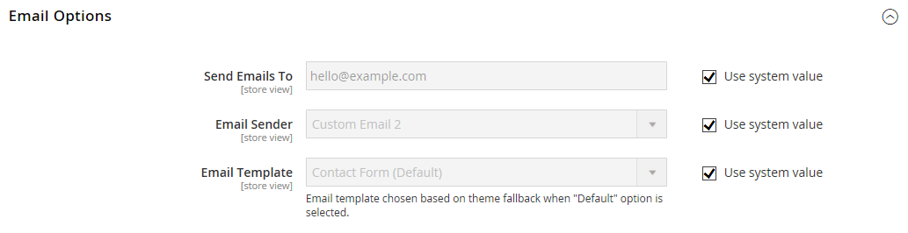

# [!UICONTROL General] > [!UICONTROL Contacts]

{{config}}

## [!UICONTROL Contact Us]

<!-- zoom -->

<!-- [Contact Us](https://experienceleague.adobe.com/it/docs/commerce-admin/start/setup/store-details#contact-us-form) -->

| Campo | [Ambito](../../getting-started/websites-stores-views.md#scope-settings) | Descrizione |
|--- |--- |--- |
| [!UICONTROL Enable Contact Us] | Visualizzazione store | Abilita la pagina [_Contattaci_](../../getting-started/store-details.md#contact-us-form) e inserisce un collegamento nel piè di pagina. |

{style="table-layout:auto"}

## [!UICONTROL Email Options]

<!-- zoom -->

<!-- [Email Options](https://experienceleague.adobe.com/it/docs/commerce-admin/start/setup/store-details#contact-us-form) -->

| Campo | [Ambito](../../getting-started/websites-stores-views.md#scope-settings) | Descrizione |
|--- |--- |--- |
| [!UICONTROL Send Emails To] | Visualizzazione store | Identifica l&#39;indirizzo di posta elettronica che riceve tutte le risposte dalla pagina _Contattaci_ |
| [!UICONTROL Email Sender] | Visualizzazione store | Identifica il contatto del punto vendita utilizzato per tutte le risposte alle richieste di e-mail dalla pagina _Contattaci_. Mittente predefinito: `Custom Email 2` |
| [!UICONTROL Email Template] | Visualizzazione store | Specifica il modello da utilizzare come base per tutte le risposte alle richieste e-mail dalla pagina _Contattaci_. Modello predefinito: `Contact Form` |

{style="table-layout:auto"}
