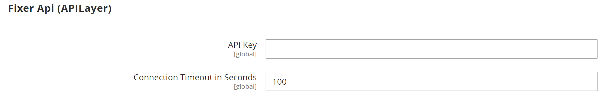

# [!UICONTROL General] > [!UICONTROL Currency Setup]

{{config}}

>[!NOTE]
>
>Per ulteriori dettagli su queste configurazioni, vedere [Configurazione valuta](../../stores-purchase/currency-configuration.md).

## [!UICONTROL Currency Options]

<!-- zoom -->

| Campo | [Ambito](../../getting-started/websites-stores-views.md#scope-settings) | Descrizione |
|--- |--- |--- |
| [!UICONTROL Base Currency] | Sito Web | La valuta principale utilizzata per tutte le transazioni di pagamento online. Per più visualizzazioni dello store, l&#39;ambito del prezzo deve essere impostato nella configurazione [Catalogo](../catalog/catalog.md). |
| [!UICONTROL Default Display Currency] | Visualizzazione store | Valuta principale utilizzata per visualizzare i prezzi. |
| [!UICONTROL Allowed Currencies] | Visualizzazione store | Le valute accettate dal tuo negozio per il pagamento. |

{style="table-layout:auto"}

## [!UICONTROL Fixer.io (legacy)]

>[!IMPORTANT]
>
>A partire dalla versione 2.4.6, il servizio [[!DNL Fixer.io]](https://fixer.io/) è obsoleto e sostituito con il servizio [[!DNL Fixer API] (APILayer)](https://apilayer.com/marketplace/fixer-api). Si consiglia di utilizzare un account APILayer invece di un account [!DNL Fixer.io] obsoleto.

<!-- zoom -->

| Campo | [Ambito](../../getting-started/websites-stores-views.md#scope-settings) | Descrizione |
|--- |--- |--- |
| [!UICONTROL API key] | Globale | Chiave utilizzata per accedere al servizio di conversione tramite l&#39;account [!DNL fixer.io]. Per ulteriori informazioni, vedere [[!DNL fixer.io]](https://fixer.io/). |
| [!UICONTROL Connection Timeout in Seconds] | Globale | Determina il numero di secondi di inattività prima del timeout di una sessione Fixer.io. Valore predefinito: `100` |

{style="table-layout:auto"}

## [!UICONTROL Fixer Api (APILayer)]

<!-- zoom -->

| Campo | [Ambito](../../getting-started/websites-stores-views.md#scope-settings) | Descrizione |
|--- |--- |--- |
| [!UICONTROL API key] | Globale | Chiave utilizzata per accedere al servizio di conversione tramite l&#39;account [!DNL APILayer]. Per ulteriori informazioni, vedere [[!DNL APILayer]](https://apilayer.com/). |
| [!UICONTROL Connection Timeout in Seconds] | Globale | Determina il numero di secondi di inattività prima del timeout di una sessione [!DNL APILayer]. Il valore predefinito è `100`. |

{style="table-layout:auto"}

## [!UICONTROL Currency Converter API]

<!-- zoom -->

| Campo | [Ambito](../../getting-started/websites-stores-views.md#scope-settings) | Descrizione |
|--- |--- |--- |
| [!UICONTROL API key] | Globale | Chiave utilizzata per accedere al servizio di conversione. Per ulteriori informazioni, vedere [[!DNL Currency Convertor] API](https://free.currencyconverterapi.com/). |
| [!UICONTROL Connection Timeout in Seconds] | Globale | Determina il numero di secondi di inattività prima del timeout di una sessione [!DNL Currency Converter]. Valore predefinito:`100` |

{style="table-layout:auto"}

## [!UICONTROL Scheduled Import Settings]

<!-- zoom -->

| Campo | [Ambito](../../getting-started/websites-stores-views.md#scope-settings) | Descrizione |
|--- |--- |--- |
| [!UICONTROL Enabled] | Visualizzazione store | Determina se l&#39;importazione programmata è abilitata per i tassi di valuta. Opzioni: `Yes` / `No` |
| [!UICONTROL Service] | Visualizzazione store | Specifica il servizio che fornisce i dati per l&#39;importazione pianificata. Il valore predefinito è `fixer.io` |
| [!UICONTROL Start Time] | Visualizzazione store | Indica l&#39;ora di inizio per ora, minuto e secondo, in base a un orologio da 24 ore. |
| [!UICONTROL Frequency] | Visualizzazione store | Determina la frequenza con cui viene eseguita l&#39;importazione pianificata. Opzioni: `Daily` / `Weekly` / `Monthly` |
| [!UICONTROL Error Email Recipient] | Visualizzazione store | Identifica l’indirizzo e-mail di ogni persona a cui viene inviata una notifica tramite e-mail relativa a errori di importazione pianificati. Per più destinatari, separa ogni voce con una virgola. |
| [!UICONTROL Error Email Sender] | Sito Web | Identifica il contatto del punto vendita che viene visualizzato come mittente della notifica e-mail di errore. Mittente predefinito: `General Contact` |
| [!UICONTROL Error Email Template] | Sito Web | Specifica il modello utilizzato come base per la notifica e-mail di errore. Modello predefinito: `Currency Update Warnings` |

{style="table-layout:auto"}
