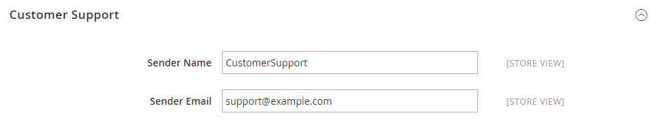

# [!UICONTROL General] > [!UICONTROL Store Email Addresses]

{{config}}

Consulta [Memorizza indirizzi e-mail](../../getting-started/store-details.md#store-email-addresses) per informazioni dettagliate su questi campi e opzioni di configurazione.

## [!UICONTROL General Contact]

<!-- zoom -->

| Campo | [Ambito](../../getting-started/websites-stores-views.md#scope-settings) | Descrizione |
|--- |--- |--- |
| [!UICONTROL Sender Name] | Visualizzazione store | Il nome visualizzato come mittente dell’e-mail inviata da `General Contact` identità. |
| [!UICONTROL Sender Email] | Visualizzazione store | L&#39;indirizzo e-mail associato al `General Contact` identità. |

{style="table-layout:auto"}

## [!UICONTROL Sales Representative]

<!-- zoom -->

| Campo | [Ambito](../../getting-started/websites-stores-views.md#scope-settings) | Descrizione |
|--- |--- |--- |
| [!UICONTROL Sender Name] | Visualizzazione store | Il nome visualizzato come mittente dell’e-mail inviata da `Sales Representative` identità. |
| [!UICONTROL Sender Email] | Visualizzazione store | L&#39;indirizzo e-mail associato al `Sales Representative` identità. |

{style="table-layout:auto"}

## [!UICONTROL Customer Support]

<!-- zoom -->

| Campo | [Ambito](../../getting-started/websites-stores-views.md#scope-settings) | Descrizione |
|--- |--- |--- |
| [!UICONTROL Sender Name] | Visualizzazione store | Il nome visualizzato come mittente dell’e-mail inviata da `Customer Support` identità. |
| [!UICONTROL Sender Email] | Visualizzazione store | L&#39;indirizzo e-mail associato al `Customer Support` identità. |

{style="table-layout:auto"}

## E-mail personalizzata 1

<!-- zoom -->

| Campo | [Ambito](../../getting-started/websites-stores-views.md#scope-settings) | Descrizione |
|--- |--- |--- |
| [!UICONTROL Sender Name] | Visualizzazione store | Il nome visualizzato come mittente dell’e-mail inviata da `Custom 1` identità. |
| [!UICONTROL Sender Email] | Visualizzazione store | L&#39;indirizzo e-mail associato al `Custom 1` identità. |

{style="table-layout:auto"}

## E-mail personalizzata 2

<!-- zoom -->

| Campo | [Ambito](../../getting-started/websites-stores-views.md#scope-settings) | Descrizione |
|--- |--- |--- |
| [!UICONTROL Sender Name] | Visualizzazione store | Il nome visualizzato come mittente dell’e-mail inviata da `Custom 2` identità. |
| [!UICONTROL Sender Email] | Visualizzazione store | L&#39;indirizzo e-mail associato al `Custom 2` identità. |

{style="table-layout:auto"}
