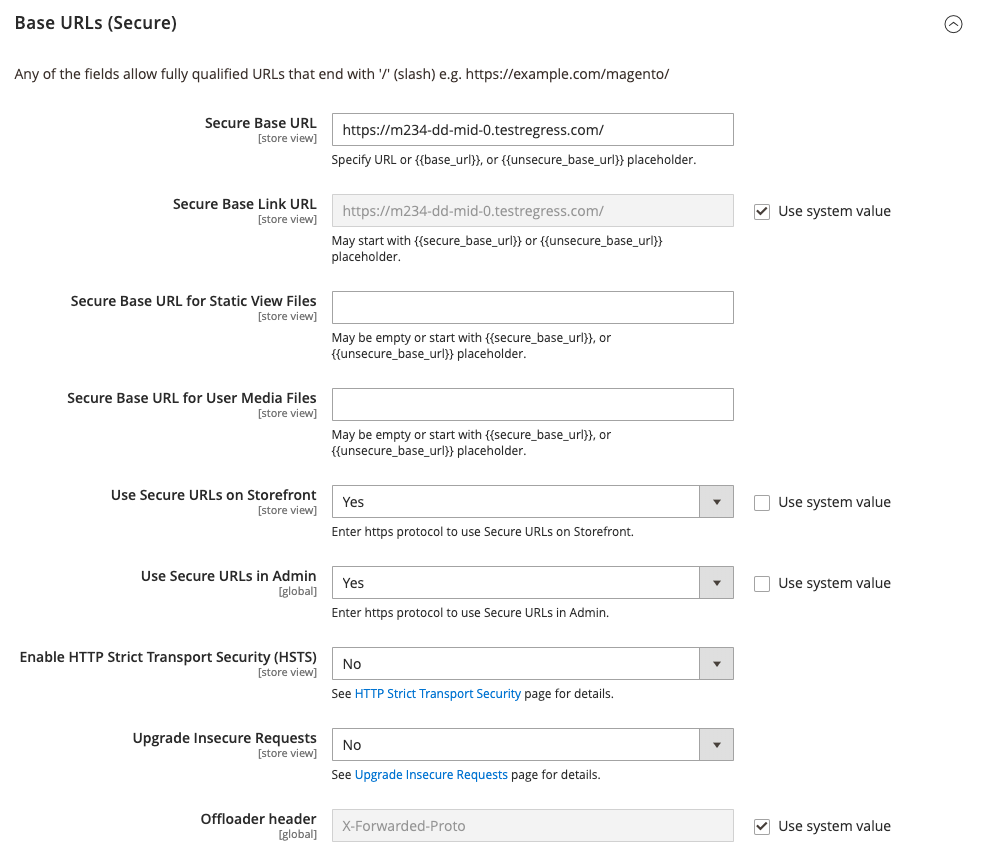

# [!UICONTROL General] > [!UICONTROL Web]

{{config}}

## [!UICONTROL URL Options]

<!-- zoom -->

<!-- [URL Options configuration settings](https://experienceleague.adobe.com/it/docs/commerce-admin/stores-sales/site-store/store-urls) -->

| Campo | Ambito | Descrizione |
|  ---  |  ---  |  ---  |
| [!UICONTROL Add Store Code to URLs] | Globale | Se sono abilitate le riscritture del server Web, inserisce nell&#39;URL il codice store della visualizzazione corrente. Opzioni: `Yes` / `No`.  Quando questo campo è impostato su `Yes`, è necessario includere i codici di archivio negli URL del browser per assicurarsi che le riscritture degli URL siano mappate correttamente e che tutte le pagine siano aperte correttamente. Questo evita _404 errori di pagina non trovata_. |
| [!UICONTROL Auto-redirect to Base URL] | Visualizzazione store | (Per le impostazioni per un singolo archivio) Se sul sito è presente un collegamento interrotto, reindirizza il traffico all’URL di base anziché a una pagina con il messaggio &quot;404 Page Not Found&quot; (Pagina 404 non trovata). Opzioni:` No` / `Yes (302 Found)` / `Yes (301 Moved Permanently)`  **_Importante:_**&#x200B;Non utilizzare il reindirizzamento automatico all&#39;URL di base per le impostazioni di più archivi. |
| [!UICONTROL Catalog media URL format] | Globale | Definisce il [formato URL](../../catalog/catalog-urls.md) assegnato ai prodotti e alle categorie. Opzioni: hash univoco per variante di immagine (modalità legacy) definisce il nome del file convertito come un valore hash univoco. L&#39;ottimizzazione immagine basata sui parametri di query definisce il processo [ottimizzazione immagine](../../content-design/media-gallery-image-optimization.md) in base ai parametri di query. |

{style="table-layout:auto"}

## [!UICONTROL Search Engine Optimization]

<!-- zoom -->

<!-- [Search Engine Optimization configuration settings](https://experienceleague.adobe.com/it/docs/commerce-admin/marketing/seo/url-rewrites/url-rewrite) -->

| Campo | [Ambito](../../getting-started/websites-stores-views.md#scope-settings) | Descrizione |
|--- |--- |--- |
| [!UICONTROL Use Web Server Rewrites] | Visualizzazione store | I sistemi basati su PHP in genere includono un file denominato `index.php` nella cartella principale. Per impostazione predefinita, il nome del file viene visualizzato nell’URL subito dopo il nome della cartella principale. Quando questa opzione è attivata, il sistema omette `index.php` dall&#39;URL. Questa best practice sull’usabilità rende ogni URL più conciso e non ha alcun impatto sulle prestazioni o sulla classificazione del sito. Opzioni: `Yes` / `No` |

{style="table-layout:auto"}

## [!UICONTROL Base URLs]

<!-- zoom -->

<!-- [Base URLS configuration settings](https://experienceleague.adobe.com/it/docs/commerce-admin/stores-sales/site-store/store-urls) -->

| Campo | [Ambito](../../getting-started/websites-stores-views.md#scope-settings) | Descrizione |
|--- |--- |--- |
| [!UICONTROL Base URL] | Visualizzazione store | Indirizzo completo della cartella principale di Commerce che non viene eseguita su un canale crittografato (SSL). L’URL deve terminare con una barra. |
| [!UICONTROL Base Link URL] | Visualizzazione store | Tag di markup utilizzato come segnaposto per l&#39;URL di base. |
| [!UICONTROL Base URL for Static View Files] | Visualizzazione store | Percorso che punta alla posizione dei file statici utilizzati dal tema, ad esempio css, font, immagini e JavaScript. Un segnaposto viene utilizzato per rappresentare l’URL di base. Se nell&#39;installazione di Commerce sono presenti più siti con la stessa struttura di cartelle, è possibile creare una cartella diversa per ogni sito. Impostare l&#39;ambito di configurazione sul sito corretto prima di immettere l&#39;URL di base per i file di visualizzazione statica. È inoltre possibile specificare una cartella all&#39;esterno dell&#39;installazione di Commerce. |
| [!UICONTROL Base URL for User Media Files] | Visualizzazione store | Percorso che punta alla posizione delle immagini del catalogo e di altri file multimediali. Un segnaposto viene utilizzato per rappresentare l’URL di base. Se nell&#39;installazione di Commerce sono presenti più siti con la stessa struttura di cartelle, è possibile utilizzare una cartella multimediale diversa per ognuno di essi. In questo modo è possibile eseguire separatamente il backup e il rollback di ogni cartella multimediale. È inoltre possibile specificare una cartella dei supporti al di fuori dell&#39;installazione di Commerce. |

{style="table-layout:auto"}

## [!UICONTROL Base URLs (Secure)]

<!-- zoom -->

<!-- [Base URLs (Secure) configuration settings](https://experienceleague.adobe.com/it/docs/commerce-admin/stores-sales/site-store/store-urls) -->

| Campo | [Ambito](../../getting-started/websites-stores-views.md#scope-settings) | Descrizione |
|--- |--- |--- |
| [!UICONTROL Secure Base URL] | Visualizzazione store | Indirizzo completo della cartella principale di Commerce fornita con il protocollo crittografato protetto (SSL/TLS). L’URL deve terminare con una barra. |
| [!UICONTROL Secure Base Link URL] | Visualizzazione store | Tag di markup utilizzato come segnaposto per l&#39;URL di base eseguito su un canale sicuro. |
| [!UICONTROL Secure Base URL for Static View Files] | Visualizzazione store | Tag di markup che punta alla posizione di file statici quali CSS, font, immagini e JavaScript utilizzati dal tema. I file possono trovarsi su un canale non sicuro o protetto. Se nell&#39;installazione di Commerce sono presenti più siti con la stessa struttura di cartelle, è possibile creare una cartella diversa per ogni sito. Impostare l&#39;ambito di configurazione sul sito corretto prima di immettere l&#39;URL di base per i file di visualizzazione statica. È inoltre possibile specificare una cartella all&#39;esterno dell&#39;installazione di Commerce. |
| [!UICONTROL Secure Base URL for User Media Files] | Visualizzazione store | Percorso che punta alla posizione delle immagini del catalogo e di altri file multimediali. I file possono trovarsi su un canale non sicuro o protetto. Un segnaposto viene utilizzato per rappresentare l’URL di base. Se nell&#39;installazione di Commerce sono presenti più siti con la stessa struttura di cartelle, è possibile utilizzare una cartella multimediale diversa per ognuno di essi. In questo modo è possibile eseguire separatamente il backup e il rollback di ogni cartella multimediale. È inoltre possibile specificare una cartella dei supporti al di fuori dell&#39;installazione di Commerce. |
| [!UICONTROL Use Secure URLs on Storefront] | Visualizzazione store | Se il dominio dispone di un certificato di sicurezza, puoi scegliere di eseguire la vetrina, con o senza crittografia SSL. Opzioni: **`Yes`**- Gli URL dell&#39;archivio iniziano con `https` per indicare che la pagina viene consegnata con un protocollo crittografato e sicuro. **`No`** - Gli URL dell&#39;archivio iniziano con `http` per indicare che la pagina viene consegnata senza protocollo sicuro. |
| [!UICONTROL Use Secure URLs in Admin] | Globale | Se il dominio dispone di un certificato di sicurezza, puoi scegliere di eseguire l’amministrazione dello store, con o senza crittografia SSL. Opzioni:  **`Yes`**- Gli URL dell&#39;amministratore iniziano con `https` per indicare che la pagina viene consegnata con un protocollo crittografato e sicuro. **`No`** - Gli URL dell&#39;amministratore iniziano con `http` per indicare che la pagina viene consegnata senza protocollo sicuro.  Quando gli URL protetti sono abilitati sia per l&#39;archivio che per l&#39;amministratore, vengono visualizzati due campi aggiuntivi per abilitare e configurare `HSTS`. |
| [!UICONTROL Enable HTTP Strict Transport Security (HSTS)] | Visualizzazione store | Se attivato, [`HSTS`][1] fornisce una misura di sicurezza contro gli attacchi &quot;man in the middle&quot; e impedisce agli utenti di ignorare il messaggio &quot;invalid certificate&quot;. Opzioni: `Yes` / `No` |
| [!UICONTROL Upgrade Insecure Requests] | Visualizzazione store | Quando questa opzione è attivata, converte le richieste non sicure (`HTTP`) ricevute dal browser nel protocollo protetto (`HTTPS`). Opzioni: `Yes` / `No` |
| [!UICONTROL Offloader Header] | Globale | Specifica il valore `offloader_header` nella configurazione del server per identificare il protocollo tra il client e il load balancer. La maggior parte delle installazioni di Commerce utilizza il valore predefinito `X-Forwarded-Proto` (XFP) per identificare il protocollo come `HTTP` o `HTTPS`. |

{style="table-layout:auto"}

## [!UICONTROL Default Pages]

<!-- zoom -->

<!-- [Default Pages configuration settings](https://experienceleague.adobe.com/it/docs/commerce-admin/content-design/elements/pages/pages#configure-default-pages) -->

| Campo | [Ambito](../../getting-started/websites-stores-views.md#scope-settings) | Descrizione |
|--- |--- |--- |
| [!UICONTROL Default Web URL] | Visualizzazione store | Indica la pagina di destinazione associata all’URL di base. Per impostazione predefinita, questo valore è impostato su &quot;cms&quot; per indicare una pagina del sistema di gestione dei contenuti di Commerce (CMS). Puoi anche utilizzare un tipo diverso di pagina di destinazione, ad esempio un blog. Se ad esempio nel server di `magento/blog` è installato un blog, è possibile immettere il nome della cartella &quot;blog&quot; come percorso relativo per la selezione delle pagine. |
| [!UICONTROL CMS Home Page] | Visualizzazione store | Per scegliere la home page del negozio, è sufficiente selezionare la pagina CMS dall&#39;elenco. Per impostazione predefinita, la home page di CMS elenca l&#39;intera selezione di pagine CMS disponibili per lo store. |
| [!UICONTROL Default No-route URL] | Visualizzazione store | Contiene l&#39;URL della pagina predefinita da visualizzare quando si verifica un errore `404 Page not Found`. Il valore predefinito è `cms/noroute/index`. |
| [!UICONTROL CMS No Route Page] | Visualizzazione store | Identifica una pagina CMS specifica che si desidera visualizzare quando si verifica un errore Pagina 404 non trovata. La pagina predefinita è 404 Non trovato. |
| [!UICONTROL CMS No Cookies Page] | Visualizzazione store | Identifica una pagina CMS specifica che viene visualizzata quando i cookie non sono abilitati per il browser. La pagina spiega perché vengono utilizzati i cookie e come abilitarli per ogni browser. La pagina predefinita è Abilita cookie. |
| [!UICONTROL Show Breadcrumbs for CMS Pages] | Visualizzazione store | Determina se un percorso di breadcrumb viene visualizzato in tutte le pagine CMS del catalogo. Opzioni: `Yes` / `No` |

{style="table-layout:auto"}

## [!UICONTROL Default Layouts]

<!-- zoom -->

<!--[Default Layouts](https://experienceleague.adobe.com/it/docs/commerce-admin/content-design/design/layout/page-layout) -->

| Campo | [Ambito](../../getting-started/websites-stores-views.md#scope-settings) | Descrizione |
|--- |--- |--- |
| [!UICONTROL Default Product Layout] | Globale | Determina il [layout](../../content-design/page-layout.md) utilizzato per impostazione predefinita per le pagine di prodotti. Opzioni:  **`No layout updates`**- Per impostazione predefinita, gli aggiornamenti del layout non sono disponibili per le pagine dei prodotti. **`Empty`** - Per impostazione predefinita, utilizza un layout vuoto per le pagine dei prodotti.  **`1 column`**- Per impostazione predefinita, utilizza un layout a colonna singola per le pagine di prodotto. **`2 columns with left bar`** - Per impostazione predefinita, utilizza un layout a due colonne con barra laterale a sinistra per le pagine di prodotti.  **`2 columns with right bar`**- Per impostazione predefinita, utilizza un layout a due colonne con barra laterale a destra per le pagine di prodotti. **`3 columns`** - Per impostazione predefinita, utilizza un layout a tre colonne con barre laterali a sinistra e a destra per le pagine di prodotti. **`Page -- Full Width`**- (Richiede [!DNL Page Builder]) Per impostazione predefinita, utilizza il layout Pagina - Larghezza intera per le pagine di prodotto. **`Category - Full Width`** - (Richiede [!DNL Page Builder]) Per impostazione predefinita, utilizza il layout Categoria - Larghezza intera per le pagine dei prodotti.  **`Product - Full Width`**- (Richiede [!DNL Page Builder]) Per impostazione predefinita, utilizza il layout Prodotto - Larghezza intera per le pagine di prodotto. |
| [!UICONTROL Default Category Layout] | Globale | Determina il [layout](../../content-design/page-layout.md) utilizzato per impostazione predefinita per le pagine delle categorie. Opzioni:  **`No layout updates`**- Per impostazione predefinita, gli aggiornamenti del layout non sono disponibili per le pagine delle categorie. **`Empty`** - Per impostazione predefinita, utilizza un layout vuoto per le pagine delle categorie.  **`1 column`**- Per impostazione predefinita, utilizza un layout a colonna singola per le pagine delle categorie. **`2 columns with left bar`** - Per impostazione predefinita, utilizza un layout a due colonne con barra laterale a sinistra per le pagine delle categorie.  **`2 columns with right bar`**- Per impostazione predefinita, utilizza un layout a due colonne con barra laterale a destra per le pagine delle categorie. **`3 columns`** - Per impostazione predefinita, utilizza un layout a tre colonne con barre laterali a sinistra e a destra per le pagine delle categorie. **`Page - Full Width`**- (Richiede [!DNL Page Builder]) Per impostazione predefinita, utilizza il layout Pagina - Larghezza intera per le pagine delle categorie. **`Category - Full Width`** - (Richiede [!DNL Page Builder]) Per impostazione predefinita, utilizza il layout Categoria - Larghezza intera per le pagine delle categorie.  **`Product - Full Width`**- (Richiede [!DNL Page Builder]) Per impostazione predefinita, utilizza il layout Prodotto - Larghezza intera per le pagine delle categorie. |
| Layout di pagina predefinito | Globale | Determina il [layout](../../content-design/page-layout.md) utilizzato per impostazione predefinita per le pagine CMS. Opzioni:  **`No layout updates`**- Per impostazione predefinita, gli aggiornamenti del layout non sono disponibili per le pagine CMS. **`Empty`** - Per impostazione predefinita, utilizza un layout vuoto per le pagine CMS.  **`1 column`**- Per impostazione predefinita, utilizza un layout a colonna singola per le pagine CMS. **`2 columns with left bar`** - Per impostazione predefinita, utilizza un layout a due colonne con la barra laterale a sinistra per le pagine CMS. **`2 columns with right bar`**- Per impostazione predefinita, utilizza un layout a due colonne con la barra laterale a destra per le pagine CMS. **`3 columns`** - Per impostazione predefinita, utilizza un layout a tre colonne con barre laterali a sinistra e a destra per le pagine CMS. **`Page - Full Width`**- (Richiede [!UICONTROL Page Builder]) Per impostazione predefinita, utilizza il layout Pagina - Larghezza intera per le pagine CMS. **`Category - Full Width`** - (Richiede [!UICONTROL Page Builder]) Per impostazione predefinita, utilizza il layout Categoria - Larghezza intera per le pagine CMS.  **`Product - Full Width`**- (Richiede [!DNL Page Builder]) Per impostazione predefinita, utilizza il layout Prodotto - Larghezza intera per le pagine CMS. |

{style="table-layout:auto"}

## [!UICONTROL Default Cookie Settings]

<!-- zoom -->

<!-- [Default Cookie configuration settings](https://experienceleague.adobe.com/it/docs/commerce-admin/start/compliance/privacy/compliance-cookie-law) -->

| Campo | [Ambito](../../getting-started/websites-stores-views.md#scope-settings) | Descrizione |
|--- |--- |--- |
| [!UICONTROL Cookie Lifetime] | Visualizzazione store | Determina per quanto tempo un cookie può esistere prima che venga eliminato automaticamente. Il valore predefinito è 3600 secondi (1 ora) |
| [!UICONTROL Cookie Path] | Visualizzazione store | Specifica le cartelle sul server in cui è possibile utilizzare i cookie di Commerce. Per rendere i cookie di Commerce disponibili ovunque nell&#39;installazione, impostare il percorso del cookie su una singola barra: `/`. Questo valore può contenere solo il percorso del cookie e **_non può_** contenere altri parametri del cookie. |
| [!UICONTROL Cookie Domain] | Visualizzazione store | Determina se i cookie di Commerce sono disponibili per i sottodomini. Ad esempio, per supportare `mysubdomain`.domain.com, immetti il nome del dominio con un punto all&#39;inizio, come `.domain.com`. Questo valore può contenere solo il dominio del cookie e **_non può_** contenere altri parametri del cookie. |
| [!UICONTROL Use HTTP Only] | Visualizzazione store | Determina se i cookie Commerce possono essere utilizzati solo su un canale non sicuro (http) o su un canale crittografato (https). Opzioni: `Yes` / `No` |
| [!UICONTROL Cookie Restriction Mode] | Sito Web | Determina se la modalità di restrizione dei cookie è abilitata. Opzioni: `Yes` / `No` |

{style="table-layout:auto"}

## [!UICONTROL Session Validation Settings]

<!-- zoom -->

<!-- [Session Validation configuration settings](https://experienceleague.adobe.com/it/docs/commerce-admin/systems/security/security-session-management#session-validation) -->

| Campo | [Ambito](../../getting-started/websites-stores-views.md#scope-settings) | Descrizione |
|--- |--- |--- |
| [!UICONTROL Validate REMOTE_ADDR] | Globale | Verifica che l&#39;indirizzo IP di una richiesta corrisponda ai dati `$_SESSION`. La sessione termina se viene rilevato un indirizzo IP diverso. Opzioni: `Yes` / `No` |
| [!UICONTROL Validate HTTP_VIA] | Globale | Verifica i dati proxy in arrivo e verifica che l&#39;indirizzo proxy di una richiesta corrisponda ai dati `$_SESSION`. La sessione termina se viene rilevato un indirizzo proxy diverso. Opzioni: `Yes` / `No` |
| [!UICONTROL Validate HTTP_x_FORWARDED_FOR] | Globale | Verifica i dati proxy in uscita e verifica che l&#39;indirizzo inoltrato di una richiesta corrisponda ai dati `$_SESSION`. La sessione termina se viene rilevato un indirizzo inoltrato diverso. Opzioni: `Yes` / `No` |
| [!UICONTROL Validate HTTP_USER_AGENT] | Globale | `USER_AGENT` fa riferimento al browser o al dispositivo utilizzato per accedere al sito Web. Verifica che il nome e la versione del browser e del sistema operativo corrispondano ai dati di `$_SESSION`. La sessione termina se viene rilevato un agente utente diverso da una richiesta a un’altra nella stessa sessione. Opzioni: `Yes` / `No` |

{style="table-layout:auto"}

## [!UICONTROL Browser Capabilities Detection]

<!-- zoom -->

<!-- [Browser Capabilities Detection configuration settings](https://experienceleague.adobe.com/it/docs/commerce-admin/systems/security/security-browser-capabilities-detection) -->

| Campo | [Ambito](../../getting-started/websites-stores-views.md#scope-settings) | Descrizione |
|--- |--- |--- |
| [!UICONTROL Redirect to CMS-page if Cookies are Disabled] | Visualizzazione store | Se i cookie sono disabilitati dal browser, viene automaticamente reindirizzato alla pagina CMS Nessun cookie. Opzioni: `Yes` / `No` |
| [!UICONTROL Show Notice if JavaScript is Disabled] | Visualizzazione store | Se JavaScript è disabilitato dal browser, viene visualizzato un avviso che richiede all&#39;utente di abilitare le opzioni di JavaScript: `Yes` / `No` (disabilita) |
| [!UICONTROL Show Notice if Local Storage is Disabled] | Visualizzazione store | Visualizza un messaggio se la cache locale è disabilitata. Opzioni: `Yes` / `No` |

{style="table-layout:auto"}

[1]: https://cheatsheetseries.owasp.org/cheatsheets/HTTP_Strict_Transport_Security_Cheat_Sheet.html
