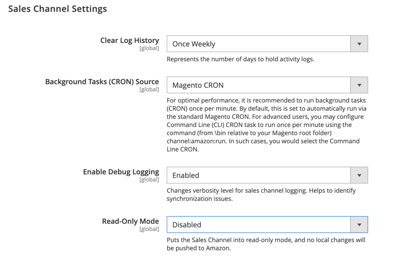

# [!UICONTROL Sales Channels] > [!UICONTROL Global Settings]

{{config}}

Queste impostazioni sono disponibili quando [[!DNL Amazon Sales Channel]](https://experienceleague.adobe.com/docs/commerce-channels/amazon/getting-started/install.html) è installato.

<!-- zoom -->

| Campo | [Ambito](../getting-started/websites-stores-views.md#scope-settings) | Descrizione |
|-----|---------|------|
| [!UICONTROL Clear Log History] | Globale | Opzioni:  **`Once Daily`**: selezionare questa opzione per cancellare la cronologia delle attività dello store una volta al giorno.  **`Once Weekly`**: selezionare questa opzione per cancellare la cronologia delle attività dello store una volta alla settimana.  **`Once Monthly`**: (predefinito) seleziona questa opzione per cancellare la cronologia delle attività del tuo Negozio una volta al mese. |
| [!UICONTROL Background Tasks (CRON) Source] | Globale | Selezionare `Magento CRON` per specificare che [!DNL Amazon Sales Channel] utilizza le impostazioni cron di Commerce per determinare gli intervalli di sincronizzazione delle comunicazioni e dei dati con Amazon Seller Central. |
| [!UICONTROL Enable Debug Logging] | Globale | Selezionare `Enabled` per raccogliere ulteriori dati di sincronizzazione quando è necessaria la risoluzione dei problemi.  Questa opzione è disabilitata per impostazione predefinita e dovrebbe essere abilitata solo quando necessario per la risoluzione dei problemi, in quanto la registrazione continua influisce negativamente sulle prestazioni. Se questa opzione è abilitata per la risoluzione dei problemi, deve essere disabilitata al termine. |
| [!UICONTROL Read-Only Mode] | Globale | Selezionare `Enabled` per bloccare tutte le richieste API in uscita per la modifica dello stato. Le modifiche potenziali vengono salvate ma non inviate finché non viene disattivata la modalità di sola lettura. Per riavviare i trasferimenti di dati, selezionare `Disabled`.  Quando si esegue la migrazione di un database a una nuova copia dell&#39;istanza (rilevata quando l&#39;URL di un archivio cambia nella configurazione), viene attivata automaticamente la modalità di sola lettura.  Questo è progettato per l&#39;utilizzo su copie dell&#39;istanza di produzione, come _Staging_ o _QA_, e non deve essere utilizzato nell&#39;istanza di produzione.  **_Nota _**: per abilitare [!UICONTROL Read-Only Mode], è necessario cancellare la cache di configurazione. |

{style="table-layout:auto"}
