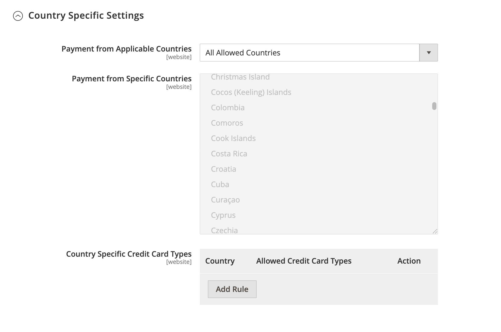
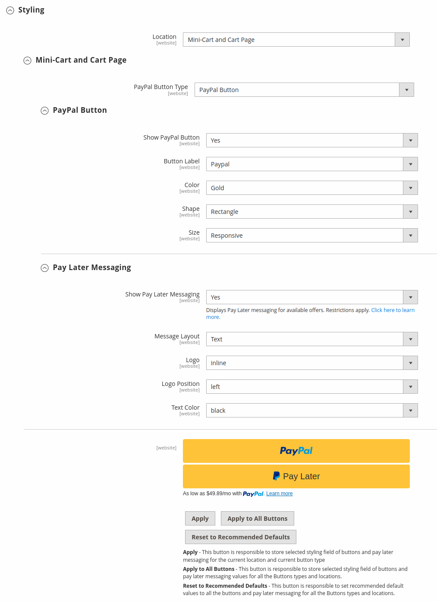
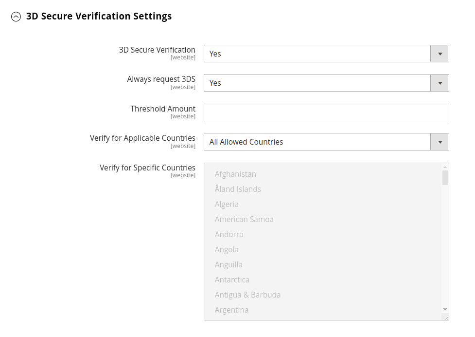

# [!UICONTROL Sales] > [!UICONTROL Payment Methods] > [!UICONTROL Braintree]

>[!IMPORTANT]
>
>**Migrazione a Commerce 2.4:** 
>Per le versioni di Adobe Commerce e Magento Open Source precedenti alla 2.4.0, si consigliava agli esercenti di installare e configurare l’estensione ufficiale per l’integrazione dei pagamenti di Braintree dal file [Commerce Marketplace](https://marketplace.magento.com/catalogsearch/result/?q=braintree) per sostituire l’integrazione core. A partire dalla versione 2.4.0, l’estensione è ora inclusa nella versione core.
>  
>Durante la migrazione a Commerce 2.4, i commercianti devono disinstallare l’estensione distribuita sul Marketplace (`paypal/module-braintree` o `gene/module-braintree`) e aggiorna tutte le personalizzazioni del codice per utilizzare `PayPal_Braintree` spazio dei nomi anziché `Magento_Braintree`. Le impostazioni di configurazione dell’estensione inclusa per Commerce e dell’estensione distribuita sulla Commerce Marketplace vengono mantenute. I pagamenti inseriti con tali versioni dell&#39;estensione vengono acquisiti, annullati o rimborsati come di consueto.
>  
>Se stai eseguendo l’aggiornamento a Commerce 2.4.0 e non utilizzi l’estensione Commerce Marketplace consigliata nella versione 2.3.x precedente, la funzione con più indirizzi non funziona con la versione 2.4.0 di Braintree. Quando un acquirente seleziona _consegna a più indirizzi_ , il metodo di pagamento della Braintree non viene visualizzato. L’estensione Commerci Marketplace precedentemente consigliata per 2.3.x presenta questo problema relativo a più indirizzi.

{{config}}

## [!UICONTROL Basic Braintree Settings]

<!-- zoom -->

| Campo | [Ambito](../../getting-started/websites-stores-views.md#scope-settings) | Descrizione |
|--- |--- |--- |
| [!UICONTROL Title] | Visualizzazione store | Valore predefinito: `Credit Card` (Braintree) |
| [!UICONTROL Environment] | Visualizzazione store | Opzioni: `Sandbox` / `Production` |
| [!UICONTROL Payment Action] | Visualizzazione store | Determina l&#39;azione eseguita dalla Braintree durante l&#39;elaborazione di un pagamento. Opzioni:  **`Authorize`**- I fondi sulla carta di credito del cliente sono autorizzati, ma non trasferiti dal conto. Viene creato un ordine nell’amministratore del negozio. In seguito sarà possibile acquisire la vendita e creare una fattura. **`Intent Sale`** (in precedenza `Authorize and Capture` nelle versioni precedenti) - I fondi sulla carta di credito del cliente vengono autorizzati e acquisiti per Braintree e vengono creati un ordine e una fattura nell&#39;amministratore del negozio. |
| [!UICONTROL Sandbox Merchant ID] | Visualizzazione store | Questo è l’identificatore univoco dell’intero account gateway sandbox. Noto anche come _ID pubblico_ o _ID produzione_, l’ID esercente è diverso per i gateway di produzione e sandbox. Questo campo viene visualizzato quando _[!UICONTROL Environment]_è impostato su `Sandbox`. |
| [!UICONTROL Sandbox Public Key] | Visualizzazione store | Questo è l&#39;identificatore pubblico specifico dell&#39;utente che limita l&#39;accesso ai dati crittografati. Ogni utente associato al gateway di Braintree sandbox dispone di una propria chiave pubblica sandbox. Questo campo viene visualizzato quando _[!UICONTROL Environment]_è impostato su `Sandbox`. |
| [!UICONTROL Sandbox Private Key] | Visualizzazione store | Si tratta dell&#39;identificatore privato specifico dell&#39;utente che limita l&#39;accesso ai dati crittografati. Ogni utente associato al gateway Braintree Sandbox dispone di una propria chiave privata per la sandbox. Questo campo viene visualizzato quando _[!UICONTROL Environment]_è impostato su `Sandbox`. |
| [!UICONTROL Merchant ID] | Visualizzazione store | Questo è l’identificatore univoco dell’intero account gateway, inclusi i diversi account esercente eventualmente presenti nel gateway. Noto anche come _ID pubblico_ o _ID produzione_, l’ID esercente è diverso per i gateway di produzione e sandbox. Questo campo viene visualizzato quando _[!UICONTROL Environment]_è impostato su `Production`. |
| [!UICONTROL Public Key] | Visualizzazione store | Questo è l&#39;identificatore pubblico specifico dell&#39;utente che limita l&#39;accesso ai dati crittografati. Ogni utente associato al gateway Braintree dispone di una propria chiave pubblica. Questo campo viene visualizzato quando _[!UICONTROL Environment]_è impostato su `Production`. |
| [!UICONTROL Private Key] | Visualizzazione store | Si tratta dell&#39;identificatore privato specifico dell&#39;utente che limita l&#39;accesso ai dati crittografati. Ogni utente associato al gateway Braintree dispone di una propria chiave privata. Questo campo viene visualizzato quando _[!UICONTROL Environment]_è impostato su `Production`. |
| [!UICONTROL Enable Card Payments] | Sito Web | Determina se il metodo di pagamento con carta di credito Braintree è disponibile per i clienti come metodo di pagamento. Opzioni: `Yes` / `No` |
| [!UICONTROL Enable Vault for Card Payments] | Sito Web | Quando questa opzione è abilitata, consente di memorizzare in modo sicuro le informazioni relative al pagamento del cliente, evitando così che i clienti debbano reinserire le informazioni sulla carta di credito per ogni acquisto. Opzioni: `Yes` / `No` |
| [!UICONTROL Enable Vault CVV Reverification] | Sito Web | Quando questa opzione è abilitata, la convalida viene eseguita per l’impostazione delle regole del CVV nell’account Braintree. Opzioni: `Yes` / `No` |

{style="table-layout:auto"}

## [!UICONTROL Advanced Braintree Settings]

{width="550" zoomable="yes"}

| Campo | [Ambito](../../getting-started/websites-stores-views.md#scope-settings) | Descrizione |
|--- |--- |--- |
| [!UICONTROL Vault Title] | Sito Web | Titolo descrittivo per il riferimento che identifica l&#39;archivio in cui sono memorizzate le informazioni sulla scheda del cliente. |
| [!UICONTROL Merchant Account ID] | Sito Web | ID dell&#39;account esercente da associare alle transazioni di Braintree da questo sito Web. Se non specificato, viene utilizzato l&#39;account commerciante predefinito del tuo account di Braintree. |
| [!UICONTROL Enable Checkout Express Payments] | Sito Web | Fornisce un&#39;esperienza di pagamento più rapida con le opzioni di pagamento rapido all&#39;inizio del processo di pagamento, tra cui PayPal, PayLater, Apple Pay e Google Pay. Opzioni: `Yes` / `No` |
| [!UICONTROL Skip Fraud Checks on Admin Orders] | Sito Web | Impedisce l&#39;invio della transazione per la valutazione come parte di [!DNL Advanced Fraud Tools] assegni, sugli ordini effettuati tramite l’amministratore solo quando è impostato su `Yes`. Opzioni: `Yes` / `No` |
| [!UICONTROL Bypass Fraud Protection Threshold] | Sito Web | `Advanced Fraud Protection` i controlli vengono ignorati quando il valore di soglia viene raggiunto o superato. Se si lascia vuoto questo campo, questa opzione viene disabilitata. |
| [!UICONTROL Debug] | Sito Web | Determina se le comunicazioni tra il sistema di Braintree e l&#39;archivio vengono registrate in un file di registro. Opzioni: `Yes` / `No` |
| [!UICONTROL CVV Verification] | Sito Web | Determina se i clienti devono fornire il codice di sicurezza a tre cifre dal retro di una carta di credito. Opzioni: `Yes` / `No` |
| [!UICONTROL Send Card Line Items] | Sito Web | Invia le righe del carrello per tutti i metodi di pagamento. Opzioni: `Yes` / `No` |
| [!UICONTROL Credit Card Types] | Sito Web | Specifica ogni carta di credito accettata come pagamento tramite Braintree. Premi e tieni premuto `Ctrl` (o `Command` su Mac) per selezionare una combinazione di schede. Opzioni: `American Express` / `Visa` / `MasterCard` / `Discover` / `JCB` / `Diners` / `Maestro International` |
| [!UICONTROL Sort Order] | Sito Web | Determina l&#39;ordine in cui la Braintree viene elencata con altri metodi di pagamento durante il pagamento. |

## [!UICONTROL Braintree Webhooks Settings]

<!-- zoom -->

| Campo | [Ambito](../../getting-started/websites-stores-views.md#scope-settings) | Descrizione |
|--- |--- |--- |
| [!UICONTROL Enable Webhook] | Sito Web | Per abilitare la funzionalità webhook per la protezione dalle frodi, i pagamenti ACH, i metodi di pagamento locali e le controversie. Opzioni: `Yes` / `No` |
| [!UICONTROL Fraud Protection URL] | Sito Web | Aggiungi questo URL nel tuo account di Braintree come [!UICONTROL Webhook Destination URL]. **Questo URL deve essere sicuro e accessibile al pubblico.** |
| [!UICONTROL Fraud Protection Approve Order Status] | Sito Web | Quando la protezione contro le frodi viene approvata per Braintree, lo stato dell’ordine selezionato viene assegnato all’ordine Commerce. Questo stato viene utilizzato per aggiornare lo stato dell&#39;ordine in cui viene utilizzato il metodo di pagamento ACH e quando si passa a `SETTLED` nella Braintree. |
| [!UICONTROL Fraud Protection Reject Order Status] | Sito Web | Quando la protezione contro le frodi viene rifiutata dalla Braintree, lo stato dell’ordine selezionato viene assegnato all’ordine Commerce. Questo stato viene utilizzato per aggiornare lo stato dell&#39;ordine in cui è utilizzato il metodo di pagamento ACH e quando `SETTLEMENT` è `DECLINED` nella Braintree. |

{style="table-layout:auto"}

## [!UICONTROL Country Specific Settings]

<!-- zoom -->

| Campo | [Ambito](../../getting-started/websites-stores-views.md#scope-settings) | Descrizione |
|--- |--- |--- |
| [!UICONTROL Payment from Applicable Countries] | Sito Web | Determina se si accettano pagamenti elaborati per Braintree da tutti i paesi o solo da paesi specifici. Opzioni: `All Allowed Countries` / `Specific Countries` |
| [!UICONTROL Payment from Specific Countries] | Sito Web | Se applicabile, identifica i paesi specifici da cui si accettano i pagamenti elaborati per Braintree. |
| [!UICONTROL Country Specific Credit Card Types] | Sito Web | Identifica le carte di credito accettate per paese per i pagamenti elaborati per Braintree. Viene salvato un record per ogni paese. Opzioni:  **`Country`**- Scegliere il paese. **`Allowed Card Types`** - Selezionare ogni carta di credito accettata dal paese come pagamento tramite Braintree.  **`Add`**- Aggiungi una riga per consentire le carte di credito per un altro paese. **`Action`** - Elimina il record delle carte di credito consentite per il paese. |

{style="table-layout:auto"}

## [!UICONTROL ACH through Braintree]

<!-- zoom -->

| Campo | [Ambito](../../getting-started/websites-stores-views.md#scope-settings) | Descrizione |
|--- |--- |--- |
| [!UICONTROL Enabled ACH Direct Debit] | Sito Web | Determina se [!DNL ACH Direct Debit] è incluso come metodo di pagamento tramite Braintree. Opzioni: `Yes` / `No` |
| [!UICONTROL Enable Vault for ACH Direct Debit] | Sito Web | I clienti possono archiviare il metodo di pagamento con addebito diretto ACH a uso singolo per utilizzi futuri. Una volta archiviati i dettagli del pagamento, il cliente può utilizzare il metodo di pagamento con addebito diretto ACH senza reimmettere i dati o autenticare le informazioni di pagamento. Opzioni: `Yes` / `No` |
| [!UICONTROL Sort Order] | Sito Web | Determina l’ordine che [!DNL ACH Direct Debit] è elencato con altri metodi di pagamento durante il pagamento. |

{style="table-layout:auto"}

## [!UICONTROL Apple Pay through Braintree]

<!-- zoom -->

| Campo | [Ambito](../../getting-started/websites-stores-views.md#scope-settings) | Descrizione |
|--- |--- |--- |
| [!UICONTROL Enable ApplePay through Braintree] | Sito Web | Determina se Apple Pay è incluso come metodo di pagamento tramite Braintree. Opzioni: `Yes` / `No`    Il dominio deve essere [verificato prima in Braintree account](https://developer.paypal.com/braintree/docs/guides/apple-pay/configuration/javascript/v3). |
| [!UICONTROL Enable Vault for ApplePay] | Sito Web | I clienti possono archiviare/archiviare il metodo di pagamento Apple Pay per utilizzi futuri. Una volta archiviati i dettagli del pagamento, il cliente può utilizzare Apple Pay senza reinserire i dati o autenticare le informazioni di pagamento. Opzioni: `Yes` / `No` |
| [!UICONTROL Payment Action] | Sito Web | Determina l&#39;azione eseguita dalla Braintree durante l&#39;elaborazione di un pagamento. Opzioni:  **`Authorize`**- I fondi sulla carta del cliente sono autorizzati, ma non trasferiti dal conto del cliente. Viene creato un ordine nell’amministratore del negozio. In seguito sarà possibile acquisire la vendita e creare una fattura. **`Intent Sale`** - I fondi sulla carta del cliente vengono autorizzati e acquisiti per Braintree e un ordine e una fattura vengono creati nell&#39;amministratore del negozio. **_Nota:_** Questo era `Authorize and Capture` nella versione 2.3.x e nelle versioni precedenti. |
| [!UICONTROL Merchant Name] | Visualizzazione store | Etichetta visualizzata ai clienti nel popup ApplePay. |
| [!UICONTROL Sort Order] | Sito Web | Determina l&#39;ordine in base al quale Apple Pay viene elencato con altri metodi di pagamento durante il pagamento. |

{style="table-layout:auto"}

## [!UICONTROL Local Payment Methods]

<!-- zoom -->

| Campo | [Ambito](../../getting-started/websites-stores-views.md#scope-settings) | Descrizione |
|--- |--- |--- |
| [!UICONTROL Enabled Local Payment Methods] | Sito Web | Determina se il metodo di pagamento locale è incluso come metodo di pagamento tramite Braintree. Opzioni: `Yes` / `No` |
| [!UICONTROL Title] | Sito Web | Etichetta visualizzata nella sezione relativa al metodo di pagamento del pagamento di pagamento. Valore predefinito: `Local Payments` |
| [!UICONTROL Fallback Button Text] | Sito Web | Inserisci il testo da utilizzare per il pulsante visualizzato nella pagina della Braintree di fallback che riporta i clienti al sito web. Valore predefinito: `Complete Checkout` |
| [!UICONTROL Redirect on Fail] | Sito Web | Specifica l&#39;URL a cui devono essere reindirizzati i clienti quando le transazioni del metodo di pagamento locale vengono annullate, non riuscite o rilevano errori. Deve essere la pagina di pagamento per l’estrazione (ad esempio, `https://www.domain.com/checkout#payment`). |
| [!UICONTROL Allowed Payment Method] | Sito Web | Selezionare il metodo di pagamento locale da abilitare. Opzioni: `Bancontact` / `EPS` / `giropay` / `iDeal` / `Klarna Pay Now` / `SOFORT` / `MyBank` / `P24` / `SEPA/ELV Direct Debit` (non ancora supportato) |
| [!UICONTROL Sort Order] | Sito Web | Determina l&#39;ordine in base al quale il metodo di pagamento locale viene elencato con altri metodi di pagamento durante l&#39;estrazione. |

{style="table-layout:auto"}

>[!NOTE]
>
>L&#39;estensione di Braintree in bundle non supporta tutti i metodi di pagamento locali elencati nel [Braintree documentazione per sviluppatori](https://developer.paypal.com/braintree/docs/guides/local-payment-methods/overview). Sono in fase di sviluppo altri metodi di pagamento locali, che saranno supportati nelle prossime versioni.

## [!UICONTROL GooglePay through Braintree]

<!-- zoom -->

| Campo | [Ambito](../../getting-started/websites-stores-views.md#scope-settings) | Descrizione |
|--- |--- |--- |
| [!UICONTROL Enabled GooglePay through Braintree] | Sito Web | Determina se [!DNL Google Pay] il pagamento è incluso come metodo di pagamento tramite Braintree. Opzioni: `Yes` / `No` |
| [!UICONTROL Enable Vault for GooglePay] | Sito Web | I clienti possono archiviare/archiviare il metodo di pagamento Google Pay per utilizzi futuri. Una volta archiviati i dettagli del pagamento, il cliente può utilizzare Google Pay senza reinserire i dati o autenticare le informazioni di pagamento. Opzioni: `Yes` / `No` |
| [!UICONTROL Payment Action] | Sito Web | Determina l&#39;azione eseguita dalla Braintree durante l&#39;elaborazione di un pagamento. Opzioni:  **`Authorize`**- I fondi sulla carta del cliente sono autorizzati, ma non trasferiti dal conto del cliente. Viene creato un ordine nell’amministratore del negozio. In seguito sarà possibile acquisire la vendita e creare una fattura. **`Intent Sale`** - I fondi sulla carta del cliente vengono autorizzati e acquisiti per Braintree e un ordine e una fattura vengono creati nell&#39;amministratore del negozio. **_Nota:_** Questo era `Authorize and Capture` nella versione 2.3.x e nelle versioni precedenti. |
| [!UICONTROL Button Color] | Sito Web | Determina il colore della [!DNL Google Pay] pulsante. Opzioni: `White` / `Black` |
| [!UICONTROL Merchant ID] | Visualizzazione store | L’ID fornito da Google deve essere inserito qui. |
| [!UICONTROL Accepted Cards] | Sito Web | Selezionare il tipo di schede che un cliente può utilizzare per effettuare l&#39;ordine utilizzando [!DNL Google Pay]. |
| [!UICONTROL Sort Order] | Sito Web | Determina l&#39;ordine in cui Google Pay viene elencato con altri metodi di pagamento durante il pagamento. |

{style="table-layout:auto"}

## [!UICONTROL Venmo through Braintree]

<!-- zoom -->

| Campo | [Ambito](../../getting-started/websites-stores-views.md#scope-settings) | Descrizione |
|--- |--- |--- |
| [!UICONTROL Enable Venmo through Braintree] | Sito Web | Determina se [!DNL Venmo] è incluso come metodo di pagamento tramite Braintree. Opzioni: `Yes` / `No` |
| [!UICONTROL Enable Vault for Venmo] | Sito Web | I clienti possono archiviare il metodo di pagamento Venmo per utilizzarlo in futuro. Una volta archiviati i dettagli del pagamento, il cliente può utilizzare il metodo di pagamento Venmo senza inserire nuovamente i dati o autenticare nuovamente le informazioni di pagamento. Opzioni: `Yes` / `No` |
| [!UICONTROL Payment Action] | Sito Web | Determina l&#39;azione eseguita dalla Braintree durante l&#39;elaborazione di un pagamento. Opzioni:  **`Authorize`**- I fondi sulla carta del cliente sono autorizzati, ma non trasferiti dal conto del cliente. Viene creato un ordine nell’amministratore del negozio. In seguito sarà possibile acquisire la vendita e creare una fattura. **`Intent Sale`** - I fondi sulla carta del cliente vengono autorizzati e acquisiti per Braintree e un ordine e una fattura vengono creati nell&#39;amministratore del negozio. **_Nota:_** Questo era  _Autorizza e acquisisci_ nella versione 2.3.x e nelle versioni precedenti. |
| [!UICONTROL Sort Order] | Sito Web | Determina l&#39;ordine in cui Venmo viene elencato con altri metodi di pagamento durante il pagamento. |

{style="table-layout:auto"}

## [!UICONTROL PayPal through Braintree]

{width="550" zoomable="yes"}

| Campo | [Ambito](../../getting-started/websites-stores-views.md#scope-settings) | Descrizione |
|--- |--- |--- |
| [!UICONTROL Enable PayPal through Braintree] | Sito Web | Determina se PayPal è incluso come metodo di pagamento tramite Braintree. Opzioni: `Yes` / `No` |
| [!UICONTROL Enable PayPal Credit through Braintree] | Sito Web | Determina se PayPal Credit è incluso come metodo di pagamento tramite Braintree. Opzioni: `Yes` / `No`. Questo campo diventa visibile quando `Enable PayPal through Braintree` è impostato su `Yes` |
| [!UICONTROL Enable PayPal PayLater through Braintree] | Sito Web | Determina se PayPal PayLater è incluso come metodo di pagamento tramite Braintree. Opzioni: `Yes` / `No`. Questo campo diventa visibile quando `Enable PayPal through Braintree` è impostato su `Yes` |
| [!UICONTROL Title] | Visualizzazione store | L&#39;etichetta che identifica PayPal tramite Braintree ai clienti durante il pagamento. Valore predefinito: `PayPal` |
| [!UICONTROL Vault Enabled] | Sito Web | Quando questa opzione è abilitata, fornisce un archivio sicuro per le informazioni di pagamento del cliente, in modo che i clienti non debbano inserire nuovamente le informazioni PayPal per ogni acquisto. Opzioni: `Yes` / `No` |
| [!UICONTROL Send Cart Line Items for PayPal] | Sito Web | Invia gli articoli della linea (articoli dell&#39;ordine) a PayPal insieme a Biglietti regalo, Confezione regalo per gli articoli, Confezione regalo per l&#39;ordine, Credito del negozio, Spedizione e Imposta come articoli della linea. Opzioni: `Yes` / `No` |
| [!UICONTROL Sort Order] | Sito Web | Numero che determina l&#39;ordine in cui PayPal tramite Braintree viene elencato con altri metodi di pagamento durante il pagamento. |
| [!UICONTROL Override Merchant Name] | Visualizzazione store | Nome alternativo che può essere utilizzato per identificare l&#39;esercente per ogni visualizzazione dello store. |
| [!UICONTROL Payment Action] | Sito Web | Determina l&#39;azione intrapresa da PayPal tramite Braintree quando viene elaborato un pagamento. Opzioni:  **`Authorize`**- I fondi sulla carta del cliente sono autorizzati, ma non trasferiti dal conto del cliente. Viene creato un ordine nell’amministratore del negozio. In seguito sarà possibile acquisire la vendita e creare una fattura. **`Authorize and Capture`** - I fondi sulla carta del cliente vengono autorizzati e acquisiti da PayPal tramite Braintree e un ordine e una fattura vengono creati nell&#39;amministratore del negozio. |
| [!UICONTROL Payment from Applicable Countries] | Sito Web | Determina se si accettano i pagamenti elaborati da PayPal tramite Braintree da tutti i paesi o solo da paesi specifici. Opzioni: `All Allowed Countries` / `Specific Countries` |
| [!UICONTROL Payment from Specific Countries] | Sito Web | Se applicabile, identifica i paesi specifici da cui si accettano i pagamenti elaborati per Braintree. |
| [!UICONTROL Require Customer's Billing Address] | Sito Web | Determina se l&#39;indirizzo di fatturazione del cliente è necessario per sottomettere un ordine. Opzioni: `Yes` / `No` |
| [!UICONTROL Debug] | Sito Web | Determina se le comunicazioni tra PayPal attraverso il sistema di Braintree e il tuo Negozio vengono registrate in un file di registro. Opzioni: `Yes` / `No` |
| [!UICONTROL Display on Shopping Cart] | Sito Web | Determina se il pulsante PayPal viene visualizzato nel [mini carrello](../../stores-purchase/cart-configuration.md#mini-cart) e il [carrello](../../stores-purchase/cart.md) pagina. Opzioni: `Yes` / `No` |

{style="table-layout:auto"}

>[!NOTE]
>
>o **[!DNL PayPal Credit]** o **[!DNL PayPal PayLater]** possono essere abilitati. Entrambi i metodi non possono essere attivati contemporaneamente.

### [!UICONTROL Styling]

<!-- zoom -->

| Campo | [Ambito](../../getting-started/websites-stores-views.md#scope-settings) | Descrizione |
|--- |--- |--- |
| [!UICONTROL Location] | Sito Web | Determina dove vengono riprodotti i pulsanti e i messaggi PayPal nella vetrina. Opzioni: `Mini-Cart and Cart Page` / `Checkout Page` / `Product Page` |

{style="table-layout:auto"}

**[!UICONTROL Mini-Cart and Cart Page]**

L&#39;opzione e le impostazioni in questa sezione variano a seconda dell&#39;impostazione in _[!UICONTROL Location]_campo.

| Campo | [Ambito](../../getting-started/websites-stores-views.md#scope-settings) | Descrizione |
|--- |--- |--- |
| [!UICONTROL PayPal Button Type] | Sito Web | Imposta il pulsante su uno dei tre tipi seguenti: `PayPal Button` / `PayPal Pay Later Button` / `PayPal Credit Button` |

**[!UICONTROL PayPal Button]**

Le opzioni e le impostazioni di questa sezione variano a seconda del tipo di pulsante selezionato nella _[!UICONTROL PayPal Button Type]_campo.

| Campo | [Ambito](../../getting-started/websites-stores-views.md#scope-settings) | Descrizione |
|--- |--- |--- |
| [!UICONTROL Show PayPal Button] | Sito Web | Determina la posizione del pulsante PayPal sull&#39;ubicazione selezionata. Opzioni: `Yes` / `No` |
| [!UICONTROL Button Label] | Sito Web | Determina l&#39;etichetta del pulsante PayPal. Opzioni: `Paypal` / `Checkout` / `Buy Now` / `Pay` |
| [!UICONTROL Color] | Sito Web | Determina il colore del pulsante PayPal. Opzioni: `Blue` / `Black` / `Gold` / `Silver` |
| [!UICONTROL Shape] | Sito Web | Determina la forma del pulsante PayPal. Opzioni: `Pill` / `Rectangle` |
| [!UICONTROL Size(Deprecated)] | Sito Web | Determina la dimensione del pulsante PayPal. Opzioni: `Medium` / `Large` / `Responsive` |

{style="table-layout:auto"}

>[!NOTE]
>
>Il **[!DNL Size(Deprecated)]** Il campo di configurazione è obsoleto e non viene utilizzato per assegnare uno stile ai pulsanti PayPal.

**[!UICONTROL PayLater Messaging]**

| Campo | [Ambito](../../getting-started/websites-stores-views.md#scope-settings) | Descrizione |
|--- |--- |--- |
| [!UICONTROL Show PayLater Messaging] | Sito Web | Abilita la messaggistica PayLater nella posizione selezionata. Opzioni: `Yes` / `No`. Quando questa opzione è attivata, viene visualizzato il messaggio PayLater per le offerte disponibili ([restrizioni applicate](https://developer.paypal.com/docs/checkout/pay-later/us/)). |
| [!UICONTROL Message Layout] | Sito Web | Determina il layout del messaggio PayLater. Opzioni: `Text` / `Flex` |
| [!UICONTROL Logo] | Sito Web | Determina il tipo di logo utilizzato per il pulsante PayPal. Opzioni: `Inline` / `Primary` / `Alternative` / `None` |
| [!UICONTROL Logo Position] | Sito Web | Determina la posizione del logo per il pulsante PayPal. Opzioni: `Left` / `Right` / `Top` |
| [!UICONTROL Text Color] | Sito Web | Determina il colore del testo del pulsante PayPal. Opzioni: `Black` / `White` / `Monochrome` / `Grayscale` |

{style="table-layout:auto"}

Quando queste opzioni sono impostate, puoi visualizzare l&#39;anteprima dei pulsanti PayPal e dei messaggi PayLater. Esistono controlli che è possibile utilizzare per applicare le impostazioni o reimpostare i valori:

| Campo | [Ambito](../../getting-started/websites-stores-views.md#scope-settings) | Descrizione |
|--- |--- |--- |
| [!UICONTROL Apply] | Sito Web | Memorizza le impostazioni di stile selezionate per i pulsanti e i messaggi PayLater e le applica alla posizione corrente e al tipo di pulsante corrente. |
| [!UICONTROL Apply to All Buttons] | Sito Web | Memorizza le impostazioni di stile selezionate per i pulsanti e i valori di messaggistica PayLater e le applica a tutti i tipi di pulsanti e a tutte le posizioni. |
| [!UICONTROL Reset to Recommended Defaults] | Sito Web | Restituisce le impostazioni di stile ai valori predefiniti consigliati per i pulsanti e i messaggi PayLater e li applica a tutti i tipi di pulsanti e a tutte le posizioni. |

{style="table-layout:auto"}

## Impostazioni di verifica 3d Secure

<!-- zoom -->

| Campo | [Ambito](../../getting-started/websites-stores-views.md#scope-settings) | Descrizione |
|--- |--- |--- |
| [!UICONTROL 3D Secure Verification] | Sito Web | Determina se una transazione deve superare un processo di verifica aggiuntivo quando il cliente è iscritto a un programma come _Verificato da VISA_. Opzioni: `Yes` / `No` |
| [!UICONTROL Always request 3DS] | Sito Web | Sfida la richiesta 3D Secure sempre per tutte le transazioni. Opzioni: `Yes` / `No` |
| [!UICONTROL Threshold Amount] | Sito Web | Determina l&#39;importo massimo dell&#39;ordine autorizzato per l&#39;elaborazione in un singolo ordine. Braintree rifiuta l&#39;autorizzazione se l&#39;importo dell&#39;ordine supera tale soglia. |
| [!UICONTROL Verify for Applicable Countries] | Sito Web | Determina i paesi in cui è necessario verificare il pagamento. Opzioni: `All Allowed Countries` / `Specific Countries` |
| [!UICONTROL Verify for Specific Countries] | Sito Web | Se del caso, indica i paesi specifici da cui devono essere verificati i pagamenti per Braintree. |

{style="table-layout:auto"}

## [!UICONTROL Dynamic Descriptors]

<!-- zoom -->

| Campo | [Ambito](../../getting-started/websites-stores-views.md#scope-settings) | Descrizione |
|--- |--- |--- |
| [!UICONTROL Name] | Visualizzazione store | Il descrittore Nome è costituito da due parti, separate da un asterisco (*). La prima parte del descrittore identifica l’azienda o il DBA e la seconda parte identifica il prodotto. Ad esempio: `company*myproduct`    La lunghezza delle parti Società e Prodotto del descrittore può essere allocata nei seguenti modi, per una lunghezza combinata fino a 22 caratteri:  **`Option 1`**- L&#39;azienda deve contenere tre caratteri / Il prodotto può contenere fino a 18 caratteri **`Option 2`** - L&#39;azienda deve contenere sette caratteri / Il prodotto può contenere fino a 14 caratteri  **`Option 3`**- L&#39;azienda deve contenere 12 caratteri / Il prodotto può contenere fino a nove caratteri |
| [!UICONTROL Phone] | Visualizzazione store | Il descrittore del telefono deve contenere da dieci a 14 caratteri e può includere solo numeri, trattini, parentesi e punti. Ad esempio: `9999999999` `(999) 999-9999` `999.999.9999` |
| [!UICONTROL URL] | Visualizzazione store | Il descrittore URL rappresenta il nome di dominio e può contenere fino a 13 caratteri. Ad esempio: `company.com` |

{style="table-layout:auto"}
