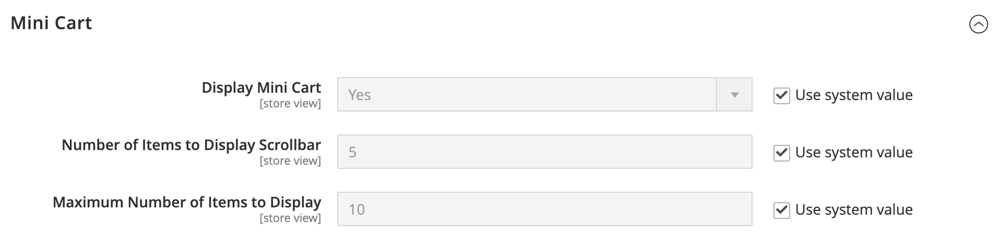

# [!UICONTROL Sales] > [!UICONTROL Checkout]

{{config}}

## [!UICONTROL Checkout Options]

<!-- zoom -->

<!--[Checkout Options](https://docs.magento.com/user-guide/sales/checkout-options.html) -->

| Campo | [Ambito](../../getting-started/websites-stores-views.md#scope-settings) | Descrizione |
|------------------------------------------------------------------|--- |----------------------------------------------------------------------------------------------------------------------------------------------------------------------------------------------------------------------------------------------------------------------------------------------------------------------------------------------------------------------------------------------------------------------------------------------------------------------|
| [!UICONTROL Enable Guest Checkout Login] | Visualizzazione store | Abilita questa impostazione per consentire agli utenti non autenticati (vetrina e API) di eseguire query se un indirizzo e-mail è già associato a un account cliente. Può essere utilizzato per migliorare il flusso di lavoro di pagamento per gli ospiti visualizzando una richiesta di accesso se l’indirizzo e-mail inserito è già registrato in un account cliente, ma ha il costo di esporre informazioni a utenti non autenticati.  Opzioni: `Yes` / `No` |
| [!UICONTROL Enable Onepage Checkout] | Visualizzazione store | Determina se [Estrazione di una pagina](../../stores-purchase/checkout-process.md#checkout-options) è il formato di estrazione predefinito. Opzioni: `Yes` / `No` |
| [!UICONTROL Allow Guest Checkout] | Visualizzazione store | Determina se gli ospiti possono effettuare l&#39;estrazione di [senza registrare](../../stores-purchase/checkout-guest.md) un account con lo store. Opzioni: `Yes` / `No` |
| [!UICONTROL Enable Terms and Conditions] | Visualizzazione store | Determina se i clienti devono accettare i [Termini e condizioni](../../stores-purchase/terms-and-conditions.md) della vendita prima di effettuare un acquisto. Opzioni: `Yes` / `No` |
| [!UICONTROL Display Billing Address On] | Visualizzazione store | Determina la posizione dell&#39;indirizzo di fatturazione durante l&#39;estrazione. Opzioni: `Payment Method` / `Payment Page` |
| [!UICONTROL Maximum Number of Items to Display in Order Summary] | Visualizzazione store | Determina il numero massimo di elementi che possono essere visualizzati nel _Riepilogo ordini_ durante l&#39;estrazione. Il valore predefinito è `10`. |
| [!UICONTROL Enable Address Search] | Sito Web |  (solo Adobe Commerce) determina se i clienti possono utilizzare la funzionalità [ricerca indirizzi](../../stores-purchase/checkout-address-search.md) per i passaggi Spedizione, Revisione e Pagamenti. Se questa opzione è abilitata, utilizza Limite numero di indirizzi del cliente per impostare il numero di indirizzi salvati necessari per attivare questa funzionalità durante il pagamento. Opzioni: `Yes` / `No` |
| Limite numero di indirizzi cliente | Sito Web |  (solo Adobe Commerce) Quando la ricerca degli indirizzi è abilitata, determina il numero di indirizzi salvati necessari per attivare questa funzionalità durante l&#39;estrazione. Quando il numero di indirizzi salvati del cliente raggiunge o supera questo numero, viene eseguito il rendering solo dell&#39;indirizzo predefinito nei passaggi _Spedizione_ e _Verifica e pagamenti_. Il cliente può utilizzare una funzione di ricerca per modificare l’indirizzo selezionato. Il valore predefinito è `10`. |

{style="table-layout:auto"}

## [!UICONTROL Shopping Cart]

<!-- zoom -->

<!--[Shopping Cart](https://docs.magento.com/user-guide/sales/cart-configuration.html) -->

| Campo | [Ambito](../../getting-started/websites-stores-views.md#scope-settings) | Descrizione |
|--- |--- |--- |
| [!UICONTROL Quote Lifetime (days)] | Sito Web | Determina la [durata di un prezzo quotato](../../stores-purchase/cart-configuration.md#quote-lifetime), in giorni. |
| [!UICONTROL After Adding a Product Redirect to Shopping Cart] | Visualizzazione store | Determina se la [pagina del carrello viene visualizzata](../../stores-purchase/cart-configuration.md#redirect-to-cart) subito dopo l&#39;aggiunta di un prodotto al carrello. Opzioni: `Yes` / `No` |
| [!UICONTROL Number of Items to Display Pager] | Visualizzazione store | Determina il numero di elementi nel carrello prima che venga attivato il cercapersone. Valore predefinito: `20` |
| [!UICONTROL Show Cross-sell Items in the Shopping Cart] | Visualizzazione store | Indica se [articoli di cross-selling](../../catalog/related-products-up-sells-cross-sells.md#cross-sells) sono visualizzati nel carrello, fornendo ulteriori opzioni di vendita ai clienti. Opzioni: `Yes` (predefinito) / `No` |
| [!UICONTROL Grouped Product Image] | Visualizzazione store | Determina l&#39;immagine [miniatura](../../stores-purchase/cart-configuration.md#cart-thumbnails) visualizzata per un [prodotto raggruppato](../../catalog/product-create-grouped.md) nel carrello. Opzioni: `Product Thumbnail Itself` / `Parent Product Thumbnail` |
| [!UICONTROL Configurable Product Image] | Visualizzazione store | Determina l&#39;immagine [miniatura](../../stores-purchase/cart-configuration.md#cart-thumbnails) visualizzata per un prodotto configurabile nel carrello. Opzioni: `Product Thumbnail Itself` / `Parent Product Thumbnail` |
| [!UICONTROL Preview Quote Lifetime (minutes)] | Visualizzazione store | Determina la durata massima dell&#39;offerta in minuti quando viene visualizzata in anteprima dal carrello. |
| [!UICONTROL Enable Clear Shopping Cart] | Sito Web | Determina se nel carrello viene visualizzata l’opzione per consentire agli utenti di cancellare il contenuto del carrello in una singola azione. Opzioni: `Yes` / `No` |

{style="table-layout:auto"}

## [!UICONTROL My Cart Link]

<!-- zoom -->

<!-- [*My Cart Link*](https://docs.magento.com/user-guide/sales/mini-cart.html) -->

| Campo | [Ambito](../../getting-started/websites-stores-views.md#scope-settings) | Descrizione |
|--- |--- |--- |
| [!UICONTROL Display Cart Summary] | Sito Web | Determina il valore visualizzato tra parentesi dopo il collegamento Carrello. Opzioni: `Display number of items in cart` / `Display item quantities` |

{style="table-layout:auto"}

## Mini carrello

<!-- zoom -->

<!-- [*Mini Cart*](https://docs.magento.com/user-guide/sales/mini-cart.html) -->

| Campo | [Ambito](../../getting-started/websites-stores-views.md#scope-settings) | Descrizione |
|--- |--- |--- |
| [!UICONTROL Display Mini Cart] | Visualizzazione store | Determina se il mini carrello viene visualizzato nelle pagine del negozio quando si fa clic sull’icona del carrello nell’intestazione. La visualizzazione del mini carrello dipende dal tema. Opzioni: `Yes` / `No` |
| [!UICONTROL Number of Items to Display Scrollbar] | Visualizzazione store | Determina il numero di elementi che possono essere visualizzati nel mini carrello prima che venga attivata la barra di scorrimento. Predefinito: `5` |
| [!UICONTROL Maximum Number of Items to Display] | Visualizzazione store | Determina il numero massimo di elementi che possono essere visualizzati nel mini carrello. Predefinito: `10` |

{style="table-layout:auto"}

## [!UICONTROL Payment Failed Emails]

<!-- zoom -->

<!-- [*Payment Failed Emails*](https://docs.magento.com/user-guide/sales/checkout-payment-failed-emails.html) -->

| Campo | [Ambito](../../getting-started/websites-stores-views.md#scope-settings) | Descrizione |
|--- |--- |--- |
| [!UICONTROL Payment Failed Email Receiver] | Visualizzazione store | Identifica il contatto del negozio che riceve le e-mail di pagamento non riuscito. Destinatario predefinito: `General Contact` |
| [!UICONTROL Payment Failed Email Sender] | Visualizzazione store | Identifica il contatto del negozio che viene visualizzato come mittente del messaggio di posta elettronica Pagamento non riuscito. Mittente predefinito: `General Contact` |
| [!UICONTROL Payment Failed Template] | Visualizzazione store | Identifica il modello utilizzato per le e-mail di pagamento non riuscito. Modello predefinito: `Payment Failed` |
| [!UICONTROL Send Payment Failed Copy To] | Visualizzazione store | Fornisce l&#39;indirizzo e-mail di chiunque riceva una copia di un messaggio e-mail di pagamento non riuscito. Separa più indirizzi con una virgola. |
| [!UICONTROL Send Payment Failed Copy Method] | Visualizzazione store | Indica il metodo e-mail utilizzato per inviare la copia. Opzioni:  **`Bcc`**- Invia una copia di cortesia nascosta includendo il destinatario nell&#39;intestazione della stessa e-mail inviata al cliente. Il destinatario Ccn non è visibile al cliente. **`Separate Email`** - Invia la copia come messaggio e-mail separato. |

{style="table-layout:auto"}
