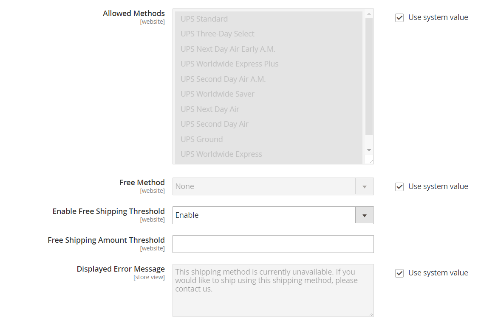

# [!UICONTROL Sales] > [!UICONTROL Delivery Methods]

{{config}}

## [!UICONTROL Basic Delivery Methods]

### [!UICONTROL Flat Rate]

<!-- zoom -->

<!-- [Flat Rate](https://docs.magento.com/user-guide/shipping/shipping-flat-rate.html) -->

| Campo | [Ambito](../../getting-started/websites-stores-views.md#scope-settings) | Descrizione |
|--- |--- |--- |
| [!UICONTROL Enabled] | Sito Web | Quando questa opzione è attivata, la funzione Tariffa fissa viene visualizzata come opzione nella _Stima spese di spedizione e imposte_ sezione del carrello e nella sezione _Spedizione_ durante il pagamento. Opzioni: `Yes` / `No` |
| [!UICONTROL Title] | Visualizzazione store | Nome utilizzato per questo metodo di spedizione durante il pagamento. |
| [!UICONTROL Method Name] | Visualizzazione store | Nome che descrive il metodo di calcolo utilizzato per produrre una stima di spedizione. Il nome del metodo viene visualizzato accanto alla tariffa stimata calcolata nel carrello. Il valore predefinito è `Fixed`. |
| [!UICONTROL Type] | Sito Web | Descrive il tipo di calcolo utilizzato per determinare la tariffa fissa. Opzioni:  **`None`**- Non viene utilizzato alcun calcolo. Imposta la tariffa fissa su zero, che equivale alla spedizione gratuita. **`Per Order`** - Addebita una singola tariffa fissa per l&#39;intero ordine.  **`Per Item`**- Addebita un tasso forfettario separato per ogni articolo nel carrello. Il tasso viene moltiplicato per il numero di articoli nel carrello, anche se la quantità totale include una combinazione di articoli diversi. |
| [!UICONTROL Price] | Sito Web | Il prezzo applicato al cliente per la spedizione a tariffa fissa. |
| [!UICONTROL Calculate Handling Fee] | Sito Web | Determina la modalità di calcolo della commissione di gestione, se inclusa. Opzioni: `Fixed` / `Percent` |
| [!UICONTROL Handling Fee] | Sito Web | Immettere l&#39;importo da addebitare per una commissione di gestione, in base al metodo scelto per calcolare l&#39;importo. Ad esempio, se l&#39;addebito è basato su un addebito fisso, immettere l&#39;importo come decimale, ad esempio 4,90. Tuttavia, se la commissione di gestione si basa su una percentuale dell&#39;ordine, immettere l&#39;importo come percentuale. Ad esempio, se si sta addebitando il 6% dell&#39;ordine, immettere il valore come `.06`. |
| [!UICONTROL Displayed Error Message] | Visualizzazione store | Messaggio visualizzato se un cliente sceglie il metodo Tasso fisso, ma per qualche motivo il metodo non è disponibile. |
| [!UICONTROL Ship to Applicable Countries] | Sito Web | Identifica i paesi in cui offri la spedizione a tariffa fissa. Opzioni:  **`All Allowed Countries`**- I clienti di qualsiasi paese specificato nella configurazione del negozio possono utilizzare la spedizione a tariffa fissa. **`Specific Countries`** - Solo i clienti di determinati paesi possono utilizzare la spedizione a tariffa fissa. |
| [!UICONTROL Ship to Specific Countries] | Sito Web | Identifica ogni paese in cui i clienti possono utilizzare la spedizione a tariffa fissa. |
| [!UICONTROL Show Method if Not Applicable] | Sito Web | Determina se la tariffa fissa viene visualizzata come opzione durante il pagamento se il metodo non è applicabile all&#39;acquisto. Opzioni: `Yes` / `No` |
| [!UICONTROL Sort Order] | Sito Web | Numero che determina l&#39;ordine di visualizzazione della tariffa fissa quando viene elencata con altri metodi di consegna durante il pagamento. |

{style="table-layout:auto"}

### [!UICONTROL Free Shipping]

<!-- zoom -->

<!-- [Free Shipping](https://docs.magento.com/user-guide/shipping/shipping-free.html) -->

| Campo | [Ambito](../../getting-started/websites-stores-views.md#scope-settings) | Descrizione |
|--- |--- |--- |
| [!UICONTROL Enabled] | Sito Web | Quando questa opzione è abilitata, la Spedizione gratuita viene visualizzata come opzione nella sezione Spedizione durante il pagamento. Opzioni: `Yes` / `No` |
| [!UICONTROL Title] | Visualizzazione store | Nome utilizzato per questo metodo di spedizione durante il pagamento. |
| Nome metodo | Visualizzazione store | Nome che descrive il metodo di calcolo utilizzato per produrre una stima di spedizione. Il nome del metodo viene visualizzato accanto alla tariffa stimata calcolata nel carrello. Il valore predefinito è `Free`. |
| Importo minimo ordine | Sito Web | L&#39;acquisto minimo necessario per applicare la Spedizione gratuita a un ordine. |
| Includi imposta in importo | Sito Web | Determina se l&#39;imposta è inclusa nel calcolo dell&#39;importo ordine minimo. Opzioni:  **Sì** - L&#39;imposta viene inclusa nel calcolo dell&#39;importo minimo dell&#39;ordine (Subtotale + Imposta - Sconto). **No** - L&#39;imposta non è inclusa nel calcolo dell&#39;importo minimo dell&#39;ordine (Subtotale - Sconto). |
| Messaggio di errore visualizzato | Visualizzazione store | Messaggio visualizzato se un cliente sceglie la spedizione gratuita, ma per qualche motivo il metodo non è disponibile. |
| Spedisci a paesi applicabili | Sito Web | Identifica i paesi in cui offri la spedizione gratuita. Opzioni:  **Tutti i paesi consentiti** - I clienti di qualsiasi paese specificato nella configurazione del negozio possono utilizzare la Spedizione gratuita.  **Paesi specifici** - I clienti di solo specifici paesi possono utilizzare Spedizione gratuita. |
| Spedisci a paesi specifici | Sito Web | Identifica ogni paese in cui i clienti possono utilizzare la Spedizione gratuita. |
| Mostra metodo se non applicabile | Sito Web | Determina se la Spedizione gratuita viene visualizzata come opzione durante il pagamento se il metodo non è applicabile all&#39;acquisto. Opzioni: `Yes` / `No` |
| [!UICONTROL Sort Order] | Sito Web | Numero che determina l&#39;ordine di visualizzazione di Spedizione gratuita quando viene elencato con altri metodi di consegna durante il pagamento. |

{style="table-layout:auto"}

### [!UICONTROL Table Rates]

<!-- zoom -->

<!-- [Table Rates](https://docs.magento.com/user-guide/shipping/shipping-table-rate.html) -->

| Campo | [Ambito](../../getting-started/websites-stores-views.md#scope-settings) | Descrizione |
|--- |--- |--- |
| [!UICONTROL Enabled] | Sito Web | Quando questa opzione è abilitata, l&#39;opzione Tassi tabella viene visualizzata nella sezione Stima spedizione e imposte del carrello e nella sezione Spedizione durante il pagamento. Opzioni: `Yes` / `No` |
| [!UICONTROL Title] | Visualizzazione store | Nome utilizzato per questo metodo di spedizione durante il pagamento. |
| Nome metodo | Visualizzazione store | Nome che descrive il metodo di calcolo utilizzato per produrre una stima di spedizione. Il nome del metodo viene visualizzato accanto alla tariffa stimata calcolata nel carrello. Il valore predefinito è `Table Rate`. |
| [!UICONTROL Condition] | Sito Web | Determina la condizione su cui si basa il calcolo. Il formato del file CSV caricato è specifico per ogni condizione. Opzioni: `Weight vs. Destination` / `Price vs. Destination` / `# of Items vs. Destination` |
| [!UICONTROL Include Virtual Products in Price Calculation] | Sito Web | Determina se i prodotti virtuali, che non richiedono la spedizione, sono inclusi nei calcoli del prezzo Tasso tabella. |
| [!UICONTROL Calculate Handling Fee] | Sito Web | Determina la modalità di calcolo della commissione di gestione, se inclusa. Opzioni: `Fixed` / `Percent` |
| [!UICONTROL Handling Fee] | Sito Web | L&#39;importo di qualsiasi tariffa aggiunta alle spese di spedizione per coprire le spese di gestione della spedizione. Immetti il valore come decimale. Ad esempio, se la tariffa è basata su una percentuale, immettere 0,06 anziché 6 %. Per un importo fisso, immettere `6.00`. |
| [!UICONTROL Displayed Error Message] | Visualizzazione store | Messaggio visualizzato se un cliente sceglie Tassi tabella, ma per qualche motivo il metodo non è disponibile. |
| [!UICONTROL Ship to Applicable Countries] | Sito Web | Identifica i paesi in cui offri la spedizione tramite Tasso tabella. Opzioni:  **`All Allowed Countries`**- I clienti di qualsiasi paese specificato nella configurazione del negozio possono utilizzare la spedizione Table Rate. **`Specific Countries`** - I clienti di solo specifici paesi possono utilizzare Tasso di spedizione tabella. |
| [!UICONTROL Ship to Specific Countries] | Sito Web | Identifica ogni paese in cui i clienti possono utilizzare la spedizione basata su tariffa tabella. |
| [!UICONTROL Show Method if Not Applicable] | Sito Web | Determina se i tassi tabella vengono visualizzati come opzione durante il pagamento se il metodo non è applicabile all&#39;acquisto. Opzioni: `Yes` / `No` |
| [!UICONTROL Sort Order] | Sito Web | Numero che determina l&#39;ordine di visualizzazione dei tassi tabella quando vengono elencati con altri metodi di consegna durante il pagamento. |

{style="table-layout:auto"}

### [!UICONTROL In-Store Delivery]

<!-- zoom -->

<!-- [In-Store Delivery](https://docs.magento.com/user-guide/shipping/shipping-in-store-delivery.html) -->

| Campo | [Ambito](../../getting-started/websites-stores-views.md#scope-settings) | Descrizione |
|--- |--- |--- |
| [!UICONTROL Enabled] | Sito Web | Quando questa opzione è abilitata, la consegna in-store può essere visualizzata come opzione nella _Stima spese di spedizione e imposte_ sezione del carrello e nella sezione _Spedizione_ durante il pagamento. Opzioni: `Yes` / `No` |
| [!UICONTROL Method Name] | Visualizzazione store | Nome che identifica la funzione di prelievo in negozio come metodo di spedizione. Questo valore viene visualizzato come etichetta di una scheda nella parte superiore della pagina Pagamento spedizione e nella tabella dei metodi di spedizione disponibili nella parte inferiore della stessa pagina. Il valore predefinito è `In-store Delivery`. |
| [!UICONTROL Title] | Visualizzazione store | Nome utilizzato per questo metodo di spedizione durante il pagamento. |
| [!UICONTROL Price] | Sito Web | Il prezzo addebitato al cliente per un prelievo in negozio. |
| [!UICONTROL Search Radius] | Sito Web | Raggio, in km, da utilizzare per la ricerca delle posizioni di prelievo. |
| [!UICONTROL Displayed Error Message] | Visualizzazione store | Messaggio visualizzato quando un cliente seleziona un prelievo in-store, ma il metodo di consegna non è disponibile. |

{style="table-layout:auto"}

## [!UICONTROL Carriers]

### [!UICONTROL UPS]

{{ups-api}}

{{beta2-updates}}

<!-- zoom -->

<!-- [UPS XML Account Settings](https://docs.magento.com/user-guide/shipping/ups.html) -->

| Campo | [Ambito](../../getting-started/websites-stores-views.md#scope-settings) | Descrizione |
|--- |--- |--- |
| [!UICONTROL Enabled for Checkout] | Sito Web | Determina se UPS è disponibile per i clienti come metodo di spedizione durante il pagamento. Opzioni: `Yes` / `No` |
| [!UICONTROL Enabled for RMA] | Sito Web | Determina se UPS è disponibile per i clienti come metodo di spedizione per un RMA. Opzioni: `Yes` / `No` |
| [!UICONTROL UPS Type] | Visualizzazione store | Specifica il metodo utilizzato per la connessione al sistema di spedizione UPS. Opzioni:  **`United Parcel Service XML`**- (Impostazione predefinita) L&#39;archivio invia un file XML con i dati a UPS come richiesta. **`United Parcel Service`** - Il tuo store invia coppie chiave-valore a UPS come richiesta.   **_Nota:_**Il tipo di servizio United Parcel Service standard è pianificato per l’obsolescenza in Commerce. Per le nuove configurazioni, utilizza [!UICONTROL United Parcel Service XML] tipo. |
| _[!UICONTROL UPS Account Settings]_ |  |  |
| [!UICONTROL Live Account] | Visualizzazione store | Specifica che l&#39;account United Parcel Service è attivo. Opzioni: `Yes` / `No` |
| [!UICONTROL Gateway URL] | Sito Web | URL che si connette al sistema UPS per recuperare le tariffe di spedizione dinamiche. UPS sta interrompendo il supporto di HTTP. Valore predefinito: `https://www.ups.com/using/services/rave/qcostcgi.cgi` |
| [!UICONTROL Title] | Visualizzazione store | Nome utilizzato per questo metodo di spedizione durante il pagamento. |
| _[!UICONTROL UPS XML Account Settings]_ |  |  |
| [!UICONTROL Access License Number] | Sito Web | Il numero di licenza di accesso dell&#39;account del corriere UPS. |
| [!UICONTROL Gateway XML URL] | Sito Web | Per il servizio XML UPS, visualizza i seguenti URL necessari per la trasmissione dei dati XML: URL XML gateway, URL XML di tracciamento, URL XML conferma spedizione, URL XML accettazione spedizione |
| [!UICONTROL Mode] | Sito Web | Determina la modalità di trasmissione utilizzata per i dati inviati al sistema UPS. Opzioni:  **`Development`**- UPS non verifica che i dati ricevuti dal server Commerce siano inviati tramite SSL. **`Live`** - UPS verifica che i dati ricevuti dal server Commerce siano inviati tramite un livello di socket sicuro (SSL). |
| ID utente | Sito Web | ID utente dell&#39;account del corriere UPS. |
| [!UICONTROL Origin of the Shipment] | Sito Web | (Solo XML UPS) Il paese o l&#39;area geografica di origine della spedizione del prodotto. |
| [!UICONTROL Password] | Visualizzazione store | Password dell&#39;account del corriere del gruppo di continuità. |

{style="table-layout:auto"}

<!-- zoom -->

<!-- [UPS Package Information](https://docs.magento.com/user-guide/shipping/ups.html) -->

| Campo | [Ambito](../../getting-started/websites-stores-views.md#scope-settings) | Descrizione |
|--- |--- |--- |
| _[!UICONTROL UPS Negotiated Rate Settings]_ |  |  |
| [!UICONTROL Enable Negotiated Rates] | Sito Web | (Solo XML UPS) Attiva/disattiva tariffe speciali, in base al contratto con UPS. Opzioni: `Yes` / `No` |
| [!UICONTROL Packages Request Type] | Sito Web | Determina la modalità di calcolo del peso per le spedizioni con più colli. Opzioni: `Divide to equal weight (one request)` / `Use origin weight (multiple requests)` |
| [!UICONTROL Shipper Number] | Sito Web | (Solo XML UPS) Il numero di spedizione UPS a sei caratteri è necessario per l&#39;utilizzo delle tariffe negoziate come riferimento. |
| [!UICONTROL Container] | Sito Web | Imposta il tipo di contenitore utilizzato per il pacchetto delle spedizioni degli ordini. Opzioni: `Customer Packaging` / `UPS Letter Envelope` / `Customer Packaging` / `UPS Letter Envelope` / `UPS Tube` / `UPS Express Box` / `UPS Worldwide 25 kilo` / `UPS Worldwide 10 kilo` |
| [!UICONTROL Weight Unit] | Sito Web | Imposta l&#39;unità di misura predefinita per il peso del prodotto nel punto vendita. Consulta [Peso dimensionale](../../stores-purchase/carriers.md#dimensional-weight) per ulteriori informazioni. |
| [!UICONTROL Tracking XML URL] | Sito Web | (Solo XML UPS) L&#39;URL UPS utilizzato per tenere traccia dei pacchetti. |
| [!UICONTROL Destination Type] | Sito Web | Imposta il tipo di destinazione di spedizione predefinito. Opzioni: `Business` / `Residential` |
| [!UICONTROL Maximum Package Weight] | Sito Web | Imposta il peso massimo che un pacchetto può avere come specificato da UPS. Se i prodotti ordinati superano il peso massimo del pacchetto, questa opzione di spedizione non è disponibile. Secondo [UPS.com](https://www.ups.com/us/en/global.page), le confezioni non possono superare i 70 kg (150 lb) Verifica il peso massimo con il tuo corriere. |
| [!UICONTROL Pickup Method] | Sito Web | Imposta il metodo di prelievo del gruppo di continuità. Opzioni: `Regular Daily Pickup` / `On Call Air` / `One Time Pickup` / `Letter Center` / `Customer Counter` |
| [!UICONTROL Minimum Package Weight] | Sito Web | Imposta il peso minimo che un pacchetto può avere in base a quanto specificato da UPS. Se i prodotti ordinati pesano meno del peso minimo del pacchetto, questa opzione di spedizione non è disponibile. Per verificare il peso minimo, contattare il vettore di spedizione. |
| [!UICONTROL Calculate Handling Fee] | Sito Web | Imposta il metodo di calcolo della tariffa di movimentazione per la spedizione delle tariffe della tabella. Opzioni:  **`Fixed`**- La tariffa di movimentazione è fissa. **`Percent`** - La commissione di imballaggio viene applicata come percentuale dell&#39;importo dell&#39;ordine. |
| [!UICONTROL Handling Applied] | Sito Web | Specifica se le spese di imballaggio vengono applicate a ogni ordine o pacchetto all&#39;interno di un ordine. |
| [!UICONTROL Handling Fee] | Sito Web | Imposta la gestione inclusa nel prezzo della tariffa di spedizione. La tariffa di imballaggio può essere impostata come importo fisso o percentuale.   **_Nota:_**Se si digita un importo percentuale, utilizzare il formato decimale `0.25` al 25%. |

{style="table-layout:auto"}

<!-- zoom -->

<!-- [UPS Allowed Methods](https://docs.magento.com/user-guide/shipping/ups.html) -->

| Campo | [Ambito](../../getting-started/websites-stores-views.md#scope-settings) | Descrizione |
|--- |--- |--- |
| _[!UICONTROL UPS allowed methods]_ |  |  |
| [!UICONTROL Allowed Methods] | Sito Web | Specifica i metodi consentiti di spedizione UPS offerti ai clienti. Le tariffe di spedizione vengono calcolate in base al metodo di spedizione selezionato. |
| [!UICONTROL Free Method] | Sito Web | Identifica il metodo utilizzato per il metodo di spedizione gratuita tramite UPS. Per disattivare la spedizione gratuita, scegliere &quot;Nessuno&quot;.   **_Nota:_**Questo metodo è simile al metodo di base [Spedizione gratuita](../../stores-purchase/shipping-free.md), tuttavia appare come opzione di spedizione UPS durante il check-out. |
| [!UICONTROL Free Shipping Amount Threshold] | Sito Web | Determina se la spedizione gratuita viene applicata quando l&#39;importo dell&#39;ordine soddisfa la soglia di spedizione gratuita. Opzioni: `Enable` / `Disable` |
| [!UICONTROL Free Shipping Amount Threshold] | Sito Web | Imposta l&#39;importo totale minimo che un ordine deve raggiungere per qualificarsi per la spedizione gratuita. |
| [!UICONTROL Displayed Error Message] | Visualizzazione store | Messaggio di errore visualizzato quando il metodo di spedizione non è disponibile per alcun motivo. |

{style="table-layout:auto"}

<!-- zoom -->

<!-- [UPS Applicable Countries and Other Settings](https://docs.magento.com/user-guide/shipping/ups.html) -->

| Campo | [Ambito](../../getting-started/websites-stores-views.md#scope-settings) | Descrizione |
|--- |--- |--- |
| _[!UICONTROL UPS Applicable countries and other Settings]_ |  |  |
| [!UICONTROL Ship to Applicable Countries] | Sito Web | Specifica il paese in cui i clienti possono utilizzare questo metodo di spedizione. Opzioni:  **`All Allowed Countries`**- Clienti di tutti [paesi](../../getting-started/store-details.md#country-options) specificato nella configurazione del punto vendita può utilizzare questo metodo di spedizione. **`Specific Countries`** - Dopo aver scelto questa opzione, il [!UICONTROL Ship to Specific Countries] viene visualizzato. Selezionare ogni paese nell&#39;elenco in cui è possibile utilizzare questo metodo di spedizione. |
| [!UICONTROL Show Method if Not Applicable] | Sito Web | Determina se UPS viene sempre visualizzato come opzione di spedizione durante il pagamento. Opzioni:  **`Yes`**- UPS appare sempre come opzione di spedizione durante il pagamento, anche se non applicabile all&#39;ordine. **`No`** - UPS viene visualizzato come opzione di spedizione durante il pagamento solo se applicabile all&#39;ordine. (ad esempio, se il peso dell&#39;ordine supera l&#39;importo del peso massimo). |
| [!UICONTROL Debug] | Sito Web | Specifica se le trasmissioni di dati tra l&#39;archivio e UPS vengono registrate nel sistema per il debug. A meno che non vi sia un problema che deve essere tracciato e registrato, questa opzione deve essere impostata su `No`. |
| [!UICONTROL Sort Order] | Sito Web | Numero che determina l&#39;ordine di visualizzazione del gruppo di continuità quando viene elencato con altri metodi di consegna durante il pagamento. Invio `0` all&#39;inizio dell&#39;elenco. |

{style="table-layout:auto"}

### [!UICONTROL USPS]

{{beta2-updates}}

| Campo | [Ambito](../../getting-started/websites-stores-views.md#scope-settings) | Descrizione |
|--- |--- |--- |
| Abilitato per l&#39;estrazione | Sito Web | Determina se USPS è disponibile per i clienti come metodo di spedizione durante il pagamento. Opzioni: `Yes` / `No` |
| _[!UICONTROL USPS Account Settings]_ |  |  |
| [!UICONTROL Gateway URL] | Sito Web | URL utilizzato per connettersi al sistema USPS per recuperare dinamicamente le tariffe di spedizione. |
| [!UICONTROL Secure Gateway URL] | Sito Web | L’URL sicuro utilizzato per connettersi al sistema USPS su un livello di socket sicuro (SSL) per recuperare dinamicamente le tariffe di spedizione. |
| [!UICONTROL Title] | Visualizzazione store | Il titolo di questa opzione di spedizione visualizzato nel carrello acquisti. |
| [!UICONTROL User ID] | Sito Web | ID utente dell&#39;account speditore USPS. |
| [!UICONTROL Password] | Sito Web | Password dell&#39;account speditore USPS. |
| [!UICONTROL Mode] | Sito Web | Determina la modalità di trasmissione dei dati inviati al sistema USPS. Le opzioni includono:  **`Development`**- USPS non verifica se i dati ricevuti dal server Commerce vengono inviati tramite SSL. **`Live`** : USPS verifica che i dati ricevuti dal server Commerce vengano inviati tramite un livello di socket sicuro (SSL). |

{style="table-layout:auto"}

<!-- zoom -->

<!-- [USPS Packaging Settings](https://docs.magento.com/user-guide/shipping/usps.html) -->

| Campo | [Ambito](../../getting-started/websites-stores-views.md#scope-settings) | Descrizione |
|--- |--- |--- |
| _[!UICONTROL USPS packaging Settings]_ |  |  |
| [!UICONTROL Packages Request Type] | Sito Web | Determina la modalità di calcolo del peso per le spedizioni con più colli. Opzioni: `Divide to equal weight (one request)` / `Use origin weight (multiple requests)` |
| [!UICONTROL Container] | Sito Web | Imposta il tipo di contenitore utilizzato per il pacchetto delle spedizioni degli ordini. Opzioni: `Variable` / `Flat Rate Box` / `Flat Rate Envelope` / `Rectangular` / Non rettangolare |
| [!UICONTROL Size] | Sito Web | Imposta l&#39;opzione Dimensione sulle dimensioni tipiche del pacchetto di spedizione. Questa opzione influisce sul calcolo della tariffa di spedizione. Opzioni: `Regular` / `Large` / `Oversize` |
| [!UICONTROL Machinable] | Sito Web | Specifica se il pacchetto può essere elaborato dalla macchina. Questa opzione influisce sul calcolo della tariffa di spedizione. |
| [!UICONTROL Maximum Package Weight] | Sito Web | Imposta il peso massimo che un pacchetto può avere come specificato da USPS. Se i prodotti ordinati superano il peso massimo del pacchetto, questa opzione di spedizione non è disponibile. |

{style="table-layout:auto"}

<!-- zoom -->

<!-- [USPS Handling Fee Settings](https://docs.magento.com/user-guide/shipping/usps.html) -->

| Campo | [Ambito](../../getting-started/websites-stores-views.md#scope-settings) | Descrizione |
|--- |--- |--- |
| _[!UICONTROL USPS Handling Fee settings]_ |  |  |
| [!UICONTROL Calculate Handling Fee] | Sito Web | Imposta il metodo di calcolo della tariffa di movimentazione per la spedizione delle tariffe della tabella. Opzioni:  **`Fixed`**- La tariffa di movimentazione è fissa. **`Percent`** - La commissione di imballaggio viene applicata come percentuale dell&#39;importo dell&#39;ordine. |
| [!UICONTROL Handling Applied] | Sito Web | Specifica se le spese di imballaggio vengono applicate a ogni ordine o pacchetto all&#39;interno di un ordine. |
| [!UICONTROL Handling Fee] | Sito Web | Imposta la gestione inclusa nel prezzo della tariffa di spedizione. La tariffa di imballaggio può essere impostata come importo fisso o percentuale.   **_Nota:_**Quando si digita un importo percentuale, utilizzare il formato decimale `0.25` al 25%. |

{style="table-layout:auto"}

<!-- zoom -->

<!-- [USPS Allowed Methods](https://docs.magento.com/user-guide/shipping/usps.html) -->

| Campo | [Ambito](../../getting-started/websites-stores-views.md#scope-settings) | Descrizione |
|--- |--- |--- |
| _[!UICONTROL USPS Allowed Methods]_ |  |  |
| [!UICONTROL Allowed Methods] | Sito Web | Specifica i metodi di spedizione USPS consentiti offerti ai clienti. Le tariffe di spedizione vengono calcolate in base al metodo di spedizione selezionato. |
| [!UICONTROL Free Method] | Sito Web | Imposta il metodo di spedizione gratuita tramite USPS o può essere disabilitato selezionando `None`.   **_Nota:_**Questo metodo di spedizione è simile al metodo di spedizione gratuita del tuo negozio, tuttavia è elencato come opzione di spedizione USPS e identificato come spedizione USPS. |
| [!UICONTROL Minimum Order Amount for Free Shipping] | Sito Web | Imposta l&#39;importo minimo dell&#39;ordine che deve essere raggiunto per qualificarsi per la spedizione gratuita. |
| [!UICONTROL Displayed Error Message] | Visualizzazione store | Messaggio di errore visualizzato quando USPS non è disponibile per alcun motivo. |

{style="table-layout:auto"}

<!-- zoom -->

<!-- [USPS Applicable Countries](https://docs.magento.com/user-guide/shipping/usps.html) -->

| Campo | [Ambito](../../getting-started/websites-stores-views.md#scope-settings) | Descrizione |
|--- |--- |--- |
| _[!UICONTROL USPS Applicable Countries]_ |  |  |
| [!UICONTROL Ship to Applicable Countries] | Sito Web | Specifica i paesi in cui possono essere spediti gli ordini. Opzioni:  **`All Allowed Countries`**- Clienti di tutti [paesi](../../getting-started/store-details.md#country-options) specificato nella configurazione del punto vendita può utilizzare questo metodo di spedizione. **`Specific Countries`** - Dopo aver scelto questa opzione, il [!UICONTROL Ship to Specific Countries] viene visualizzato. Selezionare ogni paese nell&#39;elenco in cui è possibile utilizzare questo metodo di spedizione. |
| [!UICONTROL Show Method if Not Applicable] | Sito Web | Controlla la visualizzazione della spedizione USPS durante il pagamento. Opzioni:  **`Yes`**- USPS appare sempre come opzione di spedizione durante il pagamento, anche se non applicabile all&#39;ordine. **`No`** - USPS viene visualizzato come opzione di spedizione durante il pagamento solo se applicabile all&#39;ordine (ovvero se il peso dell&#39;ordine supera l&#39;importo del peso massimo). |
| [!UICONTROL Debug] | Sito Web | Determina se il sistema gestisce un registro delle trasmissioni di dati tra l&#39;archivio e USPS per il debug. A meno che non vi sia un problema che deve essere tracciato e registrato, questa opzione deve essere impostata su `No`. |
| [!UICONTROL Sort Order] | Sito Web | Numero che determina l&#39;ordine di visualizzazione di USPS quando viene elencato con altri metodi di consegna durante il pagamento. Invio `0` all&#39;inizio dell&#39;elenco. |

{style="table-layout:auto"}

### [!UICONTROL FedEx]

{{beta2-updates}}

<!-- zoom -->

<!-- [FedEx Account Settings](https://docs.magento.com/user-guide/shipping/fedex.html) -->

| Campo | [Ambito](../../getting-started/websites-stores-views.md#scope-settings) | Descrizione |
|--- |--- |--- |
| _[!UICONTROL FedEx Account Settings]_ |  |  |
| [!UICONTROL Enabled for Checkout] | Sito Web | Determina se FedEx è disponibile per i clienti come metodo di spedizione durante il pagamento. Opzioni: `Yes` / `No` |
| [!UICONTROL Title] | Visualizzazione store | Il titolo di questa opzione di spedizione visualizzato nel carrello acquisti. |
| [!UICONTROL Account ID] | Sito Web | ID del tuo account FedEx. |
| [!UICONTROL Meter Number] | Sito Web | Il numero del misuratore FedEx. |
| [!UICONTROL Key] | Sito Web | Chiave del tuo account FedEx. |
| [!UICONTROL Password] | Sito Web | Password dell&#39;account FedEx. |
| [!UICONTROL Sandbox Mode] | Sito Web | Per eseguire transazioni FedEx in un ambiente di test, impostare la modalità sandbox su `Yes`. Opzioni: `Yes` / `No`. |
| [!UICONTROL Web-Services URL] | Sito Web | L’URL richiesto dipende dall’impostazione della modalità sandbox. Opzioni:  **`Production`**: l’URL per accedere ai servizi web FedEx quando il negozio è attivo. **`Sandbox`** : l’URL per accedere all’ambiente di test per i servizi web FedEx. |

{style="table-layout:auto"}

<!-- zoom -->

<!-- [FedEx Packaging](https://docs.magento.com/user-guide/shipping/fedex.html) -->

| Campo | [Ambito](../../getting-started/websites-stores-views.md#scope-settings) | Descrizione |
|--- |--- |--- |
| _[!UICONTROL FedEx Packaging Settings]_ |  |  |
| [!UICONTROL Packages Request Type] | Sito Web | Determina la modalità di calcolo del peso per le spedizioni con più colli. Opzioni: `Divide to equal weight (one request)` / `Use origin weight (multiple requests)` |
| [!UICONTROL Packaging] | Sito Web | Dall’elenco, seleziona il tipo di contenitore che in genere utilizzi per imballare i prodotti ordinati dal tuo store. |
| [!UICONTROL Dropoff] | Sito Web | Dall&#39;elenco, selezionare il metodo di prelievo:  **`Regular Pickup`**- (Impostazione predefinita) Se hai un volume elevato di spedizioni, organizzare prelievi regolari può essere conveniente. **`Request Courier`** - È necessario chiamare e richiedere un corriere FedEx per ritirare le spedizioni.  **`Drop Box`**- È necessario consegnare le consegne presso il vostro locale FedEx casella di consegna. **`Business Service Center`** - Le spedizioni devono essere effettuate presso il centro di assistenza locale FedEx.  **`Station`**- Le consegne devono essere effettuate presso la stazione FedEx locale. |
| [!UICONTROL Maximum Package Weight] | Sito Web | Il valore predefinito per FedEx è 150 libbre. Rivolgersi al vettore di spedizione per conoscere il peso massimo supportato. Si consiglia di utilizzare il valore predefinito, a meno che non si disponga di accordi speciali con FedEx. |

{style="table-layout:auto"}

<!-- zoom -->

<!-- [FedEx Handling Fee](https://docs.magento.com/user-guide/shipping/fedex.html) -->

| Campo | [Ambito](../../getting-started/websites-stores-views.md#scope-settings) | Descrizione |
|--- |--- |--- |
| _[!UICONTROL FedEx Handling Fee Settings]_ |  |  |
| [!UICONTROL Calculate Handling Fee] | Sito Web | Determina il metodo utilizzato per calcolare le commissioni di gestione. Opzioni: `Fixed Fee` / `Percentage`   **_Nota:_**La tariffa di imballaggio è facoltativa e viene visualizzata come un costo aggiuntivo che viene aggiunto alle spese di spedizione FedEx. |
| [!UICONTROL Handling Applied] | Sito Web | Determina la modalità di applicazione delle commissioni di gestione. Opzioni: `Per Order` / `Per Package` |
| [!UICONTROL Handling Fee] | Sito Web | Specifica l&#39;importo addebitato come commissione di imballaggio, in base al metodo utilizzato per calcolare l&#39;importo. Se l&#39;addebito è basato su un addebito fisso, immettere l&#39;importo come decimale, ad esempio `4.90`. Se la commissione di gestione è basata su una percentuale dell&#39;ordine, immettere l&#39;importo come percentuale. Ad esempio, per addebitare il 6% dell&#39;ordine, immettere il valore come `.06`. |

{style="table-layout:auto"}

<!-- zoom -->

<!-- [FedEx Delivery Methods](https://docs.magento.com/user-guide/shipping/fedex.html) -->

| Campo | [Ambito](../../getting-started/websites-stores-views.md#scope-settings) | Descrizione |
|--- |--- |--- |
| _[!UICONTROL FedEx delivery methods]_ |  |  |
| [!UICONTROL Residential Delivery] | Sito Web | Impostare una delle opzioni seguenti, a seconda che si venda business-to-consumer (B2C) o business-to-business (B2B):  **`Yes`**- Per consegne B2C **`No`** - Per consegne B2B |
| [!UICONTROL Allowed Methods] | Sito Web | Selezionare dall&#39;elenco i metodi di spedizione supportati. I metodi dipendono dal tuo account FedEx, dalla frequenza e dalle dimensioni delle tue spedizioni e dall’autorizzazione o meno delle spedizioni internazionali. In qualità di commerciante, potresti decidere di offrire solo la spedizione a terra. |
| [!UICONTROL Hub ID] | Sito Web | ID fornito da FedEx e utilizzato con [!DNL Smart Post] metodo. |
| [!UICONTROL Free Method] | Sito Web | Dall’elenco, seleziona il metodo di spedizione che preferisci utilizzare per le offerte di spedizione gratuita.   **_Nota:_**Questo metodo di spedizione è simile al normale metodo di spedizione gratuita, tuttavia è elencato all&#39;interno delle opzioni di spedizione FedEx ed è identificato come spedizione FedEx. |
| [!UICONTROL Free Shipping Amount Threshold] | Sito Web | Determina se è necessario un importo minimo per la spedizione gratuita. Opzioni:  **`Enable`**- Consente la spedizione gratuita FedEx per gli ordini che soddisfano l&#39;importo minimo. **`Disable`** - Disattiva la spedizione gratuita FedEx con ordine minimo. |
| [!UICONTROL Free Shipping Amount Threshold] | Sito Web | Specifica l&#39;importo minimo dell&#39;ordine necessario per la spedizione gratuita. |
| [!UICONTROL Displayed Error Message] | Visualizzazione store | Messaggio visualizzato quando FedEx non è disponibile per qualsiasi motivo. Puoi utilizzare il messaggio predefinito o immetterne un altro. |

{style="table-layout:auto"}

<!-- zoom -->

<!-- [FedEx Applicable Countries](https://docs.magento.com/user-guide/shipping/fedex.html) -->

| Campo | [Ambito](../../getting-started/websites-stores-views.md#scope-settings) | Descrizione |
|--- |--- |--- |
| _[!UICONTROL FedEx Applicable Countries]_ |  |  |
| [!UICONTROL Ship to Applicable Countries] | Sito Web | Indica i paesi in cui i clienti possono effettuare le spedizioni tramite FedEx. Opzioni:  **`All Allowed Countries`**- Clienti di tutti [paesi](../../getting-started/store-details.md#country-options) specificato nella configurazione del punto vendita può utilizzare questo metodo di spedizione. **`Specific Countries`** - Dopo aver scelto questa opzione, il [!UICONTROL Ship to Specific Countries] viene visualizzato. Selezionare ogni paese nell&#39;elenco in cui è possibile utilizzare questo metodo di spedizione. |
| [!UICONTROL Ship to Specific Countries] | Sito Web | Indica i paesi specifici in cui i clienti possono effettuare le spedizioni tramite FedEx. |
| [!UICONTROL Debug] | Sito Web | Determina se il sistema gestisce un registro delle trasmissioni di dati tra il tuo archivio e FedEx per il debug. A meno che non vi sia un problema che deve essere tracciato e registrato, questa opzione deve essere impostata su `No`. |
| [!UICONTROL Show Method if Not Applicable] | Sito Web | Determina quando FedEx viene visualizzato come metodo di spedizione durante il pagamento. Opzioni:  **`Yes`**- L&#39;opzione di spedizione FedEx viene visualizzata nell&#39;elenco dei metodi di consegna, indipendentemente dal fatto che l&#39;ordine sia idoneo per utilizzarlo. **`No`** - L&#39;opzione di spedizione FedEx non viene visualizzata nell&#39;elenco dei metodi di consegna se non è applicabile all&#39;ordine (ad esempio, se il peso dell&#39;ordine supera l&#39;importo del peso massimo). |
| [!UICONTROL Sort Order] | Sito Web | Un numero che determina l’ordine di visualizzazione di FedEx quando viene elencato con altri metodi di consegna durante il pagamento. Invio `0` all&#39;inizio dell&#39;elenco. |

{style="table-layout:auto"}

### [!UICONTROL DHL]

<!-- zoom -->

<!-- [DHL Account Settings](https://docs.magento.com/user-guide/shipping/dhl.html) -->

| Campo | [Ambito](../../getting-started/websites-stores-views.md#scope-settings) | Descrizione |
|--- |--- |--- |
| _[!UICONTROL DHL Account Settings]_ |  |  |
| [!UICONTROL Enabled for Checkout] | Sito Web | Determina se DHL è disponibile per i clienti come metodo di spedizione durante il pagamento. Opzioni: `Yes` / `No` |
| [!UICONTROL Title] | Visualizzazione store | Titolo del metodo di spedizione visualizzato durante il pagamento. |
| [!UICONTROL Gateway URL] | Sito Web | In genere, è possibile accettare l&#39;URL del gateway predefinito. Se invece DHL ha fornito un URL alternativo, immettere il valore in questo campo. |
| [!UICONTROL Access ID] | Sito Web | ID di accesso dell&#39;account spedizioniere DHL. |
| [!UICONTROL Password] | Sito Web | Password dell&#39;account spedizioniere DHL. |
| [!UICONTROL Account Number] | Sito Web | Il numero del conto di spedizione DHL. |

{style="table-layout:auto"}

<!-- zoom -->

<!-- [DHL Package Settings](https://docs.magento.com/user-guide/shipping/dhl.html) -->

| Campo | [Ambito](../../getting-started/websites-stores-views.md#scope-settings) | Descrizione |
|--- |--- |--- |
| _[!UICONTROL DHL Package Settings]_ |  |  |
| [!UICONTROL Calculate Handling Fee] | Sito Web | La tariffa di movimentazione è facoltativa e appare come un supplemento aggiunto al costo di spedizione DHL. Selezionare dall&#39;elenco il metodo che si desidera utilizzare per calcolare le commissioni di gestione. Opzioni: Tariffa Fissa / Percentuale. |
| [!UICONTROL Handling Applied] | Sito Web | Dall’elenco, seleziona la modalità di applicazione delle tariffe di gestione. Opzioni: `Per Order` / `Per Package` |
| Spese di imballaggio | Sito Web | Immettere l&#39;importo da addebitare per una commissione di gestione, in base al metodo scelto per calcolare l&#39;importo. Ad esempio, se l&#39;addebito è basato su un addebito fisso, immettere l&#39;importo come decimale, ad esempio `4.90`. Tuttavia, se la commissione di gestione si basa su una percentuale dell&#39;ordine, immettere l&#39;importo come percentuale. Ad esempio, se si sta addebitando il 6% dell&#39;ordine, immettere il valore come `.06`. |
| [!UICONTROL Divide Order Weight] | Visualizzazione store | Determina se il peso di un ordine superiore a 70 kg può essere diviso in unità più piccole per garantire una spesa di spedizione accurata. Opzioni: `Yes` / `No` |
| [!UICONTROL Weight Unit] | Visualizzazione store | Determina l&#39;unità di misura per il peso utilizzata nei calcoli di spedizione. Opzioni: `Pounds` / `Kilograms` |
| [!UICONTROL Size] | Visualizzazione store | Determina la dimensione del pacchetto. Opzioni:  **`Regular`**- I colli spediti sono conformi ai metodi di imballaggio standard DHL. In [!UICONTROL Allowed Methods] selezionare ogni metodo di imballaggio utilizzato per spedire i prodotti dal proprio negozio. **`Specific`** - Se i pacchetti spediti hanno dimensioni personalizzate, completare le operazioni seguenti: [!UICONTROL Height (cm)] / [!UICONTROL Depth (cm)] / [!UICONTROL Width (cm)] |

{style="table-layout:auto"}

<!-- zoom -->

<!-- DHL Allowed Methods](https://docs.magento.com/user-guide/shipping/dhl.html) -->

| Campo | [Ambito](../../getting-started/websites-stores-views.md#scope-settings) | Descrizione |
|--- |--- |--- |
| _[!UICONTROL DHL allowed methods]_ |  |  |
| [!UICONTROL Allowed Methods] | Sito Web | Nell&#39;elenco selezionare tutti i metodi di spedizione supportati. |
| [!UICONTROL Ready Time] | Sito Web | Specifica quando il pacchetto sarà pronto per il prelievo, in ore, dopo l’invio di un ordine. |
| [!UICONTROL Displayed Error Message] | Visualizzazione store | Questo messaggio viene visualizzato quando DHL non è più disponibile per qualsiasi motivo. Puoi utilizzare il messaggio predefinito o immetterne uno tuo. |
| [!UICONTROL Free Method] |  | Questo metodo di spedizione è simile al normale metodo di spedizione gratuita, tuttavia è elencato all&#39;interno delle opzioni di spedizione DHL ed è identificato come spedizione DHL. Nell&#39;elenco selezionare il metodo di spedizione che si preferisce utilizzare per le offerte di spedizione gratuita. |
| [!UICONTROL Free Shipping with Minimum Order Amount] | Sito Web | Impostate una delle seguenti opzioni:  **`Enable`**- Consentire la spedizione gratuita di DHL per gli ordini che soddisfano l&#39;importo minimo. **`Disable`** - Per non offrire spedizione gratuita DHL con ordine minimo. |
| [!UICONTROL Minimum Order Amount for Free Shipping] | Sito Web | Se si abilita [!UICONTROL Free Shipping with Minimum Order], inserisci il valore dell’importo minimo dell’ordine nel campo. |

{style="table-layout:auto"}

<!-- zoom -->

<!-- [DHL Applicable Countries](https://docs.magento.com/user-guide/shipping/dhl.html) -->

| Campo | [Ambito](../../getting-started/websites-stores-views.md#scope-settings) | Descrizione |
|--- |--- |--- |
| _[!UICONTROL DHL applicable countries]_ |  |  |
| [!UICONTROL Ship to Applicable Countries] | Sito Web | Specifica il paese in cui i clienti possono utilizzare questo metodo di spedizione. Opzioni:  **Tutti i paesi consentiti** - Tutti i paesi consentiti sono applicabili per utilizzare il metodo di spedizione gratuita. I paesi consentiti sono specificati nella sezione [!UICONTROL General] pagina di configurazione.  **Paesi specifici** - Limita questa opzione di spedizione ai paesi specificati nell&#39;elenco Spedisci a paesi specifici. |
| [!UICONTROL Ship to Specific Countries] | Sito Web | Specifica i paesi in cui possono essere inviate le spedizioni DHL. Questo elenco di paesi selezionato viene utilizzato se `Specific Countries` è selezionato in [!UICONTROL Ship to Applicable Countries] opzione. |
| [!UICONTROL Show Method if Not Applicable] | Sito Web | Determina quando DHL viene visualizzato come metodo di spedizione durante il pagamento. Opzioni:  **`Yes`**- DHL appare sempre come opzione di spedizione durante il pagamento, anche se non applicabile all&#39;ordine. **`No`** - DHL appare come opzione di spedizione durante il pagamento solo se applicabile all&#39;ordine (cioè il peso dell&#39;ordine supera l&#39;importo del peso massimo). |
| [!UICONTROL Debug] | Sito Web | Crea un file di registro con informazioni sull&#39;errore. |
| [!UICONTROL Sort Order] | Sito Web | Numero che determina l&#39;ordine di visualizzazione di DHL quando viene elencato con altri metodi di consegna durante il pagamento. Per posizionarlo in cima all&#39;elenco, immetti `0`. |

{style="table-layout:auto"}
