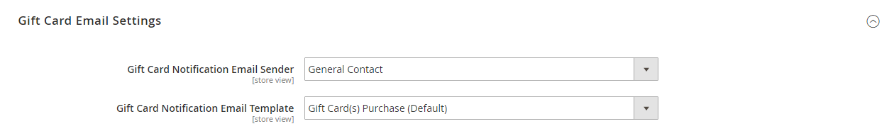
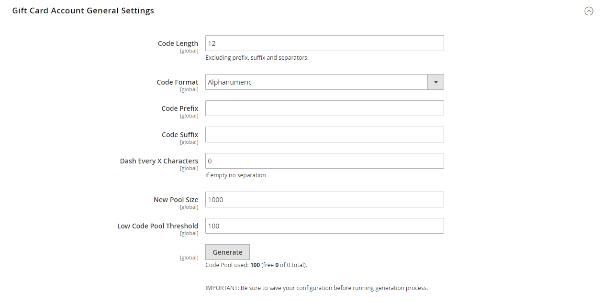

# [!UICONTROL Sales] > [!UICONTROL Gift Cards]

{{ee-feature}}

{{config}}

## [!UICONTROL Gift Card Email Settings]

<!-- zoom -->

<!-- [Gift Card Email Settings](https://docs.magento.com/user-guide/catalog/product-gift-card-account-configuration.html) -->

| Campo | [Ambito](../../getting-started/websites-stores-views.md#scope-settings) | Descrizione |
|--- |--- |--- |
| [!UICONTROL Gift Card Notification Email Sender] | Visualizzazione store | Identifica il [contatto store](../../getting-started/store-details.md#store-email-addresses) visualizzato come mittente dell&#39;e-mail di notifica gift card. Valore predefinito: `General Contact` |
| [!UICONTROL Gift Card Notification Email Template] | Visualizzazione store | Determina la [modello](../../systems/email-templates.md) utilizzato per l&#39;e-mail di notifica gift card. |

{style="table-layout:auto"}

## [!UICONTROL Gift Card General Settings]

<!-- zoom -->

<!-- [Gift Card General Settings](https://docs.magento.com/user-guide/catalog/product-gift-card-account-configuration.html) -->

| Campo | [Ambito](../../getting-started/websites-stores-views.md#scope-settings) | Descrizione |
|--- |--- |--- |
| [!UICONTROL Redeemable] | Globale | Determina se il titolare della gift card può riscattare il proprio valore in contanti. Opzioni: `Yes` / `No`. |
| [!UICONTROL Lifetime (days)] | Globale | Determina il numero di giorni di validità della scheda. Se lasciata vuota, la scheda non scade.   **_Importante:_**In alcuni casi, è illegale impostare una data di scadenza sulle carte regalo. Controlla le leggi locali prima di impostare una vita per le tue carte regalo. |
| [!UICONTROL Allow Gift Message] | Visualizzazione store | Determina se l&#39;opzione per includere un messaggio regalo è disponibile per i clienti che acquistano una gift card. Opzioni: `Yes` / `No`. |
| [!UICONTROL Gift Message Maximum Length] | Visualizzazione store | Determina il numero massimo di caratteri consentiti in un messaggio gift card. Valore predefinito: 255 |
| [!UICONTROL Generate Gift Card Account when Order Item is] | Globale | Determina se viene generato un conto gift card quando un cliente effettua un ordine o quando l&#39;ordine viene fatturato. Opzioni: `Ordered` / `Invoiced` |

{style="table-layout:auto"}

## [!UICONTROL Email Sent from Gift Card Account Management]

<!-- zoom -->

<!-- [Email Sent from Gift Card Account Management](https://docs.magento.com/user-guide/catalog/product-gift-card-account-configuration.html) -->

| Campo | [Ambito](../../getting-started/websites-stores-views.md#scope-settings) | Descrizione |
|--- |--- |--- |
| [!UICONTROL Gift Card Email Sender] | Visualizzazione store | Identifica il [contatto store](../../getting-started/store-details.md#store-email-addresses) che viene visualizzato come mittente dell&#39;e-mail della gift card. Valore predefinito: `General Contact` |
| [!UICONTROL Gift Card Template] | Visualizzazione store | Determina la [modello](../../systems/email-templates.md) che viene utilizzato per l’e-mail della gift card. |

{style="table-layout:auto"}

## [!UICONTROL Gift Card Account General Settings]

<!-- zoom -->

<!-- [Gift Card Account General Settings](https://docs.magento.com/user-guide/catalog/product-gift-card-account-configuration.html) -->

| Campo | [Ambito](../../getting-started/websites-stores-views.md#scope-settings) | Descrizione |
|--- |--- |--- |
| [!UICONTROL Code Length] | Globale | Determina la lunghezza del codice gift card. |
| [!UICONTROL Code Format] | Globale | Determina il formato del codice gift card. Opzioni: `Alphanumeric` / `Numeric` |
| [!UICONTROL Code Prefix] | Globale | Definisce qualsiasi prefisso aggiunto all&#39;inizio del codice. |
| [!UICONTROL Code Suffix] | Globale | Definisce qualsiasi suffisso aggiunto alla fine del codice. |
| [!UICONTROL Dash Every X Characters] | Globale | Se si desidera includere trattini nel codice, determina il numero di caratteri tra ogni trattino. |
| [!UICONTROL New Pool Size] | Globale | Determina la dimensione del nuovo pool di codici da generare. |
| [!UICONTROL Low Code Pool Threshold] | Globale | Determina il numero di record nel pool di codice che attivano un avviso per segnalare che il pool deve essere rifornito. |
| [!UICONTROL Generate] | Globale | Fare clic per generare l&#39;elenco dei codici gift card. |

{style="table-layout:auto"}
