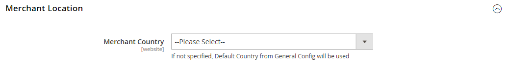
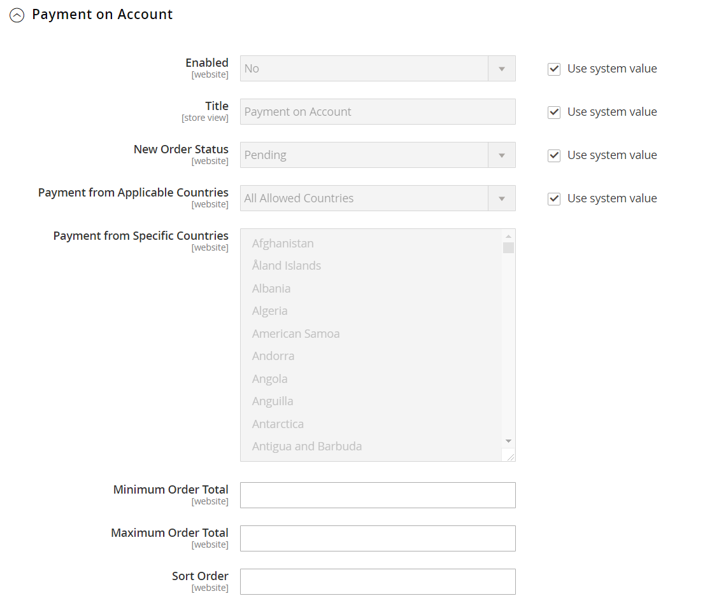
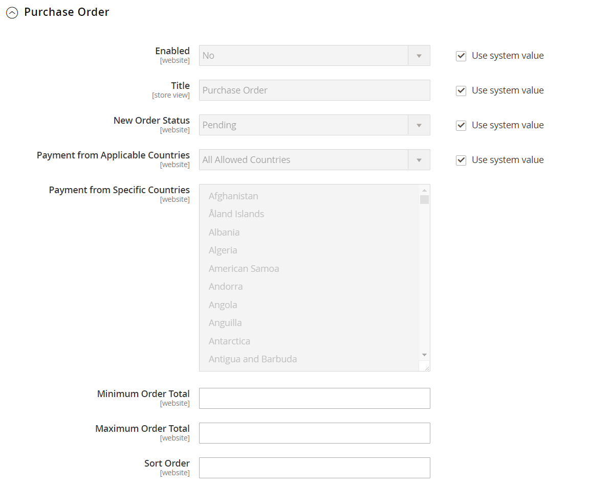

# [!UICONTROL Sales] > [!UICONTROL Payment Methods]

>[!TIP]
>
>Payment Services per Adobe Commerce e Magento Open Source fornisce una soluzione self-service chiavi in mano, che include test sandbox e una configurazione semplice, per fornire un’elaborazione dei pagamenti solida e sicura. Per ulteriori informazioni su questo potente set di strumenti e su come può fornirti le informazioni e il controllo necessari per creare la migliore esperienza per i tuoi acquirenti, consulta la [_Guida utente per i servizi di pagamento_](https://experienceleague.adobe.com/docs/commerce-merchant-services/payment-services/guide-overview.html).

{{config}}

## [!UICONTROL Merchant Location]

<!-- zoom -->

<!-- [Merchant Location](https://experienceleague.adobe.com/en/docs/commerce-admin/start/setup/store-details#merchant-location) -->

| Campo | [Ambito](../../getting-started/websites-stores-views.md#scope-settings) | Descrizione |
|--- |--- |--- |
| [!UICONTROL Merchant Country] | Sito Web | Identifica il paese in cui l&#39;esercente è registrato per esercitare l&#39;attività. |

{style="table-layout:auto"}

## Soluzioni consigliate

Le seguenti soluzioni di pagamento sono consigliate come un modo semplice per gli esercenti che stanno iniziando ad accettare il pagamento online tramite conto PayPal o carta di credito. Man mano che la tua azienda cresce, puoi combinarli con altre soluzioni di pagamento PayPal.

- [Pagamento PayPal Express](paypal-express-checkout.md)
- [Braintree](braintree.md)
- [Servizi di pagamento](payment-services.md)

>[!NOTE]
>
>Alcune integrazioni di pagamenti ed estensioni in bundle sono state rimosse nelle versioni 2.4.x e spostate in Commerce Marketplace. Puoi trovare le ultime estensioni ufficiali di integrazione pagamenti in [Commerce Marketplace](https://marketplace.magento.com/extensions/payments-security.html){:target="_blank"}.
> 
>**Amazon Pay** e **Klarna**: Adobe Commerce e le versioni di Magento Open Source da 2.4.0 a 2.4.3 includevano queste estensioni sviluppate dal fornitore. A partire dalla versione 2.4.4, queste estensioni non sono più incluse nella versione di base e devono essere installate e aggiornate dalla versione di Commerce Marketplace. Il Marketplace fornisce anche accesso alla documentazione corrente fornita dallo sviluppatore dell’estensione.
> 
>Se una di queste estensioni in bundle è abilitata e configurata, devi aggiornare il file `composer.json` come parte del processo di aggiornamento 2.4.4 e gestire gli aggiornamenti delle estensioni in futuro. Per ulteriori informazioni, vedere [Moduli di aggiornamento](https://experienceleague.adobe.com/docs/commerce-operations/upgrade-guide/modules/upgrade.html) nella _Guida all&#39;aggiornamento_. 
> 
>**Worldpay**, **Eway**, **CyberSource** e **Authorize.Net**: per informazioni dettagliate sull&#39;esecuzione di una transizione sicura da queste integrazioni di pagamento, vedere [DevBlog](https://community.magento.com/t5/Magento-DevBlog/Deprecation-of-Magento-core-payment-integrations/ba-p/426445){:target="_blank"}.

## Altri metodi PayPal

PayPal offre diverse soluzioni di pagamento che soddisfano le esigenze delle aziende di ogni dimensione e che operano in tutto il mondo. PayPal consente di accettare pagamenti da tutte le principali carte di debito e di credito. PayPal offre ulteriore comodità senza sforzi aggiuntivi, perché anche i clienti che non hanno un conto PayPal possono pagare i loro acquisti con PayPal.

### Metodi all-in-one PayPal

- [Pagamento PayPal anticipato](paypal-payments-advanced.md)
- [Pagamenti PayPal Pro](paypal-payments-pro.md)
- [Pagamenti PayPal Standard](paypal-payments-standard.md)

### Gateway di pagamento PayPal

- [PayPal Payflow Pro](paypal-payflow-pro.md) (Comprende Pagamento rapido)
- [PayPal Payflow Link](paypal-payflow-link.md) (Include Pagamento Espresso)

## Metodi di pagamento di base

I seguenti metodi di pagamento sono incorporati in Commerce e non utilizzano un fornitore di servizi di pagamento di terze parti per elaborare la transazione. Molti dei metodi di pagamento di base sono gestiti offline anziché online.

### [!UICONTROL Check / Money Order]

<!-- zoom -->

<!-- [Check / Money Order](https://experienceleague.adobe.com/en/docs/commerce-admin/stores-sales/payments/offline/check-money-order) -->

| Campo | [Ambito](../../getting-started/websites-stores-views.md#scope-settings) | Descrizione |
|--- |--- |--- |
| [!UICONTROL Enabled] | Sito Web | Determina se i clienti possono pagare tramite assegno o vaglia postale. Opzioni: `Yes` / `No` |
| [!UICONTROL Title] | Visualizzazione store | Il nome di questo metodo di pagamento che viene visualizzato ai clienti durante il pagamento. |
| [!UICONTROL New Order Status] | Sito Web | Determina lo stato iniziale dell&#39;[ordine](../../stores-purchase/order-status.md) assegnato agli ordini pagati tramite assegno o vaglia postale. Valore predefinito: `Pending` |
| [!UICONTROL Payment from Applicable Countries] | Sito Web | Determina i paesi da cui si accetta il pagamento tramite assegno o vaglia postale. Opzioni: `All Allowed Countries` / `Specific Countries` |
| [!UICONTROL Payment from Specific Countries] | Sito Web | Identifica i paesi specifici da cui si accetta il pagamento tramite assegno o vaglia postale. |
| [!UICONTROL Make Check Payable to] | Visualizzazione store | Il nome dell&#39;entità a cui gli assegni e i vaglia postali dovrebbero essere esigibili. |
| [!UICONTROL Send Check to] | Visualizzazione store | Indirizzo stradale o casella postale presso il quale devono essere inviati gli assegni e i vaglia postali. |
| [!UICONTROL Minimum Order Total] | Sito Web | Importo minimo dell&#39;ordine che può essere pagato tramite assegno o vaglia postale. |
| [!UICONTROL Maximum Order Total] | Sito Web | L&#39;importo massimo dell&#39;ordine che può essere pagato tramite assegno o vaglia postale.   **_Nota:_**un ordine è qualificato se il totale è compreso tra, o corrisponde, al totale minimo o massimo dell&#39;ordine. |
| [!UICONTROL Sort Order] | Sito Web | Numero che determina l&#39;ordine di visualizzazione del pagamento tramite assegno o vaglia postale se elencato con altri metodi di pagamento durante il pagamento. Immetti `0` per collocarlo all&#39;inizio dell&#39;elenco. |

{style="table-layout:auto"}

### [!UICONTROL Bank Transfer Payment]

<!-- zoom -->

<!-- [Bank Transfer Payment](https://experienceleague.adobe.com/en/docs/commerce-admin/stores-sales/payments/offline/bank-transfer) -->

| Campo | [Ambito](../../getting-started/websites-stores-views.md#scope-settings) | Descrizione |
|--- |--- |--- |
| [!UICONTROL Enabled] | Sito Web | Determina se i clienti possono pagare trasferendo il pagamento direttamente dalla banca al conto dell&#39;esercente. Opzioni: `Yes` / `No` |
| [!UICONTROL Title] | Visualizzazione store | Il nome di questo metodo di pagamento che viene visualizzato ai clienti durante il pagamento. |
| [!UICONTROL New Order Status] | Sito Web | Determina lo stato dell&#39;ordine iniziale assegnato agli ordini pagati tramite bonifico bancario. Valore predefinito: `Pending` |
| [!UICONTROL Payment from Applicable Countries] | Sito Web | Determina i paesi da cui si accetta il pagamento tramite bonifico bancario. Opzioni: `All Allowed Countries` / `Specific Countries` |
| [!UICONTROL Payment from Specific Countries] | Sito Web | Identifica i paesi specifici da cui si accetta il pagamento tramite bonifico bancario. |
| [!UICONTROL Minimum Order Total] | Sito Web | Importo minimo dell&#39;ordine che può essere pagato tramite bonifico bancario. |
| [!UICONTROL Maximum Order Total] | Sito Web | L&#39;importo massimo dell&#39;ordine che può essere pagato tramite bonifico bancario.   **_Nota:_**un ordine è qualificato se il totale è compreso tra, o corrisponde, al totale minimo o massimo dell&#39;ordine. |
| [!UICONTROL Sort Order] | Sito Web | Numero che determina l&#39;ordine di visualizzazione del pagamento tramite bonifico bancario se elencato con altri metodi di pagamento durante il pagamento. Immetti `0` per collocarlo all&#39;inizio dell&#39;elenco. |

{style="table-layout:auto"}

### [!UICONTROL Payment on Account]

{{b2b-feature}}

<!-- zoom -->

<!-- [Payment on Account](https://experienceleague.adobe.com/en/docs/commerce-admin/b2b/enable-basic-features#configure-payment-on-account) -->

| Campo | [Ambito](../../getting-started/websites-stores-views.md#scope-settings) | Descrizione |
|--- |--- |--- |
| [!UICONTROL Enabled] | Sito Web | Determina se le società possono utilizzare il credito aziendale per effettuare acquisti. Opzioni: `Yes` / `No` |
| [!UICONTROL Title] | Visualizzazione store | Il nome di questo metodo di pagamento che viene visualizzato ai clienti durante il pagamento. |
| [!UICONTROL New Order Status] | Sito Web | Determina lo stato dei nuovi ordini addebitati a un conto della società. Opzioni: `Pending (default)` / `Processing` / `Suspected Fraud` |
| [!UICONTROL Payment from Applicable Countries] | Sito Web | Determina i paesi in cui le aziende possono addebitare gli acquisti sui propri conti. Opzioni: `All Allowed Countries` / `Specific Countries` |
| [!UICONTROL Payment from Specific Countries] | Sito Web | Identifica i paesi specifici in cui le aziende possono addebitare gli acquisti sui propri conti. |
| [!UICONTROL Minimum Order Total] | Sito Web | Specifica l&#39;importo dell&#39;ordine più piccolo che può essere addebitato a un conto aziendale. |
| [!UICONTROL Maximum Order Total] | Sito Web | L&#39;importo massimo dell&#39;ordine che può essere addebitato a un conto aziendale.   **_Nota:_**un ordine è qualificato se il totale è compreso tra, o corrisponde, al totale minimo o massimo dell&#39;ordine. |
| [!UICONTROL Sort Order] | Sito Web | Numero che determina l&#39;ordine di visualizzazione del pagamento dell&#39;acconto se elencato con altri metodi di pagamento durante il pagamento. Immetti `0` per collocarlo all&#39;inizio dell&#39;elenco. |

{style="table-layout:auto"}

>[!NOTE]
>
>Il pagamento in conto non è supportato per gli ordini con [più indirizzi di spedizione](../../stores-purchase/shipping-settings.md#multiple-addresses) e non viene visualizzato tra le opzioni di pagamento.

### [!UICONTROL Cash On Delivery Payment]

<!-- zoom -->

<!-- [Cash On Delivery Payment](../../stores-purchase/cash-on-delivery.html) -->

| Campo | [Ambito](../../getting-started/websites-stores-views.md#scope-settings) | Descrizione |
|--- |--- |--- |
| [!UICONTROL Enabled] | Sito Web | Determina se i clienti possono pagare trasferendo il pagamento direttamente dalla banca al conto dell&#39;esercente. Opzioni: `Yes` / `No` |
| [!UICONTROL Title] | Visualizzazione store | Il nome di questo metodo di pagamento che viene visualizzato ai clienti durante il pagamento. |
| [!UICONTROL New Order Status] | Sito Web | Determina lo stato dell&#39;ordine iniziale assegnato agli ordini pagati tramite bonifico bancario. Valore predefinito: `Pending` |
| [!UICONTROL Payment from Applicable Countries] | Sito Web | Determina i paesi da cui si accetta il pagamento tramite bonifico bancario. Opzioni: `All Allowed Countries` / `Specific Countries` |
| [!UICONTROL Payment from Specific Countries] | Sito Web | Identifica i paesi specifici da cui si accetta il pagamento tramite bonifico bancario. |
| [!UICONTROL Minimum Order Total] | Sito Web | Specifica l&#39;importo minimo dell&#39;ordine che può essere pagato tramite bonifico bancario. |
| [!UICONTROL Maximum Order Total] | Sito Web | L&#39;importo massimo dell&#39;ordine che può essere pagato tramite bonifico bancario.   **_Nota:_**un ordine è qualificato se il totale è compreso tra, o corrisponde, al totale minimo o massimo dell&#39;ordine. |
| [!UICONTROL Sort Order] | Sito Web | Numero che determina l&#39;ordine di visualizzazione del pagamento tramite bonifico bancario se elencato con altri metodi di pagamento durante il pagamento. Immetti `0` per collocarlo all&#39;inizio dell&#39;elenco. |

{style="table-layout:auto"}

### [!UICONTROL Zero Subtotal Checkout]

<!-- zoom -->

<!-- [Zero Subtotal Checkout](../../stores-purchase/zero-subtotal-checkout.html) -->

| Campo | [Ambito](../../getting-started/websites-stores-views.md#scope-settings) | Descrizione |
|--- |--- |--- |
| [!UICONTROL Title] | Visualizzazione store | Nome utilizzato per questo metodo di pagamento durante l&#39;estrazione. Valore predefinito: nessuna informazione di pagamento richiesta |
| [!UICONTROL Enabled] | Sito Web | Determina se l&#39;opzione Estrazione subtotale zero è disponibile per consentire all&#39;amministratore del negozio di gestire gli ordini con un subtotale pari a zero, ad esempio quelli che sono stati tassati, ma che uno sconto ha ridotto l&#39;importo a zero. Opzioni: `Yes` / `No` |
| [!UICONTROL New Order Status] | Sito Web | Determina lo stato dell&#39;ordine iniziale assegnato agli ordini elaborati come Checkout subtotale zero. Valore predefinito: `Pending` |
| [!UICONTROL Payment from Applicable Countries] | Sito Web | Determina i paesi da cui è possibile applicare il Check-Out del subtotale zero. Opzioni: `All Allowed Countries` / `Specific Countries` |
| [!UICONTROL Payment from Specific Countries] | Sito Web | Identifica i paesi specifici per i quali è possibile applicare il Checkout subtotale zero. |
| [!UICONTROL Sort Order] | Sito Web | Un numero che determina l&#39;ordine in cui il titolo, ad esempio &quot;Nessuna informazione di pagamento è richiesta&quot;, viene visualizzato quando elencato con altri metodi di pagamento durante il pagamento. Immetti `0` per collocarlo all&#39;inizio dell&#39;elenco. |

{style="table-layout:auto"}

## [!UICONTROL Payment actions]

Le azioni di pagamento sono configurate _per metodo di pagamento_. L&#39;azione di pagamento determina quando vengono acquisiti i fondi e quando vengono create le fatture per gli ordini di vendita.

Per un elenco completo delle singole opzioni di configurazione, consulta la sezione Impostazioni di base di ogni singolo metodo di pagamento.

| Azione di pagamento | Descrizione |
|--- |---|
| [!UICONTROL Authorization] | Approva l&#39;acquisto, ma blocca i fondi. L&#39;importo non viene prelevato fino a quando non viene catturato dal commerciante. |
| [!UICONTROL Authorize] | Autorizza il conto dell&#39;acquirente per il totale dell&#39;ordine ma non acquisisce il pagamento. Acquisisci il pagamento creando una fattura. È possibile annullare o annullare gli ordini autorizzati. |
| [!UICONTROL Authorize and Capture] | Autorizza il conto dell&#39;acquirente per il totale dell&#39;ordine e acquisisce il pagamento. Viene creata automaticamente una fattura. È possibile rimborsare i fondi acquisiti tramite nota di credito. Non puoi annullare un ordine una volta acquisito il pagamento. |
| [!UICONTROL Charge on shipment] | Amazon riceve una richiesta di acquisizione e addebita al cliente una fattura creata in Commerce. |
| [!UICONTROL Charge on order] | Amazon crea la fattura e addebita al cliente quando l&#39;ordine viene effettuato. |
| [!UICONTROL Not Capture] | Quando la fattura viene inviata, il sistema non acquisisce il pagamento. Si presume che il pagamento venga acquisito tramite Commerce in un secondo momento. Nella fattura completata è presente un pulsante Acquisisci. Prima dell&#39;acquisizione, è possibile annullare la fattura. Dopo l&#39;acquisizione, è possibile creare una nota di accredito e annullare la fattura. |
| [!UICONTROL Order] | Rappresenta un accordo con PayPal che consente all&#39;esercente di acquisire uno o più importi fino al totale dell&#39;ordine dal conto dell&#39;acquirente del cliente, entro un periodo di tempo definito (fino a 29 giorni). |
| [!UICONTROL Sale] | L&#39;importo dell&#39;acquisto è autorizzato e immediatamente prelevato dal conto del cliente. |

{style="table-layout:auto"}

>[!NOTE]
>
>Non selezionare l&#39;opzione _[!UICONTROL Not Capture]_a meno che non si sia certi che il pagamento verrà acquisito tramite Commerce in un secondo momento. Non è possibile creare una nota di accredito finché il pagamento non viene acquisito utilizzando il pulsante Acquisisci.

## [!UICONTROL Purchase Order]

<!-- zoom -->

<!-- [Purchase Order](../../stores-purchase/purchase-order.html) -->

| Campo | [Ambito](../../getting-started/websites-stores-views.md#scope-settings) | Descrizione |
|--- |--- |--- |
| [!UICONTROL Enabled] | Sito Web | Determina se i clienti possono pagare per ordine di acquisto (OA). Opzioni: `Yes` / `No` |
| [!UICONTROL Title] | Visualizzazione store | Il nome di questo metodo di pagamento che viene visualizzato ai clienti durante il pagamento. |
| [!UICONTROL New Order Status] | Sito Web | Determina lo stato iniziale dell&#39;[ordine](../../stores-purchase/order-status.md) assegnato agli ordini pagati da OA. Valore predefinito: In sospeso |
| [!UICONTROL Payment from Applicable Countries] | Sito Web | Determina i paesi dai quali si accetta il pagamento tramite OA. Opzioni: `All Allowed Countries` / `Specific Countries` |
| [!UICONTROL Payment from Specific Countries] | Sito Web | Identifica i paesi specifici da cui si accetta il pagamento tramite OA. |
| [!UICONTROL Minimum Order Total] | Sito Web | Importo minimo dell&#39;ordine che può essere pagato da OA. |
| [!UICONTROL Maximum Order Total] | Sito Web | Importo massimo dell&#39;ordine che può essere pagato da OA.   **_Nota:_**un ordine è qualificato se il totale è compreso tra, o corrisponde, al totale minimo o massimo dell&#39;ordine. |
| [!UICONTROL Sort Order] | Sito Web | Numero che determina l&#39;ordine di visualizzazione del pagamento tramite OA quando viene elencato con altri metodi di pagamento durante il pagamento. Immetti `0` per collocarlo all&#39;inizio dell&#39;elenco. |

{style="table-layout:auto"}
