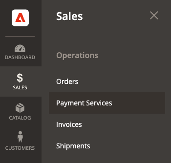

# [!UICONTROL Sales] > [!UICONTROL Payment Methods] > [!UICONTROL Payment Services]

Payment Services offre una soluzione self-service chiavi in mano, che include test sandbox e una configurazione semplice per fornire un’elaborazione dei pagamenti solida e sicura. Per ulteriori informazioni, consulta [_Guida utente di Payment Services_](https://experienceleague.adobe.com/docs/commerce-merchant-services/payment-services/guide-overview.html).

Per accedere alle impostazioni di configurazione per Servizi di pagamento, _Amministratore_ barra laterale vai a **[!UICONTROL Sales]** > **[!UICONTROL Payment Services]** e fai clic su **[!UICONTROL Settings]**.

{width="400"}

>[!NOTE]
>
>Per utilizzare la configurazione legacy invece di [Impostazioni](https://experienceleague.adobe.com/docs/commerce-merchant-services/payment-services/configure/settings.html), vedi [Configurazione legacy](https://experienceleague.adobe.com/docs/commerce-merchant-services/payment-services/configure/configure-admin.html).

## [!UICONTROL General]

{width="600" zoomable="yes"}

| Campo | [Ambito](../../getting-started/websites-stores-views.md#scope-settings) | Descrizione |
|---|---|---|
| [!UICONTROL Enable] | sito web | Attiva o disattiva [!DNL Payment Services] per il tuo sito web. Opzioni: [!UICONTROL Yes] / [!UICONTROL No] |
| [!UICONTROL Payment mode] | visualizzazione store | Imposta il metodo o l’ambiente per lo store. Opzioni: [!UICONTROL Sandbox] / [!UICONTROL Production] |
| [!UICONTROL Sandbox Merchant ID] | visualizzazione store | L’ID venditore della sandbox, generato automaticamente durante l’onboarding della sandbox. |
| [!UICONTROL Production Merchant ID] | visualizzazione store | L’ID esercente di produzione, generato automaticamente durante l’onboarding della sandbox. |
| [!UICONTROL Soft Descriptor] | visualizzazione sito Web o store | Aggiungi un soft descriptor ai tuoi siti web e alle visualizzazioni dei negozi che fornisca informazioni sulle transazioni dei clienti e delinei marchi, negozi o linee di prodotti. Il [!UICONTROL Use website] applica un qualsiasi soft descriptor aggiunto a livello di sito web. Il [!UICONTROL Use default] applica o meno qualsiasi soft descriptor aggiunto come impostazione predefinita. |

{style="table-layout:auto"}

## [!UICONTROL Credit card fields]

{width="600" zoomable="yes"}

| Campo | [Ambito](../../getting-started/websites-stores-views.md#scope-settings) | Descrizione |
|---|---|---|
| [!UICONTROL Title] | visualizzazione store | Aggiungere il testo da visualizzare come titolo per questa opzione di pagamento nella vista Metodo di pagamento durante l&#39;estrazione. |
| [!UICONTROL Payment Action] | sito web | Il [azione di pagamento](payment-methods.md#payment-actions) per il metodo di pagamento specificato. Opzioni: [!UICONTROL Authorize] / [!UICONTROL Authorize and Capture] |
| [!UICONTROL 3DS Secure authentication] | sito web | Attiva o disattiva [Autenticazione protetta 3DS](https://experienceleague.adobe.com/docs/commerce-merchant-services/payment-services/security-compliance/security.html#3ds). Opzioni: [!UICONTROL Always] / [!UICONTROL When Required] / [!UICONTROL Off] |
| [!UICONTROL Show on checkout page] | sito web | Attiva o disattiva i campi della carta di credito da visualizzare nella pagina di pagamento. Opzioni: [!UICONTROL Yes] / [!UICONTROL No] |
| [!UICONTROL Vault enabled] | visualizzazione store | Attiva o disattiva [vaulting con carta di credito](https://experienceleague.adobe.com/docs/commerce-merchant-services/payment-services/payments-checkout/vaulting.html). Opzioni: [!UICONTROL Yes] / [!UICONTROL No] |
| [!UICONTROL Show vaulted payment methods in Admin] | visualizzazione store | Abilita o disabilita la possibilità di completare gli ordini per i clienti nell’Admin [utilizzo di un metodo di pagamento a scaffale](https://experienceleague.adobe.com/docs/commerce-merchant-services/payment-services/payments-checkout/vaulting.html). Opzioni: [!UICONTROL Yes] / [!UICONTROL No] |
| [!UICONTROL Debug Mode] | sito web | Attiva o disattiva la modalità di debug. Opzioni: [!UICONTROL Yes] / [!UICONTROL No] |

{style="table-layout:auto"}

## [!UICONTROL Payment buttons]

{width="600" zoomable="yes"}

| Campo | [Ambito](../../getting-started/websites-stores-views.md#scope-settings) | Descrizione |
|---|---|---|
| [!UICONTROL Title] | visualizzazione store | Aggiungere il testo da visualizzare come titolo per questa opzione di pagamento nella visualizzazione Metodo di pagamento durante l&#39;estrazione. |
| [!UICONTROL Payment Action] | sito web | Il [azione di pagamento](payment-methods.md#payment-actions){target="_blank"} per il metodo di pagamento specificato. Opzioni: [!UICONTROL Authorize] / [!UICONTROL Authorize and Capture] |
| [!UICONTROL Show PayPal buttons on checkout page] | visualizzazione store | Attiva o disattiva [!DNL PayPal Smart Buttons] nella pagina di pagamento. Opzioni: [!UICONTROL  Yes] / [!UICONTROL No] |
| [!UICONTROL Show PayPal buttons on product detail page] | visualizzazione store | Attiva o disattiva [!DNL PayPal Smart Buttons] nella pagina dei dettagli del prodotto. Opzioni: [!UICONTROL  Yes] / [!UICONTROL No] |
| [!UICONTROL Show PayPal buttons in mini-cart preview] | visualizzazione store | Attiva o disattiva [!DNL PayPal Smart Buttons] nell’anteprima del mini-carrello. Opzioni: [!UICONTROL Yes] / [!UICONTROL No] |
| [!UICONTROL Show PayPal buttons on cart page] | visualizzazione store | Attiva o disattiva [!DNL PayPal Smart Buttons] sulla pagina del carrello. Opzioni: [!UICONTROL Yes] / [!UICONTROL No] |
| [!UICONTROL Show PayPal Pay Later button] | visualizzazione store | Abilita o disabilita l&#39;aspetto dell&#39;opzione di pagamento successivo in cui vengono visualizzati i pulsanti di pagamento. Opzioni: [!UICONTROL Yes] / [!UICONTROL No] |
| [!UICONTROL Show PayPal Pay Later Message] | sito web | Abilita o disabilita la funzione di messaggistica Paga più tardi nel carrello, nella pagina del prodotto, nel mini-carrello e durante il flusso di pagamento. Opzioni: [!UICONTROL Yes] / [!UICONTROL No] |
| [!UICONTROL Show Venmo button] | visualizzazione store | Abilita o disabilita l&#39;opzione di pagamento Venmo in cui sono visualizzati i pulsanti di pagamento. Opzioni: [!UICONTROL Yes] / [!UICONTROL No] |
| [!UICONTROL Show Apple Pay button] | visualizzazione store | Abilita o disabilita l&#39;opzione di pagamento Apple Pay in cui sono visualizzati i pulsanti di pagamento. Opzioni: [!UICONTROL Yes] / [!UICONTROL No] |
| [!UICONTROL Show PayPal Credit and Debit card button] | visualizzazione store | Abilita o disabilita l&#39;opzione di pagamento con carta di credito e debito in cui sono visualizzati i pulsanti di pagamento. Opzioni: [!UICONTROL Yes] / [!UICONTROL No] |
| [!UICONTROL Debug Mode] | sito web | Attiva o disattiva la modalità di debug. Opzioni: [!UICONTROL Yes] / [!UICONTROL No] |

{style="table-layout:auto"}

## [!UICONTROL PayPal Smart Button Styling]

{width="600" zoomable="yes"}

| Campo | [Ambito](../../getting-started/websites-stores-views.md#scope-settings) | Descrizione |
|--- |--- |--- |
| [!UICONTROL Layout] | Visualizzazione store | Consente di definire lo stile del layout dei pulsanti di pagamento. Opzioni: [!UICONTROL Vertical] / [!UICONTROL Horizontal] |
| [!UICONTROL Tagline] | Visualizzazione store | Attiva/disattiva tagline. Opzioni: [!UICONTROL Yes] / [!UICONTROL No] |
| [!UICONTROL Color] | Visualizzazione store | Definire il colore dei pulsanti di pagamento. Opzioni: [!UICONTROL Blue] / [!UICONTROL Gold] / [!UICONTROL Silver] / [!UICONTROL White] / [!UICONTROL Black] |
| [!UICONTROL Shape] | Visualizzazione store | Definire la forma dei pulsanti di pagamento. Opzioni: [!UICONTROL Rectangular] / [!UICONTROL Pill] |
| [!UICONTROL Responsive Button Height] | Visualizzazione store | Definisce se i pulsanti di pagamento utilizzano un&#39;altezza predefinita. Opzioni: [!UICONTROL Yes] / [!UICONTROL No] |
| [!UICONTROL Height] | Visualizzazione store | Definire l&#39;altezza dei pulsanti di pagamento. Valore predefinito: nessuno |
| [!UICONTROL Label] | Visualizzazione store | Definire l&#39;etichetta visualizzata nei pulsanti di pagamento. Opzioni: [!UICONTROL PayPal] / [!UICONTROL Checkout] / [!UICONTROL Buynow] / [!UICONTROL Pay] / [!UICONTROL Installment] |

{style="table-layout:auto"}
