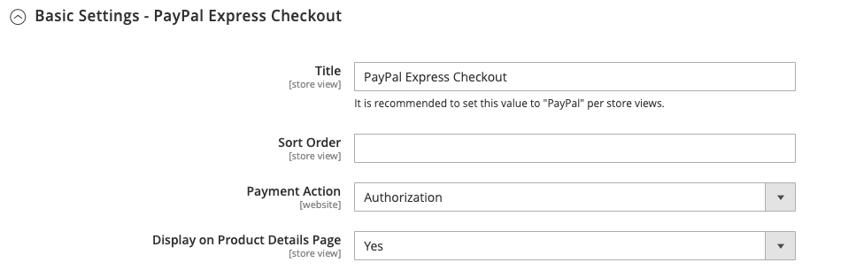

# [!UICONTROL Sales] > [!UICONTROL Payment Methods] > [!UICONTROL PayPal Express Checkout]

>[!IMPORTANT]
>
>**Requisiti PSD2:**  
>A partire dal 14 settembre 2019, le banche europee potrebbero rifiutare i pagamenti che non soddisfano i requisiti di [PSD2](../../getting-started/compliance-payment-services-directive.md). Non è necessaria alcuna azione affinché PayPal Express Checkout sia conforme a PSD2 perché tutti i requisiti sono gestiti da PayPal.

{{config}}

## [!UICONTROL Required PayPal Settings]

<!-- zoom -->

<!-- [PayPal Express Checkout Required Settings](../../stores-purchase/paypal-express-checkout.html) -->

| Campo | [Ambito](../../getting-started/websites-stores-views.md#scope-settings) | Descrizione |
|--- |--- |--- |
| [!UICONTROL Enable this Solution] | Sito Web | Attiva [!DNL PayPal Express Checkout] come metodo di pagamento disponibile per i clienti. Opzioni: `Yes` / `No` |
| [!UICONTROL Enable In-Context Checkout Experience] | Sito Web | Attiva PayPal in-Context Checkout semplificato come metodo di pagamento disponibile per i clienti. Opzioni: `Yes` / `No` |
| [!UICONTROL Enable PayPal Credit] | Sito Web | Attiva PayPal Credit per consentire ai clienti di acquistare ora, ma di pagare in seguito. Si viene pagati in anticipo, ma i clienti hanno più tempo per pagare. Opzioni: `Yes` / `No` |

{style="table-layout:auto"}

### [!UICONTROL Express Checkout]

| Campo | [Ambito](../../getting-started/websites-stores-views.md#scope-settings) | Descrizione |
|--- |--- |--- |
| [!UICONTROL Email Associated with PayPal Merchant Account] | Sito Web | Specifica l&#39;indirizzo e-mail specificato al momento dell&#39;apertura del conto PayPal dell&#39;esercente. L&#39;indirizzo email fa distinzione tra maiuscole e minuscole e deve corrispondere esattamente al tuo indirizzo email nel sistema PayPal. |
| [!UICONTROL API Authentication Methods] | Sito Web | Determina il metodo utilizzato per l’autenticazione API. Opzioni:  **`API Signature`**- Visualizza il campo _[!UICONTROL API Signature]_nel modulo. **`API Certificate`**- Visualizza il campo_[!UICONTROL API Certificate]_ nel modulo. |
| [!UICONTROL API Username] | Sito Web | Il nome utente API associato al tuo account esercente PayPal. |
| [!UICONTROL API Password] | Sito Web | La password API associata al tuo conto PayPal per esercenti. |
| [!UICONTROL API Signature] | Sito Web | La firma API associata al tuo conto PayPal per esercenti. |
| [!UICONTROL API Certificate] | Sito Web | Sfoglia per caricare il certificato API. |
| [!UICONTROL Get Credentials from PayPal] |  | Recupera le credenziali API da PayPal. |
| [!UICONTROL Sandbox Credentials] |  | Recupera le credenziali sandbox da PayPal. |
| [!UICONTROL Sandbox Mode] | Sito Web | Per eseguire il Checkpoint PayPal Express in un ambiente di test, immettere le credenziali API sandbox e impostarle su `Yes`. Opzioni: `Yes` / `No` |
| [!UICONTROL API Uses Proxy] | Sito Web | Se il sistema utilizza un server proxy per stabilire la connessione tra Commerce e il sistema PayPal, impostarlo su `Yes`. Opzioni: `Yes` / `No` |
| [!UICONTROL Proxy Host] | Sito Web | Se l’API utilizza il proxy, questo specifica l’indirizzo IP dell’host proxy. |
| [!UICONTROL Proxy Port] | Sito Web | Se l&#39;API utilizza il proxy, specifica la porta utilizzata dall&#39;host proxy. |

{style="table-layout:auto"}

### [!UICONTROL Advertise PayPal Credit]

<!-- zoom -->

| Campo | [Ambito](../../getting-started/websites-stores-views.md#scope-settings) | Descrizione |
|--- |--- |--- |
| [!UICONTROL Publisher ID] | Sito Web | L&#39;ID editore associato al tuo conto PayPal Credit. |
| [!UICONTROL Get Publisher ID from PayPal] |  | Recupera l&#39;ID editore da PayPal. |
| [!UICONTROL Home Page] | Sito Web | Determina la posizione e le dimensioni del banner [!DNL PayPal Credit] nella home page. Opzioni:  **Visualizzazione** - Visualizza un banner [!DNL PayPal Credit] nella home page dell&#39;archivio. Opzioni: `Yes` / `No`  **Posizione** - Determina la posizione del banner [!DNL PayPal Credit] nella home page. Opzioni: Intestazione (al centro) / Barra laterale (a destra)  **Dimensioni** - Determina le dimensioni del banner [!DNL PayPal Credit] nella home page. Opzioni: `190 x 100` / `234 x 60` / `300 x 50` / `468 x 60` / `728 x 90` /` 800 x 66` |
| [!UICONTROL Catalog Category Page] | Sito Web | Determina la posizione e le dimensioni del banner [!DNL PayPal Credit] nelle pagine delle categorie. Opzioni: (come per [!UICONTROL Home Page]) |
| [!UICONTROL Catalog Product Page] | Sito Web | Determina la posizione e le dimensioni del banner [!DNL PayPal Credit] nelle pagine dei prodotti. Opzioni: (come per [!UICONTROL Home Page]) |
| [!UICONTROL Checkout Cart Page] | Sito Web | Determina la posizione e le dimensioni del banner [!DNL PayPal Credit] sulla pagina del carrello. Opzioni: (come per [!UICONTROL Home Page]) |

{style="table-layout:auto"}

## [!UICONTROL Basic Settings]

<!-- zoom -->

| Campo | [Ambito](../../getting-started/websites-stores-views.md#scope-settings) | Descrizione |
|--- |--- |--- |
| [!UICONTROL Title] | Visualizzazione store | Nome che identifica il metodo di pagamento PayPal Express Checkout durante il pagamento. |
| [!UICONTROL Sort Order] | Visualizzazione store | Un numero che determina l&#39;ordine di pagamento che PayPal Express Checkout viene visualizzato quando elencato con altri metodi di pagamento durante il pagamento. Immetti `0` come primo elemento dell&#39;elenco. |
| [!UICONTROL Payment Action] | Sito Web | Determina l&#39;azione intrapresa da PayPal quando riceve un ordine. Opzioni:  **`Authorization`**- Approva l&#39;acquisto, ma blocca i fondi. L&#39;importo non viene prelevato fino a quando non viene &quot;catturato&quot; dal mercante. **`Sale`** - L&#39;importo dell&#39;acquisto è autorizzato e immediatamente ritirato dal conto del cliente.  **`Order`**- Rappresenta un accordo con PayPal che consente all&#39;esercente di acquisire uno o più importi fino al totale ordinato dal conto dell&#39;acquirente del cliente, entro un periodo di tempo definito. Questo può essere fino a 29 giorni. Per acquisire i fondi, è necessario generare una o più fatture dall&#39;amministratore di Commerce. |
| [!UICONTROL Display on Product Details Page] | Visualizzazione store | Determina se il pulsante &quot;Paga con PayPal&quot; viene visualizzato nelle pagine dei prodotti. Le opzioni includono: `Yes` / `No` |

{style="table-layout:auto"}

## [!UICONTROL Advanced Settings]

<!-- zoom -->

| Campo | [Ambito](../../getting-started/websites-stores-views.md#scope-settings) | Descrizione |
|--- |--- |--- |
| [!UICONTROL Display on Shopping Cart] | Visualizzazione store | Determina se PayPal Express Checkout viene visualizzato come opzione di pagamento nel carrello. Opzioni: `Yes` (PayPal consigliato) / `No` |
| [!UICONTROL Payment Action Applicable From] | Sito Web | Determina l&#39;intervallo della selezione paese applicabile. Opzioni: `All Allowed Countries` / `Specific Countries` |
| [!UICONTROL Countries Payment Applicable From] | Sito Web | Identifica ogni paese dal quale il pagamento è accettato. Solo i clienti con un indirizzo di fatturazione in un paese selezionato possono effettuare acquisti con questo metodo di pagamento. |
| [!UICONTROL Debug Mode] | Sito Web | Registra i messaggi inviati tra il tuo negozio e il sistema di pagamento in un file di registro. Opzioni: `Yes` / `No`   **_Nota:_**Il file di registro è archiviato nel server ed è accessibile solo agli sviluppatori. In conformità agli standard di sicurezza dei dati PCI, le informazioni sulla carta di credito non vengono registrate nel file di registro. |
| [!UICONTROL Enable SSL Verification] | Sito Web | Abilita la verifica del certificato di sicurezza host. Opzioni: `Yes` / `No` |
| [!UICONTROL Transfer Cart Line Items] | Sito Web | Visualizza un riepilogo completo delle righe presenti nel carrello del cliente sul sito PayPal. Opzioni: `Yes` / `No` |
| [!UICONTROL Transfer Shipping Options] | Sito Web | Include fino a dieci opzioni di spedizione sul sito PayPal. Opzioni: `Yes` / `No` |
| [!UICONTROL Shortcut Buttons Flavor] | Visualizzazione store | Determina il tipo di immagine utilizzata per il pulsante di accettazione PayPal. Opzioni:  **`Dynamic`**- (Consigliato) Visualizza un&#39;immagine che può essere modificata dinamicamente dal server PayPal. **`Static`** - Visualizza un&#39;immagine statica che non può essere modificata dinamicamente. |
| [!UICONTROL Enable PayPal Guest Checkout] | Sito Web | Consente ai clienti che non dispongono di un conto PayPal di effettuare acquisti con PayPal Express Checkout. Opzioni: `Yes` / `No` |
| [!UICONTROL Require Customer's Billing Address] | Sito Web | Determina se l&#39;indirizzo di fatturazione del cliente è obbligatorio. Opzioni: `Yes` / `No` / `For Virtual Quotes Only` |
| [!UICONTROL Billing Agreement Signup] | Sito Web | Determina se i clienti possono stipulare un [contratto di fatturazione](../../stores-purchase/paypal-billing-agreements.md) con lo store. Opzioni:  **`Auto`**- Il cliente può iscriversi a un contratto di fatturazione durante il pagamento rapido. **`Ask Customer`** - Al cliente viene chiesto se desidera iscriversi a un contratto di fatturazione.  **`Never`**- Ai clienti non viene offerta la possibilità di iscriversi a un contratto di fatturazione. |
| [!UICONTROL Skip Order Review Step] | Sito Web | Determina se i clienti possono completare la transazione dal sito PayPal o se devono tornare al tuo negozio e completare il passaggio di revisione dell&#39;ordine prima di sottomettere l&#39;ordine. Opzioni: `Yes` / `No` |

{style="table-layout:auto"}

### [!UICONTROL Billing Agreement Settings]

<!-- zoom -->

| Campo | [Ambito](../../getting-started/websites-stores-views.md#scope-settings) | Descrizione |
|--- |--- |--- |
| [!UICONTROL Enabled] | Sito Web | Quando questa opzione è abilitata, gli accordi di fatturazione vengono visualizzati ai clienti come opzione di pagamento durante il pagamento. Opzioni: `Yes` / `No` |
| [!UICONTROL Title] | Visualizzazione store | Etichetta per l&#39;opzione di contratto di fatturazione PayPal visualizzata come opzione di pagamento durante il pagamento. |
| [!UICONTROL Sort Order] | Visualizzazione store | Determina l&#39;ordine in cui gli accordi di fatturazione vengono elencati con altri metodi di pagamento durante il pagamento. |
| [!UICONTROL Payment Action] | Sito Web | Determina il modo in cui PayPal gestisce la transazione: Opzioni:  **Autorizzazione** - Approva l&#39;acquisto, ma blocca i fondi. L&#39;importo non viene prelevato fino a quando non viene &quot;catturato&quot; dal mercante.  **Vendita** - L&#39;importo dell&#39;acquisto è autorizzato e immediatamente ritirato dal conto del cliente. |
| [!UICONTROL Payment Applicable From] | Sito Web | Determina l&#39;intervallo della selezione paese applicabile. Opzioni: Tutti I Paesi Consentiti/Specifici Paesi |
| [!UICONTROL Countries Payment Applicable From] | Sito Web | Identifica ogni paese dal quale il pagamento è accettato. Solo i clienti con un indirizzo di fatturazione in un paese selezionato possono effettuare acquisti con questo metodo di pagamento. |
| [!UICONTROL Debug Mode] | Sito Web | Registra la comunicazione con il sistema di pagamento in un file di registro. Opzioni: `Yes` / `No`   **_Nota:_**Il file di registro è archiviato nel server ed è accessibile solo agli sviluppatori. In conformità agli standard di sicurezza dei dati PCI, le informazioni sulla carta di credito non vengono registrate nel file di registro. |
| [!UICONTROL Enable SSL Verification] | Sito Web | Abilita un passaggio di verifica su per garantire che la transazione avvenga su un canale SSL crittografato. Opzioni: `Yes` / `No` |
| [!UICONTROL Transfer Cart Line Items] | Sito Web | Quando questa opzione è attivata, visualizza un riepilogo delle righe del carrello nella pagina dei pagamenti di PayPal. Opzioni: `Yes` / `No` |
| [!UICONTROL Allow in Billing Agreement Wizard] | Sito Web | Quando questa opzione è abilitata, i clienti possono avviare un contratto di fatturazione dal dashboard del proprio account cliente. |

{style="table-layout:auto"}

### [!UICONTROL Settlement Report Settings]

<!-- zoom -->

| Campo | [Ambito](../../getting-started/websites-stores-views.md#scope-settings) | Descrizione |
|--- |--- |--- |
| **[!UICONTROL SFTP Credentials]** |  |  |
| [!UICONTROL Login] | Sito Web | Il nome utente necessario per accedere al server FTP protetto di PayPal. |
| [!UICONTROL Password] | Sito Web | La password necessaria per accedere al server FTP protetto di PayPal. |
| [!UICONTROL Sandbox Mode] | Sito Web | Se abilitata, esegue i rapporti in un ambiente di test prima di &quot;andare live&quot; nell’ambiente di produzione. Opzioni: `Yes` / `No` |
| [!UICONTROL Custom Endpoint Hostname or IP-Address] | Sito Web | URL in cui vengono gestiti i report di liquidazione. Valore predefinito: `reports.paypal.com` |
| [!UICONTROL Custom Path] | Sito Web | Percorso in cui vengono salvati i report di liquidazione sul server. Valore predefinito: `/ppreports/outgoing` |
| **[!UICONTROL Scheduled Fetching]** |  |  |
| [!UICONTROL Enable Automatic Fetching] | Sito Web | Quando questa opzione è abilitata, recupera automaticamente i rapporti di liquidazione secondo programma. Opzioni: `Yes` / `No` |
| [!UICONTROL Schedule] | Sito Web | Determina la frequenza con cui i rapporti di liquidazione vengono generati da PayPal. Opzioni: `Daily` / `Every 3 days` / `Every 7 days` / `Every 10 days` / `Every 14 days` / `Every 30 days` / `Every 40 days` |
| [!UICONTROL Time of Day] | Sito Web | Determina l&#39;ora, il minuto e il secondo in cui vengono generati i rapporti di liquidazione. |

{style="table-layout:auto"}

### [!UICONTROL Frontend Experience Settings]

<!-- zoom -->

| Campo | [Ambito](../../getting-started/websites-stores-views.md#scope-settings) | Descrizione |
|--- |--- |--- |
| [!UICONTROL PayPal Product Logo] | Visualizzazione store | Determina il logo PayPal visualizzato nel tuo Negozio. Ci sono quattro stili di base in due dimensioni. Opzioni: `No Logo` / `We prefer PayPal (150 x 60)` / `We prefer PayPal (150 x 40)` / `Now accepting PayPal (150 x 60)` / `Now accepting PayPal (150 x 40)` / `Payments by PayPal (150 x 60)` / `Payments by PayPal (150 x 40)` / `Shop now using (150 x 60)` / `Shop now using (150 x 40)` |
| **[!UICONTROL PayPal Merchant Pages Style]** |  |  |
| [!UICONTROL Page Style] | Visualizzazione store | Determina l&#39;aspetto della pagina del venditore PayPal. Valori consentiti: **`paypal`** - Utilizza lo stile di pagina PayPal.  **`primary`**- Utilizza lo stile di pagina identificato come stile &quot;principale&quot; nel profilo dell&#39;account. **`your_custom_value`** - Utilizza uno stile di pagina di pagamento personalizzato, specificato nel profilo del tuo account. |
| [!UICONTROL Header Image URL] | Visualizzazione store | URL dell&#39;immagine visualizzato nell&#39;angolo superiore sinistro della pagina di pagamento. La dimensione massima è 750 x 90 pixel.   **_Nota:_**PayPal consiglia di memorizzare l&#39;immagine in un server protetto (https). In caso contrario, il browser del cliente potrebbe avvertire che &quot;la pagina contiene sia elementi protetti che non protetti&quot;. |
| [!UICONTROL Header Image Background Color] | Visualizzazione store | Codice di sei caratteri [colore esadecimale](https://en.wikipedia.org/wiki/Web_colors) per il colore di sfondo dell&#39;intestazione nella pagina di estrazione. È possibile immettere il codice in lettere maiuscole e minuscole. |
| [!UICONTROL Header Image Border Color] | Visualizzazione store | Codice di colore [esadecimale](https://en.wikipedia.org/wiki/Web_colors) di sei caratteri per il bordo di due pixel attorno all&#39;intestazione. |
| [!UICONTROL Page Background Color] | Visualizzazione store | Codice [esadecimale a sei caratteri](https://en.wikipedia.org/wiki/Web_colors) per il colore di sfondo della pagina di pagamento visualizzato dietro l&#39;intestazione e il modulo di pagamento. |

{style="table-layout:auto"}

#### [!UICONTROL Customize Smart Buttons (Basic)]

<!-- zoom -->

| Campo | [Ambito](../../getting-started/websites-stores-views.md#scope-settings) | Descrizione |
|--- |--- |--- |
| [!UICONTROL Customize Button] | Visualizzazione store | Determina se i pulsanti avanzati PayPal possono essere personalizzati in base al layout e al tema del negozio. Puoi applicare queste modifiche in modo indipendente nella pagina Pagine di pagamento, nelle pagine Prodotto, nella pagina Carrello e nel Mini carrello. |
| [!UICONTROL Label] | Visualizzazione store | Testo visualizzato da PayPal sul pulsante Pagamento avanzato. Opzioni:  **`Checkout`**(viene visualizzato &quot;Pagamento PayPal&quot;) **`Pay`** (viene visualizzato &quot;Pagamento con PayPal&quot;)  **`Buy Now`**(viene visualizzato &quot;Acquista ora con PayPal&quot;) **`PayPal`** (viene visualizzato &quot;PayPal&quot;)  **`Installment`**(viene visualizzato &quot;PayPal&quot;) **`Credit`** (viene visualizzato &quot;CREDITO PayPal&quot;) |
| [!UICONTROL Layout] | Visualizzazione store | Determina se visualizzare i pulsanti avanzati PayPal in verticale o in orizzontale. Opzioni:  **`Vertical`**- L&#39;acquirente deve effettuare l&#39;accesso a PayPal o creare un conto PayPal indipendentemente dal fatto che sia selezionato &quot;Abilita pagamento ospite&quot;. **`Horizontal`** - Se è selezionata l&#39;opzione &quot;Abilita pagamento ospite&quot;, visualizza il pulsante **`Pay with Debit Card or Credit Card`** nella finestra popup di PayPal. In caso contrario, l&#39;acquirente deve effettuare l&#39;accesso a PayPal o creare un conto PayPal. |
| [!UICONTROL Size] | Visualizzazione store | Imposta le dimensioni del pulsante Pagamento avanzato. Opzioni:  **`Medium`**- 250 pixel per 35 pixel **`Large`** - 350 pixel per 40 pixel  **`Responsive`**- (impostazione predefinita) Regola alla larghezza del contenitore. La larghezza minima è di 100 pixel e la larghezza massima è di 500 pixel. L&#39;altezza viene regolata dinamicamente in base alla larghezza. |
| [!UICONTROL Shape] | Visualizzazione store | Imposta la forma del pulsante Pagamento avanzato. Opzioni: `Pill` (predefinito) / `Rectangle` |
| [!UICONTROL Color] | Visualizzazione store | Imposta il colore del pulsante Pagamento avanzato. Opzioni: `Gold` (impostazione predefinita) / `Blue` / `Silver` / `Black` |

{style="table-layout:auto"}

#### [!UICONTROL Customize Smart Buttons (Features)]

<!-- zoom -->

| Campo | [Ambito](../../getting-started/websites-stores-views.md#scope-settings) | Descrizione |
|--- |--- |--- |
| [!UICONTROL Disable Funding Options] | Visualizzazione store | Determina quali altre opzioni di finanziamento PayPal vengono visualizzate nella pagina Pagamento. Le opzioni selezionate non vengono mai visualizzate nella pagina Checkout. Le opzioni non selezionate vengono visualizzate solo se PayPal supporta la valuta del negozio e l&#39;ubicazione dell&#39;acquirente. Opzioni: `PayPal Credit` / `PayPal Guest Checkout` `Credit Card Icons` / `Elektronisches Lastschriftverfahren - German ELV` |

{style="table-layout:auto"}
