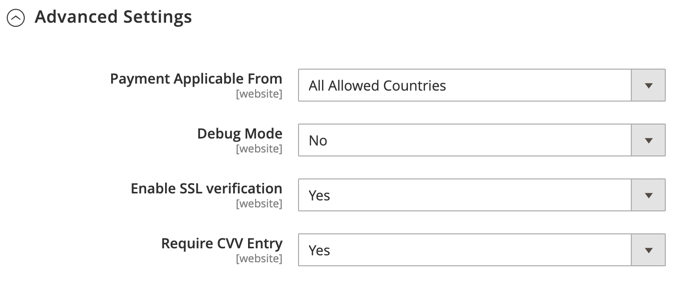

# [!UICONTROL Sales] > [!UICONTROL Payment Methods] >  [!UICONTROL PayPal Payflow Pro]

>[!IMPORTANT]
>
>**Requisiti PSD2:**  
>A partire dal 14 settembre 2019, le banche europee potrebbero rifiutare i pagamenti che non soddisfano i requisiti di [PSD2](../../getting-started/compliance-payment-services-directive.md). Per rispettare PSD2, [!DNL PayPal Payflow Pro] deve essere integrato con [!DNL Cardinal Commerce]. Per ulteriori informazioni, vedere [3D Secure for Payflow](https://developer.paypal.com/api/nvp-soap/payflow/3d-secure-overview/).

{{config}}

## [!UICONTROL Required Settings]

<!-- zoom -->

| Campo | [Ambito](../../getting-started/websites-stores-views.md#scope-settings) | Descrizione |
|--- |--- |--- |
| [!UICONTROL Email Associated with PayPal Merchant Account] | Sito Web | (Facoltativo) Tutti gli indirizzi e-mail associati al tuo conto PayPal per esercenti. Gli indirizzi e-mail fanno distinzione tra maiuscole e minuscole e devono corrispondere esattamente agli indirizzi presenti nel tuo account. |
| [!UICONTROL Partner] | Sito Web | Il tuo ID Partner PayPal, se applicabile. |
| [!UICONTROL Vendor] | Sito Web | Il nome di accesso dell&#39;utente PayPal. |
| Utente | Sito Web | ID di un altro utente sul tuo conto PayPal. |
| [!UICONTROL Password] | Sito Web | La password associata al tuo conto PayPal per esercenti. |
| [!UICONTROL Test Mode] | Sito Web | Se abilitata, esegue PayPal Payflow Pro in un ambiente di test. Disattiva la modalità di test quando sei pronto per andare &quot;live&quot; in modalità di produzione. Opzioni: `Yes` / `No` |
| [!UICONTROL Use Proxy] | Sito Web | Un proxy può essere utilizzato per reindirizzare il traffico quando il firewall del server impedisce l&#39;accesso diretto al server PayPal. Se applicabile, identifica il server proxy utilizzato per stabilire la connessione con il server PayPal. Opzioni: `Yes` / `No`   Se abilitata, impostare le opzioni proxy:  **`Proxy Host`**- Indirizzo IP dell&#39;host proxy. **`Proxy Port`** - Numero della porta proxy. |
| [!UICONTROL Enable this Solution] | Sito Web | Determina se PayPal Payflow Pro è disponibile per i clienti come metodo di pagamento. |
| [!UICONTROL Enable PayPal Credit] | Sito Web | Determina se PayPal Credit è disponibile per i clienti come opzione di pagamento. |

{style="table-layout:auto"}

## [!UICONTROL Advertise PayPal Credit]

<!-- zoom -->

| Campo | [Ambito](../../getting-started/websites-stores-views.md#scope-settings) | Descrizione |
|--- |--- |--- |
| [!UICONTROL Publisher ID] | Sito Web | L&#39;ID editore associato al tuo conto PayPal Credit. |
| [!UICONTROL Get Publisher ID from PayPal] |  | Recupera l&#39;ID editore da PayPal. |
| [!UICONTROL Home Page] | Sito Web | Determina la posizione e le dimensioni del banner [!DNL PayPal Credit] nella home page. Opzioni:  **`Display`**- Determina se nella home page dell&#39;archivio verrà visualizzato un banner [!DNL PayPal Credit]. Opzioni: `Yes` / `No` **`Position`** - Determina la posizione del banner [!DNL PayPal Credit] nella home page. Opzioni: Intestazione (al centro) / Barra laterale (a destra)  **`Size`**- Determina le dimensioni del banner [!DNL PayPal Credit] nella home page. Opzioni: `190 x 100` / `234 x 60` / `300 x 50` / `468 x 60` / `728 x 90` /` 800 x 66` |
| [!UICONTROL Catalog Category Page] | Sito Web | Determina la posizione e le dimensioni del banner [!DNL PayPal Credit] nelle pagine delle categorie. Opzioni: (come per [!UICONTROL Home Page]) |
| [!UICONTROL Catalog Product Page] | Sito Web | Determina la posizione e le dimensioni del banner [!DNL PayPal Credit] nelle pagine dei prodotti. Opzioni: (come per [!UICONTROL Home Page]) |
| [!UICONTROL Checkout Cart Page] | Sito Web | Determina la posizione e le dimensioni del banner [!DNL PayPal Credit] sulla pagina del carrello. Opzioni: (come per [!UICONTROL Home Page]) |

{style="table-layout:auto"}

## [!UICONTROL Basic Settings - PayPal Payflow Pro]

<!-- zoom -->

| Campo | [Ambito](../../getting-started/websites-stores-views.md#scope-settings) | Descrizione |
|--- |--- |--- |
| [!UICONTROL Title] | Visualizzazione store | Nome che identifica PayPal Payflow Pro come metodo di pagamento durante il pagamento. |
| [!UICONTROL Sort Order] | Visualizzazione store | Numero che determina l&#39;ordine di visualizzazione di PayPal Payflow Pro quando viene elencato con altri metodi di pagamento durante il pagamento. |
| [!UICONTROL Payment Action] | Sito Web | Determina l&#39;azione intrapresa da PayPal quando un ordine viene inviato. Opzioni:  **`Authorization`**- Approva l&#39;acquisto, ma blocca i fondi. L&#39;importo non viene prelevato fino a quando non viene &quot;catturato&quot; dal mercante. **`Sale`** - L&#39;importo dell&#39;acquisto è autorizzato e immediatamente ritirato dal conto del cliente. |
| **[!UICONTROL Credit Card Settings]** |  |  |
| [!UICONTROL Allowed Credit Cart Types] | Sito Web | Determina le carte di credito disponibili per i clienti durante il pagamento. Seleziona ogni scheda supportata. Opzioni: `American Express` (richiede un contratto aggiuntivo) / `Visa` / `MasterCard` / `Discover` / `JCB` |

{style="table-layout:auto"}

## [!UICONTROL Advanced Settings]

<!-- zoom -->

| Campo | [Ambito](../../getting-started/websites-stores-views.md#scope-settings) | Descrizione |
|--- |--- |--- |
| Mostra sul carrello | Visualizzazione store | Determina se PayPal Express Checkout viene visualizzato come opzione di pagamento nel carrello. Opzioni: Sì (consigliato) / No |
| [!UICONTROL Payment Action Applicable From] | Sito Web | Determina l&#39;intervallo della selezione paese applicabile. Opzioni: Tutti I Paesi Consentiti/Specifici Paesi |
| [!UICONTROL Countries Payment Applicable From] | Sito Web | Identifica ogni paese dal quale il pagamento è accettato. Solo i clienti con un indirizzo di fatturazione in un paese selezionato possono effettuare acquisti con questo metodo di pagamento. |
| [!UICONTROL Debug Mode] | Sito Web | Registra i messaggi inviati tra il tuo negozio e il sistema di pagamento PayPal in un file di registro. Opzioni: `Yes` / `No`   **_Nota:_**&#x200B;Il file di registro è archiviato nel server ed è accessibile solo agli sviluppatori. In conformità agli standard di sicurezza dei dati PCI, le informazioni sulla carta di credito non vengono registrate nel file di registro. |
| [!UICONTROL Enable SSL Verification] | Sito Web | Abilita la verifica del certificato di sicurezza host. Opzioni: `Yes` / `No` |
| [!UICONTROL Transfer Cart Line Items] | Sito Web | Visualizza un riepilogo completo delle righe presenti nel carrello del cliente sul sito PayPal. Opzioni: `Yes` / `No` |
| [!UICONTROL Skip Order Review Step] | Sito Web | Determina se i clienti possono completare la transazione dal sito PayPal o se devono tornare al tuo negozio e completare il passaggio di revisione dell&#39;ordine prima di sottomettere l&#39;ordine. Opzioni: `Yes` / `No` |

{style="table-layout:auto"}
