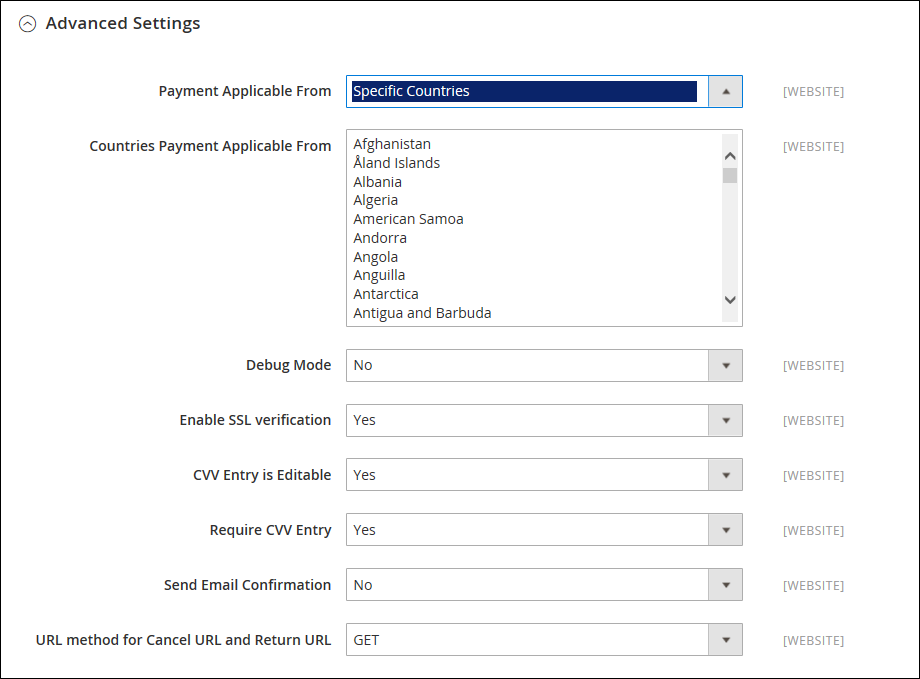

# [!UICONTROL Sales] > [!UICONTROL Payment Methods] > [!UICONTROL PayPal Payments Advanced]

>[!IMPORTANT]
>
>**Requisiti PSD2:**  
>A partire dal 14 settembre 2019, le banche europee potrebbero rifiutare i pagamenti che non soddisfano [PSD2](../../getting-started/compliance-payment-services-directive.md) requisiti. Per conformarsi alle disposizioni del PSD 2: [!DNL PayPal Payments Advanced] deve essere integrato con [!DNL Cardinal Commerce]. Per ulteriori informazioni, consulta [Protezione 3D per il flusso di pagamento](https://developer.paypal.com/api/nvp-soap/payflow/3d-secure-overview/).

{{config}}

## [!UICONTROL Required Settings]

<!-- zoom -->

| Campo | [Ambito](../../getting-started/websites-stores-views.md#scope-settings) | Descrizione |
|--- |--- |--- |
| [!UICONTROL Email Associated with PayPal Merchant Account] | Sito Web | (Facoltativo) Tutti gli indirizzi e-mail associati al tuo conto PayPal per esercenti. Gli indirizzi e-mail fanno distinzione tra maiuscole e minuscole e devono corrispondere esattamente agli indirizzi presenti nel tuo account. |
| [!UICONTROL Partner] | Sito Web | Il tuo ID Partner PayPal, se applicabile. |
| [!UICONTROL Vendor] | Sito Web | Il nome di accesso dell&#39;utente PayPal. |
| Utente | Sito Web | ID di un altro utente sul tuo conto PayPal. |
| [!UICONTROL Password] | Sito Web | La password associata al tuo conto PayPal per esercenti. |
| [!UICONTROL Test Mode] | Sito Web | Quando questa opzione è abilitata, esegue PayPal Payments Advanced in un ambiente di test. Disattiva la modalità di test quando sei pronto per andare &quot;live&quot; in modalità di produzione. Opzioni: `Yes` / `No` |
| [!UICONTROL Use Proxy] | Sito Web | Un proxy può essere utilizzato per reindirizzare il traffico quando il firewall del server impedisce l&#39;accesso diretto al server PayPal. Se applicabile, identifica il server proxy utilizzato per stabilire la connessione con il server PayPal. Opzioni: `Yes` / `No`   Se l&#39;opzione è attivata, impostare le opzioni:  **`Proxy Host`**: indirizzo IP dell’host proxy. **`Proxy Port`** - Numero della porta proxy. |
| [!UICONTROL Enable this Solution] | Sito Web | Determina se PayPal Payments Advanced è disponibile per i clienti come metodo di pagamento. |
| [!UICONTROL Enable PayPal Credit] | Sito Web | Determina se PayPal Credit è disponibile per i clienti come opzione di pagamento. |

{style="table-layout:auto"}

## [!UICONTROL Advertise PayPal Credit]

<!-- zoom -->

| Campo | [Ambito](../../getting-started/websites-stores-views.md#scope-settings) | Descrizione |
|--- |--- |--- |
| [!UICONTROL Publisher ID] | Sito Web | L&#39;ID editore associato al tuo conto PayPal Credit. |
| [!UICONTROL Get Publisher ID from PayPal] |  | Recupera l&#39;ID editore da PayPal. |
| [!UICONTROL Home Page] | Sito Web | Determina la posizione e le dimensioni del [!DNL PayPal Credit] nella home page. Opzioni:  **`Display`**- Determina se[!DNL PayPal Credit] il banner viene visualizzato nella home page del negozio. Opzioni: `Yes` / `No` **`Position`** - Determina la posizione della [!DNL PayPal Credit] nella home page. Opzioni: Intestazione (al centro) / Barra laterale (a destra)  **`Size`**- Determina le dimensioni della [!DNL PayPal Credit] nella home page. Opzioni: `190 x 100` / `234 x 60` / `300 x 50` / `468 x 60` / `728 x 90` /` 800 x 66` |
| [!UICONTROL Catalog Category Page] | Sito Web | Determina la posizione e le dimensioni del [!DNL PayPal Credit] banner sulle pagine delle categorie. Opzioni: (come per [!UICONTROL Home Page]) |
| [!UICONTROL Catalog Product Page] | Sito Web | Determina la posizione e le dimensioni del [!DNL PayPal Credit] banner sulle pagine dei prodotti. Opzioni: (come per [!UICONTROL Home Page]) |
| [!UICONTROL Checkout Cart Page] | Sito Web | Determina la posizione e le dimensioni del [!DNL PayPal Credit] banner sulla pagina del carrello. Opzioni: (come per [!UICONTROL Home Page]) |

{style="table-layout:auto"}

## [!UICONTROL Basic Settings]

<!-- zoom -->

| Campo | [Ambito](../../getting-started/websites-stores-views.md#scope-settings) | Descrizione |
|--- |--- |--- |
| [!UICONTROL Title] | Visualizzazione store | Nome che identifica PayPal Payments Advanced come metodo di pagamento durante il pagamento. |
| [!UICONTROL Sort Order] | Visualizzazione store | Numero che determina l&#39;ordine di visualizzazione di PayPal Payments Advanced se elencato con altri metodi di pagamento durante l&#39;estrazione. |
| [!UICONTROL Payment Action] | Sito Web | Determina l&#39;azione intrapresa da PayPal quando un ordine viene inviato. Opzioni:  **`Authorization`**- Approva l&#39;acquisto, ma blocca i fondi. L&#39;importo non viene prelevato fino a quando non viene &quot;catturato&quot; dal mercante. **`Sale`** - L&#39;importo dell&#39;acquisto è autorizzato e immediatamente prelevato dal conto del cliente. |

{style="table-layout:auto"}

## [!UICONTROL Advanced Settings]

<!-- zoom -->

| Campo | [Ambito](../../getting-started/websites-stores-views.md#scope-settings) | Descrizione |
|--- |--- |--- |
| [!UICONTROL Payment Applicable From] | Sito Web | Determina l&#39;intervallo della selezione paese applicabile. Opzioni: `All Allowed Countries` / `Specific Countries` |
| [!UICONTROL Countries Payment Applicable From] | Sito Web | Identifica ogni paese dal quale il pagamento è accettato. Solo i clienti con un indirizzo di fatturazione in un paese selezionato possono effettuare acquisti con questo metodo di pagamento. |
| [!UICONTROL Debug Mode] | Sito Web | Registra i messaggi inviati tra il tuo negozio e il sistema di pagamento in un file di registro. Opzioni: `Yes` / `No`   **_Nota:_**Il file di registro viene archiviato sul server ed è accessibile solo agli sviluppatori. In conformità agli standard di sicurezza dei dati PCI, le informazioni sulla carta di credito non vengono registrate nel file di registro. |
| [!UICONTROL Enable SSL Verification] | Sito Web | Determina se il canale sicuro sull&#39;host viene verificato prima che venga eseguita una transazione. Opzioni: `Yes` / `No` |
| [!UICONTROL CVV Entry is Editable] | Sito Web | Determina se il cliente può modificare il CVV dopo l&#39;immissione. Opzioni: `Yes` / `No` |
| [!UICONTROL Require CVV Entry] | Sito Web | Determina se i clienti devono inserire il codice CVV dal retro della carta di credito. Opzioni: `Yes` / `No` |
| [!UICONTROL Send Email Confirmation] | Sito Web | Determina se il cliente riceve la conferma e-mail del pagamento. Opzioni: `Yes` / `No` |
| [!UICONTROL URL Method for Cancel URL and Return URL] | Sito Web | Determina il metodo utilizzato per scambiare informazioni con il server PayPal durante una transazione. Opzioni:  **`GET`**- Recupera le informazioni risultanti da un processo. Questo è il metodo predefinito. **`POST`** - Invia un blocco di dati, ad esempio i dati immessi in un modulo, al processo di gestione dei dati. |

{style="table-layout:auto"}

## [!UICONTROL Settlement Report Settings]

<!-- zoom -->

| Campo | [Ambito](../../getting-started/websites-stores-views.md#scope-settings) | Descrizione |
|--- |--- |--- |
| **[!UICONTROL SFTP Credentials]** |  |  |
| [!UICONTROL Login] | Sito Web | Il nome utente necessario per accedere al server FTP protetto di PayPal. |
| [!UICONTROL Password] | Sito Web | La password necessaria per accedere al server FTP protetto di PayPal. |
| [!UICONTROL Sandbox Mode] | Sito Web | Se abilitata, esegue i rapporti in un ambiente di test prima di &quot;andare live&quot; nell’ambiente di produzione. Opzioni: `Yes` / `No` |
| [!UICONTROL Custom Endpoint Hostname or IP-Address] | Sito Web | URL in cui vengono gestiti i report di liquidazione. Valore predefinito: `reports.paypal.com` |
| [!UICONTROL Custom Path] | Sito Web | Percorso in cui vengono salvati i report di liquidazione sul server. Valore predefinito: `/ppreports/outgoing` |
| **[!UICONTROL Scheduled Fetching]** |  |  |
| [!UICONTROL Enable Automatic Fetching] | Sito Web | Quando questa opzione è abilitata, recupera automaticamente i rapporti di liquidazione secondo programma. Opzioni: `Yes` / `No` |
| [!UICONTROL Schedule] | Globale | Determina la frequenza con cui i rapporti di liquidazione vengono generati da PayPal. Opzioni: `Daily` / `Every 3 days` / `Every 7 days` / `Every 10 days` / `Every 14 days` / `Every 30 days` / `Every 40 days` |
| [!UICONTROL Time of Day] | Globale | Determina l&#39;ora, il minuto e il secondo in cui vengono generati i rapporti di liquidazione. |

{style="table-layout:auto"}

## [!UICONTROL Frontend Experience Settings]

<!-- zoom -->

| Campo | [Ambito](../../getting-started/websites-stores-views.md#scope-settings) | Descrizione |
|--- |--- |--- |
| [!UICONTROL PayPal Product Logo] | Visualizzazione store | Determina il logo PayPal visualizzato nel tuo Negozio. Ci sono quattro stili di base in due dimensioni. Opzioni: `No Logo` / `We prefer PayPal (150 x 60)` / `We prefer PayPal (150 x 40)` / `Now accepting PayPal (150 x 60)` / `Now accepting PayPal (150 x 40)` / `Payments by PayPal (150 x 60)` / `Payments by PayPal (150 x 40)` / `Shop now using (150 x 60)` / `Shop now using (150 x 40)` |
| **[!UICONTROL PayPal Merchant Pages Style]** |  |  |
| [!UICONTROL Page Style] | Visualizzazione store | Determina l&#39;aspetto della pagina del venditore PayPal. Valori consentiti:  **`paypal`**- Utilizza lo stile di pagina PayPal. **`primary`** : utilizza lo stile di pagina identificato come stile &quot;principale&quot; nel profilo dell’account.  **`your_custom_value`**- Utilizza uno stile di pagina di pagamento personalizzato, specificato nel profilo del tuo account. |
| [!UICONTROL Header Image URL] | Visualizzazione store | URL dell&#39;immagine visualizzato nell&#39;angolo superiore sinistro della pagina di pagamento. La dimensione massima è 750 x 90 pixel.   **_Nota:_**PayPal consiglia di memorizzare l&#39;immagine su un server protetto (https). In caso contrario, il browser del cliente potrebbe avvertire che &quot;la pagina contiene sia elementi protetti che non protetti&quot;. |
| [!UICONTROL Header Image Background Color] | Visualizzazione store | I sei caratteri [colore esadecimale](https://en.wikipedia.org/wiki/Web_colors) codice per il colore di sfondo dell&#39;intestazione nella pagina di pagamento. È possibile immettere il codice in lettere maiuscole e minuscole. |
| [!UICONTROL Header Image Border Color] | Visualizzazione store | Codice di colore esadecimale a sei caratteri per il bordo di due pixel attorno all&#39;intestazione. |
| [!UICONTROL Page Background Color] | Visualizzazione store | Codice di colore esadecimale a sei caratteri per il colore di sfondo della pagina di pagamento visualizzato dietro l&#39;intestazione e il modulo di pagamento. |

{style="table-layout:auto"}

## [!UICONTROL Basic Settings - PayPal Express Checkout]

<!-- zoom -->

| Campo | [Ambito](../../getting-started/websites-stores-views.md#scope-settings) | Descrizione |
|--- |--- |--- |
| [!UICONTROL Title] | Visualizzazione store | Nome che identifica il metodo di pagamento PayPal Express Checkout durante il pagamento. |
| [!UICONTROL Sort Order] | Visualizzazione store | Numero che determina l&#39;ordine di visualizzazione del Checkout PayPal Express quando viene elencato con altri metodi di pagamento durante il pagamento. Invio `0` all&#39;inizio dell&#39;elenco. |
| [!UICONTROL Payment Action] | Sito Web | Determina l&#39;azione intrapresa da PayPal quando riceve un ordine. Opzioni:  **`Authorization`**- Approva l&#39;acquisto, ma blocca i fondi. L&#39;importo non viene prelevato fino a quando non viene &quot;catturato&quot; dal mercante. **`Sale`** - L&#39;importo dell&#39;acquisto è autorizzato e immediatamente prelevato dal conto del cliente.  **`Order`**- Rappresenta un accordo con PayPal che consente all&#39;esercente di acquisire uno o più importi fino al totale ordinato dal conto dell&#39;acquirente del cliente, entro un periodo di tempo definito. Questo può essere fino a 29 giorni. Per acquisire i fondi, è necessario generare una o più fatture dall’amministratore di Commerce. |
| [!UICONTROL URL Display on Product Details Page] | Visualizzazione store | Determina se il pulsante &quot;Paga con PayPal&quot; viene visualizzato nelle pagine dei prodotti. Opzioni: `Yes` / `No` |

{style="table-layout:auto"}

## [!UICONTROL PayPal Express Checkout - Advanced Settings]

<!-- zoom -->

| Campo | [Ambito](../../getting-started/websites-stores-views.md#scope-settings) | Descrizione |
|--- |--- |--- |
| [!UICONTROL Display on Shopping Cart] | Visualizzazione store | Determina se PayPal Express Checkout viene visualizzato come opzione di pagamento nel carrello. Opzioni: `Yes` (consigliato) / `No` |
| [!UICONTROL Payment Action Applicable From] | Sito Web | Determina l&#39;intervallo della selezione paese applicabile. Opzioni: `All Allowed Countries` / `Specific Countries` |
| [!UICONTROL Countries Payment Applicable From] | Sito Web | Identifica ogni paese dal quale il pagamento è accettato. Solo i clienti con un indirizzo di fatturazione in un paese selezionato possono effettuare acquisti con questo metodo di pagamento. |
| [!UICONTROL Debug Mode] | Sito Web | Registra i messaggi inviati tra il tuo negozio e il sistema di pagamento PayPal in un file di registro. Opzioni: `Yes` / `No`   **_Nota:_**Il file di registro viene archiviato sul server ed è accessibile solo agli sviluppatori. In conformità agli standard di sicurezza dei dati PCI, le informazioni sulla carta di credito non vengono registrate nel file di registro. |
| [!UICONTROL Enable SSL Verification] | Sito Web | Abilita la verifica del certificato di sicurezza host. Opzioni: `Yes` / `No` |
| [!UICONTROL Transfer Cart Line Items] | Sito Web | Visualizza un riepilogo completo delle righe presenti nel carrello del cliente sul sito PayPal. Opzioni: `Yes` / `No` |
| [!UICONTROL Skip Order Review Step] | Sito Web | Determina se i clienti possono completare la transazione dal sito PayPal o se devono tornare al tuo negozio e completare il passaggio di revisione dell&#39;ordine prima di sottomettere l&#39;ordine. Opzioni: `Yes` / `No` |

{style="table-layout:auto"}
