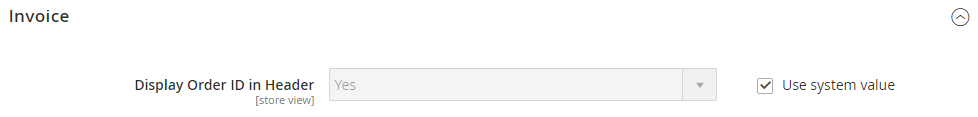

# [!UICONTROL Sales] > [!UICONTROL PDF Print-outs]

{{config}}

<!-- [Invoice](https://docs.magento.com/user-guide/marketing/sales-documents-ref-id.html) -->

## [!UICONTROL Invoice]

<!-- zoom -->

| Campo | [Ambito](../../getting-started/websites-stores-views.md#scope-settings) | Descrizione |
|--- |--- |--- |
| [!UICONTROL Display Order ID in Header] | Visualizzazione store | Include l&#39;ID ordine nell&#39;intestazione delle fatture come riferimento. Opzioni: `Yes` / `No` |

{style="table-layout:auto"}

## [!UICONTROL Shipment]

<!-- zoom -->

| Campo | [Ambito](../../getting-started/websites-stores-views.md#scope-settings) | Descrizione |
|--- |--- |--- |
| [!UICONTROL Display Order ID in Header] | Visualizzazione store | Include l&#39;ID ordine nell&#39;intestazione dei documenti di trasporto della spedizione come riferimento. Opzioni: `Yes` / `No` |

{style="table-layout:auto"}

## [!UICONTROL Credit Memo]

<!-- zoom -->

| Campo | [Ambito](../../getting-started/websites-stores-views.md#scope-settings) | Descrizione |
|--- |--- |--- |
| [!UICONTROL Display Order ID in Header] | Visualizzazione store | Include l&#39;ID ordine nell&#39;intestazione delle note di credito come riferimento. Opzioni: `Yes` / `No` |

{style="table-layout:auto"}
