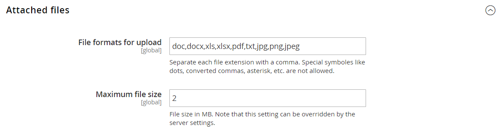

# [!UICONTROL Sales] > [!UICONTROL Quotes]

{{b2b-feature}}

>[!TIP]
>
>Con l’installazione e l’abilitazione di Adobe Commerce B2B, l’esperienza di acquisto può essere personalizzata con funzioni specifiche per l’azienda. Adobe Commerce B2B è una soluzione integrata che supporta sia i modelli B2B che B2C. Per ulteriori informazioni sulle funzionalità B2B, consulta la [Guida utente di Adobe Commerce B2B](https://experienceleague.adobe.com/docs/commerce-admin/b2b/introduction.html).

{{config}}

<!-- [Quotes](https://docs.magento.com/user-guide/sales/quotes.html) -->

## [!UICONTROL General]

<!-- zoom -->

| Campo | [Ambito](../../getting-started/websites-stores-views.md#scope-settings) | Descrizione |
|--- |--- |--- |
| [!UICONTROL Minimum Amount] | Sito Web | La quantità minima del subtotale del carrello, dopo eventuali sconti, necessaria prima che un cliente possa inviare una richiesta di preventivo. Valore predefinito: `0` |
| [!UICONTROL Minimum Amount Message] | Visualizzazione store | Il messaggio visualizzato nel carrello quando un cliente tenta di inviare una richiesta di preventivo, ma l’importo minimo richiesto non viene raggiunto. |
| [!UICONTROL Default Expiration Period] | Sito Web | Determina la durata predefinita di un [preventivo](../../b2b/quote-price-negotiation.md) come periodo di tempo a partire dalla data di invio della richiesta di preventivo. Opzioni: `Days` / `Weeks` / `Months` |

{style="table-layout:auto"}

## [!UICONTROL Attached Files]

<!-- zoom -->

| Campo | [Ambito](../../getting-started/websites-stores-views.md#scope-settings) | Descrizione |
|--- |--- |--- |
| [!UICONTROL File formats for upload] | Globale | Determina i formati di file che possono essere allegati a un&#39;offerta. Valori predefiniti supportati: `doc`, `docx`, `xls`, `xlsx`, `pdf`, `txt`, `jpg`, `png` e `jpeg` |
| [!UICONTROL Maximum file size] | Globale | Determina la dimensione massima di un file allegato a un&#39;offerta. Questa impostazione può essere ignorata dalla configurazione del server. |

{style="table-layout:auto"}
