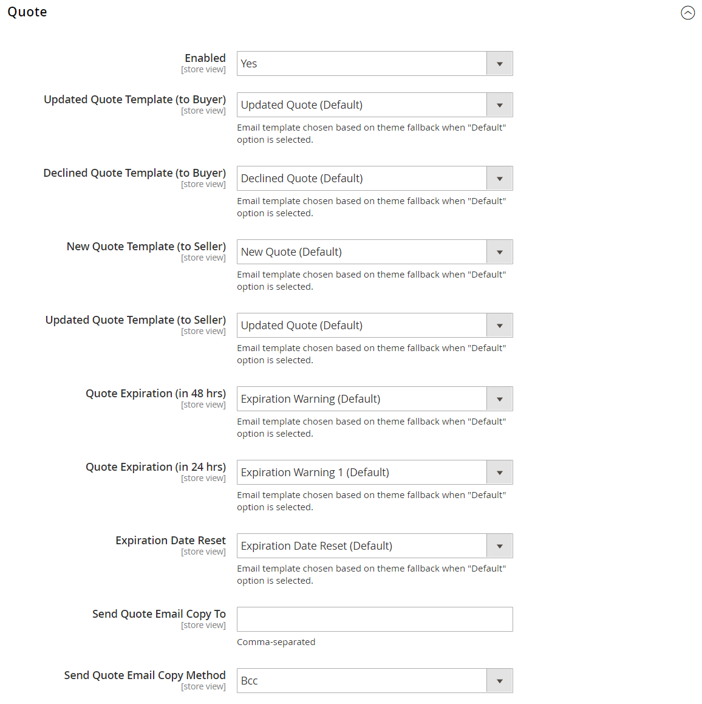

# [!UICONTROL Sales] > [!UICONTROL Sales Emails]

{{config}}

## [!UICONTROL General Settings]

<!-- zoom -->

<!-- [General Settings](https://experienceleague.adobe.com/en/docs/commerce-admin/systems/communications/email-communications) -->

| Campo | [Ambito](../../getting-started/websites-stores-views.md#scope-settings) | Descrizione |
|--- |--- |--- |
| [!UICONTROL Asynchronous sending] | Globale | Determina se le e-mail di vendita vengono inviate in modo asincrono. È consigliabile abilitare l’invio asincrono. Opzioni:  **`Disable`**- (Predefinito) Le e-mail di vendita vengono inviate quando attivate da un evento. **`Enable`** - (Consigliato) Le e-mail di vendita vengono inviate a intervalli regolari predeterminati. |

{style="table-layout:auto"}

## [!UICONTROL Order]

<!-- zoom -->

<!-- [Order](https://experienceleague.adobe.com/en/docs/commerce-admin/stores-sales/order-management/orders/orders) -->

| Campo | [Ambito](../../getting-started/websites-stores-views.md#scope-settings) | Descrizione |
|--- |--- |--- |
| [!UICONTROL Enabled] | Visualizzazione store | Quando è abilitata, invia un’e-mail transazionale per ogni ordine effettuato. Opzioni: `Yes` / `No` |
| [!UICONTROL New Order Confirmation Email Sender] | Visualizzazione store | Identifica il contatto del punto vendita che viene visualizzato come mittente del messaggio. Mittente predefinito: `Sales Representative` |
| [!UICONTROL New Order Confirmation Template] | Visualizzazione store | Identifica il modello inviato per confermare i nuovi ordini effettuati dai clienti. Modello predefinito: `New Order` |
| [!UICONTROL New Order Confirmation Template for Guest] | Visualizzazione store | Identifica il modello inviato per confermare i nuovi ordini effettuati dagli ospiti. Modello predefinito: `New Order for Guest` |
| [!UICONTROL Send Order Email Copy To] | Visualizzazione store | Fornisce l&#39;indirizzo e-mail di chiunque riceva una copia di un ordine e-mail. Separa più indirizzi con una virgola. |
| [!UICONTROL Send Order Email Copy Method] | Visualizzazione store | Indica il metodo e-mail utilizzato per inviare la copia. Le opzioni includono:  **`Bcc`**- Invia una copia di cortesia nascosta includendo il destinatario nell&#39;intestazione della stessa e-mail inviata al cliente. Il destinatario Ccn non è visibile al cliente. **`Separate Email`** - Invia la copia come messaggio e-mail separato. |

{style="table-layout:auto"}

## [!UICONTROL Order Comments]

<!-- zoom -->

<!-- [Order Comments](https://experienceleague.adobe.com/en/docs/commerce-admin/stores-sales/order-management/orders/order-processing#process-an-order) -->

| Campo | [Ambito](../../getting-started/websites-stores-views.md#scope-settings) | Descrizione |
|--- |--- |--- |
| [!UICONTROL Enabled] | Visualizzazione store | Quando è abilitata, invia un’e-mail transazionale per ogni commento dell’ordine. Opzioni: `Yes` / `No` |
| [!UICONTROL Order Comment Email Sender] | Visualizzazione store | Identifica il contatto del punto vendita che viene visualizzato come mittente del messaggio. Mittente predefinito: `Sales Representative` |
| [!UICONTROL Order Comment Email Template] | Visualizzazione store | Identifica il modello inviato quando un commento viene aggiunto a un ordine cliente. Modello predefinito: `Order Update` |
| [!UICONTROL New Order Confirmation Template for Guest] | Visualizzazione store | Identifica il modello inviato quando un commento viene aggiunto a un ordine ospite. Modello predefinito: `Order Update for Guest` |
| [!UICONTROL Send Order Email Copy To|Store View] | Fornisce l&#39;indirizzo e-mail di chiunque riceva una copia di un&#39;e-mail di commento dell&#39;ordine. Separa più indirizzi con una virgola. |
| [!UICONTROL Send Order Email Copy Method] | Visualizzazione store | Indica il metodo utilizzato per inviare la copia. Le opzioni includono:  **`Bcc`**- Invia una copia di cortesia nascosta includendo il destinatario nell&#39;intestazione della stessa e-mail inviata al cliente. Il destinatario Ccn non è visibile al cliente. **`Separate Email`** - Invia la copia come messaggio e-mail separato. |

{style="table-layout:auto"}

## [!UICONTROL Invoice]

<!-- zoom -->

<!-- [Invoice](https://experienceleague.adobe.com/en/docs/commerce-admin/stores-sales/order-management/invoices) -->

| Campo | [Ambito](../../getting-started/websites-stores-views.md#scope-settings) | Descrizione |
|--- |--- |--- |
| [!UICONTROL Enabled] | Visualizzazione store | Quando è abilitata, invia un’e-mail transazionale per ogni fattura generata. Opzioni: `Yes` / `No` |
| [!UICONTROL Invoice Email Sender] | Visualizzazione store | Identifica il contatto del punto vendita che viene visualizzato come mittente del messaggio. Mittente predefinito: `Sales Representative` |
| [!UICONTROL Invoice Email Template] | Visualizzazione store | Identifica il modello inviato quando viene generata una fattura per un cliente. Modello predefinito: `New Invoice` |
| [!UICONTROL Invoice Email Template for Guest] | Visualizzazione store | Identifica il modello inviato quando viene generata una fattura per un ospite. Modello predefinito: `New Invoice for Guest` |
| [!UICONTROL Send Invoice Email Copy To] | Visualizzazione store | Fornisce l&#39;indirizzo di posta elettronica di chiunque debba ricevere una copia di un&#39;e-mail di fattura. Separa più indirizzi con una virgola. |
| [!UICONTROL Send Invoice Email Copy Method] | Visualizzazione store | Indica il metodo utilizzato per inviare la copia. Le opzioni includono:  **`Bcc`**- Invia una copia di cortesia nascosta includendo il destinatario nell&#39;intestazione della stessa e-mail inviata al cliente. Il destinatario Ccn non è visibile al cliente. **`Separate Email`** - Invia la copia come messaggio e-mail separato. |

{style="table-layout:auto"}

## [!UICONTROL Invoice Comments]

<!-- zoom -->

<!-- [Invoice Comments](https://experienceleague.adobe.com/en/docs/commerce-admin/stores-sales/order-management/invoices#create-an-invoice) -->

| Campo | [Ambito](../../getting-started/websites-stores-views.md#scope-settings) | Descrizione |
|--- |--- |--- |
| [!UICONTROL Enabled] | Visualizzazione store | Quando è abilitata, invia un’e-mail transazionale per ogni commento della fattura. Opzioni: `Yes` / `No` |
| [!UICONTROL Invoice Comment Email Sender] | Visualizzazione store | Identifica il contatto del punto vendita che viene visualizzato come mittente del messaggio. Mittente predefinito: `Sales Representative` |
| [!UICONTROL Invoice Comment Email Template] | Visualizzazione store | Identifica il modello inviato quando un commento viene aggiunto a una fattura cliente. Modello predefinito: `Invoice Update` |
| [!UICONTROL Invoice Comment Email Template for Guest] | Visualizzazione store | Identifica il modello inviato quando si aggiunge un commento a una fattura guest. Modello predefinito: `Invoice Update for Guest` |
| [!UICONTROL Send Invoice Comment Email Copy To] | Visualizzazione store | Fornisce l&#39;indirizzo di posta elettronica di chiunque possa ricevere una copia di un&#39;e-mail di commento della fattura. Separa più indirizzi con una virgola. |
| [!UICONTROL Send Invoice Comments Email Copy Method] | Visualizzazione store | Indica il metodo e-mail utilizzato per inviare la copia. Le opzioni includono:  **`Bcc`**- Invia una copia di cortesia nascosta includendo il destinatario nell&#39;intestazione della stessa e-mail inviata al cliente. Il destinatario Ccn non è visibile al cliente. **`Separate Email`** - Invia la copia come messaggio e-mail separato. |

{style="table-layout:auto"}

## [!UICONTROL Shipment]

<!-- zoom -->

<!-- [Shipment](https://experienceleague.adobe.com/en/docs/commerce-admin/stores-sales/order-management/shipments) -->

| Campo | [Ambito](../../getting-started/websites-stores-views.md#scope-settings) | Descrizione |
|--- |--- |--- |
| [!UICONTROL Enabled] | Visualizzazione store | Quando è abilitata, invia un’e-mail transazionale per ogni spedizione generata. Opzioni: `Yes` / `No` |
| [!UICONTROL Shipment Email Sender] | Visualizzazione store | Identifica il contatto del punto vendita che viene visualizzato come mittente del messaggio. Mittente predefinito: `Sales Representative` |
| [!UICONTROL Shipment Email Template] | Visualizzazione store | Identifica il modello inviato quando viene generata una spedizione per un cliente. Modello predefinito: `New Shipment` |
| [!UICONTROL Shipment Email Template for Guest] | Visualizzazione store | Identifica il modello inviato quando viene generata una spedizione per un ospite. Modello predefinito: `New Shipment for Guest` |
| [!UICONTROL Send Shipment Email Copy To] | Visualizzazione store | Fornisce l&#39;indirizzo di posta elettronica di tutti coloro che devono ricevere una copia di un&#39;e-mail di spedizione. Separa più indirizzi con una virgola. |
| [!UICONTROL Send Shipment Email Copy Method] | Visualizzazione store | Indica il metodo utilizzato per inviare la copia. Le opzioni includono:  **`Bcc`**- Invia una copia di cortesia nascosta includendo il destinatario nell&#39;intestazione della stessa e-mail inviata al cliente. Il destinatario Ccn non è visibile al cliente. **`Separate Email`** - Invia la copia come messaggio e-mail separato. |

{style="table-layout:auto"}

## [!UICONTROL Shipment Comments]

<!-- zoom -->

<!-- [Shipment Comments](https://experienceleague.adobe.com/en/docs/commerce-admin/stores-sales/order-management/shipments) -->

| Campo | [Ambito](../../getting-started/websites-stores-views.md#scope-settings) | Descrizione |
|--- |--- |--- |
| [!UICONTROL Enabled] | Visualizzazione store | Quando è abilitata, invia un’e-mail transazionale per ogni commento di spedizione. Opzioni: `Yes` / `No` |
| [!UICONTROL Shipment Comment Email Sender] | Visualizzazione store | Identifica il contatto del punto vendita che viene visualizzato come mittente del messaggio. Mittente predefinito: `Sales Representative` |
| [!UICONTROL Shipment Comment Email Template] | Visualizzazione store | Identifica il modello inviato quando viene aggiunto un commento a una spedizione cliente. Modello predefinito: `Shipment Update` |
| [!UICONTROL Shipment Comment Email Template for Guest] | Visualizzazione store | Identifica il modello inviato quando un commento viene aggiunto a una spedizione guest. Modello predefinito: `Shipment Update for Guest` |
| [!UICONTROL Send Shipment Comment Email Copy To] | Visualizzazione store | Fornisce l&#39;indirizzo di posta elettronica di chiunque possa ricevere una copia di un&#39;e-mail di commento della spedizione. Separa più indirizzi con una virgola. |
| [!UICONTROL Send Shipment Comments Email Copy Method] | Visualizzazione store | Indica il metodo e-mail utilizzato per inviare la copia. Le opzioni includono:  **`Bcc`**- Invia una copia di cortesia nascosta includendo il destinatario nell&#39;intestazione della stessa e-mail inviata al cliente. Il destinatario Ccn non è visibile al cliente. **`Separate Email`** - Invia la copia come messaggio e-mail separato. |

{style="table-layout:auto"}

## [!UICONTROL Credit Memo]

<!-- zoom -->

<!-- [Credit Memo](https://experienceleague.adobe.com/en/docs/commerce-admin/stores-sales/order-management/credit-memos/credit-memos) -->

| Campo | [Ambito](../../getting-started/websites-stores-views.md#scope-settings) | Descrizione |
|--- |--- |--- |
| [!UICONTROL Enabled] | Visualizzazione store | Attiva l’e-mail transazionale per ogni nota di credito generata. Opzioni: `Yes` / `No` |
| [!UICONTROL Credit Memo Email Sender] | Visualizzazione store | Identifica il contatto del punto vendita che viene visualizzato come mittente del messaggio. Mittente predefinito: `Sales Representative` |
| [!UICONTROL Credit Memo Email Template] | Visualizzazione store | Identifica il modello inviato quando viene generata una nota di credito per un cliente. Modello predefinito: `New Credit Memo` |
| [!UICONTROL Credit Memo Email Template for Guest] | Visualizzazione store | Identifica il modello inviato quando viene generata una nota di credito per un ospite. Modello predefinito: `New Credit Memo for Guest` |
| [!UICONTROL Send Credit Memo Email Copy To] | Visualizzazione store | Fornisce l&#39;indirizzo e-mail di tutti coloro che devono ricevere una copia di un messaggio e-mail di nota di credito. Separa più indirizzi con una virgola. |
| [!UICONTROL Send Credit Memo Email Copy Method] | Visualizzazione store | Indica il metodo utilizzato per inviare la copia. Le opzioni includono:  **`Bcc`**- Invia una copia di cortesia nascosta includendo il destinatario nell&#39;intestazione della stessa e-mail inviata al cliente. Il destinatario Ccn non è visibile al cliente. **`Separate Email`** - Invia la copia come messaggio e-mail separato. |

{style="table-layout:auto"}

## [!UICONTROL Credit Memo Comments]

<!-- zoom -->

<!-- [Credit Memo Comments](https://experienceleague.adobe.com/en/docs/commerce-admin/stores-sales/order-management/credit-memos/credit-memo-create) -->

| Campo | [Ambito](../../getting-started/websites-stores-views.md#scope-settings) | Descrizione |
|--- |--- |--- |
| [!UICONTROL Enabled] | Visualizzazione store | Quando questa opzione è attivata, invia un messaggio e-mail transazionale per ogni commento della nota di credito. Opzioni: `Yes` / `No` |
| [!UICONTROL Credit Memo Comment Email Sender] | Visualizzazione store | Identifica il contatto del punto vendita che viene visualizzato come mittente del messaggio. Mittente predefinito: `Sales Representative` |
| [!UICONTROL Credit Memo Comment Email Template] | Visualizzazione store | Identifica il modello inviato quando un commento viene aggiunto a una nota di credito cliente. Modello predefinito: `Credit Memo Update` |
| [!UICONTROL Credit Memo Comment Email Template for Guest] | Visualizzazione store | Identifica il modello inviato quando un commento viene aggiunto a una nota di credito guest. Modello predefinito: `Credit Memo Update for Guest` |
| [!UICONTROL Send Credit Memo Comment Email Copy To] | Visualizzazione store | Specifica l&#39;indirizzo e-mail di chiunque debba ricevere una copia dell&#39;e-mail di commento della nota di credito. Separa più indirizzi con una virgola. |
| [!UICONTROL Send Credit Memo Comments Email Copy Method] | Visualizzazione store | Indica il metodo e-mail utilizzato per inviare la copia. Le opzioni includono:  **`Bcc`**- Invia una copia di cortesia nascosta includendo il destinatario nell&#39;intestazione della stessa e-mail inviata al cliente. Il destinatario Ccn non è visibile al cliente. **`Separate Email`** - Invia la copia come messaggio e-mail separato. |

{style="table-layout:auto"}

## [!UICONTROL Order Ready For Pickup in Store]

Questa opzione richiede l&#39;attivazione di [Inventory management](../../inventory-management/guide-overview.md).

<!-- zoom -->

<!-- [Order Ready For Pickup in Store](https://experienceleague.adobe.com/en/docs/commerce-admin/stores-sales/delivery/basic-methods/shipping-in-store-delivery) -->

| Campo | [Ambito](../../getting-started/websites-stores-views.md#scope-settings) | Descrizione |
|--- |--- |--- |
| [!UICONTROL Enabled] | Visualizzazione store | Quando è abilitata, invia un’e-mail transazionale quando un ordine è pronto per il prelievo in-store. Opzioni: `Yes` / `No` |
| [!UICONTROL Order Ready For Pickup Email Sender] | Visualizzazione store | Identifica il contatto del punto vendita che viene visualizzato come mittente del messaggio. Mittente predefinito: `General Contact` |
| [!UICONTROL Order Ready For Pickup Email Template] | Visualizzazione store | Identifica il modello utilizzato per l’e-mail transazionale per ogni ordine pronto per il ritiro in negozio per un cliente registrato. Modello predefinito: `Order is Ready for Pickup` |
| [!UICONTROL Order Ready For Pickup Email Template for Guest] | Visualizzazione store | Identifica il modello utilizzato per l’e-mail transazionale per ogni ordine pronto per il ritiro in negozio per un ospite. Modello predefinito: `Order is Ready for Pickup for Guest` |
| Invia Ordine Pronto Per Il Ritiro Della Copia E-Mail A | Visualizzazione store | Specifica l&#39;indirizzo di posta elettronica di chiunque debba ricevere una copia di un&#39;e-mail di tipo _Ordina per ritiro_. Separa più indirizzi con una virgola. |
| [!UICONTROL Send Order Ready For Pickup Email Copy Method] | Visualizzazione store | Indica il metodo e-mail utilizzato per inviare la copia. Opzioni:  **`Bcc`**- Invia una copia di cortesia nascosta includendo il destinatario nell&#39;intestazione della stessa e-mail inviata al cliente. Il destinatario Ccn non è visibile al cliente. **`Separate Email`** - Invia la copia come messaggio e-mail separato. |

{style="table-layout:auto"}

## [!UICONTROL Purchase Order Approval]

{{b2b-feature}}

<!-- zoom -->

| Campo | [Ambito](../../getting-started/websites-stores-views.md#scope-settings) | Descrizione |
|--- |--- |--- |
| [!UICONTROL Enabled] | Visualizzazione store | Quando è abilitata, invia e-mail durante il processo dell’ordine di acquisto. Opzioni: `Yes` / `No` |
| [!UICONTROL Created and requires Approval Purchase Order (to Buyer)] | Visualizzazione store | Invia una conferma e-mail al creatore dell&#39;ordine fornitore. |
| [!UICONTROL Created and Automatically approved Purchase Order (to Buyer)] | Visualizzazione store | Invia una conferma e-mail al creatore dell&#39;ordine fornitore. |
| [!UICONTROL Approved Purchase Order (to Buyer)] | Visualizzazione store | Invia un&#39;e-mail al creatore all&#39;approvazione dell&#39;ordine di acquisto. |
| [!UICONTROL Rejected Purchase Order (to Buyer)] | Visualizzazione store | Invia un&#39;e-mail al creatore quando l&#39;ordine fornitore viene rifiutato. |
| [!UICONTROL Comment added to Purchase Order] | Visualizzazione store | Invia un&#39;e-mail al creatore quando un commento è stato aggiunto all&#39;ordine di acquisto. |
| [!UICONTROL Error creating Order from Purchase Order (to Buyer)] | Visualizzazione store | Notifica al creatore che si è verificato un errore durante la conversione di un ordine di acquisto in un ordine. |
| [!UICONTROL Purchase Order required Approval (to Approver)] | Visualizzazione store | Invia un&#39;e-mail per notificare all&#39;approvatore che l&#39;ordine di acquisto richiede la sua approvazione. |

{style="table-layout:auto"}

## [!UICONTROL Quote]

{{b2b-feature}}

<!-- zoom -->

<!-- [Quotes](https://experienceleague.adobe.com/en/docs/commerce-admin/b2b/quotes/account-dashboard-my-quotes) -->

| Campo | [Ambito](../../getting-started/websites-stores-views.md#scope-settings) | Descrizione |
|--- |--- |--- |
| [!UICONTROL Enabled] | Visualizzazione store | Consente l&#39;invio di messaggi e-mail di preventivo dalla visualizzazione corrente dello store. Opzioni: `Yes` / `No` |
| [!UICONTROL Updated Quote Template (to Buyer)] | Visualizzazione store | Determina il modello e-mail utilizzato per la notifica inviata all&#39;acquirente quando è disponibile un preventivo aggiornato. Modello predefinito: `Updated Quote` |
| [!UICONTROL Declined Quote Template (to Buyer)] | Visualizzazione store | Determina il modello e-mail utilizzato per la notifica inviata all&#39;acquirente quando un preventivo viene rifiutato. Modello predefinito: `Declined Quote` |
| [!UICONTROL New Quote Template (to Seller)] | Visualizzazione store | Determina il modello di e-mail utilizzato per la notifica inviata al venditore quando viene ricevuta una richiesta per un nuovo preventivo. Modello predefinito: `New Quote` |
| [!UICONTROL Updated Quote Template (to Seller)] | Visualizzazione store | Determina il modello di e-mail utilizzato per la notifica inviata al venditore quando viene ricevuto un preventivo aggiornato. Modello predefinito: `Updated Quote` |
| [!UICONTROL Quote Expiration (in 48 hrs)] | Visualizzazione store | Specifica il modello e-mail utilizzato per l&#39;avviso di scadenza inviato 48 ore prima della scadenza del preventivo. Modello predefinito: `Expiration Warning` |
| [!UICONTROL Quote Expiration (in 24 hrs)] | Visualizzazione store | Specifica il modello e-mail utilizzato per l&#39;avviso di scadenza inviato 24 ore prima della scadenza del preventivo. Modello predefinito: `Expiration Warning 1` |
| [!UICONTROL Expiration Date Reset] | Visualizzazione store | Specifica il modello e-mail utilizzato per l’avviso inviato quando cambia la data di scadenza. Modello predefinito: `Expiration Date Reset` |
| [!UICONTROL Send Quote Email Copy To] | Visualizzazione store | Specifica l&#39;indirizzo di posta elettronica di ogni persona che deve ricevere una copia dell&#39;e-mail del preventivo. Separa più indirizzi con una virgola. |
| [!UICONTROL Send Quote Email Copy Method] | Visualizzazione store | Indica il metodo e-mail utilizzato per inviare la copia. Le opzioni includono:  **`Bcc`**- Invia una copia di cortesia nascosta includendo il destinatario nell&#39;intestazione della stessa e-mail inviata al cliente. Il destinatario Ccn non è visibile al cliente. **`Separate Email`** - Invia la copia come messaggio e-mail separato. |

{style="table-layout:auto"}

## [!UICONTROL RMA]

{{ee-feature}}

<!-- zoom -->

<!-- [RMA](https://experienceleague.adobe.com/en/docs/commerce-admin/stores-sales/order-management/returns/returns) -->

| Campo | [Ambito](../../getting-started/websites-stores-views.md#scope-settings) | Descrizione |
|--- |--- |--- |
| [!UICONTROL Enabled] | Visualizzazione store | Attiva la notifica e-mail per ogni RMA generato. Opzioni: `Yes` / `No` |
| [!UICONTROL RMA Email Sender] | Visualizzazione store | Identifica il [contatto archivio](../../getting-started/store-details.md#store-email-addresses) che viene visualizzato come mittente del messaggio. Valore predefinito: `Sales Representative` |
| [!UICONTROL RMA Email Template] | Visualizzazione store | Determina il [modello e-mail](../../systems/email-templates.md) utilizzato per la notifica inviata quando viene generata una RMA per un cliente. Modello predefinito: `New RMA` |
| [!UICONTROL RMA Email Template for Guest] | Visualizzazione store | Determina il modello inviato quando viene generato un RMA per un guest. Modello predefinito: `New RMA for Guest` |
| [!UICONTROL Send RMA Email Copy To] | Visualizzazione store | Fornisce l&#39;indirizzo di posta elettronica di tutti coloro che devono ricevere una copia di un&#39;e-mail RMA. Separa più indirizzi con una virgola. |
| [!UICONTROL Send RMA  Email Copy Method] | Visualizzazione store | Indica il metodo e-mail utilizzato per inviare la copia. Le opzioni includono:  **`Bcc`**- Invia una copia di cortesia nascosta includendo il destinatario nell&#39;intestazione della stessa e-mail inviata al cliente. Il destinatario Ccn non è visibile al cliente. **`Separate Email`** - Invia la copia come messaggio e-mail separato. |

{style="table-layout:auto"}

## [!UICONTROL RMA Authorization]

{{ee-feature}}

<!-- zoom -->

<!-- [RMA Authorization](https://experienceleague.adobe.com/en/docs/commerce-admin/stores-sales/order-management/returns/rma-configure) -->

| Campo | [Ambito](../../getting-started/websites-stores-views.md#scope-settings) | Descrizione |
|--- |--- |--- |
| [!UICONTROL Enabled] | Visualizzazione store | Quando questa opzione è attivata, invia una notifica e-mail per ogni autorizzazione RMA. Opzioni: `Yes` / `No` |
| [!UICONTROL RMA Authorization Email Sender] | Visualizzazione store | Identifica il [contatto archivio](../../getting-started/store-details.md#store-email-addresses) visualizzato come mittente del messaggio. Valore predefinito: `Sales Representative` |
| [!UICONTROL RMA Authorization Email Template] | Visualizzazione store | Determina il [modello e-mail](../../systems/email-templates.md) utilizzato quando viene inviata una notifica di autorizzazione RMA. Modello predefinito: `RMA Authorization` |
| [!UICONTROL RMA Authorization Email Template for Guest] | Visualizzazione store | Determina il modello utilizzato quando viene inviata una notifica di autorizzazione RMA a un guest. Modello predefinito: `RMA Authorization for Guest` |
| [!UICONTROL Send RMA Authorization Email Copy To] | Visualizzazione store | Fornisce l&#39;indirizzo di posta elettronica di chiunque debba ricevere una copia di un messaggio e-mail di autorizzazione RMA. Separa più indirizzi con una virgola. |
| [!UICONTROL Send RMA Authorization Email Copy Method] | Visualizzazione store | Indica il metodo e-mail utilizzato per inviare la copia. Le opzioni includono:  **`Bcc`**- Invia una copia di cortesia nascosta includendo il destinatario nell&#39;intestazione della stessa e-mail inviata al cliente. Il destinatario Ccn non è visibile al cliente. **`Separate Email`** - Invia la copia come messaggio e-mail separato. |

{style="table-layout:auto"}

## [!UICONTROL RMA Admin Comments]

{{ee-feature}}

<!-- zoom -->

| Campo | [Ambito](../../getting-started/websites-stores-views.md#scope-settings) | Descrizione |
|--- |--- |--- |
| [!UICONTROL Enabled] | Visualizzazione store | Quando questa opzione è attivata, invia una notifica e-mail per ogni commento dell&#39;amministratore RMA. Opzioni: `Yes` / `No` |
| [!UICONTROL RMA Comment Email Sender] | Visualizzazione store | Identifica il [contatto archivio](../../getting-started/store-details.md#store-email-addresses) visualizzato come mittente del messaggio. Valore predefinito: `Sales Representative` |
| [!UICONTROL RMA Comment Email Template] | Visualizzazione store | Determina il [modello e-mail](../../systems/email-templates.md) utilizzato quando un amministratore aggiunge un commento a un RMA per un cliente. Modello predefinito: `RMA Admin Comments` |
| [!UICONTROL RMA Comment Email Template for Guest] | Visualizzazione store | Determina il modello utilizzato quando un amministratore aggiunge un commento a un RMA per un ospite. Modello predefinito: `RMA Admin Comments for Guest` |
| [!UICONTROL Send RMA Comment Email Copy To] | Visualizzazione store | Fornisce l’indirizzo e-mail di chiunque desideri ricevere una copia della notifica. Separa più indirizzi con una virgola. |
| [!UICONTROL Send RMA Comments Email Copy Method] | Visualizzazione store | Indica il metodo e-mail utilizzato per inviare la copia. Le opzioni includono:  **`Bcc`**- Invia una copia di cortesia nascosta includendo il destinatario nell&#39;intestazione della stessa e-mail inviata al cliente. Il destinatario Ccn non è visibile al cliente. **`Separate Email`** - Invia la copia come messaggio e-mail separato. |

{style="table-layout:auto"}

## [!UICONTROL RMA Customer Comments]

{{ee-feature}}

<!-- zoom -->

<!-- [RMA Customer Comments](https://experienceleague.adobe.com/en/docs/commerce-admin/stores-sales/order-management/returns/returns) -->

| Campo | [Ambito](../../getting-started/websites-stores-views.md#scope-settings) | Descrizione |
|--- |--- |--- |
| [!UICONTROL Enabled] | Visualizzazione store | Quando questa opzione è attivata, invia una notifica e-mail per ogni commento del cliente RMA. Opzioni: `Yes` / `No` |
| [!UICONTROL RMA Comment Email Sender] | Visualizzazione store | Identifica il [contatto archivio](../../getting-started/store-details.md#store-email-addresses) visualizzato come mittente del messaggio. Valore predefinito: `Customer Support` |
| [!UICONTROL RMA Comment Email Recipient] | Visualizzazione store | Identifica il contatto del negozio che è il destinatario dell’e-mail di commento del cliente. Valore predefinito: `Sales Representative` |
| [!UICONTROL RMA Comment Email Template] | Visualizzazione store | Determina il [modello e-mail](../../systems/email-templates.md) utilizzato quando un cliente aggiunge un commento a una RMA. Modello predefinito: `RMA Admin Comments` |
| [!UICONTROL Send RMA Comment Email Copy To] | Visualizzazione store | Fornisce l’indirizzo e-mail di chiunque desideri ricevere una copia della notifica. Separa più indirizzi con una virgola. |
| [!UICONTROL Send RMA Comments Email Copy Method] | Visualizzazione store | Indica il metodo e-mail utilizzato per inviare la copia. Le opzioni includono:  **`Bcc`**- Invia una copia di cortesia nascosta includendo il destinatario nell&#39;intestazione della stessa e-mail inviata al cliente. Il destinatario Ccn non è visibile al cliente. **`Separate Email`** - Invia la copia come messaggio e-mail separato. |

{style="table-layout:auto"}
