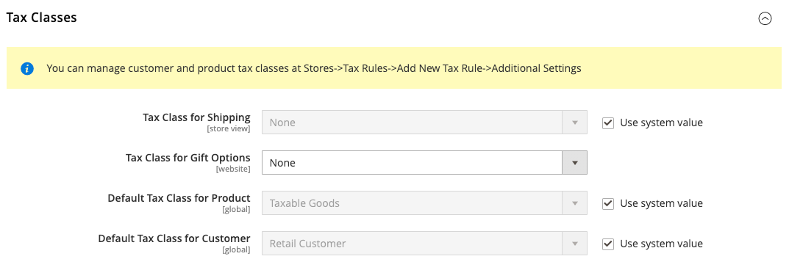
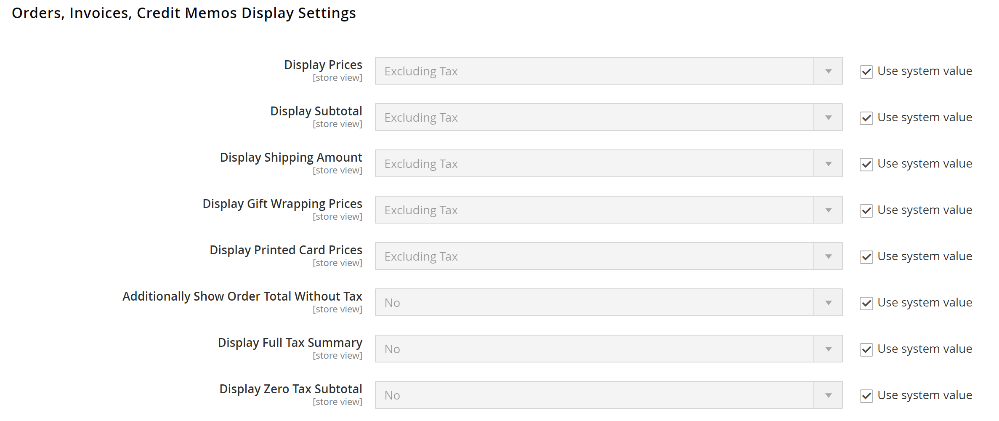

# [!UICONTROL Sales] > [!UICONTROL Tax]

>[!NOTE]
>
>Adobe Commerce e le versioni di Magento Open Source da 2.4.0 a 2.4.3 includevano l’estensione sviluppata dal fornitore Vertex utilizzata per l’integrazione con [!UICONTROL Vertex Cloud]. A partire dalla versione 2.4.4, questa estensione non è più inclusa nella versione core e deve essere installata e aggiornata dalla versione Commerci Marketplace. Il Marketplace fornisce anche accesso alla documentazione corrente fornita dallo sviluppatore dell’estensione.
>  
>Se l’estensione in bundle è abilitata e configurata, devi aggiornare il file compositore.json come parte del processo di aggiornamento 2.4.4 e gestire gli aggiornamenti delle estensioni in futuro. Consulta [Aggiornare moduli ed estensioni](https://experienceleague.adobe.com/docs/commerce-operations/upgrade-guide/modules/upgrade.html) nel _Guida all’aggiornamento_ per ulteriori informazioni.

{{config}}

## [!UICONTROL Tax Classes]

<!-- zoom -->

Per ulteriori informazioni sulla modifica di queste impostazioni, vedere [Classi di imposta](../../stores-purchase/tax-class.md) nel _Guida ai negozi e all’esperienza di acquisto_.

| Campo | [Ambito](../../getting-started/websites-stores-views.md#scope-settings) | Descrizione |
|--- |--- |--- |
| [!UICONTROL Tax Class for Shipping] | Sito Web | Identifica la classe fiscale utilizzata per la spedizione. Le opzioni includono tutte le classi di imposta prodotto disponibili: `None` / `Taxable Goods` / `Shipping` / `Tax Exempt` |
| [!UICONTROL Tax Class for Gift Options] | Sito Web |  Solo per Adobe Commerce Identifica la classe di imposta predefinita utilizzata per le opzioni regalo. |
| [!UICONTROL Default Tax Class for Product] | Globale | Identifica la classe fiscale predefinita utilizzata per i prodotti. |
| [!UICONTROL Default Tax Class for Customer] | Globale | Identifica la classe fiscale predefinita utilizzata per i clienti. |

{:style=&quot;table-layout:auto&quot;}

## [!UICONTROL Calculation Settings]

<!-- zoom -->

| Campo | [Ambito](../../getting-started/websites-stores-views.md#scope-settings) | Descrizione |
|--- |--- |--- |
| [!UICONTROL Tax Calculation Method Based On] | Sito Web | Determina il metodo utilizzato per calcolare l&#39;imposta per un ordine. Opzioni: **`Unit Price`**- I calcoli delle imposte si basano sul prezzo unitario di ciascun prodotto. **`Row Total`** - I calcoli delle imposte si basano sul totale della voce.  **`Total`**- I calcoli delle imposte si basano sul totale dell&#39;ordine.  _** Nota:**_Se un&#39;estensione per il calcolo delle imposte è installata dal Marketplace, ad esempio _Vertex Cloud_, il servizio di estensione è elencato come opzione. |
| [!UICONTROL Tax Calculation Based On] | Sito Web | Determina se il calcolo dell&#39;imposta si basa sull&#39;indirizzo di spedizione, sull&#39;indirizzo di fatturazione o sull&#39;origine di spedizione. Opzioni: `Shipping Address` / `Billing Address` / `Shipping Origin` |
| [!UICONTROL Catalog Prices] | Sito Web | Determina se i prezzi del catalogo includono o escludono le imposte. Opzioni: `Excluding Tax` / `Including Tax` |
| [!UICONTROL Shipping Prices] | Sito Web | Determina i prezzi di spedizione che includono o escludono le imposte. Opzioni: `Excluding Tax` / `Including Tax` |
| [!UICONTROL Apply Customer Tax] | Sito Web | Determina se l&#39;imposta viene applicata prima o dopo uno sconto. Opzioni: `Before Discount` / `After Discount` |
| [!UICONTROL Apply Discount on Prices] | Sito Web | Determina se i prezzi scontati includono o escludono le imposte. Opzioni: `Excluding Tax` / `Including Tax` |
| [!UICONTROL Apply Tax On] | Sito Web | Determina se l&#39;imposta viene applicata al prezzo originale o a un prezzo personalizzato, se disponibile. Opzioni: `Custom price if available` / `Original price only` |
| [!UICONTROL Enable Cross Border Trade] | Sito Web | Quando questa opzione è abilitata, applica prezzi coerenti oltre i confini delle aree con aliquote diverse. Opzioni: `Yes` / `No`   **_Nota:_**L&#39;utilizzo del commercio transfrontaliero rettifica il margine di profitto in base all&#39;aliquota fiscale. |

{:style=&quot;table-layout:auto&quot;}

## [!UICONTROL Default Tax Destination Calculation]

<!-- zoom -->

| Campo | [Ambito](../../getting-started/websites-stores-views.md#scope-settings) | Descrizione |
|--- |--- |--- |
| [!UICONTROL Default Country] | Visualizzazione store | Determina il paese su cui si basano i calcoli delle imposte. |
| [!UICONTROL Default State] | Visualizzazione store | Determina lo stato su cui si basano i calcoli delle imposte. Un asterisco (*) può fungere da carattere jolly per indicare tutti gli stati all&#39;interno del paese selezionato. |
| [!UICONTROL Default Post Code] | Visualizzazione store | Identifica il CAP su cui si basano i calcoli delle imposte. Un asterisco (*) può fungere da carattere jolly per indicare tutti i codici postali all’interno dello stato selezionato. |

{:style=&quot;table-layout:auto&quot;}

## [!UICONTROL Price Display Settings]

<!-- zoom -->

Per ulteriori informazioni sulla modifica di queste impostazioni, vedere [Configurare le impostazioni di visualizzazione del prezzo](../../stores-purchase/display-settings.md#configure-price-display-settings) nel _Guida ai negozi e all’esperienza di acquisto_.

| Campo | [Ambito](../../getting-started/websites-stores-views.md#scope-settings) | Descrizione |
|--- |--- |--- |
| [!UICONTROL Display Product Prices in Catalog] | Visualizzazione store | Determina se i prezzi dei prodotti pubblicati nel catalogo includono o escludono le imposte o visualizzano due versioni del prezzo, una con e l&#39;altra senza imposte. Opzioni: `Excluding Tax` / `Including Tax` / `Including and Excluding Tax`   **_Nota:_**Se si imposta il campo Visualizza prezzi prodotto su `Including Tax`, l&#39;imposta viene visualizzata solo se esiste una regola fiscale che corrisponde all&#39;origine dell&#39;imposta o se esiste un indirizzo del cliente che corrisponde alla regola fiscale. Gli eventi che possono attivare una corrispondenza includono la creazione di un account cliente, l’accesso o l’utilizzo dello strumento di stima delle imposte e della spedizione nel carrello. |
| [!UICONTROL Display Shipping Prices] | Visualizzazione store | Determina se i prezzi di spedizione includono o escludono l&#39;imposta oppure se visualizzano due versioni del prezzo di spedizione, una con e l&#39;altra senza imposta. Opzioni: `Excluding Tax` / `Including Tax` / `Including and Excluding Tax` |

{:style=&quot;table-layout:auto&quot;}

## [!UICONTROL Shopping Cart Display Settings]

<!-- zoom -->

Per ulteriori informazioni sulla modifica di queste impostazioni, vedere [Configurare le impostazioni di visualizzazione del carrello](../../stores-purchase/display-settings.md#step-2-configure-shopping-cart-display-settings) nel _Guida ai negozi e all’esperienza di acquisto_.

| Campo | [Ambito](../../getting-started/websites-stores-views.md#scope-settings) | Descrizione |
|--- |--- |--- |
| [!UICONTROL Display Prices] | Visualizzazione store | Determina se i prezzi del carrello includono o escludono le imposte o se visualizzano due versioni del prezzo: una con e l&#39;altra senza imposte. Opzioni: `Excluding Tax` / `Including Tax` / `Including and Excluding Tax` |
| [!UICONTROL Display Subtotal|Store View] | Determina se il subtotale del carrello acquisti include o esclude le imposte oppure mostra due versioni del subtotale, una con e l&#39;altra senza imposte. Opzioni: `Excluding Tax` / `Including Tax` / `Including and Excluding Tax` |
| [!UICONTROL Display Shipping Amount] | Visualizzazione store | Determina se l&#39;importo della spedizione del carrello acquisti include o esclude le imposte o mostra due versioni dell&#39;importo della spedizione, una con e l&#39;altra senza imposte. Opzioni: `Excluding Tax` / `Including Tax` / `Including and Excluding Tax` |
| [!UICONTROL Additionally Show Order Total Without Tax] | Visualizzazione store | Determina se nel carrello viene visualizzata una riga aggiuntiva con l&#39;importo totale complessivo senza imposte. Opzioni: `Yes` / `No` |
| [!UICONTROL Display Full Tax Summary] | Visualizzazione store | Determina se il carrello include un riepilogo fiscale completo. Opzioni: `Yes` / `No` |
| [!UICONTROL Display Zero Tax Subtotal] | Visualizzazione store | Determina se il carrello acquisti include un subtotale dell&#39;imposta quando l&#39;imposta è zero. Opzioni: `Yes` / `No` |

{:style=&quot;table-layout:auto&quot;}

## [!UICONTROL Orders, Invoices, Credit Memos Display Settings]

<!-- zoom -->

Per ulteriori informazioni sulla modifica di queste impostazioni, vedere [Configura impostazioni di visualizzazione ordine, fattura e nota di accredito](../../stores-purchase/display-settings.md#step-3-configure-order-invoice-and-credit-memo-display-settings) nel _Guida ai negozi e all’esperienza di acquisto_.

| Campo | [Ambito](../../getting-started/websites-stores-views.md#scope-settings) | Descrizione |
|--- |--- |--- |
| [!UICONTROL Display Prices] | Visualizzazione store | Determina se i prezzi nei documenti di vendita includono o escludono le imposte o se in ogni documento vengono visualizzate due versioni del prezzo, una con e l&#39;altra senza imposte. Opzioni: `Excluding Tax` / `Including Tax` / `Including and Excluding Tax` |
| [!UICONTROL Display Subtotal] | Visualizzazione store | Determina se il subtotale nei documenti di vendita include o esclude le imposte o se in ogni documento vengono visualizzate due versioni del subtotale, una con e l&#39;altra senza imposte. Opzioni: `Excluding Tax` / `Including Tax` / `Including and Excluding Tax` |
| [!UICONTROL Display Shipping Amount] | Visualizzazione store | Determina se l&#39;importo di spedizione nei documenti di vendita include o esclude le imposte o se in ogni documento vengono visualizzate due versioni del subtotale, una con e l&#39;altra senza imposte. Opzioni: `Excluding Tax` / `Including Tax` / `Including and Excluding Tax` |
| [!UICONTROL Additionally Show Order Total Without Tax] | Visualizzazione store | Determina se nei documenti di vendita viene visualizzata una riga aggiuntiva con l&#39;importo totale complessivo senza imposte. Opzioni: `Yes` / `No` |
| [!UICONTROL Display Full Tax Summary] | Visualizzazione store | Determina se il riepilogo fiscale completo viene visualizzato nei documenti di vendita. Opzioni: `Yes` / `No` |
| [!UICONTROL Display Zero Tax Subtotal] | Visualizzazione store | Determina la sezione del subtotale nei documenti di vendita quando non viene addebitata alcuna imposta. Opzioni: `Yes` / `No` |
| [!UICONTROL Display Gift Wrapping Prices] | Visualizzazione store |  (Solo per Adobe Commerce) Determina se i prezzi di confezione regalo sono inclusi nel subtotale. Opzioni: `Excluding Tax` / `Including Tax` / `Including and Excluding Tax` |
| [!UICONTROL Display Printed Card Prices] | Visualizzazione store |  (Solo Adobe Commerce) Determina se i prezzi delle schede stampate sono inclusi nel subtotale. Opzioni: `Excluding Tax` / `Including Tax` / `Including and Excluding Tax` |

{:style=&quot;table-layout:auto&quot;}

## [!UICONTROL Fixed Product Taxes]

<!-- zoom -->

Per ulteriori informazioni sulla modifica di queste impostazioni, vedere [Imposta sui prodotti fissi (FPT)](../../stores-purchase/fixed-product-tax.md) nel _Guida ai negozi e all’esperienza di acquisto_.

| Campo | [Ambito](../../getting-started/websites-stores-views.md#scope-settings) | Descrizione |
|--- |--- |--- |
| [!UICONTROL Enable FPT] | Sito Web | Determina se FPT è disponibile. Opzioni: `Yes` / `No` |
| [!UICONTROL Display Prices in Product Lists] | Sito Web | Controlla la visualizzazione di FPT negli elenchi di prodotti. Opzioni:  **`Including FPT Only`** - I prezzi visualizzati includono le imposte sui prodotti fisse. L&#39;importo FPT non viene visualizzato separatamente. **`Including FPT and FPT description`**- I prezzi visualizzati includono le imposte sui prodotti fisse. L&#39;importo FPT viene visualizzato separatamente. **`Excluding FPT. Including FPT description and final price`** - I prezzi visualizzati non includono le imposte sui prodotti fisse. L&#39;importo FPT viene visualizzato separatamente. **`Excluding FPT`**- I prezzi visualizzati non includono le imposte sui prodotti fisse. L&#39;importo FPT non viene visualizzato separatamente. |
| Visualizza prezzo nella pagina di visualizzazione prodotto | Sito Web | Controlla la visualizzazione di FPT nella pagina del prodotto. Opzioni:  **`Including FPT Only`** - I prezzi visualizzati includono le imposte sui prodotti fisse. L&#39;importo FPT non viene visualizzato separatamente. **`Including FPT and FPT description`**- I prezzi visualizzati includono le imposte sui prodotti fisse. L&#39;importo FPT viene visualizzato separatamente. **`Excluding FPT. Including FPT description and final price`** - I prezzi visualizzati non includono le imposte sui prodotti fisse. L&#39;importo FPT viene visualizzato separatamente. **`Excluding FPT`**- I prezzi visualizzati non includono le imposte sui prodotti fisse. L&#39;importo FPT non viene visualizzato separatamente. |
| [!UICONTROL Display Prices in Sales Modules] | Sito Web | Controlla la visualizzazione di FPT nel carrello e durante il pagamento. Opzioni:  **`Including FPT Only`** - I prezzi visualizzati includono le imposte sui prodotti fisse. L&#39;importo FPT non viene visualizzato separatamente. **`Including FPT and FPT description`**- I prezzi visualizzati includono le imposte sui prodotti fisse. L&#39;importo FPT viene visualizzato separatamente. **`Excluding FPT. Including FPT description and final price`** - I prezzi visualizzati non includono le imposte sui prodotti fisse. L&#39;importo FPT viene visualizzato separatamente. **`Excluding FPT`**- I prezzi visualizzati non includono le imposte sui prodotti fisse. L&#39;importo FPT non viene visualizzato separatamente. |
| [!UICONTROL Display Prices in Emails] | Sito Web | Controlla la visualizzazione di FPT nelle e-mail. Opzioni:  **`Including FPT Only`** - I prezzi visualizzati includono le imposte sui prodotti fisse. L&#39;importo FPT non viene visualizzato separatamente. **`Including FPT and FPT description`**- I prezzi visualizzati includono le imposte sui prodotti fisse. L&#39;importo FPT viene visualizzato separatamente. ** Escluso FPT. Compresa la descrizione del FPT e il prezzo finale **- I prezzi visualizzati non includono le imposte sui prodotti fisse. L&#39;importo FPT viene visualizzato separatamente. **`Excluding FPT`** - I prezzi visualizzati non includono le imposte sui prodotti fisse. L&#39;importo FPT non viene visualizzato separatamente. |
| [!UICONTROL Apply Discounts to FPT] | Sito Web | Determina se è possibile applicare sconti all&#39;importo FPT. Opzioni: `Yes` / `No` |
| [!UICONTROL FPT Tax Configuration] | Sito Web | Determina la modalità di calcolo dell&#39;imposta FPT. Opzioni:  **`Not Taxed`**- Selezionare questa opzione se la giurisdizione di imposta non applica l&#39;FPT. Ad esempio, California. **`Taxed`** - Selezionare questa opzione se la giurisdizione fiscale imposta l&#39;FPT. Ad esempio, Canada.  **`Loaded and Displayed with Tax`**- Fare clic su questa opzione se FPT viene aggiunto al totale dell&#39;ordine prima dell&#39;applicazione delle imposte. Ad esempio, i paesi dell&#39;UE. |
| [!UICONTROL Include FPT in Subtotal] | Sito Web | Determina se FPT è incluso nel subtotale del carrello acquisti. Opzioni:  **`Yes`**- Include FPT nel subtotale del carrello. **`No`** - FPT non è incluso nel subtotale e viene inserito dopo il subtotale nel carrello. |

{:style=&quot;table-layout:auto&quot;}
