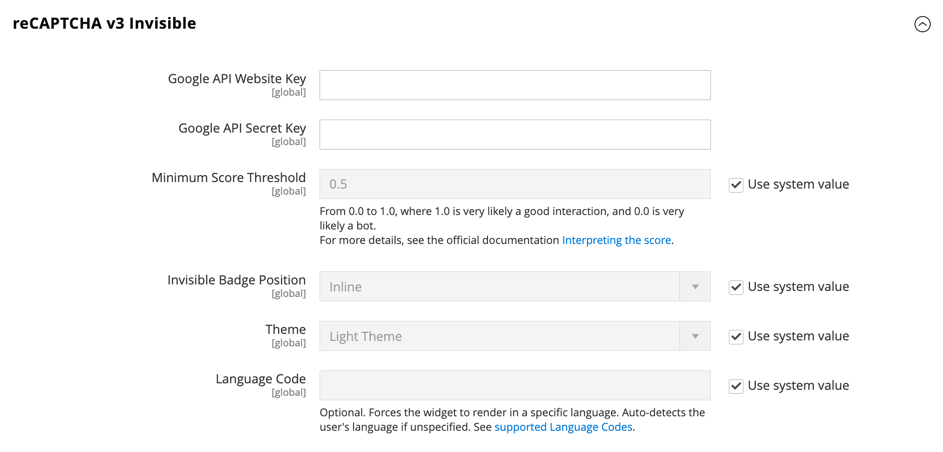

# [!UICONTROL Security] > [!UICONTROL Google reCAPTCHA Admin Panel]

>[!IMPORTANT]
>
>Prima di configurare Google reCAPTCHA, è necessario assicurarsi che il `PHP.ini` Il file include le seguenti impostazioni: `allow_url_fopen = 1`. Questo potrebbe richiedere l’assistenza dello sviluppatore. Consulta [Impostazioni PHP richieste](https://experienceleague.adobe.com/docs/commerce-operations/installation-guide/prerequisites/php-settings.html) nel _Guida all’installazione_.

{{config}}

Per ulteriori informazioni sulla modifica di queste impostazioni, vedere [Google reCAPTCHA](../../systems/security-google-recaptcha.md) nel _Guida ai sistemi di amministrazione_.

## [!UICONTROL reCAPTCHA v2 ("I am not a robot")]

<!-- zoom -->

| Campo | [Ambito](../../getting-started/websites-stores-views.md#scope-settings) | Descrizione |
|--|--|--|
| [!UICONTROL Google API Website Key] | Globale | Chiave del sito Web creata al momento della registrazione dell&#39;account Google reCAPTCHA. |
| [!UICONTROL Google API Secret Key] | Globale | La chiave segreta associata al tuo account Google reCAPTCHA. |
| [!UICONTROL Size] | Globale | Dimensione della casella Google reCAPTCHA visualizzata durante l&#39;accesso. Opzioni: `Normal` (impostazione predefinita) / `Compact` |
| [!UICONTROL Theme] | Globale | Determina lo stile della casella Google reCAPTCHA. Opzioni: `Light Theme` (impostazione predefinita) / `Dark Theme` |
| [!UICONTROL Language Code] | Globale | A [codice a due caratteri](https://developers.google.com/recaptcha/docs/language) specifica la lingua utilizzata per il testo e i messaggi reCAPTCHA di Google. |

{:style=&quot;table-layout:auto&quot;}

## [!UICONTROL reCAPTCHA v2 Invisible]

<!-- zoom -->

| Campo | [Ambito](../../getting-started/websites-stores-views.md#scope-settings) | Descrizione |
|--|--|--|
| [!UICONTROL Google API Website Key] | Globale | Chiave del sito Web creata al momento della registrazione dell&#39;account Google reCAPTCHA. |
| [!UICONTROL Google API Secret Key] | Globale | La chiave segreta associata al tuo account Google reCAPTCHA. |
| [!UICONTROL Invisible Badge Position] | Globale | La posizione del badge reCAPTCHA invisibile su ogni pagina. Opzioni: `Inline` / `Bottom Right` / `Bottom Left` |
| [!UICONTROL Theme] | Globale | Determina lo stile della casella Google reCAPTCHA. Opzioni: `Light Theme` (impostazione predefinita) / `Dark Theme` |
| [!UICONTROL Language Code] | Globale | A [codice a due caratteri](https://developers.google.com/recaptcha/docs/language) specifica la lingua utilizzata per il testo e i messaggi reCAPTCHA di Google. |

{:style=&quot;table-layout:auto&quot;}

## [!UICONTROL reCAPTCHA v3 Invisible]

<!-- zoom -->

| Campo | [Ambito](../../getting-started/websites-stores-views.md#scope-settings) | Descrizione |
|--|--|--|
| [!UICONTROL Google API Website Key] | Globale | Chiave del sito Web creata al momento della registrazione dell&#39;account Google reCAPTCHA. |
| [!UICONTROL Google API Secret Key] | Globale | La chiave segreta associata al tuo account Google reCAPTCHA. |
| [!UICONTROL Minimum Score Threshold] | Globale | Punteggio minimo che identifica un’interazione dell’utente come rischio potenziale, dove 1,0 è una tipica interazione dell’utente e 0,0 è probabilmente un bot. Predefinito: `0.5` |
| [!UICONTROL Invisible Badge Position] | Globale | La posizione del badge reCAPTCHA invisibile su ogni pagina. Opzioni: `Inline` / `Bottom Right` / `Bottom Left` |
| [!UICONTROL Theme] | Globale | Determina lo stile della casella Google reCAPTCHA. Opzioni: `Light Theme` (impostazione predefinita) / `Dark Theme` |
| [!UICONTROL Language Code] | Globale | A [codice a due caratteri](https://developers.google.com/recaptcha/docs/language) specifica la lingua utilizzata per il testo e i messaggi reCAPTCHA di Google. |

{:style=&quot;table-layout:auto&quot;}

## [!UICONTROL reCAPTCHA Failure Messages]

<!-- zoom -->

| Campo | [Ambito](../../getting-started/websites-stores-views.md#scope-settings) | Descrizione |
|--|--|--|
| [!UICONTROL reCAPTCHA Validation Failure Message] | Globale | Messaggio visualizzato nell’amministratore se la verifica non riesce. Testo predefinito: `reCAPTCHA verification failed.` |
| [!UICONTROL reCAPTCHA Technical Failure Message] | Globale | Il messaggio visualizzato nell’amministratore se reCAPTCHA non restituisce un risultato di verifica. Testo predefinito: `Something went wrong with reCAPTCHA. Please contact the store owner.` |

{:style=&quot;table-layout:auto&quot;}

## [!UICONTROL Admin Panel]

<!-- zoom -->

>[!NOTE]
>
>Il tipo reCAPTCHA scelto deve corrispondere al tipo associato alla chiave API dell’account Google reCAPTCHA.

>[!WARNING]
>
>Quando si utilizza reCAPTCHA versione 3, un utente autentico con un punteggio basso non può procedere. Per la versione 2, un utente autentico con un punteggio basso riceve una sfida. Valuta attentamente se gli utenti autentici con un punteggio basso devono avere l’opportunità di risolvere un problema (versione 2) o essere bloccati (versione 3).

| Campo | [Ambito](../../getting-started/websites-stores-views.md#scope-settings) | Descrizione |
|--|--|--|
| [!UICONTROL Enable for Login] | Globale | Determina il tipo di reCAPTCHA abilitato per [Accesso amministratore](https://experienceleague.adobe.com/docs/commerce-admin/start/admin/admin-signin.html). Opzioni: **`No`**- (impostazione predefinita) Non convalida l’accesso amministratore. **`reCAPTCHA v2 ("I am not a robot")`** - Richiede all&#39;utente di selezionare _Io non sono un robot_ casella di controllo. **`Invisible reCAPTCHA v2`**: convalida il comportamento dell’utente in background senza richiedere interazioni in base al punteggio. **`Invisible reCAPTCHA v3`** - (Consigliato) Convalida il comportamento dell’utente in background in base al punteggio di interazione. |
| [!UICONTROL Enable for Forgot Password] | Globale | Determina il tipo di reCAPTCHA abilitato per richiedere un [Reimpostazione password amministratore](https://experienceleague.adobe.com/docs/commerce-admin/start/admin/admin-signin.html#reset-your-password). Opzioni: **`No`**- (impostazione predefinita) Non convalida la richiesta di reimpostazione della password. **`reCAPTCHA v2 ("I am not a robot")`** - Richiede all&#39;utente di selezionare _Io non sono un robot_ casella di controllo. **`Invisible reCAPTCHA v2`**: convalida il comportamento dell’utente in background senza richiedere interazioni in base al punteggio. **`Invisible reCaptcha v3`** - (Consigliato) Convalida il comportamento dell’utente in background in base al punteggio di interazione. |

{:style=&quot;table-layout:auto&quot;}
