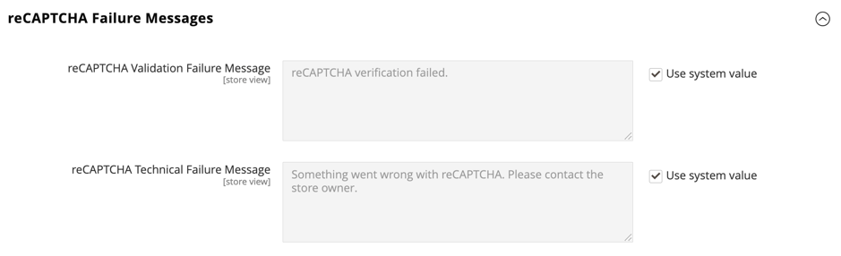

# [!UICONTROL Security] > [!UICONTROL Google reCAPTCHA Storefront]

>[!IMPORTANT]
>
>Prima di configurare Google reCAPTCHA, è necessario assicurarsi che il file `PHP.ini` includa l&#39;impostazione seguente: `allow_url_fopen = 1`. Questo potrebbe richiedere l’assistenza dello sviluppatore. Vedere [Impostazioni PHP](https://experienceleague.adobe.com/docs/commerce-operations/installation-guide/prerequisites/php-settings.html?lang=it) nella _Guida all&#39;installazione_.

{{config}}

Per ulteriori informazioni sull&#39;utilizzo di Google reCAPTCHA per proteggere l&#39;archivio, vedere Google [reCAPTCHA](../../systems/security-google-recaptcha.md) nella _Guida ai sistemi di amministrazione_.

## [!UICONTROL reCAPTCHA v2 ("I am not a robot")]

<!-- zoom -->

| Campo | [Ambito](../../getting-started/websites-stores-views.md#scope-settings) | Descrizione |
|--|--|--|
| [!UICONTROL Google API Website Key] | Sito Web | Chiave del sito Web creata al momento della registrazione dell&#39;account Google reCAPTCHA. |
| [!UICONTROL Google API Secret Key] | Sito Web | La chiave segreta associata al tuo account Google reCAPTCHA. |
| [!UICONTROL Size] | Sito Web | La dimensione della casella Google reCAPTCHA che viene visualizzata quando un cliente accede al proprio account. Opzioni: `Normal` (predefinito) / `Compact` |
| [!UICONTROL Theme] | Sito Web | Determina lo stile della casella Google reCAPTCHA. Opzioni: `Light Theme` (predefinito) / `Dark Theme` |
| [!UICONTROL Language Code] | Visualizzazione store | [codice a due caratteri](https://developers.google.com/recaptcha/docs/language) che specifica il linguaggio utilizzato per il testo e i messaggi reCAPTCHA di Google. |

{style="table-layout:auto"}

## [!UICONTROL reCAPTCHA v2 Invisible]

<!-- zoom -->

| Campo | [Ambito](../../getting-started/websites-stores-views.md#scope-settings) | Descrizione |
|--|--|--|
| [!UICONTROL Google API Website Key] | Sito Web | Chiave del sito Web creata al momento della registrazione dell&#39;account Google reCAPTCHA. |
| [!UICONTROL Google API Secret Key] | Sito Web | La chiave segreta associata al tuo account Google reCAPTCHA. |
| [!UICONTROL Invisible Badge Position] | Sito Web | La posizione del badge reCAPTCHA invisibile su ogni pagina. Opzioni: `Inline` / `Bottom Right` / `Bottom Left` |
| [!UICONTROL Theme] | Globale | Determina lo stile della casella Google reCAPTCHA. Opzioni: `Light Theme` (predefinito) / `Dark Theme` |
| [!UICONTROL Language Code] | Visualizzazione store | [codice a due caratteri](https://developers.google.com/recaptcha/docs/language) che specifica il linguaggio utilizzato per il testo e i messaggi reCAPTCHA di Google. |

{style="table-layout:auto"}

## [!UICONTROL reCAPTCHA v3 Invisible]

<!-- zoom -->

| Campo | [Ambito](../../getting-started/websites-stores-views.md#scope-settings) | Descrizione |
|--|--|--|
| [!UICONTROL Google API Website Key] | Sito Web | Chiave del sito Web creata al momento della registrazione dell&#39;account Google reCAPTCHA. |
| [!UICONTROL Google API Secret Key] | Sito Web | La chiave segreta associata al tuo account Google reCAPTCHA. |
| [!UICONTROL Minimum Score Threshold] | Globale | Punteggio minimo che identifica un’interazione dell’utente come rischio potenziale, dove 1,0 è una tipica interazione dell’utente e 0,0 è probabilmente un bot. Predefinito: `0.5` |
| [!UICONTROL Invisible Badge Position] | Sito Web | La posizione del badge reCAPTCHA invisibile su ogni pagina. Opzioni: `Inline` / `Bottom Right` / `Bottom Left` |
| [!UICONTROL Theme] | Sito Web | Determina lo stile della casella Google reCAPTCHA. Opzioni: `Light Theme` (predefinito) / `Dark Theme` |
| [!UICONTROL Language Code] | Visualizzazione store | [codice a due caratteri](https://developers.google.com/recaptcha/docs/language) che specifica il linguaggio utilizzato per il testo e i messaggi reCAPTCHA di Google. |

{style="table-layout:auto"}

## [!UICONTROL reCAPTCHA Enterprise]

[!BADGE Solo SaaS]{type=Positive url="https://experienceleague.adobe.com/it/docs/commerce/user-guides/product-solutions" tooltip="Applicabile solo ai progetti Adobe Commerce as a Cloud Service (infrastruttura SaaS gestita da Adobe)."}

[!BADGE Sandbox]{type=Caution tooltip="Gli elementi elencati sono attualmente disponibili solo negli ambienti Sandbox. Adobe rende disponibili le nuove versioni negli ambienti Sandbox per consentire di testare le modifiche imminenti prima che siano disponibili negli ambienti di produzione."}

<!-- zoom -->

| Campo | [Ambito](../../getting-started/websites-stores-views.md#scope-settings) | Descrizione |
|--|--|--|
| [!UICONTROL Site Key] | Sito Web | Chiave del sito creata al momento della registrazione dell&#39;account Google reCAPTCHA Enterprise. |
| [!UICONTROL Google Cloud Project ID] | Sito Web | L&#39;ID del progetto viene visualizzato nella sezione **Informazioni progetto** del dashboard del progetto. |
| [!UICONTROL Service Account JSON] | Sito Web | Scarica la chiave dell’account del servizio dalla console Google Cloud e incollane il contenuto in questo campo. |
| [!UICONTROL Minimum Score Threshold] | Sito Web | Punteggio minimo che identifica un’interazione dell’utente come rischio potenziale, dove 1,0 è una tipica interazione dell’utente e 0,0 è probabilmente un bot. Predefinito: `0.5` |
| [!UICONTROL Badge Position] | Sito Web | La posizione del badge reCAPTCHA invisibile su ogni pagina. Opzioni: `Inline` / `Bottom Right` / `Bottom Left` |
| [!UICONTROL Theme] | Sito Web | Determina lo stile della casella Google reCAPTCHA. Opzioni: `Light Theme` (predefinito) / `Dark Theme` |
| [!UICONTROL Language Code] | Visualizzazione store | [codice a due caratteri](https://developers.google.com/recaptcha/docs/language) che specifica il linguaggio utilizzato per il testo e i messaggi reCAPTCHA di Google. Lascia vuoto il campo per utilizzare la lingua predefinita del browser dell’utente. |
| [!UICONTROL Validation Failure Message] | Visualizzazione store | Messaggio da visualizzare quando la convalida non riesce. |

{style="table-layout:auto"}

## [!UICONTROL reCAPTCHA Failure Messages]

<!-- zoom -->

| Campo | [Ambito](../../getting-started/websites-stores-views.md#scope-settings) | Descrizione |
|--|--|--|
| [!UICONTROL reCAPTCHA Validation Failure Message] | Visualizzazione store | Messaggio visualizzato nella vetrina se la verifica non riesce. Testo predefinito: `reCAPTCHA verification failed.` |
| [!UICONTROL reCAPTCHA Technical Failure Message] | Visualizzazione store | Messaggio visualizzato nella vetrina se reCAPTCHA non restituisce un risultato di verifica. Testo predefinito: `Something went wrong with reCAPTCHA. Please contact the store owner.` |

{style="table-layout:auto"}

## [!UICONTROL Storefront]

<!-- zoom -->

>[!NOTE]
>
>Il tipo reCAPTCHA scelto deve corrispondere al tipo associato alla chiave API dell’account Google reCAPTCHA.

>[!WARNING]
>
>Quando si utilizza reCAPTCHA versione 3, un utente autentico con un punteggio basso non può procedere. Per la versione 2, un utente autentico con un punteggio basso riceve una sfida. Valuta attentamente se gli utenti autentici con un punteggio basso devono avere l’opportunità di risolvere un problema (versione 2) o essere bloccati (versione 3).

| Campo | [Ambito](../../getting-started/websites-stores-views.md#scope-settings) | Descrizione |
|--|--|--|
| [!UICONTROL Enable for Customer Login] | Sito Web | Specifica il tipo di reCAPTCHA utilizzato quando i clienti [accedono](../../customers/customer-sign-in.md) ai propri account. Opzioni: **`No`**- (predefinito) Non convalida la richiesta di accesso. **`reCAPTCHA v2 ("I am not a robot")`** - Richiede che l&#39;utente selezioni la casella di controllo _Non sono un robot_. **`Invisible reCAPTCHA v2`**- Convalida il comportamento dell&#39;utente in background senza richiedere interazioni in base al punteggio. **`Invisible reCAPTCHA v3`** - (consigliato) convalida il comportamento dell&#39;utente in background in base al punteggio di interazione. |
| [!UICONTROL Enable for Forgot Password] | Sito Web | Specifica il tipo di reCAPTCHA utilizzato quando i clienti richiedono una [reimpostazione password](../../customers/password-reset.md). Opzioni: **`No`**- (impostazione predefinita) non convalida la richiesta di reimpostazione della password. **`reCAPTCHA v2 ("I am not a robot")`** - Richiede che l&#39;utente selezioni la casella di controllo _Non sono un robot_. **`Invisible reCAPTCHA v2`**- Convalida il comportamento dell&#39;utente in background senza richiedere interazioni in base al punteggio. **`Invisible reCAPTCHA v3`** - (consigliato) convalida il comportamento dell&#39;utente in background in base al punteggio di interazione. |
| [!UICONTROL Enable for Create New Customer Account] | Sito Web | Specifica il tipo di reCAPTCHA utilizzato quando il cliente si registra per un [nuovo account](../../customers/account-create.md). Opzioni: **`No`**- (impostazione predefinita) non convalida la richiesta dell&#39;account. **`reCAPTCHA v2 ("I am not a robot")`** - Richiede che l&#39;utente selezioni la casella di controllo _Non sono un robot_. **`Invisible reCAPTCHA v2`**- Convalida il comportamento dell&#39;utente in background senza richiedere interazioni in base al punteggio. **`Invisible reCAPTCHA v3`** - (consigliato) convalida il comportamento dell&#39;utente in background in base al punteggio di interazione. |
| [!UICONTROL Enable for Edit Customer Account] | Sito Web | Specifica il tipo di reCAPTCHA utilizzato quando il cliente modifica le [informazioni sull&#39;account](../../customers/account-dashboard-account-information.md). Opzioni: **`No`**- (impostazione predefinita) non convalida la richiesta dell&#39;account. **`reCAPTCHA v2 ("I am not a robot")`** - Richiede che l&#39;utente selezioni la casella di controllo _Non sono un robot_. **`Invisible reCAPTCHA v2`**- Convalida il comportamento dell&#39;utente in background senza richiedere interazioni in base al punteggio. **`Invisible reCAPTCHA v3`** - (consigliato) convalida il comportamento dell&#39;utente in background in base al punteggio di interazione. |
| [!UICONTROL Enable for Create New Company Account] | Sito Web |  (disponibile solo con Adobe Commerce B2B) Specifica il tipo di reCAPTCHA utilizzato per la creazione di un nuovo [account società](../../b2b/account-company-create.md). Opzioni: **`No`**- (impostazione predefinita) non convalida la richiesta dell&#39;account. **`reCAPTCHA v2 ("I am not a robot")`** - Richiede che l&#39;utente selezioni la casella di controllo _Non sono un robot_. **`Invisible reCAPTCHA v2`**- Convalida il comportamento dell&#39;utente in background senza richiedere interazioni in base al punteggio. **`Invisible reCAPTCHA v3`** - (consigliato) convalida il comportamento dell&#39;utente in background in base al punteggio di interazione. |
| [!UICONTROL Enable for Contact Us] | Sito Web | Specifica il tipo di reCAPTCHA utilizzato per inviare un messaggio dalla pagina [Contattaci](../../getting-started/store-details.md#contact-us-form) dell&#39;archivio. Opzioni: **`No`**- (impostazione predefinita) non convalida la richiesta del messaggio. **`reCAPTCHA v2 ("I am not a robot")`** - Richiede che l&#39;utente selezioni la casella di controllo _Non sono un robot_. **`Invisible reCAPTCHA v2`**- Convalida il comportamento dell&#39;utente in background senza richiedere interazioni in base al punteggio. **`Invisible reCAPTCHA v3`** - (consigliato) convalida il comportamento dell&#39;utente in background in base al punteggio di interazione. |
| [!UICONTROL Enable for Product Review] | Sito Web | Specifica il tipo di reCAPTCHA utilizzato quando i clienti inviano una [recensione prodotto](../../merchandising-promotions/product-reviews.md). Opzioni: **`No`**- (impostazione predefinita) non convalida la richiesta di revisione del prodotto. **`reCAPTCHA v2 ("I am not a robot")`** - Richiede che l&#39;utente selezioni la casella di controllo _Non sono un robot_. **`Invisible reCAPTCHA v2`**- Convalida il comportamento dell&#39;utente in background senza richiedere interazioni in base al punteggio. **`Invisible reCAPTCHA v3`** - (consigliato) convalida il comportamento dell&#39;utente in background in base al punteggio di interazione. |
| [!UICONTROL Enable for Newsletter Subscription] | Sito Web | Specifica il tipo di reCAPTCHA invisibile utilizzato quando i clienti si registrano a un abbonamento a [newsletter](../../merchandising-promotions/newsletter-subscribers.md). Opzioni: **`No`**- (impostazione predefinita) non convalida la richiesta di abbonamento alla newsletter. **`reCAPTCHA v2 ("I am not a robot")`** - Richiede che l&#39;utente selezioni la casella di controllo _Non sono un robot_. **`Invisible reCAPTCHA v2`**- Convalida il comportamento dell&#39;utente in background senza richiedere interazioni in base al punteggio. **`Invisible reCAPTCHA v3`** - (consigliato) convalida il comportamento dell&#39;utente in background in base al punteggio di interazione. |
| [!UICONTROL Enable for Gift Card] | Sito Web |  (solo Adobe Commerce) Specifica il tipo di reCAPTCHA utilizzato quando i clienti immettono un codice [gift card](../../catalog/product-gift-card-create.md). Opzioni: **`No`**- (impostazione predefinita) Non convalida l&#39;invio del codice gift card. **`reCAPTCHA v2 ("I am not a robot")`** - Richiede che l&#39;utente selezioni la casella di controllo _Non sono un robot_. **`Invisible reCAPTCHA v2`**- Convalida il comportamento dell&#39;utente in background senza richiedere interazioni in base al punteggio. **`Invisible reCAPTCHA v3`** - (consigliato) convalida il comportamento dell&#39;utente in background in base al punteggio di interazione. |
| [!UICONTROL Enable for Invitation Create Account] | Sito Web | Specifica il tipo di reCAPTCHA utilizzato quando i clienti inviano un codice di creazione account [invito](../../merchandising-promotions/invitations.md). Opzioni: **`No`**- (predefinito) Non convalida l&#39;invio dell&#39;e-mail di invito. **`reCAPTCHA v2 ("I am not a robot")`** - Richiede che l&#39;utente selezioni la casella di controllo _Non sono un robot_. **`Invisible reCAPTCHA v2`**- Convalida il comportamento dell&#39;utente in background senza richiedere interazioni in base al punteggio. **`Invisible reCAPTCHA v3`** - (consigliato) convalida il comportamento dell&#39;utente in background in base al punteggio di interazione. |
| [!UICONTROL Enable for Send to Friend] | Sito Web | Specifica il tipo di reCAPTCHA utilizzato quando i clienti [condividono un prodotto](../../stores-purchase/email-a-friend.md) con un amico. Opzioni: **`No`**- (impostazione predefinita) non convalida l&#39;invio dell&#39;e-mail. **`reCAPTCHA v2 ("I am not a robot")`** - Richiede che l&#39;utente selezioni la casella di controllo _Non sono un robot_. **`Invisible reCAPTCHA v2`**- Convalida il comportamento dell&#39;utente in background senza richiedere interazioni in base al punteggio. **`Invisible reCAPTCHA v3`** - (consigliato) convalida il comportamento dell&#39;utente in background in base al punteggio di interazione. |
| [!UICONTROL Enable for Wishlist Sharing] | Sito Web | Specifica il tipo di reCAPTCHA utilizzato quando i clienti [condividono una lista dei desideri](../../stores-purchase/wishlist-storefront.md#share-the-wish-list). Opzioni: **`No`**- (impostazione predefinita) non convalida l&#39;invio del messaggio e dell&#39;e-mail. **`reCAPTCHA v2 ("I am not a robot")`** - Richiede che l&#39;utente selezioni la casella di controllo _Non sono un robot_. **`Invisible reCAPTCHA v2`**- Convalida il comportamento dell&#39;utente in background senza richiedere interazioni in base al punteggio. **`Invisible reCAPTCHA v3`** - (consigliato) convalida il comportamento dell&#39;utente in background in base al punteggio di interazione. |
| [!UICONTROL Enable for Coupon Codes] | Sito Web | Specifica il tipo di reCAPTCHA utilizzato quando i clienti immettono un [codice coupon](../../merchandising-promotions/price-rules-cart-coupon.md). Opzioni: **`No`**- (predefinito) Non convalida l&#39;invio del codice coupon. **`reCAPTCHA v2 ("I am not a robot")`** - Richiede che l&#39;utente selezioni la casella di controllo _Non sono un robot_. **`Invisible reCAPTCHA v2`**- Convalida il comportamento dell&#39;utente in background senza richiedere interazioni in base al punteggio. **`Invisible reCAPTCHA v3`** - (consigliato) convalida il comportamento dell&#39;utente in background in base al punteggio di interazione. |
| [!UICONTROL Enable for PayPal Payflow Pro payment form] | Sito Web | Specifica il tipo di reCAPTCHA utilizzato quando i clienti pagano un acquisto con [PayPal Payflow Pro](../../stores-purchase/paypal-payflow-pro.md). Opzioni: **`No`**- (impostazione predefinita) non convalida la richiesta di reimpostazione della password. **`reCAPTCHA v2 ("I am not a robot")`** - Richiede che l&#39;utente selezioni la casella di controllo _Non sono un robot_. **`Invisible reCAPTCHA v2`**- Convalida il comportamento dell&#39;utente in background senza richiedere interazioni in base al punteggio. **`Invisible reCAPTCHA v3`** - (consigliato) convalida il comportamento dell&#39;utente in background in base al punteggio di interazione. |

{style="table-layout:auto"}
