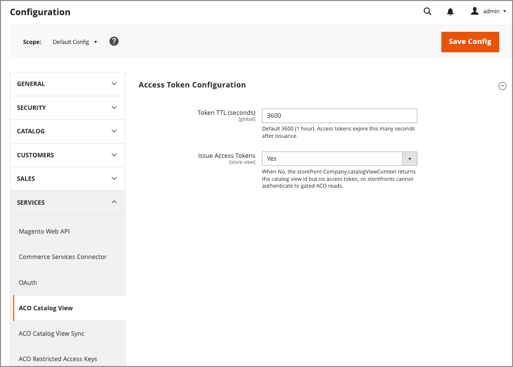

# [!UICONTROL Services] > [!UICONTROL ACO Catalog View]

Utilizzare queste impostazioni per controllare i token di accesso emessi da [!DNL Adobe Commerce Optimizer Connector for B2B]. Gli storefront utilizzano questi token per l’autenticazione nelle viste di catalogo privato di Commerce Optimizer compilate con dati sincronizzati da cataloghi condivisi personalizzati configurati nell’amministratore.

{{config}}

<!-- zoom -->

## [!UICONTROL Access Token Configuration]

| Campo | [Ambito](../../getting-started/websites-stores-views.md#scope-settings) | Descrizione |
| --- | --- | --- |
| [!UICONTROL Token TTL (seconds)] | Globale | Numero di secondi in cui un token di accesso rimane valido dopo la generazione. Questa impostazione è di sola lettura nell&#39;ambito predefinito. I valori configurati nel sito Web o nell&#39;ambito della visualizzazione archivio vengono ignorati. Impostazione predefinita: 3600 secondi. |
| [!UICONTROL Issue Access Tokens] | Visualizzazione store | Controlla se la vetrina può ottenere un token di accesso per una vista catalogo. Se è impostato su `No`, `Company.catalogViewContext` restituisce l&#39;ID della vista catalogo ma non un token di accesso, pertanto gli storefront non possono eseguire l&#39;autenticazione per la lettura da [!DNL Adobe Commerce Optimizer] viste di catalogo private sincronizzate da Adobe Commerce. |

{style="table-layout:auto"}

>[!MORELIKETHIS]
>
> - [Sincronizzazione visualizzazione catalogo ACO](./aco-catalog-view-sync.md) — Configura la modalità di sincronizzazione delle visualizzazioni catalogo in [!DNL Adobe Commerce Optimizer]
> - [Monitoraggio dello stato di sincronizzazione della visualizzazione del catalogo](../../systems/catalog-view-sync-status.md) — Monitora l&#39;integrità della sincronizzazione e riconcilia la deriva
